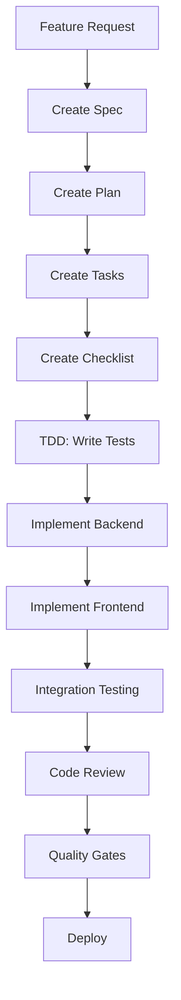

# Neetaq (نطاق) Project Constitution

**Version**: 1.0.0 | **Ratified**: 2025-02-05 | **Last Amended**: 2025-02-05

---

## Core Principles

### I. Service-First Architecture

Every feature is implemented using the Service Layer pattern:
- Controllers handle HTTP requests only - no business logic
- Services contain all business logic and are independently testable
- DTOs (Data Transfer Objects) for data validation and transformation
- Clear separation of concerns between layers

### II. Test-Driven Development (TDD) - NON-NEGOTIABLE

TDD is mandatory for all new features:
- Write tests first → Get approval → Tests fail → Implement feature
- Red-Green-Refactor cycle strictly enforced
- Backend: Pest PHP tests with minimum 80% coverage
- Frontend: Jest + React Testing Library tests
- E2E tests for critical user flows using Playwright

### III. Security First

Security is integrated into every layer:
- Input validation using Form Requests (backend) and Zod (frontend)
- Authorization checks using Laravel Spatie Permissions
- SQL injection prevention using Eloquent ORM
- XSS protection using proper escaping and Content Security Policy
- **Rate limiting** on all public endpoints (`throttle.login` middleware)
- **Secure authentication** using Laravel Sanctum with **httpOnly cookies**
- **CSRF protection** with automatic token refresh
- **Token storage** in memory only (never localStorage) to prevent XSS token theft
- **API versioning** (`/api/v1`) for backward compatibility

### IV. Type Safety

Strong typing is enforced across the codebase:
- Backend: `declare(strict_types=1)` in every PHP file
- Frontend: TypeScript strict mode enabled
- Return types declared for all methods
- Parameter types declared for all functions
- No `any` types in TypeScript

### V. Code Quality Standards

Code must meet strict quality standards:
- Backend: Laravel Pint for code formatting
- Frontend: ESLint + Prettier for code formatting
- PHPStan for static analysis (level 5+)
- TypeScript strict mode with no implicit any
- Maximum function complexity: 10
- Maximum function length: 50 lines

### VI. API-First Design

All features are designed as API-first:
- RESTful API design principles
- Consistent response format using ApiResponseTrait
- API Resources for data transformation
- OpenAPI/Swagger documentation
- Version controlled endpoints

### VII. Performance & Scalability

Performance is considered from the start:
- Database indexes for frequently queried fields
- Caching using Redis for expensive operations
- Lazy loading for relationships
- Database query optimization (N+1 prevention)
- Frontend code splitting and lazy loading
- Image optimization and CDN usage

### VIII. Observability

Comprehensive logging and monitoring:
- Structured logging using Laravel Telescope
- Error tracking with proper exception handling
- Performance monitoring
- User activity logging for audit trails
- Health checks for all critical services

### IX. Internationalization (i18n)

Support for Arabic and English:
- All user-facing messages in Arabic (primary)
- Backend validation messages in Arabic
- Frontend UI supports RTL layout
- Language files organized by feature
- Date/time formatting per locale

### X. Documentation

Code must be self-documenting:
- Clear, descriptive variable and function names
- DocBlock comments for complex logic
- README files for major features
- API documentation for all endpoints
- Architecture diagrams for complex systems

---

## Backend Standards

### File Structure

```
backend/app/
├── Http/
│   ├── Controllers/{Module}/
│   │   └── {Feature}Controller.php
│   ├── Requests/{Module}/
│   │   ├── Store{Feature}Request.php
│   │   └── Update{Feature}Request.php
│   └── Resources/{Module}/
│       └── {Feature}Resource.php
├── DTOs/{Module}/
│   └── {Feature}Data.php
├── Services/{Module}/
│   └── {Feature}Service.php
├── Models/
│   └── {Feature}.php
├── Observers/
│   └── {Feature}Observer.php (if needed)
└── Exceptions/
    └── {Feature}NotFoundException.php (if needed)
```

### Naming Conventions

- Classes: PascalCase (e.g., `StudentService`, `ExamController`)
- Methods: camelCase (e.g., `getStudentById`, `createExam`)
- Variables: camelCase (e.g., `$studentId`, `$examData`)
- Constants: UPPER_SNAKE_CASE (e.g., `MAX_ATTEMPTS`, `DEFAULT_LIMIT`)
- Database tables: snake_case (e.g., `student_points`, `exam_attempts`)

### Code Standards

| Standard | Description |
|----------|-------------|
| `strict_types` | Required at top of every PHP file |
| `declare(strict_types=1)` | Mandatory type declaration |
| `ApiResponseTrait` | Use `successResponse()` and `errorResponse()` |
| Arabic Messages | All user-facing messages in Arabic |
| Return Types | All methods must declare return type |
| Constructor Injection | Use dependency injection in constructors |

---

## Frontend Standards

### File Structure

```
frontend/src/
├── app/
│   ├── {role}/
│   │   └── {feature}/
│   │       └── page.tsx
├── components/
│   ├── {category}/
│   │   └── {ComponentName}.tsx
├── services/
│   ├── {module}/
│   │   └── {feature}Service.ts
├── hooks/
│   ├── use{Feature}.ts
├── contexts/
│   ├── {ContextName}Context.tsx
├── types/
│   ├── {feature}.types.ts
└── utils/
    ├── {utility}.ts
```

### Naming Conventions

- Components: PascalCase (e.g., `StudentDashboard`, `ExamCard`)
- Hooks: camelCase with `use` prefix (e.g., `useAuth`, `useNotifications`)
- Services: camelCase with `Service` suffix (e.g., `studentService`, `examService`)
- Types: PascalCase (e.g., `StudentData`, `ExamConfig`)
- Interfaces: PascalCase with `I` prefix (e.g., `IStudentService`)
- Constants: UPPER_SNAKE_CASE (e.g., `API_BASE_URL`, `MAX_RETRIES`)

### Code Standards

| Standard | Description |
|----------|-------------|
| TypeScript | Strict mode enabled, no implicit any |
| ESLint | Airbnb style guide with custom rules |
| Prettier | Consistent code formatting |
| React Hooks | Follow React Hooks rules strictly |
| Error Boundaries | Wrap components with error boundaries |
| Loading States | Show loading indicators during async operations |
| Error Handling | User-friendly error messages in Arabic |

---

## Quality Gates

### Backend Gates

- [ ] All tests pass (Pest)
- [ ] Test coverage ≥ 80%
- [ ] PHPStan passes at level 5+
- [ ] Laravel Pint formatting applied
- [ ] No security vulnerabilities (Composer audit)
- [ ] API documentation updated
- [ ] Database migrations created and tested

### Frontend Gates

- [ ] All tests pass (Jest)
- [ ] Test coverage ≥ 70%
- [ ] TypeScript compilation succeeds
- [ ] ESLint passes with no errors
- [ ] Prettier formatting applied
- [ ] No console errors in browser
- [ ] Accessibility checks pass (WCAG 2.1 AA)

### Integration Gates

- [ ] E2E tests pass for critical flows
- [ ] API contracts match frontend expectations
- [ ] Performance benchmarks met
- [ ] Security review completed
- [ ] Code review approved

---

## Development Workflow

### Feature Development Process



### Code Review Requirements

- All PRs require at least one approval
- Reviewer must verify:
  - Constitution compliance
  - Test coverage
  - Security considerations
  - Performance impact
  - Documentation completeness

### Deployment Process

1. Feature branch created from `main`
2. All quality gates must pass
3. Code review approved
4. Merge to `staging` branch
5. Staging environment tested
6. Merge to `main` branch
7. Production deployment

---

## Security Requirements

### Authentication & Authorization

- Laravel Sanctum for API authentication
- Role-based access control (RBAC)
- Permission-based feature access
- Session timeout configuration
- Multi-factor authentication (optional)

### Data Protection

- Input validation on all endpoints
- Output encoding to prevent XSS
- SQL injection prevention
- CSRF protection for state-changing operations
- Secure file upload handling
- Sensitive data encryption at rest

### API Security

- Rate limiting on all public endpoints
- CORS configuration
- API key authentication for external services
- Request signing for sensitive operations
- Audit logging for all actions

---

## Performance Standards

### Backend Performance

- API response time < 200ms (p95)
- Database queries optimized (no N+1)
- Cache hit rate > 80%
- Queue processing time < 5s
- Memory usage < 512MB per worker

### Frontend Performance

- First Contentful Paint < 1.5s
- Time to Interactive < 3s
- Lighthouse score > 90
- Bundle size < 500KB (gzipped)
- Image optimization (WebP format)

---

## Governance

### Amendment Process

1. Proposed change documented with rationale
2. Team review and discussion
3. Approval required from project lead
4. Update constitution with version bump
5. Communicate changes to team

### Compliance Verification

- All PRs must verify constitution compliance
- Automated checks for style and type safety
- Manual review for architecture and design
- Non-compliance requires justification

### Exception Handling

- Complexity must be justified in plan
- Security exceptions require security review
- Performance exceptions require benchmarks
- All exceptions documented and reviewed

---

## References

- Backend Structure: [`structure backend.md`](../structure%20backend.md)
- Frontend Structure: [`structure frontend.md`](../structure%20frontend.md) (to be created)
- Laravel Documentation: https://laravel.com/docs
- Next.js Documentation: https://nextjs.org/docs
- PHP Standards: https://www.php-fig.org/psr/
