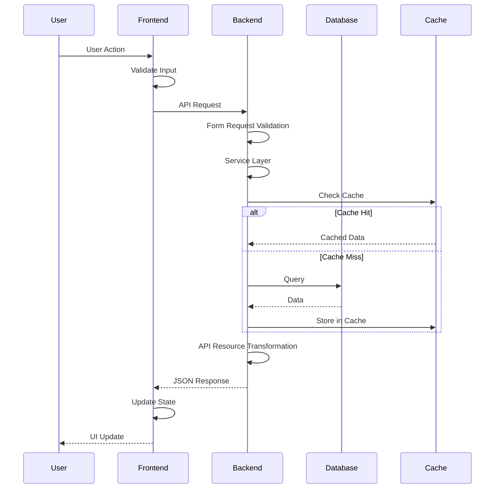

# Implementation Plan: [FEATURE]

**Project**: Neetaq (نطاق) | **Branch**: `[###-feature-name]` | **Date**: [DATE]
**Spec**: [link to spec.md] | **Input**: Feature specification from `/specs/[###-feature-name]/spec.md`

**Note**: This template is filled in by the `/speckit.plan` command. See `.roo/commands/speckit.plan.md` for the execution workflow.

---

## Summary

[Extract from feature spec: primary requirement + technical approach from research]

---

## Technical Context

<!--
  ACTION REQUIRED: Replace the content in this section with the technical details
  for the project. The structure here is presented in advisory capacity to guide
  the iteration process.
-->

### Backend (Laravel)

**Language/Version**: PHP 8.4+
**Primary Dependencies**: Laravel 12, Laravel Sanctum, Spatie Laravel Permission, Pest PHP, Laravel Horizon, Laravel Telescope
**Storage**: MySQL/PostgreSQL, Redis (cache/queue), S3 (media)
**Testing**: Pest PHP, PHPUnit
**Target Platform**: Linux server (Docker)
**Project Type**: web (backend + frontend)
**Performance Goals**: API response < 200ms (p95), 1000+ req/s
**Constraints**: <512MB memory per worker, <200ms p95, Arabic messages
**Scale/Scope**: 10k+ users, multi-tenant (academies)

### Frontend (Next.js)

**Language/Version**: TypeScript 5.6+, Next.js 16, React 18.3
**Primary Dependencies**: Axios, React Query, Lucide React, Tailwind CSS, Firebase, Laravel Echo
**Storage**: IndexedDB (offline), localStorage (preferences)
**Testing**: Jest, React Testing Library, Playwright (E2E)
**Target Platform**: Web browsers (Chrome, Firefox, Safari, Edge)
**Project Type**: web (SPA with SSR)
**Performance Goals**: FCP < 1.5s, TTI < 3s, Lighthouse > 90
**Constraints**: <500KB bundle (gzipped), <100MB memory, RTL support
**Scale/Scope**: 10k+ concurrent users, 50+ pages

---

## Constitution Check

*GATE: Must pass before Phase 0 research. Re-check after Phase 1 design.*

### Backend Gates

| Gate | Status | Notes |
|------|--------|-------|
| Service-First Architecture | [ ] | Controllers only handle HTTP, Services contain business logic |
| TDD Approach | [ ] | Tests written before implementation |
| Security | [ ] | Input validation, authorization, XSS prevention, **httpOnly cookies** |
| Token Storage | [ ] | **Memory-only storage**, no localStorage for sensitive data |
| Rate Limiting | [ ] | **throttle.login middleware** on all auth endpoints |
| CSRF Protection | [ ] | Automatic CSRF token refresh, 419 error handling |
| Type Safety | [ ] | `declare(strict_types=1)`, return types, parameter types |
| Code Quality | [ ] | Laravel Pint, PHPStan level 5+ |
| API-First | [ ] | RESTful design, ApiResponseTrait, consistent responses, **API versioning** |
| Performance | [ ] | Indexes, caching, lazy loading, N+1 prevention |
| Observability | [ ] | Logging, error tracking, performance monitoring |
| Internationalization | [ ] | Arabic messages, RTL support |
| Documentation | [ ] | Docblocks, API documentation |

### Frontend Gates

| Gate | Status | Notes |
|------|--------|-------|
| Component Architecture | [ ] | Proper component structure, reusable UI components |
| TDD Approach | [ ] | Tests written before implementation |
| Security | [ ] | Input validation, XSS prevention, CSRF protection |
| Type Safety | [ ] | TypeScript strict mode, no implicit any |
| Code Quality | [ ] | ESLint, Prettier, Airbnb style guide |
| Performance | [ ] | Code splitting, lazy loading, bundle optimization |
| Accessibility | [ ] | WCAG 2.1 AA compliance, ARIA attributes |
| Internationalization | [ ] | Arabic messages, RTL layout |
| Documentation | [ ] | JSDoc, Storybook stories |

### Overall Status

**[PASS / FAIL]** - [Reason if fail]

---

## Project Structure

### Documentation (this feature)

```text
specs/[###-feature]/
├── spec.md              # Feature specification
├── plan.md              # This file (/speckit.plan command output)
├── research.md          # Phase 0 output (/speckit.plan command)
├── data-model.md        # Phase 1 output (/speckit.plan command)
├── quickstart.md        # Phase 1 output (/speckit.plan command)
├── contracts/           # Phase 1 output (/speckit.plan command)
│   ├── backend-api.yaml
│   └── frontend-api.yaml
├── checklists/          # /speckit.checklist command output
│   ├── ux.md
│   ├── security.md
│   └── test.md
└── tasks.md             # Phase 2 output (/speckit.tasks command - NOT created by /speckit.plan)
```

### Source Code (repository root)

```text
# Backend (Laravel)
backend/
├── app/
│   ├── Http/
│   │   ├── Controllers/{Module}/
│   │   │   └── {Feature}Controller.php
│   │   ├── Requests/{Module}/
│   │   │   ├── Store{Feature}Request.php
│   │   │   └── Update{Feature}Request.php
│   │   └── Resources/{Module}/
│   │       └── {Feature}Resource.php
│   ├── DTOs/{Module}/
│   │   └── {Feature}Data.php
│   ├── Services/{Module}/
│   │   └── {Feature}Service.php
│   ├── Models/
│   │   └── {Feature}.php
│   ├── Observers/
│   │   └── {Feature}Observer.php (if needed)
│   └── Exceptions/
│       └── {Feature}NotFoundException.php (if needed)
├── database/
│   ├── migrations/
│   │   └── xxxx_xx_xx_create_{feature}_table.php
│   ├── factories/
│   │   └── {Feature}Factory.php
│   └── seeders/
│       └── {Feature}Seeder.php (if needed)
└── tests/
    ├── Feature/
    │   ├── {Module}/
    │   │   └── {Feature}Test.php
    └── Unit/
        ├── {Module}/
        │   ├── {Feature}ServiceTest.php
        │   └── {Feature}ModelTest.php

# Frontend (Next.js)
frontend/
├── src/
│   ├── app/
│   │   └── {role}/
│   │       └── {feature}/
│   │           ├── page.tsx
│   │           ├── layout.tsx (if needed)
│   │           ├── loading.tsx (if needed)
│   │           └── error.tsx (if needed)
│   ├── components/
│   │   ├── {category}/
│   │   │   ├── {Feature}Component.tsx
│   │   │   └── index.ts
│   │   └── {role}/
│   │       └── {feature}/
│   │           ├── {SubComponent}.tsx
│   │           └── index.ts
│   ├── services/
│   │   ├── {module}/
│   │   │   └── {feature}Service.ts
│   │   └── index.ts
│   ├── hooks/
│   │   └── use{Feature}.ts
│   ├── types/
│   │   └── {feature}.types.ts
│   └── utils/
│       └── {feature}Utils.ts (if needed)
└── tests/
    ├── unit/
    │   ├── components/
    │   │   └── {Feature}Component.test.tsx
    │   ├── hooks/
    │   │   └── use{Feature}.test.ts
    │   └── services/
    │       └── {feature}Service.test.ts
    └── e2e/
        └── {feature}.spec.ts
```

**Structure Decision**: Web application with Laravel backend and Next.js frontend. Backend follows Service-First architecture, frontend follows component-based architecture with TypeScript.

---

## Security Checklist

> **MANDATORY**: Must be completed before any implementation begins

### Authentication & Authorization

- [ ] All auth endpoints use `throttle.login` middleware
- [ ] Tokens stored in httpOnly cookies (not localStorage)
- [ ] Token expiration ≤ 12 hours (not 1 year)
- [ ] Refresh token flow implemented with automatic refresh
- [ ] CSRF protection enabled on state-changing operations

### Input Validation & Output Encoding

- [ ] Form Request validation on all backend endpoints
- [ ] Zod validation on all frontend inputs
- [ ] SQL injection prevention (Eloquent ORM, parameterized queries)
- [ ] XSS prevention (proper escaping, CSP headers)
- [ ] File upload validation (type, size, content)

### API Security

- [ ] API versioned (`/api/v1`) for future compatibility
- [ ] Rate limiting on public endpoints
- [ ] CORS configuration properly set
- [ ] Authentication required on non-public routes
- [ ] Authorization checks using Spatie Permissions

### Data Protection

- [ ] Sensitive data encrypted at rest
- [ ] Passwords hashed (bcrypt/argon2)
- [ ] PII data access logged
- [ ] Database backups encrypted

### Frontend Security

- [ ] No tokens in localStorage
- [ ] Content Security Policy configured
- [ ] HTTPS only in production
- [ ] Error messages don't leak sensitive info

---

## Complexity Tracking

> **Fill ONLY if Constitution Check has violations that must be justified**

| Violation | Why Needed | Simpler Alternative Rejected Because |
|-----------|------------|-------------------------------------|
| [e.g., additional service layer] | [current need] | [why direct access insufficient] |
| [e.g., custom state management] | [specific problem] | [why Context API insufficient] |
| [e.g., additional database table] | [data requirement] | [why existing structure insufficient] |

---

## Architecture Decisions

### Backend Architecture

**Pattern**: Service-First Architecture

**Rationale**:
- Separates business logic from HTTP handling
- Makes services independently testable
- Promotes code reusability
- Easier to maintain and refactor

**Components**:
- **Controllers**: Handle HTTP requests/responses only
- **Services**: Contain all business logic
- **Form Requests**: Validate input and check permissions
- **DTOs**: Transfer data between layers
- **Resources**: Transform data for API responses
- **Models**: Define data structure and relationships

### Frontend Architecture

**Pattern**: Component-Based Architecture with Custom Hooks

**Rationale**:
- Reusable components across the application
- Custom hooks for state management and side effects
- TypeScript for type safety
- Next.js App Router for routing and SSR

**Components**:
- **UI Components**: Reusable UI elements (Button, Input, Modal, etc.)
- **Dashboard Components**: Dashboard-specific components
- **Role-Specific Components**: Components for specific user roles (admin, academy, student, teacher, parent)
- **Pages**: Next.js App Router pages
- **Services**: API calls using axios
- **Hooks**: Custom React hooks for state and side effects
- **Contexts**: Global state management
- **Types**: TypeScript type definitions

---

## Data Flow



---

## Integration Points

### External Services

- **Firebase**: Push notifications
- **AWS S3**: File storage
- **Payment Gateway**: Payment processing (if applicable)
- **SMS Service**: SMS notifications (if applicable)

### Internal Services

- **Redis**: Caching and queue management
- **MySQL/PostgreSQL**: Primary database
- **Laravel Horizon**: Queue monitoring
- **Laravel Telescope**: Debugging and monitoring

---

## Testing Strategy

### Backend Testing

**Unit Tests**:
- Test individual services in isolation
- Test model methods and relationships
- Test DTO transformations

**Feature Tests**:
- Test API endpoints end-to-end
- Test authentication and authorization
- Test validation and error handling

**Coverage Goal**: ≥80%

### Frontend Testing

**Unit Tests**:
- Test individual components
- Test custom hooks
- Test utility functions

**Integration Tests**:
- Test component interactions
- Test service layer

**E2E Tests**:
- Test critical user flows
- Test cross-browser compatibility

**Coverage Goal**: ≥70%

---

## Deployment Strategy

### Backend Deployment

1. Run database migrations
2. Clear and cache config
3. Clear and cache routes
4. Restart queue workers
5. Clear application cache

### Frontend Deployment

1. Build production bundle
2. Run tests
3. Deploy to CDN/Vercel
4. Clear CDN cache (if applicable)

---

## Rollback Plan

### Backend Rollback

1. Revert code to previous version
2. Run rollback migrations (if needed)
3. Clear application cache
4. Restart queue workers

### Frontend Rollback

1. Revert to previous build
2. Clear CDN cache
3. Verify functionality

---

## Monitoring & Observability

### Metrics to Track

**Backend**:
- API response time
- Error rate
- Queue processing time
- Cache hit rate
- Database query time

**Frontend**:
- Page load time
- Time to Interactive
- Error rate
- User engagement metrics

### Logging

**Backend**:
- Use Laravel Telescope for debugging
- Log all errors with stack traces
- Log user actions for audit trails

**Frontend**:
- Log errors to console
- Send error reports to monitoring service
- Track user events

---

## References

- **Constitution**: [`.specify/memory/constitution.md`](../.specify/memory/constitution.md)
- **Backend Structure**: [`structure backend.md`](../structure%20backend.md)
- **Frontend Structure**: [`structure frontend.md`](../structure%20frontend.md)
- **Laravel Documentation**: https://laravel.com/docs
- **Next.js Documentation**: https://nextjs.org/docs
