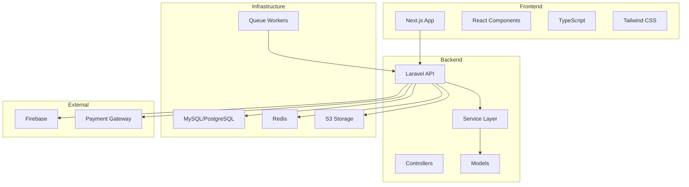

# Neetaq (نطاق) - Project Overview

**Project Name**: Neetaq (نطاق)
**Version**: 1.0.0
**Last Updated**: 2025-02-05

---

## 📋 Table of Contents

1. [Project Description](#project-description)
2. [Architecture Overview](#architecture-overview)
3. [Technology Stack](#technology-stack)
4. [Project Structure](#project-structure)
5. [Development Workflow](#development-workflow)
6. [Quality Standards](#quality-standards)
7. [Documentation](#documentation)

---

## Project Description

Neetaq (نطاق) is a comprehensive educational management platform designed for academies, teachers, students, and parents. The system provides features for:

- **Academy Management**: Manage academies, billing, reports, and settings
- **Teacher Management**: Create and manage teachers, permissions, and subscriptions
- **Student Management**: Track student enrollment, attendance, exams, and performance
- **Lecture Management**: Schedule and manage lectures with attendance tracking
- **Exam Management**: Create and administer exams with automatic grading
- **Notification System**: Send push notifications and messages to users
- **Gamification**: Reward students with points and leaderboards
- **Reporting**: Generate comprehensive reports for various metrics

---

## Architecture Overview



### Architecture Principles

1. **Service-First Architecture**: Business logic resides in services, controllers only handle HTTP
2. **API-First Design**: RESTful API with consistent response format
3. **Component-Based Frontend**: Reusable React components with TypeScript
4. **Multi-Tenancy**: Support for multiple academies with isolated data
5. **Event-Driven**: Laravel events and listeners for decoupled operations

---

## Technology Stack

### Backend (Laravel)

| Technology | Version | Purpose |
|------------|----------|---------|
| PHP | 8.2+ | Programming language |
| Laravel | 12.0 | Framework |
| Laravel Sanctum | 4.2+ | API authentication |
| Spatie Permission | 6.23+ | Role/permission management |
| Laravel Horizon | 5.40+ | Queue monitoring |
| Laravel Telescope | 5.16+ | Debugging tool |
| Laravel Reverb | 1.6+ | WebSockets |
| Pest PHP | 4.1+ | Testing framework |
| MySQL/PostgreSQL | Latest | Database |
| Redis | Latest | Cache/Queue |
| AWS S3 | Latest | File storage |

### Frontend (Next.js)

| Technology | Version | Purpose |
|------------|----------|---------|
| TypeScript | 5.6+ | Programming language |
| Next.js | 15.4+ | Framework |
| React | 18.3+ | UI library |
| Axios | 1.11+ | HTTP client |
| Tailwind CSS | 3.4+ | Styling |
| Lucide React | 0.562+ | Icons |
| Firebase | 12.6+ | Push notifications |
| Laravel Echo | 2.2.6+ | Real-time events |
| Pusher.js | 8.4.0+ | WebSocket client |
| Jest | 30.2+ | Testing framework |
| Playwright | 1.58+ | E2E testing |

---

## Project Structure

### Root Directory

```
neetaq/
├── backend/              # Laravel backend application
├── frontend/             # Next.js frontend application
├── mysql/                # MySQL configuration
├── nginx/                # Nginx configuration
├── scripts/              # Utility scripts
├── plans/                # Planning documents
├── .roo/                 # Roo AI agent commands
├── .specify/             # SpecKit templates and memory
├── docker-compose.yml     # Docker development setup
├── docker-compose.prod.yml # Docker production setup
├── Makefile              # Build and deployment commands
└── PROJECT_OVERVIEW.md   # This file
```

### Backend Structure

```
backend/
├── app/
│   ├── Http/
│   │   ├── Controllers/   # API controllers by module
│   │   ├── Requests/      # Form request validators
│   │   ├── Resources/     # API resource transformers
│   │   └── Middleware/   # HTTP middleware
│   ├── Services/          # Business logic layer
│   ├── DTOs/             # Data transfer objects
│   ├── Models/           # Eloquent models
│   ├── Observers/        # Model observers
│   ├── Exceptions/       # Custom exceptions
│   ├── Enums/            # PHP enums
│   ├── Jobs/             # Queue jobs
│   ├── Notifications/    # Notification classes
│   └── Providers/        # Service providers
├── database/
│   ├── migrations/       # Database migrations
│   ├── factories/        # Model factories
│   └── seeders/         # Database seeders
├── tests/
│   ├── Feature/          # Feature tests
│   └── Unit/            # Unit tests
└── resources/           # Views and assets
```

### Frontend Structure

```
frontend/
├── src/
│   ├── app/              # Next.js App Router pages
│   │   ├── admin/        # Admin pages
│   │   ├── academy/      # Academy pages
│   │   ├── student/      # Student pages
│   │   ├── teacher/      # Teacher pages
│   │   ├── parent/       # Parent pages
│   │   └── login/        # Authentication pages
│   ├── components/       # React components
│   │   ├── ui/           # Reusable UI components
│   │   ├── dashboard/    # Dashboard components
│   │   ├── admin/        # Admin-specific components
│   │   ├── academy/      # Academy-specific components
│   │   ├── student/      # Student-specific components
│   │   ├── teacher/      # Teacher-specific components
│   │   └── parent/       # Parent-specific components
│   ├── services/         # API service layer
│   ├── hooks/            # Custom React hooks
│   ├── contexts/         # React contexts
│   ├── types/            # TypeScript type definitions
│   ├── utils/            # Utility functions
│   └── lib/              # Library configurations
└── tests/
    ├── unit/             # Unit tests
    └── e2e/              # E2E tests
```

---

## Development Workflow

### Feature Development Process

```mermaid
graph LR
    A[Feature Request] --> B[Create Spec]
    B --> C[Create Plan]
    C --> D[Create Tasks]
    D --> E[Create Checklist]
    E --> F[TDD: Write Tests]
    F --> G[Implement Backend]
    G --> H[Implement Frontend]
    H --> I[Integration Testing]
    I --> J[Code Review]
    J --> K[Quality Gates]
    K --> L[Deploy]
```



### Command Workflow

1. **Create Specification**: Use `/speckit.specify` to create feature specification
2. **Create Plan**: Use `/speckit.plan` to create implementation plan
3. **Create Tasks**: Use `/speckit.tasks` to break down plan into tasks
4. **Create Checklist**: Use `/speckit.checklist` to create quality checklist
5. **Implement**: Use `/speckit.implement` to execute implementation

### Branch Strategy

- `main`: Production-ready code
- `staging`: Pre-production testing
- `feature/xxx`: Feature development branches
- `bugfix/xxx`: Bug fix branches

---

## Quality Standards

### Backend Quality Gates

| Gate | Standard |
|------|----------|
| Test Coverage | ≥80% (Pest) |
| Static Analysis | PHPStan level 5+ |
| Code Formatting | Laravel Pint |
| Security | No vulnerabilities (Composer audit) |
| Performance | API response < 200ms (p95) |

### Frontend Quality Gates

| Gate | Standard |
|------|----------|
| Test Coverage | ≥70% (Jest) |
| Type Safety | TypeScript strict mode |
| Code Formatting | ESLint + Prettier |
| Accessibility | WCAG 2.1 AA |
| Performance | Lighthouse score >90 |

---

## Documentation

### Key Documentation Files

| File | Description |
|------|-------------|
| [`.specify/memory/constitution.md`](.specify/memory/constitution.md) | Project constitution and standards |
| [`structure backend.md`](structure%20backend.md) | Backend implementation template |
| [`structure frontend.md`](structure%20frontend.md) | Frontend implementation template |
| [`PROJECT_OVERVIEW.md`](PROJECT_OVERVIEW.md) | This file |

### AI Agent Configuration

| Directory | Description |
|-----------|-------------|
| [`.roo/commands/`](.roo/commands/) | Roo AI agent commands |
| [`.specify/templates/`](.specify/templates/) | SpecKit templates |
| [`.specify/memory/`](.specify/memory/) | SpecKit memory and constitution |

---

## User Roles

### Admin
- Manage academies
- Manage teachers and subscriptions
- View reports and analytics
- System configuration

### Academy
- Manage students and teachers
- Manage lectures and exams
- Track attendance and payments
- Send notifications

### Teacher
- Manage assigned students
- Create and grade exams
- Track attendance
- Send notifications to students

### Student
- View lectures and exams
- Take exams
- View results and mistakes
- Receive notifications

### Parent
- View children's progress
- View attendance and results
- Receive notifications

---

## Key Features

### Attendance System
- QR code-based attendance
- Manual attendance recording
- Attendance reports
- Parent notifications

### Exam System
- Create exams with questions
- Automatic grading
- Time-limited exams
- Result analysis
- Mistake tracking

### Notification System
- Push notifications (Firebase)
- SMS notifications
- In-app notifications
- Voice messages

### Gamification
- Points system
- Leaderboards
- Achievements
- Rewards

### Payment System
- Student payments
- Payment tracking
- Billing reports
- Payment reminders

---

## Getting Started

### Prerequisites

- Docker and Docker Compose
- PHP 8.2+ (for local development)
- Node.js 18+ (for local development)
- MySQL 8+
- Redis

### Quick Start

```bash
# Clone the repository
git clone <repository-url>
cd neetaq

# Start development environment
docker-compose up -d

# Install backend dependencies
cd backend
composer install
php artisan migrate
php artisan db:seed

# Install frontend dependencies
cd ../frontend
npm install
npm run dev
```

### Development Commands

```bash
# Backend
composer test                    # Run Pest tests
composer pint                    # Format code
phpstan analyse                  # Static analysis
php artisan serve                # Start server

# Frontend
npm test                         # Run Jest tests
npm run lint                     # Run ESLint
npm run type-check               # TypeScript check
npm run dev                      # Start dev server
```

---

## Support and Resources

- **Laravel Documentation**: https://laravel.com/docs
- **Next.js Documentation**: https://nextjs.org/docs
- **Project Constitution**: [`.specify/memory/constitution.md`](.specify/memory/constitution.md)
- **Backend Structure**: [`structure backend.md`](structure%20backend.md)
- **Frontend Structure**: [`structure frontend.md`](structure%20frontend.md)
