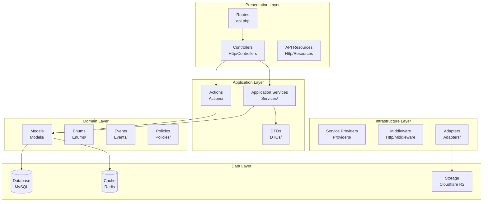

# Backend Architecture

The Neetaq backend follows Domain-Driven Design (DDD) principles with a clean separation of concerns.

## Architecture Overview



## Domain Structure

The backend is organized into domains under `app/Domains/`:

```
backend/app/Domains/
├── Application/           # Shared application logic
│   ├── Http/
│   │   ├── Controllers/   # Organized by role (Admin, Teacher, Student, etc.)
│   │   ├── Middleware/    # Custom middleware
│   │   └── Resources/     # API Resources
│   └── Services/          # Application services
│
├── Auth/                  # Authentication & Authorization
│   ├── Actions/           # Login, OTP, etc.
│   ├── Enums/             # Role enums, status enums
│   ├── Http/Middleware/   # Auth middleware
│   ├── Models/            # User models (Admin, Teacher, Student, etc.)
│   ├── Notifications/     # Auth-related notifications
│   └── Services/          # Auth services
│
├── Exams/                 # Exam & Assessment domain
│   ├── Actions/           # Start/Submit exam
│   ├── Builders/          # Query builders
│   ├── DTOs/              # Exam data transfer objects
│   ├── Enums/             # Exam status, question types
│   ├── Events/            # Exam lifecycle events
│   ├── Jobs/              # Background processing
│   ├── Listeners/         # Event listeners
│   ├── Models/            # Exam, Question, Attempt, Result
│   ├── Notifications/     # Exam notifications
│   └── Resources/         # API resources
│
├── Lectures/              # Lecture & Attendance domain
│   ├── Actions/           # Activate/Close lecture
│   ├── DTOs/              # Lecture data objects
│   ├── Enums/             # Attendance methods, status
│   ├── Events/            # Lecture lifecycle
│   ├── Jobs/              # Scheduled lecture jobs
│   ├── Listeners/         # Event listeners
│   ├── Models/            # Lecture, Attendance, Session
│   ├── Notifications/     # Attendance notifications
│   ├── Policies/          # Authorization policies
│   └── Resources/         # API resources
│
├── Enrollments/           # Student enrollment domain
│   ├── DTOs/              # Enrollment data
│   ├── Enums/             # Enrollment status, group types
│   ├── Models/            # Enrollment, Group, Grade
│   └── Resources/         # API resources
│
├── Notifications/         # Notification system
│   ├── Channels/          # FCM, Voice, Database
│   ├── Contracts/         # Channel interfaces
│   ├── DTOs/              # Notification data
│   ├── Enums/             # Notification types
│   ├── Events/            # Notification events
│   ├── Factories/         # Notification factories
│   ├── Jobs/              # Bulk notification jobs
│   ├── Listeners/         # Broadcast listeners
│   ├── Models/            # SentNotification, AcademyNotification
│   ├── Resources/         # API resources
│   └── Services/          # Notification services
│
├── Subscriptions/         # Payment & Subscription domain
│   ├── DTOs/              # Payment data
│   ├── Enums/             # Subscription status, payment methods
│   ├── Events/            # Subscription events
│   ├── Exceptions/        # Quota exceptions
│   ├── Jobs/              # Expiration checks
│   ├── Listeners/         # Expiration listeners
│   ├── Models/            # Subscription, PaymentLog
│   └── Specifications/    # Business rules
│
├── Media/                 # File storage domain
│   ├── Adapters/          # R2, Local storage adapters
│   ├── Jobs/              # Upload processing
│   └── Services/          # Image processing, avatar service
│
└── Support/               # Shared support utilities
    ├── Enums/             # Common enums
    └── Traits/            # Reusable traits
```

## Naming Conventions

### Controllers

```php
// Format: {Role}{Entity}Controller.php
AdminTeacherController.php      // Admin managing teachers
TeacherStudentController.php    // Teacher managing students
StudentExamController.php       // Student taking exams
AcademyDashboardController.php  // Academy dashboard
```

### Services

```php
// Format: {Entity}Service.php or {Role}{Entity}Service.php
TeacherService.php              // General teacher operations
AdminTeacherService.php         // Admin-specific teacher operations
StudentExamService.php          // Student exam operations
NotificationService.php         // General notification service
```

### Models

```php
// Singular, PascalCase
Teacher.php
Student.php
Exam.php
ExamAttempt.php
LectureSession.php
```

### DTOs

```php
// Format: {Entity}Data.php
TeacherData.php
StudentExamData.php
CreateEnrollmentDTO.php
```

### Resources

```php
// Format: {Entity}Resource.php
TeacherResource.php
StudentDashboardResource.php
ExamResultDetailResource.php
```

## Layer Responsibilities

### Controllers (Presentation Layer)

- Handle HTTP requests/responses
- Delegate to services/actions
- Return API resources

```php
<?php
namespace App\Domains\Application\Http\Controllers\Teacher;

use App\Domains\Application\Http\Controllers\Controller;
use App\Domains\Application\Services\Teacher\TeacherService;
use Illuminate\Http\JsonResponse;
use Illuminate\Http\Request;

class StudentController extends Controller
{
    public function __construct(
        private TeacherService $service
    ) {}

    public function index(Request $request): JsonResponse
    {
        $students = $this->service->getStudents($request->user());
        return $this->successResponse($students);
    }
}
```

### Services (Application Layer)

- Contain business logic
- Orchestrate domain operations
- Handle transactions

```php
<?php
namespace App\Domains\Application\Services\Teacher;

use App\Domains\Auth\Models\Teacher;
use App\Domains\Auth\Models\Student;
use Illuminate\Support\Collection;

class TeacherService
{
    public function getStudents(Teacher $teacher): Collection
    {
        return $teacher->students()
            ->with('groups')
            ->get();
    }
}
```

### Models (Domain Layer)

- Define data structure
- Encapsulate business rules
- Define relationships

```php
<?php
namespace App\Domains\Auth\Models;

use App\Domains\Enrollments\Models\Enrollment;
use Illuminate\Database\Eloquent\Relations\HasMany;

class Teacher extends Authenticatable
{
    public function students(): BelongsToMany
    {
        return $this->belongsToMany(Student::class, 'enrollments')
            ->withPivot(['grade_id', 'group_id']);
    }
}
```

### Actions (Application Layer)

Single-responsibility classes for discrete operations:

```php
<?php
namespace App\Domains\Exams\Actions;

use App\Domains\Auth\Models\Student;
use App\Domains\Exams\Models\Exam;
use App\Domains\Exams\Models\ExamAttempt;

class StartAttemptAction
{
    public function execute(Exam $exam, Student $student): ExamAttempt
    {
        return ExamAttempt::create([
            'exam_id' => $exam->id,
            'student_id' => $student->id,
            'started_at' => now(),
            'status' => ExamAttemptStatus::IN_PROGRESS,
        ]);
    }
}
```

## Repository Pattern

The project uses Eloquent directly with query scopes and builders:

```php
<?php
namespace App\Domains\Exams\Builders;

use Illuminate\Database\Eloquent\Builder;

class ExamAttemptBuilder extends Builder
{
    public function forStudent(string $studentId): self
    {
        return $this->where('student_id', $studentId);
    }

    public function inProgress(): self
    {
        return $this->where('status', ExamAttemptStatus::IN_PROGRESS);
    }

    public function completedToday(): self
    {
        return $this->whereDate('completed_at', today());
    }
}
```

## Dependency Injection

All dependencies are injected through constructors:

```php
class ExamController extends Controller
{
    public function __construct(
        private StartAttemptAction $startAttempt,
        private SubmitAttemptAction $submitAttempt,
        private ExamResultService $resultService,
    ) {}
}
```

## Service Provider Registration

```php
<?php
// bootstrap/providers.php
return [
    App\Providers\AppServiceProvider::class,
    App\Providers\RepositoryServiceProvider::class,
    App\Providers\SettingsServiceProvider::class,
    App\Providers\HorizonServiceProvider::class,
];
```

## API Response Format

All controllers use the `ApiResponseTrait` for consistent responses:

```php
// Success Response
{
    "status": true,
    "status_code": 200,
    "message": "Success",
    "data": { ... }
}

// Error Response
{
    "status": false,
    "status_code": 400,
    "message": "Validation failed",
    "errors": { ... }
}
```

## References

- [`backend/app/Domains/`](/backend/app/Domains/)
- [`backend/routes/api.php`](/backend/routes/api.php)
- [`backend/app/Domains/Support/Traits/ApiResponseTrait.php`](/backend/app/Domains/Support/Traits/ApiResponseTrait.php)
- [`backend/bootstrap/providers.php`](/backend/bootstrap/providers.php)

## TODO

- [ ] Document event sourcing implementation
- [ ] Add CQRS pattern documentation
- [ ] Document query optimization strategies
- [ ] Add caching layer documentation
