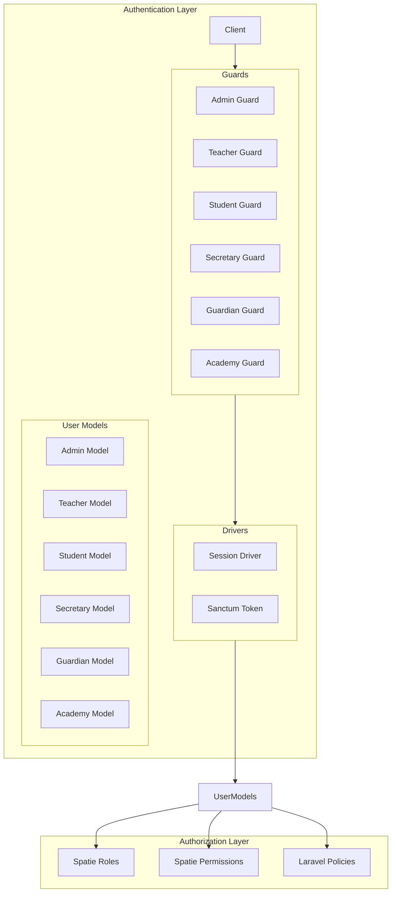
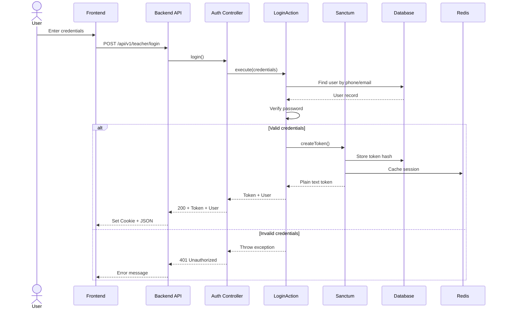

# Authentication & Authorization

The Neetaq platform implements a multi-guard authentication system supporting multiple user types with distinct roles and permissions.

## Authentication Architecture



## Multi-Guard Configuration

```php
<?php
// config/auth.php
return [
    'defaults' => [
        'guard' => env('AUTH_GUARD', 'web'),
        'passwords' => env('AUTH_PASSWORD_BROKER', 'users'),
    ],

    'guards' => [
        'web' => [
            'driver' => 'session',
            'provider' => 'users',
        ],
        
        'admin' => [
            'driver' => 'session',
            'provider' => 'admins',
        ],
        
        'teacher' => [
            'driver' => 'session',
            'provider' => 'teachers',
        ],
        
        'student' => [
            'driver' => 'session',
            'provider' => 'students',
        ],
        
        'secretary' => [
            'driver' => 'session',
            'provider' => 'secretaries',
        ],
        
        'guardian' => [
            'driver' => 'session',
            'provider' => 'guardians',
        ],
        
        'academy' => [
            'driver' => 'session',
            'provider' => 'academies',
        ],
    ],

    'providers' => [
        'admins' => [
            'driver' => 'eloquent',
            'model' => App\Domains\Auth\Models\Admin::class,
        ],
        
        'teachers' => [
            'driver' => 'eloquent',
            'model' => App\Domains\Auth\Models\Teacher::class,
        ],
        
        'students' => [
            'driver' => 'eloquent',
            'model' => App\Domains\Auth\Models\Student::class,
        ],
        
        'secretaries' => [
            'driver' => 'eloquent',
            'model' => App\Domains\Auth\Models\Secretary::class,
        ],
        
        'guardians' => [
            'driver' => 'eloquent',
            'model' => App\Domains\Auth\Models\Guardian::class,
        ],
        
        'academies' => [
            'driver' => 'eloquent',
            'model' => App\Domains\Auth\Models\Academy::class,
        ],
    ],
];
```

## User Models

### Admin

```php
<?php
namespace App\Domains\Auth\Models;

use Illuminate\Foundation\Auth\User as Authenticatable;
use Laravel\Sanctum\HasApiTokens;
use Spatie\Permission\Traits\HasRoles;

class Admin extends Authenticatable
{
    use HasApiTokens, HasRoles, HasUuids;

    protected $fillable = [
        'name',
        'email',
        'password',
        'phone',
        'avatar_key',
        'is_super_admin',
    ];

    protected $hidden = [
        'password',
        'remember_token',
    ];

    protected $casts = [
        'password' => 'hashed',
        'is_super_admin' => 'boolean',
    ];
}
```

### Teacher

```php
<?php
namespace App\Domains\Auth\Models;

class Teacher extends Authenticatable
{
    use HasApiTokens, HasRoles, HasUuids, HasDeviceTokens;

    protected $fillable = [
        'name',
        'email',
        'password',
        'phone',
        'avatar_key',
        'status',
        'is_independent',
        'subscription_plan',
        'subscription_expires_at',
    ];

    protected $casts = [
        'password' => 'hashed',
        'is_independent' => 'boolean',
        'subscription_expires_at' => 'datetime',
        'status' => TeacherStatus::class,
    ];

    // Relationships
    public function academies(): BelongsToMany
    {
        return $this->belongsToMany(Academy::class, 'academy_teacher')
            ->withPivot(['is_active']);
    }

    public function students(): BelongsToMany
    {
        return $this->belongsToMany(Student::class, 'enrollments')
            ->withPivot(['grade_id', 'group_id', 'is_active']);
    }
}
```

### Student

```php
<?php
namespace App\Domains\Auth\Models;

class Student extends Authenticatable
{
    use HasApiTokens, HasRoles, HasUuids, HasDeviceTokens;

    protected $fillable = [
        'name',
        'password',
        'phone',
        'parent_phone',
        'guardian_id',
        'avatar_key',
        'gender',
        'education_type',
        'location',
    ];

    protected $casts = [
        'password' => 'hashed',
        'gender' => StudentGender::class,
        'education_type' => StudentEducationType::class,
    ];

    public function guardian(): BelongsTo
    {
        return $this->belongsTo(Guardian::class);
    }

    public function enrollments(): HasMany
    {
        return $this->hasMany(Enrollment::class);
    }
}
```

## Authentication Flows

### Login Flow



### Token Authentication

```php
<?php
// Auth Controller - Token Response
public function login(LoginRequest $request): JsonResponse
{
    $credentials = $request->validated();
    
    $result = $this->loginAction->execute($credentials);
    
    return $this->successResponse([
        'user' => new TeacherResource($result['user']),
        'token' => $result['token'],
    ], 'Login successful');
}

// Token Creation
$token = $user->createToken(
    name: 'auth_token',
    expiresAt: now()->addDays(30)
);

return [
    'user' => $user,
    'token' => $token->plainTextToken,
];
```

### Token Validation Middleware

```php
<?php
// Protected Route
Route::middleware('auth:sanctum')->group(function () {
    Route::get('/students', [StudentController::class, 'index']);
});

// Middleware Flow:
// 1. Extract Bearer token from header
// 2. Look up token in personal_access_tokens table
// 3. Retrieve associated user
// 4. Set user on request
// 5. Continue to controller
```

## Cookie-Based Sessions

### Session Configuration

```php
// config/session.php
return [
    'driver' => env('SESSION_DRIVER', 'redis'),
    'lifetime' => env('SESSION_LIFETIME', 120),
    'expire_on_close' => false,
    'encrypt' => true,
    'same_site' => 'lax',
    'secure' => env('SESSION_SECURE_COOKIE', false),
];
```

### Cookie Response

```php
<?php
// Set cookie with token
return response()
    ->json(['message' => 'Login successful'])
    ->cookie(
        name: 'auth_token',
        value: $token,
        minutes: 60 * 24 * 30, // 30 days
        path: '/',
        domain: null,
        secure: true,
        httpOnly: true,
        sameSite: 'lax'
    );
```

## Role-Based Access Control (RBAC)

### Role Definitions

| Role | Description | Permissions |
|------|-------------|-------------|
| `super-admin` | Full system access | All permissions |
| `admin` | Platform administration | Manage teachers, academies |
| `teacher` | Content creator | Manage students, exams |
| `secretary` | Administrative assistant | Limited academy access |
| `student` | End user | Take exams, view content |
| `guardian` | Parent access | View child progress |

### Permission Definitions

```php
<?php
// Database seeder
$permissions = [
    // Teacher permissions
    'teacher.view',
    'teacher.create',
    'teacher.edit',
    'teacher.delete',
    
    // Student permissions
    'student.view',
    'student.create',
    'student.edit',
    'student.delete',
    
    // Exam permissions
    'exam.view',
    'exam.create',
    'exam.edit',
    'exam.delete',
    'exam.activate',
    
    // Academy permissions
    'academy.view',
    'academy.manage',
];

foreach ($permissions as $permission) {
    Permission::create(['name' => $permission]);
}

// Assign to roles
$teacherRole->givePermissionTo([
    'student.view', 'student.create', 'student.edit',
    'exam.view', 'exam.create', 'exam.edit', 'exam.activate',
]);
```

### Checking Permissions

```php
<?php
// In controller
public function store(Request $request): JsonResponse
{
    if (!$request->user()->can('student.create')) {
        return $this->errorResponse('Unauthorized', 403);
    }
    
    // Or use middleware
}

// Route middleware
Route::post('/students', [StudentController::class, 'store'])
    ->middleware('can:student.create');

// Blade directive
@can('student.edit')
    <button>Edit</button>
@endcan
```

## Academy Context

### Multi-Tenant Authorization

```php
<?php
namespace App\Domains\Auth\Http\Middleware;

use Closure;
use Illuminate\Http\Request;

class InjectAcademyContext
{
    public function handle(Request $request, Closure $next)
    {
        $academyId = $request->header('X-Academy-Id');
        
        if ($academyId) {
            // Verify user belongs to academy
            $belongsToAcademy = $request->user()
                ->academies()
                ->where('academies.id', $academyId)
                ->exists();
            
            if (!$belongsToAcademy) {
                return response()->json([
                    'message' => 'Unauthorized for this academy'
                ], 403);
            }
            
            // Set academy context for queries
            app()->instance('current_academy_id', $academyId);
        }
        
        return $next($request);
    }
}
```

## Custom Middleware

### Teacher Suspension Check

```php
<?php
namespace App\Domains\Auth\Http\Middleware;

use Closure;
use Illuminate\Http\Request;

class EnsureTeacherNotSuspended
{
    public function handle(Request $request, Closure $next)
    {
        $teacher = $request->user();
        
        if ($teacher && $teacher->status === TeacherStatus::SUSPENDED) {
            return response()->json([
                'message' => 'Your account has been suspended.',
                'code' => 'ACCOUNT_SUSPENDED'
            ], 403);
        }
        
        return $next($request);
    }
}
```

### Throttling

```php
<?php
// Route with throttle
Route::post('/login', [AuthController::class, 'login'])
    ->middleware('throttle.login'); // 5 attempts per minute

// Custom throttle key
RateLimiter::for('login', function (Request $request) {
    return Limit::perMinute(5)->by($request->ip());
});
```

## Logout & Token Revocation

```php
<?php
public function logout(Request $request): JsonResponse
{
    // Revoke current token
    $request->user()->currentAccessToken()->delete();
    
    // Or revoke all tokens
    $request->user()->tokens()->delete();
    
    // Clear session
    auth()->guard('web')->logout();
    
    return $this->successResponse(null, 'Logged out successfully');
}
```

## Token Refresh

```php
<?php
public function refresh(Request $request): JsonResponse
{
    $user = $request->user();
    
    // Delete old token
    $request->user()->currentAccessToken()->delete();
    
    // Create new token
    $token = $user->createToken('auth_token');
    
    return $this->successResponse([
        'token' => $token->plainTextToken,
    ]);
}
```

## Device Token Management

```php
<?php
namespace App\Domains\Auth\Models;

class DeviceToken extends Model
{
    protected $fillable = [
        'user_id',
        'user_type',
        'device_token',
        'device_type',
        'device_name',
        'last_used_at',
    ];

    public function tokenable(): MorphTo
    {
        return $this->morphTo('user');
    }
}

// Store device token
DeviceToken::create([
    'user_id' => $user->id,
    'user_type' => Teacher::class,
    'device_token' => $request->device_token,
    'device_type' => $request->device_type,
]);
```

## References

- [`backend/config/auth.php`](/backend/config/auth.php)
- [`backend/config/sanctum.php`](/backend/config/sanctum.php)
- [`backend/config/permission.php`](/backend/config/permission.php)
- [`backend/app/Domains/Auth/Models/`](/backend/app/Domains/Auth/Models/)
- [`backend/app/Domains/Auth/Http/Middleware/`](/backend/app/Domains/Auth/Http/Middleware/)

## TODO

- [ ] Document OAuth 2.0 implementation
- [ ] Add JWT token alternative documentation
- [ ] Document 2FA implementation
- [ ] Add API key authentication for third parties
