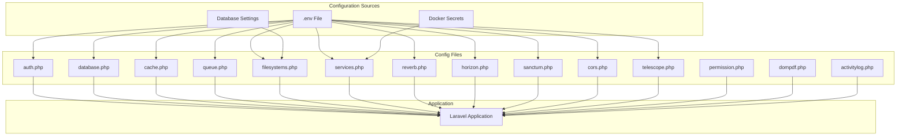
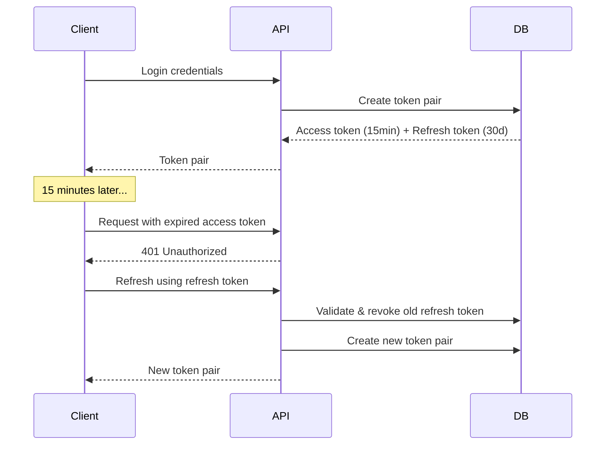
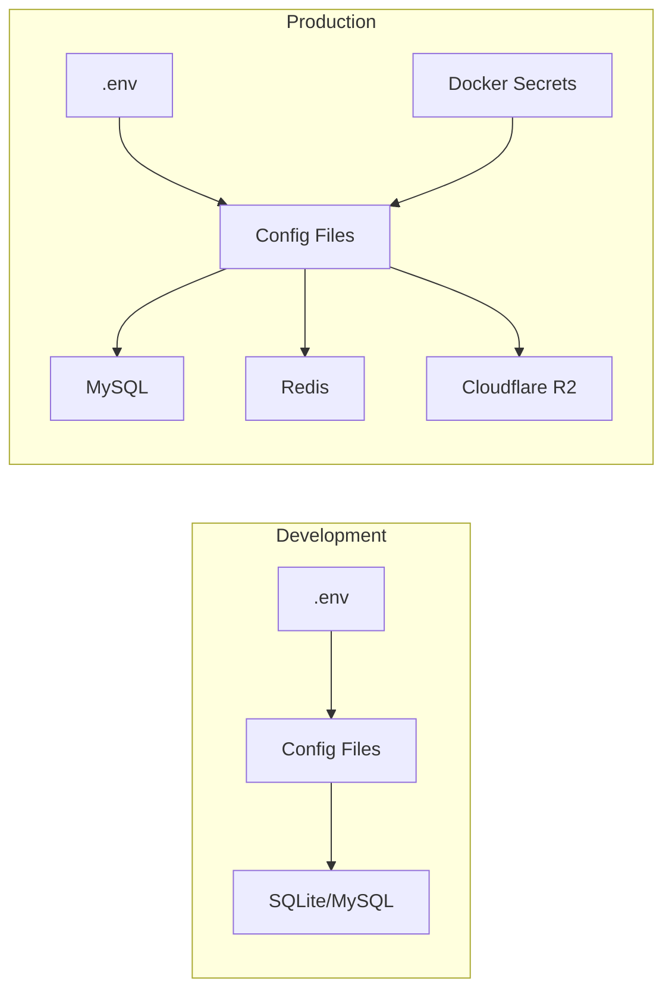

# Configuration Reference

This document provides a comprehensive reference for all backend configuration files, environment variables, and best practices for the application.

## Overview

The backend uses Laravel's configuration system with files located in `backend/config/`. Configuration values can be overridden via environment variables in `.env` files.



## Environment Variables Reference

### Core Application

| Variable | Description | Default | Required |
|----------|-------------|---------|----------|
| `APP_NAME` | Application name | `Laravel` | No |
| `APP_ENV` | Environment (`local`, `production`, `testing`) | `local` | Yes |
| `APP_KEY` | Application encryption key | - | Yes |
| `APP_DEBUG` | Enable debug mode | `false` | Yes |
| `APP_URL` | Application URL | `http://localhost` | Yes |
| `APP_TIMEZONE` | Application timezone | `UTC` | No |

### Database Configuration

| Variable | Description | Default | Required |
|----------|-------------|---------|----------|
| `DB_CONNECTION` | Database driver (`mysql`, `sqlite`, `pgsql`) | `sqlite` | Yes |
| `DB_HOST` | Database host | `127.0.0.1` | Yes |
| `DB_PORT` | Database port | `3306` (MySQL) / `5432` (PostgreSQL) | Yes |
| `DB_DATABASE` | Database name | `laravel` | Yes |
| `DB_USERNAME` | Database username | `root` | Yes |
| `DB_PASSWORD` | Database password | - | Yes |
| `DB_CHARSET` | Character set | `utf8mb4` | No |
| `DB_COLLATION` | Collation | `utf8mb4_unicode_ci` | No |

### Authentication

| Variable | Description | Default | Required |
|----------|-------------|---------|----------|
| `AUTH_GUARD` | Default authentication guard | `web` | No |
| `AUTH_PASSWORD_BROKER` | Password reset broker | `users` | No |
| `AUTH_PASSWORD_TIMEOUT` | Password confirmation timeout (seconds) | `10800` | No |

### Cache Configuration

| Variable | Description | Default | Required |
|----------|-------------|---------|----------|
| `CACHE_STORE` | Default cache driver | `database` | Yes |
| `DB_CACHE_CONNECTION` | Database cache connection | - | No |
| `DB_CACHE_TABLE` | Cache table name | `cache` | No |
| `REDIS_CACHE_CONNECTION` | Redis cache connection | `cache` | No |

### Queue Configuration

| Variable | Description | Default | Required |
|----------|-------------|---------|----------|
| `QUEUE_CONNECTION` | Default queue driver | `database` | Yes |
| `DB_QUEUE_CONNECTION` | Database queue connection | - | No |
| `DB_QUEUE_TABLE` | Jobs table name | `jobs` | No |
| `DB_QUEUE` | Default queue name | `default` | No |
| `DB_QUEUE_RETRY_AFTER` | Retry after seconds | `90` | No |

---

## Authentication Configuration

**File:** [`config/auth.php`](../../../backend/config/auth.php)

### Guards

The application uses multiple authentication guards for different user types:

```php
'guards' => [
    'web' => [
        'driver' => 'session',
        'provider' => 'users',
    ],
    'admin' => [
        'driver' => 'session',
        'provider' => 'admins',
    ],
    'teacher' => [
        'driver' => 'session',
        'provider' => 'teachers',
    ],
    'student' => [
        'driver' => 'session',
        'provider' => 'students',
    ],
    'secretary' => [
        'driver' => 'session',
        'provider' => 'secretaries',
    ],
    'guardian' => [
        'driver' => 'session',
        'provider' => 'guardians',
    ],
    'academy' => [
        'driver' => 'session',
        'provider' => 'academies',
    ],
],
```

### User Providers

Each guard has a corresponding Eloquent provider:

| Provider | Model | Description |
|----------|-------|-------------|
| `admins` | `App\Domains\Auth\Models\Admin` | Admin users |
| `teachers` | `App\Domains\Auth\Models\Teacher` | Teacher accounts |
| `students` | `App\Domains\Auth\Models\Student` | Student accounts |
| `secretaries` | `App\Domains\Auth\Models\Secretary` | Secretary accounts |
| `guardians` | `App\Domains\Auth\Models\Guardian` | Parent/Guardian accounts |
| `academies` | `App\Domains\Auth\Models\Academy` | Academy/Institution accounts |

### Usage Example

```php
// Authenticate with specific guard
auth()->guard('teacher')->attempt($credentials);
auth()->guard('student')->user();

// Check authenticated guard
if (auth()->guard('teacher')->check()) {
    // Teacher is logged in
}
```

---

## Database Configuration

**File:** [`config/database.php`](../../../backend/config/database.php)

### Supported Connections

#### MySQL

```php
'mysql' => [
    'driver' => 'mysql',
    'host' => env('DB_HOST', '127.0.0.1'),
    'port' => env('DB_PORT', '3306'),
    'database' => env('DB_DATABASE', 'laravel'),
    'username' => env('DB_USERNAME', 'root'),
    'password' => env('DB_PASSWORD', ''),
    'charset' => env('DB_CHARSET', 'utf8mb4'),
    'collation' => env('DB_COLLATION', 'utf8mb4_unicode_ci'),
    'strict' => true,
],
```

#### MariaDB

```php
'mariadb' => [
    'driver' => 'mariadb',
    'host' => env('DB_HOST', '127.0.0.1'),
    'port' => env('DB_PORT', '3306'),
    // ... similar to MySQL
],
```

#### PostgreSQL

```php
'pgsql' => [
    'driver' => 'pgsql',
    'host' => env('DB_HOST', '127.0.0.1'),
    'port' => env('DB_PORT', '5432'),
    'database' => env('DB_DATABASE', 'laravel'),
    'search_path' => 'public',
    'sslmode' => 'prefer',
],
```

#### SQLite (Development)

```php
'sqlite' => [
    'driver' => 'sqlite',
    'database' => env('DB_DATABASE', database_path('database.sqlite')),
    'foreign_key_constraints' => env('DB_FOREIGN_KEYS', true),
],
```

### Redis Configuration

```php
'redis' => [
    'client' => env('REDIS_CLIENT', 'predis'),
    'options' => [
        'cluster' => env('REDIS_CLUSTER', 'redis'),
    ],
    'default' => [
        'url' => env('REDIS_URL'),
        'host' => env('REDIS_HOST', '127.0.0.1'),
        'password' => env('REDIS_PASSWORD'),
        'port' => env('REDIS_PORT', '6379'),
    ],
    'cache' => [
        'url' => env('REDIS_URL'),
        'host' => env('REDIS_HOST', '127.0.0.1'),
        'password' => env('REDIS_PASSWORD'),
        'port' => env('REDIS_PORT', '6379'),
        'database' => env('REDIS_CACHE_DB', '1'),
    ],
],
```

---

## Filesystems Configuration

**File:** [`config/filesystems.php`](../../../backend/config/filesystems.php)

### Available Disks

#### Local Storage

```php
'local' => [
    'driver' => 'local',
    'root' => storage_path('app/private'),
    'serve' => true,
    'throw' => false,
],
```

#### Public Storage

```php
'public' => [
    'driver' => 'local',
    'root' => storage_path('app/public'),
    'url' => env('APP_URL').'/storage',
    'visibility' => 'public',
],
```

#### Cloudflare R2 (Production)

```php
'r2' => [
    'driver' => 's3',
    'key' => _r2_setting('cloudflare_r2_access_key_id', 'R2_ACCESS_KEY_ID'),
    'secret' => _r2_setting('cloudflare_r2_secret_access_key', 'R2_SECRET_ACCESS_KEY'),
    'region' => 'auto',
    'bucket' => _r2_setting('cloudflare_r2_bucket', 'R2_BUCKET_NAME'),
    'endpoint' => _r2_setting('cloudflare_r2_endpoint', 'R2_ENDPOINT'),
    'url' => _r2_setting('cloudflare_r2_public_url', 'R2_PUBLIC_DOMAIN'),
    'use_path_style_endpoint' => false,
    'throw' => true,
],
```

### R2 Environment Variables

| Variable | Description | Required |
|----------|-------------|----------|
| `R2_ACCESS_KEY_ID` | R2 access key | Yes |
| `R2_SECRET_ACCESS_KEY` | R2 secret key | Yes |
| `R2_BUCKET_NAME` | R2 bucket name | Yes |
| `R2_ACCOUNT_ID` | Cloudflare account ID | Yes |
| `R2_ENDPOINT` | R2 endpoint URL | No |
| `R2_PUBLIC_DOMAIN` | Public URL domain | No |

::: tip Dynamic R2 Settings
R2 credentials can be stored in the database settings table (`cloudflare_r2_*` keys) with encryption at rest. The `_r2_setting()` helper falls back to environment variables when database is unavailable.
:::

### Usage Example

```php
// Store file on R2
Storage::disk('r2')->put('videos/example.mp4', $fileContent);

// Generate temporary URL
$url = Storage::disk('r2')->temporaryUrl('videos/example.mp4', now()->addMinutes(30));
```

---

## Services Configuration

**File:** [`config/services.php`](../../../backend/config/services.php)

### Firebase

```php
'firebase' => [
    'credentials' => docker_secret('FIREBASE_CREDENTIALS', storage_path('firebase/service-account.json')),
    'project_id' => docker_secret('FIREBASE_PROJECT_ID'),
],
```

| Variable | Description | Required |
|----------|-------------|----------|
| `FIREBASE_CREDENTIALS` | Path to service account JSON | Yes |
| `FIREBASE_PROJECT_ID` | Firebase project ID | Yes |

### Cloudflare Services

```php
'cloudflare' => [
    'r2' => [
        'access_key_id' => docker_secret('CLOUDFLARE_R2_ACCESS_KEY_ID'),
        'secret_access_key' => docker_secret('CLOUDFLARE_R2_SECRET_ACCESS_KEY'),
        'bucket' => docker_secret('CLOUDFLARE_R2_BUCKET'),
        'endpoint' => docker_secret('CLOUDFLARE_R2_ENDPOINT'),
        'public_url' => docker_secret('CLOUDFLARE_R2_PUBLIC_URL'),
    ],
    'kv' => [
        'account_id' => docker_secret('CLOUDFLARE_KV_ACCOUNT_ID'),
        'namespace_id' => docker_secret('CLOUDFLARE_KV_NAMESPACE_ID'),
        'api_token' => docker_secret('CLOUDFLARE_KV_API_TOKEN'),
    ],
],
```

### Email Services

```php
'postmark' => [
    'key' => env('POSTMARK_API_KEY'),
],

'resend' => [
    'key' => env('RESEND_API_KEY'),
],

'ses' => [
    'key' => env('AWS_ACCESS_KEY_ID'),
    'secret' => env('AWS_SECRET_ACCESS_KEY'),
    'region' => env('AWS_DEFAULT_REGION', 'us-east-1'),
],
```

---

## Cache Configuration

**File:** [`config/cache.php`](../../../backend/config/cache.php)

### Available Stores

| Store | Driver | Best For |
|-------|--------|----------|
| `array` | Array | Testing |
| `database` | Database | Simple setups |
| `file` | File | Single server |
| `redis` | Redis | Production |
| `memcached` | Memcached | High performance |
| `dynamodb` | DynamoDB | AWS environments |
| `failover` | Failover | High availability |

### Configuration

```php
'default' => env('CACHE_STORE', 'database'),

'stores' => [
    'database' => [
        'driver' => 'database',
        'connection' => env('DB_CACHE_CONNECTION'),
        'table' => env('DB_CACHE_TABLE', 'cache'),
    ],
    
    'redis' => [
        'driver' => 'redis',
        'connection' => env('REDIS_CACHE_CONNECTION', 'cache'),
    ],
    
    'failover' => [
        'driver' => 'failover',
        'stores' => ['database', 'array'],
    ],
],
```

### Usage Example

```php
// Cache with TTL
Cache::put('key', 'value', now()->addHours(1));

// Cache with tags (Redis only)
Cache::tags(['users', 'teachers'])->put('teacher:1', $teacher);

// Remember pattern
$settings = Cache::remember('app.settings', 3600, fn() => Setting::all());
```

---

## Queue Configuration

**File:** [`config/queue.php`](../../../backend/config/queue.php)

### Available Connections

| Connection | Driver | Use Case |
|------------|--------|----------|
| `sync` | Synchronous | Testing/Debug |
| `database` | Database | Simple setups |
| `redis` | Redis | Production with Horizon |
| `sqs` | AWS SQS | AWS environments |
| `beanstalkd` | Beanstalkd | Legacy systems |
| `failover` | Failover | High availability |

### Configuration

```php
'default' => env('QUEUE_CONNECTION', 'database'),

'connections' => [
    'database' => [
        'driver' => 'database',
        'connection' => env('DB_QUEUE_CONNECTION'),
        'table' => env('DB_QUEUE_TABLE', 'jobs'),
        'queue' => env('DB_QUEUE', 'default'),
        'retry_after' => (int) env('DB_QUEUE_RETRY_AFTER', 90),
    ],
    
    'redis' => [
        'driver' => 'redis',
        'connection' => env('REDIS_QUEUE_CONNECTION', 'default'),
        'queue' => env('REDIS_QUEUE', 'default'),
        'retry_after' => 90,
    ],
    
    'failover' => [
        'driver' => 'failover',
        'connections' => ['database', 'deferred'],
    ],
],
```

### Job Batching

```php
'batching' => [
    'database' => env('DB_CONNECTION', 'sqlite'),
    'table' => 'job_batches',
],
```

### Failed Jobs

```php
'failed' => [
    'driver' => env('QUEUE_FAILED_DRIVER', 'database-uuids'),
    'database' => env('DB_CONNECTION', 'mysql'),
    'table' => 'failed_jobs',
],
```

---

## Horizon Configuration

**File:** [`config/horizon.php`](../../../backend/config/horizon.php)

Laravel Horizon provides a dashboard for monitoring Redis queues.

### Basic Settings

```php
'name' => env('HORIZON_NAME'),
'domain' => env('HORIZON_DOMAIN'),
'path' => env('HORIZON_PATH', 'horizon'),
'use' => 'default', // Redis connection
'prefix' => env('HORIZON_PREFIX', Str::slug(env('APP_NAME'), '_').'_horizon:'),
```

### Environment Variables

| Variable | Description | Default |
|----------|-------------|---------|
| `HORIZON_NAME` | Horizon instance name | - |
| `HORIZON_DOMAIN` | Subdomain for Horizon | - |
| `HORIZON_PATH` | URL path | `horizon` |
| `HORIZON_PREFIX` | Redis key prefix | `{app}_horizon:` |

### Job Trimming

```php
'trim' => [
    'recent' => 60,          // 1 hour
    'pending' => 60,         // 1 hour
    'completed' => 60,       // 1 hour
    'recent_failed' => 10080, // 1 week
    'failed' => 10080,       // 1 week
    'monitored' => 10080,    // 1 week
],
```

### Wait Thresholds

```php
'waits' => [
    'redis:default' => 60, // Alert after 60 seconds wait
],
```

---

## Reverb (WebSocket) Configuration

**File:** [`config/reverb.php`](../../../backend/config/reverb.php)

### Server Configuration

```php
'default' => env('REVERB_SERVER', 'reverb'),

'servers' => [
    'reverb' => [
        'host' => env('REVERB_SERVER_HOST', '0.0.0.0'),
        'port' => env('REVERB_SERVER_PORT', 8080),
        'path' => env('REVERB_SERVER_PATH', ''),
        'hostname' => env('REVERB_HOST'),
        'max_request_size' => env('REVERB_MAX_REQUEST_SIZE', 10_000),
        'scaling' => [
            'enabled' => env('REVERB_SCALING_ENABLED', false),
            'channel' => env('REVERB_SCALING_CHANNEL', 'reverb'),
            'server' => [
                'url' => env('REDIS_URL'),
                'host' => env('REDIS_HOST', '127.0.0.1'),
                'port' => env('REDIS_PORT', '6379'),
            ],
        ],
    ],
],
```

### Application Credentials

| Variable | Description | Required |
|----------|-------------|----------|
| `REVERB_APP_ID` | Application ID | Yes |
| `REVERB_APP_KEY` | Public key | Yes |
| `REVERB_APP_SECRET` | Secret key | Yes |
| `REVERB_HOST` | WebSocket host | Yes |
| `REVERB_PORT` | WebSocket port | No |
| `REVERB_SCALING_ENABLED` | Enable horizontal scaling | No |

### Scaling Configuration

For horizontal scaling, enable Redis pub/sub:

```env
REVERB_SCALING_ENABLED=true
REVERB_SCALING_CHANNEL=reverb
REDIS_URL=redis://localhost:6379
```

---

## Sanctum Configuration

**File:** [`config/sanctum.php`](../../../backend/config/sanctum.php)

### Stateful Domains

```php
'stateful' => explode(',', env('SANCTUM_STATEFUL_DOMAINS', sprintf(
    '%s%s',
    'localhost,localhost:3000,127.0.0.1,127.0.0.1:8000,::1',
    Sanctum::currentApplicationUrlWithPort(),
))),
```

### Authentication Guards

```php
'guard' => ['web', 'admin', 'teacher', 'student', 'secretary', 'guardian'],
```

### Token Expiration

The application uses explicit `expires_at` values per token type:

| Token Type | TTL | Environment Variable |
|------------|-----|---------------------|
| Access Token | 15 minutes | `ACCESS_TOKEN_TTL_MINUTES` |
| Refresh Token | 30 days | `REFRESH_TOKEN_TTL_DAYS` |

```php
'expiration' => null, // Uses explicit expires_at per token
```

### Token Lifecycle



---

## CORS Configuration

**File:** [`config/cors.php`](../../../backend/config/cors.php)

### Configuration

```php
'paths' => ['api/*', 'sanctum/csrf-cookie', 'avatar/*', 'broadcasting/*'],

'allowed_methods' => ['*'],

'allowed_origins' => [
    'http://localhost:3000',
    'http://127.0.0.1:3000',
    'http://localhost',
    'http://127.0.0.1',
    'http://75.119.130.3',
    'http://neetaq.com',
    'https://neetaq.com',
],

'allowed_headers' => ['*'],

'supports_credentials' => true,
```

### Production CORS

For production, update `allowed_origins` to include only your production domains:

```php
'allowed_origins' => [
    'https://yourdomain.com',
    'https://www.yourdomain.com',
],
```

---

## Telescope Configuration

**File:** [`config/telescope.php`](../../../backend/config/telescope.php)

### Basic Settings

```php
'enabled' => env('TELESCOPE_ENABLED', true),
'domain' => env('TELESCOPE_DOMAIN'),
'path' => env('TELESCOPE_PATH', 'telescope'),
'driver' => env('TELESCOPE_DRIVER', 'database'),
```

### Environment Variables

| Variable | Description | Default |
|----------|-------------|---------|
| `TELESCOPE_ENABLED` | Enable/disable Telescope | `true` |
| `TELESCOPE_PATH` | URL path | `telescope` |
| `TELESCOPE_DRIVER` | Storage driver | `database` |

### Storage Configuration

```php
'storage' => [
    'database' => [
        'connection' => env('DB_CONNECTION', 'mysql'),
        'chunk' => 1000,
    ],
],
```

### Ignored Paths

```php
'ignore_paths' => [
    'livewire*',
    'nova-api*',
    'pulse*',
    '_boost*',
],
```

::: warning Production Security
Always restrict Telescope access in production using the `Authorize` middleware. Never expose Telescope publicly.
:::

---

## Permission Configuration

**File:** [`config/permission.php`](../../../backend/config/permission.php)

Spatie Laravel Permission package configuration.

### Table Names

```php
'table_names' => [
    'roles' => 'roles',
    'permissions' => 'permissions',
    'model_has_permissions' => 'model_has_permissions',
    'model_has_roles' => 'model_has_roles',
    'role_has_permissions' => 'role_has_permissions',
],
```

### Column Names

```php
'column_names' => [
    'role_pivot_key' => null,
    'permission_pivot_key' => null,
    'model_morph_key' => 'model_id',
    'team_foreign_key' => 'team_id',
],
```

### Usage Example

```php
// Assign role to user
$user->assignRole('teacher');

// Check permission
if ($user->can('edit-lectures')) {
    // ...
}

// Create permission
Permission::create(['name' => 'edit-lectures']);

// Create role with permissions
$role = Role::create(['name' => 'teacher']);
$role->givePermissionTo(['edit-lectures', 'view-students']);
```

---

## DomPDF Configuration

**File:** [`config/dompdf.php`](../../../backend/config/dompdf.php)

### Key Settings

```php
'show_warnings' => false,
'public_path' => null,
'convert_entities' => true,

'options' => [
    'font_dir' => storage_path('fonts'),
    'font_cache' => storage_path('fonts'),
    'temp_dir' => sys_get_temp_dir(),
    'chroot' => storage_path(),
    'log_output_file' => storage_path('logs/dompdf.log'),
],
```

### Usage Example

```php
// Generate PDF from view
$pdf = Pdf::loadView('reports.exam-results', ['results' => $results]);

// Download PDF
return $pdf->download('exam-results.pdf');

// Stream PDF
return $pdf->stream('exam-results.pdf');

// Save to storage
Storage::disk('r2')->put('reports/exam-results.pdf', $pdf->output());
```

---

## Activity Log Configuration

**File:** [`config/activitylog.php`](../../../backend/config/activitylog.php)

### Configuration

```php
'enabled' => env('ACTIVITY_LOGGER_ENABLED', true),
'delete_records_older_than_days' => 365,
'default_log_name' => 'default',
'subject_returns_soft_deleted_models' => false,
'activity_model' => \Spatie\Activitylog\Models\Activity::class,
'table_name' => env('ACTIVITY_LOGGER_TABLE_NAME', 'activity_log'),
```

### Environment Variables

| Variable | Description | Default |
|----------|-------------|---------|
| `ACTIVITY_LOGGER_ENABLED` | Enable/disable logging | `true` |
| `ACTIVITY_LOGGER_TABLE_NAME` | Log table name | `activity_log` |
| `ACTIVITY_LOGGER_DB_CONNECTION` | Database connection | Default |

### Usage Example

```php
// Log activity on model
activity()
    ->performedOn($student)
    ->causedBy(auth()->user())
    ->withProperties(['action' => 'enrollment'])
    ->log('Student enrolled in course');

// Retrieve activity logs
$activities = Activity::where('subject_type', Student::class)->get();
```

---

## Best Practices

### Development Environment

```env
APP_ENV=local
APP_DEBUG=true
DB_CONNECTION=mysql
CACHE_STORE=array
QUEUE_CONNECTION=sync
TELESCOPE_ENABLED=true
```

### Production Environment

```env
APP_ENV=production
APP_DEBUG=false
DB_CONNECTION=mysql
CACHE_STORE=redis
QUEUE_CONNECTION=redis
TELESCOPE_ENABLED=false
FILESYSTEM_DISK=r2
```

### Security Recommendations

1. **Never commit `.env` files** - Use `.env.example` as template
2. **Use Docker secrets** for sensitive credentials in production
3. **Enable HTTPS** for all production endpoints
4. **Restrict Telescope/Horizon** access to administrators only
5. **Use encrypted storage** for R2 credentials in database
6. **Rotate API keys** regularly
7. **Use strong APP_KEY** (32+ random characters)

### Configuration Caching

```bash
# Cache configuration for production
php artisan config:cache

# Clear configuration cache
php artisan config:clear
```

::: warning
After running `config:cache`, changes to `.env` won't take effect until you clear the cache.
:::

---

## Configuration Architecture



## Related Documentation

- [Authentication Domain](../domains/auth.md)
- [Database Documentation](../database.md)
- [Security Guide](../security.md)
- [Environment Variables](../../getting-started/env-vars.md)
