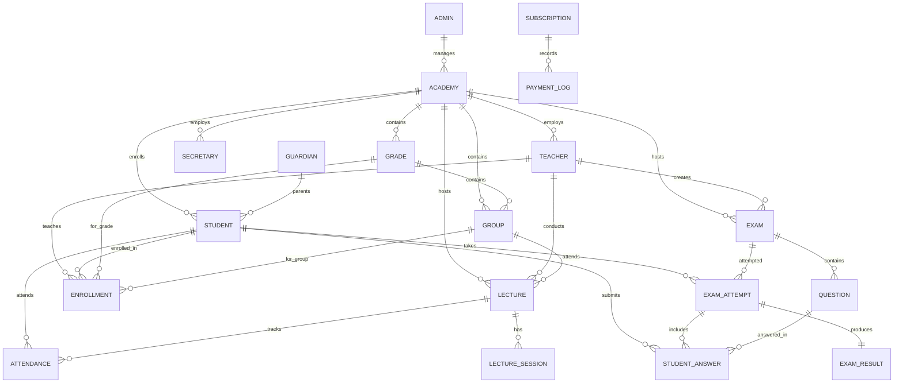

# Database Architecture

The Neetaq platform uses MySQL 8.0 with Laravel Eloquent ORM for data persistence.

## Entity Relationship Diagram



## Core Models

### User Models

```php
<?php
// app/Domains/Auth/Models/Admin.php
class Admin extends Authenticatable
{
    use HasApiTokens, HasRoles, HasUuids;
    
    protected $primaryKey = 'id';
    protected $keyType = 'string';
    public $incrementing = false;
}

// app/Domains/Auth/Models/Teacher.php
class Teacher extends Authenticatable
{
    use HasApiTokens, HasRoles, HasUuids, HasDeviceTokens;
    
    protected $fillable = [
        'name', 'email', 'password', 'phone',
        'avatar_key', 'status', 'is_independent',
        'subscription_plan', 'subscription_expires_at',
    ];
    
    public function academies(): BelongsToMany
    {
        return $this->belongsToMany(Academy::class, 'academy_teacher')
            ->withPivot(['is_active', 'joined_at']);
    }
    
    public function students(): BelongsToMany
    {
        return $this->belongsToMany(Student::class, 'enrollments')
            ->withPivot(['grade_id', 'group_id', 'balance', 'is_active']);
    }
}

// app/Domains/Auth/Models/Student.php
class Student extends Authenticatable
{
    use HasApiTokens, HasRoles, HasUuids, HasDeviceTokens;
    
    protected $fillable = [
        'name', 'password', 'phone', 'parent_phone',
        'guardian_id', 'avatar_key', 'gender',
        'education_type', 'location',
    ];
    
    public function guardian(): BelongsTo
    {
        return $this->belongsTo(Guardian::class);
    }
    
    public function enrollments(): HasMany
    {
        return $this->hasMany(Enrollment::class);
    }
    
    public function examAttempts(): HasMany
    {
        return $this->hasMany(ExamAttempt::class);
    }
}
```

### Academy Model

```php
<?php
namespace App\Domains\Auth\Models;

class Academy extends Model
{
    use HasUuids;
    
    protected $fillable = [
        'name', 'email', 'phone', 'address',
        'logo_key', 'qr_code', 'status',
        'subscription_plan', 'subscription_expires_at',
    ];
    
    public function teachers(): BelongsToMany
    {
        return $this->belongsToMany(Teacher::class, 'academy_teacher')
            ->withPivot(['is_active']);
    }
    
    public function secretaries(): HasMany
    {
        return $this->hasMany(Secretary::class);
    }
    
    public function grades(): HasMany
    {
        return $this->hasMany(Grade::class);
    }
    
    public function groups(): HasMany
    {
        return $this->hasMany(Group::class);
    }
    
    public function students(): HasMany
    {
        return $this->hasMany(Student::class);
    }
}
```

### Enrollment Model

```php
<?php
namespace App\Domains\Enrollments\Models;

class Enrollment extends Model
{
    use HasUuids;
    
    protected $fillable = [
        'student_id', 'teacher_id', 'academy_id',
        'grade_id', 'group_id', 'balance',
        'is_active', 'subscription_start', 'subscription_end',
        'teacher_notes',
    ];
    
    protected $casts = [
        'is_active' => 'boolean',
        'subscription_start' => 'datetime',
        'subscription_end' => 'datetime',
        'balance' => 'decimal:2',
    ];
    
    public function student(): BelongsTo
    {
        return $this->belongsTo(Student::class);
    }
    
    public function teacher(): BelongsTo
    {
        return $this->belongsTo(Teacher::class);
    }
    
    public function academy(): BelongsTo
    {
        return $this->belongsTo(Academy::class);
    }
    
    public function grade(): BelongsTo
    {
        return $this->belongsTo(Grade::class);
    }
    
    public function group(): BelongsTo
    {
        return $this->belongsTo(Group::class);
    }
}
```

### Exam Models

```php
<?php
namespace App\Domains\Exams\Models;

class Exam extends Model
{
    use HasUuids;
    
    protected $fillable = [
        'title', 'description', 'teacher_id',
        'academy_id', 'grade_id', 'group_id',
        'duration_minutes', 'total_marks',
        'passing_percentage', 'shuffle_questions',
        'shuffle_options', 'show_results',
        'status', 'starts_at', 'ends_at',
    ];
    
    protected $casts = [
        'shuffle_questions' => 'boolean',
        'shuffle_options' => 'boolean',
        'show_results' => 'boolean',
        'starts_at' => 'datetime',
        'ends_at' => 'datetime',
        'status' => ExamStatus::class,
    ];
    
    public function teacher(): BelongsTo
    {
        return $this->belongsTo(Teacher::class);
    }
    
    public function questions(): HasMany
    {
        return $this->hasMany(Question::class);
    }
    
    public function attempts(): HasMany
    {
        return $this->hasMany(ExamAttempt::class);
    }
}

class Question extends Model
{
    use HasUuids;
    
    protected $fillable = [
        'exam_id', 'type', 'content',
        'options', 'correct_answer',
        'marks', 'order',
    ];
    
    protected $casts = [
        'options' => 'array',
        'correct_answer' => 'array',
        'type' => QuestionType::class,
    ];
    
    public function exam(): BelongsTo
    {
        return $this->belongsTo(Exam::class);
    }
    
    public function answers(): HasMany
    {
        return $this->hasMany(StudentAnswer::class);
    }
}

class ExamAttempt extends Model
{
    use HasUuids;
    
    protected $fillable = [
        'exam_id', 'student_id',
        'started_at', 'completed_at',
        'status', 'ip_address',
        'device_info', 'suspicious_activity',
    ];
    
    protected $casts = [
        'started_at' => 'datetime',
        'completed_at' => 'datetime',
        'suspicious_activity' => 'boolean',
        'status' => ExamAttemptStatus::class,
    ];
    
    public function exam(): BelongsTo
    {
        return $this->belongsTo(Exam::class);
    }
    
    public function student(): BelongsTo
    {
        return $this->belongsTo(Student::class);
    }
    
    public function answers(): HasMany
    {
        return $this->hasMany(StudentAnswer::class);
    }
    
    public function result(): HasOne
    {
        return $this->hasOne(ExamResult::class);
    }
}
```

### Lecture Models

```php
<?php
namespace App\Domains\Lectures\Models;

class Lecture extends Model
{
    use HasUuids;
    
    protected $fillable = [
        'title', 'description', 'teacher_id',
        'academy_id', 'grade_id', 'group_id',
        'status', 'scheduled_at', 'started_at', 'ended_at',
        'qr_code', 'qr_expires_at',
    ];
    
    protected $casts = [
        'scheduled_at' => 'datetime',
        'started_at' => 'datetime',
        'ended_at' => 'datetime',
        'qr_expires_at' => 'datetime',
        'status' => LectureStatus::class,
    ];
    
    public function attendances(): HasMany
    {
        return $this->hasMany(Attendance::class);
    }
    
    public function sessions(): HasMany
    {
        return $this->hasMany(LectureSession::class);
    }
}

class Attendance extends Model
{
    use HasUuids;
    
    protected $fillable = [
        'lecture_id', 'student_id',
        'status', 'method', 'scanned_at',
        'qr_code', 'notes',
    ];
    
    protected $casts = [
        'scanned_at' => 'datetime',
        'status' => AttendanceStatus::class,
        'method' => AttendanceMethod::class,
    ];
}
```

## Query Examples

### Eager Loading

```php
<?php
// Load teacher with students and their groups
$teacher = Teacher::with(['students.groups', 'academies'])
    ->find($teacherId);

// Load exam with all related data
$exam = Exam::with([
    'questions',
    'attempts.student',
    'attempts.result',
    'teacher',
    'academy',
])->find($examId);
```

### Query Scopes

```php
<?php
// Model scope
class Exam extends Model
{
    public function scopeActive($query)
    {
        return $query->where('status', ExamStatus::ACTIVE);
    }
    
    public function scopeForAcademy($query, string $academyId)
    {
        return $query->where('academy_id', $academyId);
    }
    
    public function scopeUpcoming($query)
    {
        return $query->where('starts_at', '>', now());
    }
}

// Usage
$exams = Exam::active()
    ->forAcademy($academyId)
    ->upcoming()
    ->get();
```

### Complex Queries

```php
<?php
// Get students with attendance stats
$students = Student::whereHas('enrollments', function ($q) use ($teacherId) {
    $q->where('teacher_id', $teacherId)
      ->where('is_active', true);
})
->withCount(['attendances as present_count' => function ($q) {
    $q->where('status', AttendanceStatus::PRESENT);
}])
->withCount(['attendances as absent_count' => function ($q) {
    $q->where('status', AttendanceStatus::ABSENT);
}])
->get();

// Get exam results with ranking
$results = ExamResult::where('exam_id', $examId)
    ->orderByDesc('marks_obtained')
    ->orderBy('completed_at')
    ->get()
    ->map(function ($result, $index) {
        $result->rank = $index + 1;
        return $result;
    });
```

## Migrations Reference

### Key Migration Files

| Migration | Purpose |
|-----------|---------|
| `2025_12_09_000000_create_academies_table.php` | Academy entities |
| `2025_12_10_000000_create_admins_table.php` | Admin users |
| `2025_12_10_000001_create_teachers_table.php` | Teacher users |
| `2025_12_10_000002_create_grades_table.php` | Grade levels |
| `2025_12_10_000003_create_groups_table.php` | Student groups |
| `2025_12_10_000005_create_secretaries_table.php` | Secretary users |
| `2025_12_10_000006_create_lectures_table.php` | Lectures |
| `2025_12_10_000007_create_exams_table.php` | Exams |
| `2025_12_10_000008_create_questions_table.php` | Exam questions |
| `2025_12_10_000009_create_exam_attempts_table.php` | Student attempts |
| `2025_12_12_000001_create_enrollments_table.php` | Student enrollments |
| `2025_12_17_000001_create_student_points_table.php` | Gamification points |
| `2025_12_18_000001_create_payment_logs_table.php` | Payment records |
| `2025_12_10_000018_create_permission_tables.php` | Spatie permissions |

## Database Indexes

```php
<?php
// Performance indexes
Schema::table('exam_attempts', function (Blueprint $table) {
    $table->index(['exam_id', 'status']);
    $table->index(['student_id', 'status']);
    $table->index('started_at');
});

Schema::table('enrollments', function (Blueprint $table) {
    $table->index(['teacher_id', 'is_active']);
    $table->index(['academy_id', 'is_active']);
    $table->index(['student_id', 'is_active']);
});
```

## References

- [`backend/database/migrations/`](/backend/database/migrations/)
- [`backend/app/Domains/Auth/Models/`](/backend/app/Domains/Auth/Models/)
- [`backend/app/Domains/Exams/Models/`](/backend/app/Domains/Exams/Models/)
- [`backend/app/Domains/Enrollments/Models/`](/backend/app/Domains/Enrollments/Models/)
- [`backend/app/Domains/Lectures/Models/`](/backend/app/Domains/Lectures/Models/)

## TODO

- [ ] Add database partitioning strategy
- [ ] Document read replica configuration
- [ ] Add query optimization guidelines
- [ ] Document migration rollback procedures
