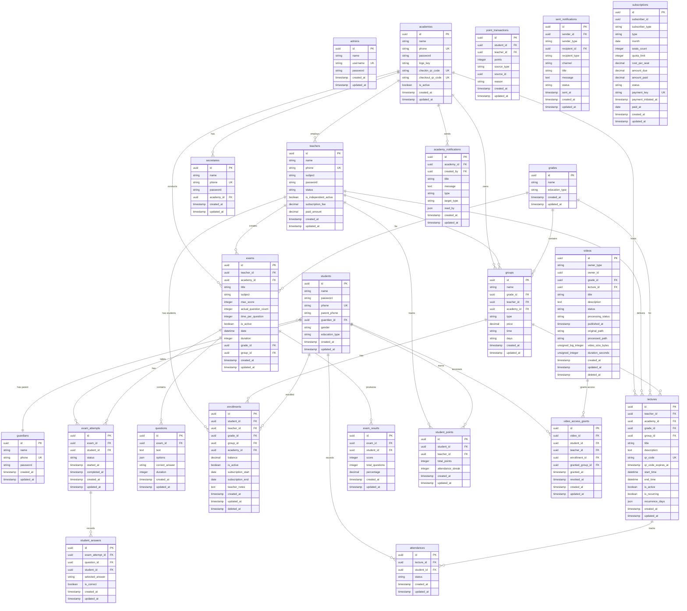

# Database Documentation

This document provides comprehensive documentation for the backend database architecture, including migrations, seeders, factories, and best practices.

## Overview

The application uses **Laravel's database abstraction layer** with **MySQL** as the primary database driver. The database architecture follows a domain-driven design pattern with UUID primary keys for all entities.

### Key Characteristics

| Feature | Implementation |
|---------|----------------|
| Primary Keys | UUID (Universally Unique Identifier) |
| ORM | Eloquent ORM |
| Migration Strategy | Timestamp-based naming |
| Soft Deletes | Enabled on critical entities |
| Foreign Keys | Cascading deletes where appropriate |

## Entity Relationship Diagram



## Migrations

### Migration Naming Convention

Migrations follow Laravel's timestamp-based naming convention:

```
YYYY_MM_DD_HHMMSS_descriptive_name.php
```

**Pattern Examples:**
| Pattern | Description | Example |
|---------|-------------|---------|
| `create_{table}_table` | Create new table | `2025_12_10_000001_create_teachers_table.php` |
| `add_{column}_to_{table}` | Add column(s) | `2026_01_05_000001_add_voice_columns_to_sent_notifications.php` |
| `{table}_{columns}_nullable` | Make columns nullable | `2025_12_22_133813_make_payment_log_columns_nullable.php` |
| `add_performance_indexes` | Add database indexes | `2026_02_07_000001_add_performance_indexes.php` |

### Migration Categories

#### Core User Tables

| Migration | Table | Description |
|-----------|-------|-------------|
| `2025_12_10_000000_create_admins_table` | `admins` | Platform administrators |
| `2025_12_09_000000_create_academies_table` | `academies` | Educational institutions |
| `2025_12_10_000001_create_teachers_table` | `teachers` | Independent teachers |
| `2025_12_10_000004_create_students_table` | `students` | Students enrolled in courses |
| `2025_12_10_000005_create_secretaries_table` | `secretaries` | Academy staff members |
| `2026_01_01_000001_create_guardians_table` | `guardians` | Parent/Guardian accounts |

#### Educational Structure

| Migration | Table | Description |
|-----------|-------|-------------|
| `2025_12_10_000002_create_grades_table` | `grades` | Grade levels (e.g., Grade 10, 11, 12) |
| `2025_12_10_000003_create_groups_table` | `groups` | Study groups within grades |
| `2025_12_12_000001_create_enrollments_table` | `enrollments` | Student-teacher relationships |

#### Content & Assessment

| Migration | Table | Description |
|-----------|-------|-------------|
| `2025_12_10_000006_create_lectures_table` | `lectures` | Lecture sessions |
| `2026_01_06_132143_create_lecture_sessions_table` | `lecture_sessions` | Recurring lecture instances |
| `2025_12_10_000007_create_exams_table` | `exams` | Examinations |
| `2025_12_10_000008_create_questions_table` | `questions` | Exam questions |
| `2025_12_10_000009_create_exam_attempts_table` | `exam_attempts` | Student exam attempts |
| `2025_12_10_000012_create_exam_results_table` | `exam_results` | Exam scores |
| `2025_12_13_000003_create_student_answers_table` | `student_answers` | Individual question answers |

#### Attendance & Tracking

| Migration | Table | Description |
|-----------|-------|-------------|
| `2025_12_10_000011_create_attendances_table` | `attendances` | Student attendance records |
| `2025_12_12_000002_create_student_activity_logs_table` | `student_activity_logs` | Activity tracking |
| `2026_01_08_000004_create_teacher_attendance_logs_table` | `teacher_attendance_logs` | Teacher check-in/out |

#### Gamification

| Migration | Table | Description |
|-----------|-------|-------------|
| `2025_12_17_000001_create_student_points_table` | `student_points` | Point balances |
| `2025_12_17_000002_create_point_transactions_table` | `point_transactions` | Point history |
| `2025_12_17_000003_create_gamification_settings_table` | `gamification_settings` | Point configuration |
| `2025_12_17_100000_create_student_failed_questions_table` | `student_failed_questions` | Wrong answer tracking |

#### Videos Feature

| Migration | Table | Description |
|-----------|-------|-------------|
| `2026_03_06_000400_create_videos_feature_tables` | `videos`, `video_group_targets`, `video_attachments`, `video_access_grants` | Video content system |
| `2026_03_07_000001_create_video_upload_sessions_table` | `video_upload_sessions` | Upload tracking |
| `2026_03_09_000001_create_video_quiz_tables` | `video_quizzes`, `video_quiz_questions` | Interactive video quizzes |

#### Notifications

| Migration | Table | Description |
|-----------|-------|-------------|
| `2025_12_10_000011_create_notifications_table` | `notifications` | Laravel notifications |
| `2025_12_10_000012_create_sent_notifications_table` | `sent_notifications` | Custom notification tracking |
| `2026_01_08_200044_create_academy_notifications_table` | `academy_notifications` | Academy-wide announcements |
| `2025_12_10_212838_create_device_tokens_table` | `device_tokens` | Push notification tokens |
| `2025_12_31_000001_create_parent_device_tokens_table` | `parent_device_tokens` | Guardian device tokens |

#### Subscriptions & Billing

| Migration | Table | Description |
|-----------|-------|-------------|
| `2026_02_13_000001_create_subscriptions_table` | `subscriptions` | Unified subscription tracking |
| `2025_12_18_000001_create_payment_logs_table` | `payment_logs` | Payment records |
| `2026_01_05_000002_create_daily_voice_limits_table` | `daily_voice_limits` | Voice call quotas |

#### Laravel Package Tables

| Migration | Table | Description |
|-----------|-------|-------------|
| `2025_12_10_000013_create_sessions_table` | `sessions` | Session storage |
| `2025_12_10_000014_create_password_reset_tokens_table` | `password_reset_tokens` | Password resets |
| `2025_12_10_000015_create_cache_table` | `cache` | Cache storage |
| `2025_12_10_000016_create_jobs_table` | `jobs` | Queue jobs |
| `2025_12_10_000017_create_personal_access_tokens_table` | `personal_access_tokens` | API tokens |
| `2025_12_10_000018_create_permission_tables` | `permissions`, `roles`, etc. | Spatie permissions |
| `2025_12_10_121147_create_telescope_entries_table` | `telescope_entries` | Debug assistant |
| `2026_03_03_001901_create_media_table` | `media` | Spatie media library |
| `2026_03_03_001902_create_activity_log_table` | `activity_log` | Spatie activity log |
| `2026_03_03_001936_create_health_tables` | Health tables | Server health monitoring |

### Migration Structure

Each migration follows the standard Laravel structure:

```php
<?php

use Illuminate\Database\Migrations\Migration;
use Illuminate\Database\Schema\Blueprint;
use Illuminate\Support\Facades\Schema;

return new class extends Migration
{
    /**
     * Run the migrations.
     */
    public function up(): void
    {
        Schema::create('table_name', function (Blueprint $table) {
            $table->uuid('id')->primary();
            // ... columns
            $table->timestamps();
            
            // Indexes
            $table->index(['column1', 'column2']);
        });
    }

    /**
     * Reverse the migrations.
     */
    public function down(): void
    {
        Schema::dropIfExists('table_name');
    }
};
```

### Common Column Patterns

```php
// UUID Primary Key
$table->uuid('id')->primary();

// Foreign Keys
$table->foreignUuid('teacher_id')->constrained('teachers')->onDelete('cascade');
$table->foreignUuid('academy_id')->nullable()->constrained()->nullOnDelete();

// Enum Columns
$table->string('status')->default(\App\Domains\Auth\Enums\TeacherStatus::PENDING->value);

// Soft Deletes
$table->softDeletes();

// Indexes
$table->index(['teacher_id', 'is_active'], 'custom_index_name');
$table->unique(['student_id', 'teacher_id', 'academy_id'], 'enrollment_context_unique');
```

## Database Indexes

Performance indexes are defined in dedicated migrations to optimize query performance:

### Performance Index Migrations

| Migration | Description |
|-----------|-------------|
| `2026_02_07_000001_add_performance_indexes` | Core performance indexes |
| `2026_03_23_000001_add_missing_performance_indexes` | Additional indexes from SQL review |

### Key Index Categories

#### Students Table
```php
$table->index('created_at', 'students_created_at_index');
$table->index('name', 'students_name_index');
$table->index('phone');
$table->index('guardian_id');
```

#### Lectures Table
```php
$table->index(['teacher_id', 'is_active'], 'lectures_teacher_active_index');
$table->index(['grade_id', 'is_active'], 'lectures_grade_active_index');
$table->index(['teacher_id', 'start_time', 'is_active'], 'idx_lectures_teacher_date');
$table->index(['academy_id', 'start_time'], 'lectures_academy_start_time_index');
```

#### Enrollments Table
```php
$table->index('student_id');
$table->index('teacher_id');
$table->index('academy_id');
$table->index(['teacher_id', 'is_active'], 'enrollments_teacher_active_index');
$table->index(['grade_id', 'is_active'], 'enrollments_grade_active_index');
$table->index(['teacher_id', 'grade_id', 'is_active'], 'idx_enrollments_lookup');
$table->index(['student_id', 'is_active'], 'enrollments_student_active_index');
```

#### Attendances Table
```php
$table->index(['lecture_id', 'created_at'], 'attendances_lecture_date_index');
$table->index(['student_id', 'created_at'], 'attendances_student_date_index');
$table->index(['lecture_id', 'status'], 'idx_attendance_lecture');
$table->index(['student_id', 'lecture_id'], 'idx_attendance_student');
```

#### Videos & Access
```php
// Videos
$table->index(['owner_type', 'owner_id']);
$table->index(['status', 'published_at']);
$table->index(['academy_id', 'status']);

// Video Access Grants
$table->unique(['video_id', 'student_id']);
$table->index(['student_id', 'revoked_at']);
```

## Seeders

Seeders populate the database with initial and test data.

### Available Seeders

| Seeder | Purpose | Usage |
|--------|---------|-------|
| [`DatabaseSeeder`](backend/database/seeders/DatabaseSeeder.php) | Main seeder | `php artisan db:seed` |
| [`AdminSeeder`](backend/database/seeders/AdminSeeder.php) | Creates default admin | Production |
| [`SuperAdminSeeder`](backend/database/seeders/SuperAdminSeeder.php) | Creates super admin | Production |
| [`RolesAndPermissionsSeeder`](backend/database/seeders/RolesAndPermissionsSeeder.php) | Sets up RBAC | Production |
| [`FilamentPermissionSeeder`](backend/database/seeders/FilamentPermissionSeeder.php) | Admin panel permissions | Production |
| [`AcademySeeder`](backend/database/seeders/AcademySeeder.php) | Test academy data | Development |
| [`CompleteSeeder`](backend/database/seeders/CompleteSeeder.php) | Full test dataset | Development |
| [`DemoSeeder`](backend/database/seeders/DemoSeeder.php) | Demo environment data | Staging |
| [`StudentSeeder`](backend/database/seeders/StudentSeeder.php) | Test students | Development |

### DatabaseSeeder Structure

```php
class DatabaseSeeder extends Seeder
{
    public function run(): void
    {
        // Disable foreign key checks for truncation
        Schema::disableForeignKeyConstraints();

        // Truncate existing data
        Admin::truncate();
        Role::truncate();
        Permission::truncate();

        Schema::enableForeignKeyConstraints();

        $this->call([
            FilamentPermissionSeeder::class,
            // AcademySeeder::class,  // Uncomment for development
            // CompleteSeeder::class,
        ]);
    }
}
```

### Running Seeders

```bash
# Run all seeders
php artisan db:seed

# Run specific seeder
php artisan db:seed --class=AdminSeeder

# Fresh migration with seeding
php artisan migrate:fresh --seed

# Production seeding (requires confirmation)
php artisan db:seed --class=RolesAndPermissionsSeeder --force
```

## Factories

Factories generate fake data for testing and development.

### Available Factories

| Factory | Model | Purpose |
|---------|-------|---------|
| [`UserFactory`](backend/database/factories/UserFactory.php) | `User` | Generic user testing |
| [`StudentFactory`](backend/database/factories/StudentFactory.php) | `Student` | Student test data |
| [`TeacherFactory`](backend/database/factories/TeacherFactory.php) | `Teacher` | Teacher test data |
| [`SecretaryFactory`](backend/database/factories/SecretaryFactory.php) | `Secretary` | Secretary test data |
| [`GradeFactory`](backend/database/factories/GradeFactory.php) | `Grade` | Grade levels |
| [`GroupFactory`](backend/database/factories/GroupFactory.php) | `Group` | Study groups |
| [`LectureFactory`](backend/database/factories/LectureFactory.php) | `Lecture` | Lecture sessions |
| [`ExamFactory`](backend/database/factories/ExamFactory.php) | `Exam` | Examinations |

### Factory Examples

#### StudentFactory

```php
class StudentFactory extends Factory
{
    protected $model = Student::class;
    
    protected static ?string $password;

    public function definition(): array
    {
        return [
            'name' => fake()->name(),
            'password' => static::$password ??= Hash::make('password'),
            'location' => fake()->city(),
            'phone' => fake()->phoneNumber(),
            'parent_phone' => fake()->phoneNumber(),
            'gender' => fake()->randomElement(['male', 'female']),
            'education_type' => fake()->randomElement(['general', 'azhar']),
        ];
    }
}
```

#### TeacherFactory

```php
class TeacherFactory extends Factory
{
    protected $model = Teacher::class;
    
    protected static ?string $password;

    public function definition(): array
    {
        return [
            'name' => fake()->name(),
            'password' => static::$password ??= Hash::make('password'),
            'status' => 'active',
        ];
    }
}
```

### Using Factories

```php
// Create single model
$student = Student::factory()->create();

// Create multiple models
$students = Student::factory()->count(10)->create();

// Create with specific attributes
$teacher = Teacher::factory()->create([
    'phone' => '201234567890',
    'status' => 'active',
]);

// Create with relationships
$group = Group::factory()
    ->for(Teacher::factory())
    ->for(Grade::factory())
    ->create();

// Make without persisting
$student = Student::factory()->make();
```

## Best Practices

### Migration Best Practices

1. **Use UUID Primary Keys**
   ```php
   $table->uuid('id')->primary();
   ```

2. **Define Foreign Key Constraints**
   ```php
   // Cascade delete
   $table->foreignUuid('teacher_id')->constrained()->onDelete('cascade');
   
   // Nullable with null on delete
   $table->foreignUuid('academy_id')->nullable()->constrained()->nullOnDelete();
   ```

3. **Add Indexes for Performance**
   ```php
   // Single column index
   $table->index('phone');
   
   // Composite index for common queries
   $table->index(['teacher_id', 'is_active'], 'teacher_active_index');
   ```

4. **Use Soft Deletes for Recoverable Data**
   ```php
   $table->softDeletes();
   ```

5. **Keep Migrations Reversible**
   ```php
   public function down(): void
   {
       Schema::dropIfExists('table_name');
   }
   ```

### Indexing Strategy

1. **Index Foreign Keys** - All foreign key columns should be indexed
2. **Composite Indexes** - Create indexes for frequently queried column combinations
3. **Conditional Indexes** - Add indexes for status/active flags combined with other columns
4. **Use Named Indexes** - Give indexes descriptive names for easier management

### Seeder Best Practices

1. **Use firstOrCreate for Production Seeders**
   ```php
   Admin::firstOrCreate(
       ['username' => 'admin'],
       ['name' => 'Super Admin', 'password' => Hash::make('password')]
   );
   ```

2. **Truncate Before Seeding in Development**
   ```php
   Schema::disableForeignKeyConstraints();
   Model::truncate();
   Schema::enableForeignKeyConstraints();
   ```

3. **Call Related Seeders**
   ```php
   $this->call([
       RolesAndPermissionsSeeder::class,
       AdminSeeder::class,
   ]);
   ```

### Factory Best Practices

1. **Define Default Password Once**
   ```php
   protected static ?string $password;
   
   public function definition(): array
   {
       return [
           'password' => static::$password ??= Hash::make('password'),
       ];
   }
   ```

2. **Use Faker for Realistic Data**
   ```php
   'name' => fake()->name(),
   'phone' => fake()->phoneNumber(),
   'email' => fake()->unique()->safeEmail(),
   ```

3. **Use States for Variations**
   ```php
   public function inactive(): static
   {
       return $this->state(fn (array $attributes) => [
           'status' => 'inactive',
       ]);
   }
   ```

## Database Commands Reference

```bash
# Run migrations
php artisan migrate

# Rollback last migration
php artisan migrate:rollback

# Rollback all migrations
php artisan migrate:reset

# Fresh migration (drop all and re-run)
php artisan migrate:fresh

# Fresh with seeding
php artisan migrate:fresh --seed

# Check migration status
php artisan migrate:status

# Create new migration
php artisan make:migration create_example_table

# Create migration with model
php artisan make:model Example -m

# Run seeders
php artisan db:seed
php artisan db:seed --class=ExampleSeeder

# Tinker (REPL for database interaction)
php artisan tinker
```

## Related Documentation

- [Configuration Reference](../configuration/index.md)
- [Auth Domain](../domains/auth.md)
- [Enrollments Domain](../domains/enrollments.md)
- [Videos Domain](../domains/videos.md)
- [Subscriptions Domain](../domains/subscriptions.md)
