# Application Domain

## Overview

The Application domain serves as the **cross-cutting infrastructure layer** of the platform, providing shared functionality, utilities, and services that are used across all other domains. It acts as the foundation that enables consistent behavior patterns, security measures, and common operations throughout the system.

### Key Responsibilities

- **API Response Standardization**: Consistent JSON response formatting across all endpoints
- **Security & Validation**: Input sanitization, file upload validation, and sensitive field protection
- **Authorization Infrastructure**: Base policies and ownership scopes for IDOR protection
- **Caching Layer**: Centralized caching service with configurable TTL
- **Audit Logging**: Automatic tracking of model changes
- **Notification Broadcasting**: Real-time notification delivery via WebSocket
- **Multi-tenancy Support**: Academy filtering and teacher/academy resolution

### Architecture Diagram

```mermaid
graph TB
    subgraph "Application Domain"
        subgraph "Core Services"
            CS[CacheService]
            HS[HelperService]
            IS[InputSanitizer]
            FUV[FileUploadValidator]
        end
        
        subgraph "Traits"
            ART[ApiResponseTrait]
            HDT[HasDeviceTokens]
            HAF[HasAcademyFilter]
            HAL[HasAuditLog]
            GSF[GuardsSensitiveFields]
            HOS[HasOwnershipScopes]
            BN[BroadcastsNotification]
            RA[ResolvesAcademy]
            RT[ResolvesTeacher]
        end
        
        subgraph "Infrastructure"
            BP[BasePolicy]
            BF[BaseFilter]
            AE[ApiException]
            MW[Middleware]
            RL[Rules]
        end
    end
    
    subgraph "Consumer Domains"
        AUTH[Auth Domain]
        VIDEOS[Videos Domain]
        EXAMS[Exams Domain]
        NOTIF[Notifications Domain]
        SUBS[Subscriptions Domain]
    end
    
    CS --> AUTH
    ART --> VIDEOS
    HAF --> EXAMS
    HAL --> SUBS
    BP --> NOTIF
    GSF --> AUTH
    IS --> VIDEOS
```



---

## Directory Structure

```
backend/app/Domains/Application/
├── Enums/
│   └── AuditAction.php
├── Exceptions/
│   ├── ApiException.php
│   ├── SeatLimitException.php
│   ├── SubscriptionExpiredException.php
│   └── UnauthorizedException.php
├── Filters/
│   ├── BaseFilter.php
│   ├── EnrollmentFilter.php
│   ├── ExamFilter.php
│   ├── GradeFilter.php
│   ├── GroupFilter.php
│   ├── LectureFilter.php
│   └── VideoFilter.php
├── Helpers/
│   ├── general.php
│   ├── helpers.php
│   └── secrets.php
├── Http/
│   ├── Controllers/
│   │   ├── Academy/
│   │   ├── Api/
│   │   ├── Guardian/
│   │   ├── Media/
│   │   ├── Secretary/
│   │   ├── Student/
│   │   ├── Teacher/
│   │   └── Traits/
│   ├── Middleware/
│   │   ├── ApiRateLimiter.php
│   │   ├── CheckMaintenanceMode.php
│   │   └── SanitizeInput.php
│   ├── Requests/
│   │   └── ...
│   └── Resources/
│       └── ...
├── Models/
│   ├── DailyVoiceLimit.php
│   ├── Setting.php
│   ├── SyncError.php
│   └── TeacherAttendanceLog.php
├── Policies/
│   ├── BasePolicy.php
│   └── [40+ Policy Classes]
├── Rules/
│   ├── SanitizedHtml.php
│   └── SecureFileUpload.php
├── Services/
│   ├── CacheService.php
│   ├── CloudflareKVService.php
│   ├── FileUploadValidator.php
│   ├── HelperService.php
│   ├── InputSanitizer.php
│   ├── SeasonalThemeService.php
│   ├── Academy/
│   ├── Admin/
│   ├── Guardian/
│   ├── Secretary/
│   ├── Student/
│   └── Teacher/
├── Traits/
│   ├── ApiResponseTrait.php
│   ├── BroadcastsNotification.php
│   ├── GuardsSensitiveFields.php
│   ├── HasAcademyFilter.php
│   ├── HasAuditLog.php
│   ├── HasDeviceTokens.php
│   ├── HasOwnershipScopes.php
│   ├── ResolvesAcademy.php
│   └── ResolvesTeacher.php
└── ValueObjects/
```

---

## Traits

Traits provide reusable functionality across models, controllers, and services. They are the primary mechanism for sharing behavior in the Application domain.

### ApiResponseTrait

Standardizes JSON API responses across all controllers.

**Location**: [`ApiResponseTrait.php`](../../../backend/app/Domains/Application/Traits/ApiResponseTrait.php)

#### Methods

| Method | HTTP Status | Description |
|--------|-------------|-------------|
| `successResponse($data, $message, $code)` | 200 | Standard success response with data |
| `created($data, $message)` | 201 | Resource created successfully |
| `errorResponse($message, $errors, $code, $data)` | 400+ | Error response with optional details |
| `unauthorized($message)` | 401 | Authentication required |
| `forbidden($message)` | 403 | Permission denied |
| `notFound($message)` | 404 | Resource not found |
| `validationError($errors, $message)` | 422 | Validation failed |
| `serverError($message)` | 500 | Internal server error |

#### Usage Example

```php
<?php

use App\Domains\Application\Traits\ApiResponseTrait;

class VideoController extends Controller
{
    use ApiResponseTrait;
    
    public function store(StoreVideoRequest $request)
    {
        $video = $this->videoService->create($request->validated());
        
        return $this->created($video, 'Video uploaded successfully');
    }
    
    public function show(string $id)
    {
        $video = Video::find($id);
        
        if (!$video) {
            return $this->notFound('Video not found');
        }
        
        return $this->successResponse($video);
    }
}
```

---

### HasDeviceTokens

Manages FCM device tokens for push notifications.

**Location**: [`HasDeviceTokens.php`](../../../backend/app/Domains/Application/Traits/HasDeviceTokens.php)

#### Methods

| Method | Return Type | Description |
|--------|-------------|-------------|
| `deviceTokens()` | `MorphMany` | Relationship to device tokens |
| `routeNotificationForFcm()` | `array` | Returns tokens for FCM routing |

#### Usage Example

```php
<?php

use App\Domains\Application\Traits\HasDeviceTokens;

class Student extends Model
{
    use HasDeviceTokens;
    
    // Now the model can receive push notifications
}

// Sending notification
$student->notify(new ExamResultNotification($exam));
```

---

### HasAcademyFilter

Provides academy-based query filtering for multi-tenant data isolation.

**Location**: [`HasAcademyFilter.php`](../../../backend/app/Domains/Application/Traits/HasAcademyFilter.php)

#### Methods

| Method | Description |
|--------|-------------|
| `applyAcademyFilter($query, $academyId, $gradeRelation)` | Filter by academy with grade relation |
| `applyDirectAcademyFilter($query, $academyId)` | Direct filter on academy_id column |

#### Filter Modes

| Academy ID Value | Behavior |
|-----------------|----------|
| `null` | Returns empty (requires explicit selection) |
| `'independent'` | Filters for `academy_id IS NULL` |
| UUID string | Filters for specific academy |

#### Usage Example

```php
<?php

use App\Domains\Application\Traits\HasAcademyFilter;

class EnrollmentService
{
    use HasAcademyFilter;
    
    public function getEnrollments(string $academyId)
    {
        return Enrollment::query()
            ->tap(fn($q) => $this->applyDirectAcademyFilter($q, $academyId))
            ->with(['student', 'grade'])
            ->get();
    }
}
```

---

### ResolvesAcademy

Resolves the effective academy from authenticated user context.

**Location**: [`ResolvesAcademy.php`](../../../backend/app/Domains/Application/Traits/ResolvesAcademy.php)

#### Methods

| Method | Return Type | Description |
|--------|-------------|-------------|
| `getAcademy(Request $request)` | `Academy\|null` | Resolves academy from user |

#### Resolution Logic

1. If user is `Academy` → returns the academy directly
2. If user is `Secretary` → returns the secretary's academy
3. Otherwise → returns `null`

#### Usage Example

```php
<?php

use App\Domains\Application\Traits\ResolvesAcademy;

class AcademyDashboardController extends Controller
{
    use ResolvesAcademy;
    
    public function index(Request $request)
    {
        $academy = $this->getAcademy($request);
        
        if (!$academy) {
            return $this->forbidden('No academy access');
        }
        
        return $this->successResponse($academy->statistics());
    }
}
```

---

### ResolvesTeacher

Resolves the effective teacher from authenticated user context.

**Location**: [`ResolvesTeacher.php`](../../../backend/app/Domains/Application/Traits/ResolvesTeacher.php)

#### Methods

| Method | Return Type | Description |
|--------|-------------|-------------|
| `getTeacherFromRequest(Request $request)` | `Teacher\|null` | Resolves teacher from user |

#### Resolution Logic

1. If user is `Teacher` → returns the teacher directly
2. If user is `Secretary` → returns first associated teacher
3. Otherwise → returns `null`

#### Usage Example

```php
<?php

use App\Domains\Application\Traits\ResolvesTeacher;

class TeacherReportController extends Controller
{
    use ResolvesTeacher;
    
    public function generate(Request $request)
    {
        $teacher = $this->getTeacherFromRequest($request);
        
        abort_if(!$teacher, 403, 'No teacher access');
        
        return $this->reportService->generateForTeacher($teacher);
    }
}
```

---

### BroadcastsNotification

Enables real-time notification delivery via Laravel Reverb (WebSocket).

**Location**: [`BroadcastsNotification.php`](../../../backend/app/Domains/Application/Traits/BroadcastsNotification.php)

#### Methods

| Method | Description |
|--------|-------------|
| `broadcastViaReverb($notifiable, $userType)` | Broadcasts notification in real-time |

#### Usage Example

```php
<?php

use App\Domains\Application\Traits\BroadcastsNotification;
use Illuminate\Notifications\Notification;

class ExamResultNotification extends Notification
{
    use BroadcastsNotification;
    
    public function toDatabase($notifiable): array
    {
        return [
            'title' => 'نتيجة الامتحان',
            'message' => 'تم رصد نتيجتك',
            'type' => 'exam_result',
            'exam_id' => $this->exam->id,
        ];
    }
    
    public function afterCommit(): void
    {
        $this->broadcastViaReverb($this->notifiable, 'student');
    }
}
```

---

### GuardsSensitiveFields

Protects critical fields from mass assignment vulnerabilities.

**Location**: [`GuardsSensitiveFields.php`](../../../backend/app/Domains/Application/Traits/GuardsSensitiveFields.php)

#### Protected Field Categories

| Category | Fields |
|----------|--------|
| Administrative | `is_admin`, `is_super_admin`, `is_active`, `is_verified`, `is_approved`, `is_suspended` |
| Role/Permission | `role`, `user_type`, `subscription_type`, `permission_level`, `access_level`, `permissions` |
| Authentication | `password`, `remember_token`, `api_token`, `two_factor_secret`, `two_factor_recovery_codes` |
| Verification | `email_verified_at`, `phone_verified_at` |
| Financial | `balance`, `credits`, `points`, `total_points`, `amount_due`, `amount_paid`, `subscription_fee` |
| Relationships | `academy_id`, `teacher_id` |
| Payment | `stripe_id`, `pm_type`, `pm_last_four`, `payment_method`, `payment_key` |

#### Usage Example

```php
<?php

use App\Domains\Application\Traits\GuardsSensitiveFields;

class User extends Model
{
    use GuardsSensitiveFields;
    
    protected $fillable = ['name', 'email', 'phone'];
    
    // Even if someone tries: User::create(['name' => 'X', 'is_admin' => true])
    // is_admin will be automatically guarded
    
    // Add custom sensitive fields:
    protected array $customSensitiveFields = ['custom_role', 'special_permission'];
}
```

---

### HasAuditLog

Provides automatic audit trail for model changes.

**Location**: [`HasAuditLog.php`](../../../backend/app/Domains/Application/Traits/HasAuditLog.php)

#### Tracked Events

| Event | AuditAction |
|-------|-------------|
| `created` | `CREATED` |
| `updated` | `UPDATED` |
| `deleted` | `DELETED` |
| `restored` | `RESTORED` |

#### Usage Example

```php
<?php

use App\Domains\Application\Traits\HasAuditLog;

class Payment extends Model
{
    use HasAuditLog;
    
    // All CRUD operations are now automatically logged to audit_logs table
}

// Audit log entry includes:
// - user_id (who made the change)
// - auditable_type & auditable_id (what changed)
// - action (what kind of change)
// - old_values & new_values (before/after state)
// - ip_address & user_agent (request context)
```

---

### HasOwnershipScopes

Provides query scopes for IDOR (Insecure Direct Object Reference) protection.

**Location**: [`HasOwnershipScopes.php`](../../../backend/app/Domains/Application/Traits/HasOwnershipScopes.php)

#### Methods

| Method | Description |
|--------|-------------|
| `scopeOwnedBy($query, $userId, $column)` | Filter by user ownership |
| `scopeForTeacher($query, $teacherId)` | Filter by teacher ownership |
| `scopeForAcademy($query, $academyId)` | Filter by academy ownership |
| `scopeForStudent($query, $studentId)` | Filter by student ownership |

#### Usage Example

```php
<?php

use App\Domains\Application\Traits\HasOwnershipScopes;

class Video extends Model
{
    use HasOwnershipScopes;
}

// In controller/service - Safe from IDOR:
public function show(Request $request, string $id)
{
    $video = Video::forTeacher($request->user()->teacher->id)
        ->findOrFail($id);
    
    return $this->successResponse($video);
}

// Academy-level query:
$videos = Video::forAcademy($academyId)->published()->get();
```

---

## Services

Services encapsulate business logic and are organized by the user role they primarily serve.

### Shared Services

Core services used across all user types and domains.

#### CacheService

Centralized caching with configurable TTL and automatic invalidation.

**Location**: [`CacheService.php`](../../../backend/app/Domains/Application/Services/CacheService.php)

| Constant | TTL | Use Case |
|----------|-----|----------|
| `TTL_SHORT` | 60 seconds | Frequently changing data |
| `TTL_MEDIUM` | 300 seconds | Semi-static data |
| `TTL_LONG` | 3600 seconds | Rarely changing data |

| Method | Description |
|--------|-------------|
| `getSettingWithTtl($key, $ttl, $callback)` | Get cached setting |
| `remember($key, $ttl, $callback)` | Cache callback result |
| `forget($key)` | Invalidate cache |

#### HelperService

General-purpose utility methods.

**Location**: [`HelperService.php`](../../../backend/app/Domains/Application/Services/HelperService.php)

#### InputSanitizer

Sanitizes user input to prevent XSS and injection attacks.

**Location**: [`InputSanitizer.php`](../../../backend/app/Domains/Application/Services/InputSanitizer.php)

| Method | Description |
|--------|-------------|
| `clean($value, $allowHtml)` | Basic input cleaning |
| `sanitizeHtml($value)` | HTML sanitization with allowed tags |
| `sanitizeArray($data, $rules)` | Array sanitization |
| `sanitizeFilename($filename)` | Filename sanitization |
| `sanitizeUrl($url)` | URL sanitization |
| `escape($content)` | HTML entity escaping |

#### FileUploadValidator

Validates file uploads for security and compliance.

**Location**: [`FileUploadValidator.php`](../../../backend/app/Domains/Application/Services/FileUploadValidator.php)

| Method | Description |
|--------|-------------|
| `validate($file, $type)` | Validate file by type |
| `validateImage($file)` | Image-specific validation |
| `validateDocument($file)` | Document validation |
| `validateVideo($file)` | Video validation |

---

### Teacher Services

Services for teacher-specific operations.

| Service | Location | Description |
|---------|----------|-------------|
| `DashboardService` | [`Teacher/DashboardService.php`](../../../backend/app/Domains/Application/Services/Teacher/DashboardService.php) | Teacher dashboard statistics |
| `PermissionService` | [`Teacher/PermissionService.php`](../../../backend/app/Domains/Application/Services/Teacher/PermissionService.php) | Permission management |
| `PaymentService` | [`Teacher/PaymentService.php`](../../../backend/app/Domains/Application/Services/Teacher/PaymentService.php) | Payment processing |
| `PaymentLogService` | [`Teacher/PaymentLogService.php`](../../../backend/app/Domains/Application/Services/Teacher/PaymentLogService.php) | Payment history |
| `StudentService` | [`Teacher/StudentService.php`](../../../backend/app/Domains/Application/Services/Teacher/StudentService.php) | Student management |
| `GroupService` | [`Teacher/GroupService.php`](../../../backend/app/Domains/Application/Services/Teacher/GroupService.php) | Group management |
| `LectureService` | [`Teacher/LectureService.php`](../../../backend/app/Domains/Application/Services/Teacher/LectureService.php) | Lecture management |
| `LectureExportService` | [`Teacher/LectureExportService.php`](../../../backend/app/Domains/Application/Services/Teacher/LectureExportService.php) | Export lectures |
| `ExamService` | [`Teacher/ExamService.php`](../../../backend/app/Domains/Application/Services/Teacher/ExamService.php) | Exam management |
| `GradeService` | [`Teacher/GradeService.php`](../../../backend/app/Domains/Application/Services/Teacher/GradeService.php) | Grade management |
| `NotificationService` | [`Teacher/NotificationService.php`](../../../backend/app/Domains/Application/Services/Teacher/NotificationService.php) | Notification handling |
| `SecretaryService` | [`Teacher/SecretaryService.php`](../../../backend/app/Domains/Application/Services/Teacher/SecretaryService.php) | Secretary management |
| `ScanService` | [`Teacher/ScanService.php`](../../../backend/app/Domains/Application/Services/Teacher/ScanService.php) | QR code scanning |
| `SyncErrorService` | [`Teacher/SyncErrorService.php`](../../../backend/app/Domains/Application/Services/Teacher/SyncErrorService.php) | Sync error handling |
| `TeacherService` | [`Teacher/TeacherService.php`](../../../backend/app/Domains/Application/Services/Teacher/TeacherService.php) | Teacher profile |

---

### Student Services

Services for student-specific operations.

| Service | Location | Description |
|---------|----------|-------------|
| `StudentExamService` | [`Student/StudentExamService.php`](../../../backend/app/Domains/Application/Services/Student/StudentExamService.php) | Exam taking |
| `StudentAttendanceService` | [`Student/StudentAttendanceService.php`](../../../backend/app/Domains/Application/Services/Student/StudentAttendanceService.php) | Attendance tracking |
| `StudentDashboardService` | [`Student/StudentDashboardService.php`](../../../backend/app/Domains/Application/Services/Student/StudentDashboardService.php) | Dashboard data |
| `StudentLectureService` | [`Student/StudentLectureService.php`](../../../backend/app/Domains/Application/Services/Student/StudentLectureService.php) | Lecture access |
| `StudentNotificationService` | [`Student/StudentNotificationService.php`](../../../backend/app/Domains/Application/Services/Student/StudentNotificationService.php) | Notifications |
| `StudentService` | [`Student/StudentService.php`](../../../backend/app/Domains/Application/Services/Student/StudentService.php) | Profile management |
| `MistakesService` | [`Student/MistakesService.php`](../../../backend/app/Domains/Application/Services/Student/MistakesService.php) | Mistake book |

---

### Academy Services

Services for academy administration.

| Service | Location | Description |
|---------|----------|-------------|
| `DashboardService` | [`Academy/DashboardService.php`](../../../backend/app/Domains/Application/Services/Academy/DashboardService.php) | Academy statistics |
| `StudentService` | [`Academy/StudentService.php`](../../../backend/app/Domains/Application/Services/Academy/StudentService.php) | Student management |
| `TeacherService` | [`Academy/TeacherService.php`](../../../backend/app/Domains/Application/Services/Academy/TeacherService.php) | Teacher management |
| `AttendanceService` | [`Academy/AttendanceService.php`](../../../backend/app/Domains/Application/Services/Academy/AttendanceService.php) | Attendance reports |
| `GroupService` | [`Academy/GroupService.php`](../../../backend/app/Domains/Application/Services/Academy/GroupService.php) | Group management |
| `LectureService` | [`Academy/LectureService.php`](../../../backend/app/Domains/Application/Services/Academy/LectureService.php) | Lecture scheduling |
| `PaymentService` | [`Academy/PaymentService.php`](../../../backend/app/Domains/Application/Services/Academy/PaymentService.php) | Payment management |
| `SecretaryService` | [`Academy/SecretaryService.php`](../../../backend/app/Domains/Application/Services/Academy/SecretaryService.php) | Secretary management |
| `PermissionService` | [`Academy/PermissionService.php`](../../../backend/app/Domains/Application/Services/Academy/PermissionService.php) | Permission control |
| `GradeService` | [`Academy/GradeService.php`](../../../backend/app/Domains/Application/Services/Academy/GradeService.php) | Grade management |
| `NotificationService` | [`Academy/NotificationService.php`](../../../backend/app/Domains/Application/Services/Academy/NotificationService.php) | Notifications |
| `ReportService` | [`Academy/ReportService.php`](../../../backend/app/Domains/Application/Services/Academy/ReportService.php) | Report generation |
| `AcademyAuthService` | [`Academy/AcademyAuthService.php`](../../../backend/app/Domains/Application/Services/Academy/AcademyAuthService.php) | Authentication |

---

### Guardian Services

Services for parent/guardian access.

| Service | Location | Description |
|---------|----------|-------------|
| `GuardianAuthService` | [`Guardian/GuardianAuthService.php`](../../../backend/app/Domains/Application/Services/Guardian/GuardianAuthService.php) | Guardian authentication |
| `GuardianNotificationService` | [`Guardian/GuardianNotificationService.php`](../../../backend/app/Domains/Application/Services/Guardian/GuardianNotificationService.php) | Notifications |
| `GuardianSummaryService` | [`Guardian/GuardianSummaryService.php`](../../../backend/app/Domains/Application/Services/Guardian/GuardianSummaryService.php) | Child progress summary |

---

### Secretary Services

| Service | Location | Description |
|---------|----------|-------------|
| `SecretaryService` | [`Secretary/SecretaryService.php`](../../../backend/app/Domains/Application/Services/Secretary/SecretaryService.php) | Secretary operations |

---

### Admin Services

| Service | Location | Description |
|---------|----------|-------------|
| `ReportService` | [`Admin/ReportService.php`](../../../backend/app/Domains/Application/Services/Admin/ReportService.php) | System-wide reports |
| `SettingsService` | [`Admin/SettingsService.php`](../../../backend/app/Domains/Application/Services/Admin/SettingsService.php) | Platform settings |

---

## Helpers

Global helper functions for common operations.

### general.php

**Location**: [`Helpers/general.php`](../../../backend/app/Domains/Application/Helpers/general.php)

| Function | Description |
|----------|-------------|
| `rescue_api($callback, $fallbackMessage)` | Wraps callable in try/catch with JSON response |
| `format_arabic_number($number)` | Converts numbers to Arabic numerals (١٢٣) |
| `generate_otp($length)` | Generates numeric OTP code |

```php
<?php

// Error handling wrapper
return rescue_api(fn() => $this->ok($action->execute($dto)));

// Arabic numerals
echo format_arabic_number(2026); // ٢٠٢٦

// OTP generation
$otp = generate_otp(6); // e.g., "847293"
```

### helpers.php

**Location**: [`Helpers/helpers.php`](../../../backend/app/Domains/Application/Helpers/helpers.php)

| Function | Description |
|----------|-------------|
| `clean_input($value, $allowHtml)` | Sanitize input string |
| `clean_html($value)` | Sanitize HTML content |
| `sanitize_array($data, $rules)` | Sanitize array data |
| `sanitize_filename($filename)` | Sanitize filename |
| `sanitize_url($url)` | Sanitize URL |
| `escape_html($content)` | Escape HTML entities |

```php
<?php

// Input sanitization
$cleanName = clean_input($request->input('name'));

// HTML sanitization (allows safe tags)
$safeContent = clean_html($request->input('content'));

// Array sanitization
$cleanData = sanitize_array($request->all(), [
    'name' => 'string',
    'email' => 'email',
]);
```

---

## Filters

Query filters for structured data filtering.

### BaseFilter

Abstract base class for all filters.

**Location**: [`BaseFilter.php`](../../../backend/app/Domains/Application/Filters/BaseFilter.php)

```php
<?php

abstract class BaseFilter
{
    public function __construct(protected array $filters) {}
    
    public function apply(Builder $query): Builder
    {
        foreach ($this->filters as $key => $value) {
            if ($value === null || $value === '') {
                continue;
            }
            
            $method = 'filter' . str_replace('_', '', ucwords($key, '_'));
            
            if (method_exists($this, $method)) {
                $this->$method($query, $value);
            }
        }
        
        return $query;
    }
}
```

### Available Filters

| Filter | Location | Description |
|--------|----------|-------------|
| `EnrollmentFilter` | [`EnrollmentFilter.php`](../../../backend/app/Domains/Application/Filters/EnrollmentFilter.php) | Filter enrollments |
| `ExamFilter` | [`ExamFilter.php`](../../../backend/app/Domains/Application/Filters/ExamFilter.php) | Filter exams |
| `GradeFilter` | [`GradeFilter.php`](../../../backend/app/Domains/Application/Filters/GradeFilter.php) | Filter grades |
| `GroupFilter` | [`GroupFilter.php`](../../../backend/app/Domains/Application/Filters/GroupFilter.php) | Filter groups |
| `LectureFilter` | [`LectureFilter.php`](../../../backend/app/Domains/Application/Filters/LectureFilter.php) | Filter lectures |
| `VideoFilter` | [`VideoFilter.php`](../../../backend/app/Domains/Application/Filters/VideoFilter.php) | Filter videos |

---

## Exceptions

Custom exception classes for API error handling.

### ApiException

Base exception class for all API exceptions.

**Location**: [`ApiException.php`](../../../backend/app/Domains/Application/Exceptions/ApiException.php)

```php
<?php

abstract class ApiException extends Exception
{
    protected int $statusCode = 400;
    protected string $errorType = 'error';
    
    public function render($request): JsonResponse
    {
        return response()->json([
            'status' => false,
            'status_code' => $this->statusCode,
            'error_type' => $this->errorType,
            'message' => $this->getMessage(),
        ], $this->statusCode);
    }
}
```

### Specialized Exceptions

| Exception | Location | HTTP Code | Use Case |
|-----------|----------|-----------|----------|
| `SeatLimitException` | [`SeatLimitException.php`](../../../backend/app/Domains/Application/Exceptions/SeatLimitException.php) | 402 | Subscription seat limit reached |
| `SubscriptionExpiredException` | [`SubscriptionExpiredException.php`](../../../backend/app/Domains/Application/Exceptions/SubscriptionExpiredException.php) | 402 | Subscription has expired |
| `UnauthorizedException` | [`UnauthorizedException.php`](../../../backend/app/Domains/Application/Exceptions/UnauthorizedException.php) | 401 | Authentication required |

---

## Middleware

HTTP middleware for request processing.

### CheckMaintenanceMode

Checks if the system is in maintenance mode.

**Location**: [`CheckMaintenanceMode.php`](../../../backend/app/Domains/Application/Http/Middleware/CheckMaintenanceMode.php)

```php
<?php

class CheckMaintenanceMode
{
    public function handle(Request $request, Closure $next): Response
    {
        // Skip for admin routes and login
        if ($request->is('api/admin/*') || $request->is('api/login/*')) {
            return $next($request);
        }
        
        $maintenanceMode = Setting::where('key', 'maintenanceMode')->value('value');
        
        if ($maintenanceMode === 'true') {
            return response()->json([
                'message' => 'System is currently in maintenance mode.',
                'maintenance' => true
            ], 503);
        }
        
        return $next($request);
    }
}
```

### Other Middleware

| Middleware | Location | Description |
|------------|----------|-------------|
| `ApiRateLimiter` | [`ApiRateLimiter.php`](../../../backend/app/Domains/Application/Http/Middleware/ApiRateLimiter.php) | Rate limiting |
| `SanitizeInput` | [`SanitizeInput.php`](../../../backend/app/Domains/Application/Http/Middleware/SanitizeInput.php) | Input sanitization |

---

## Rules

Custom validation rules.

### SanitizedHtml

Validates that HTML content is safe after sanitization.

**Location**: [`SanitizedHtml.php`](../../../backend/app/Domains/Application/Rules/SanitizedHtml.php)

```php
<?php

// In a FormRequest:
public function rules(): array
{
    return [
        'content' => ['required', 'string', new SanitizedHtml()],
        'description' => ['nullable', 'string', new SanitizedHtml(0.3)],
    ];
}
```

### SecureFileUpload

Validates file uploads for security.

**Location**: [`SecureFileUpload.php`](../../../backend/app/Domains/Application/Rules/SecureFileUpload.php)

```php
<?php

// File type options: 'image', 'document', 'video'
$validated = $request->validate([
    'avatar' => ['required', 'file', new SecureFileUpload('image')],
    'document' => ['nullable', 'file', new SecureFileUpload('document')],
]);
```

---

## Enums

### AuditAction

Defines audit log action types.

**Location**: [`AuditAction.php`](../../../backend/app/Domains/Application/Enums/AuditAction.php)

| Case | Value | Label (Arabic) |
|------|-------|----------------|
| `CREATED` | `created` | أُنشئ |
| `UPDATED` | `updated` | عُدِّل |
| `DELETED` | `deleted` | حُذف |
| `RESTORED` | `restored` | استُرجع |
| `LOGGED_IN` | `logged_in` | تسجيل دخول |
| `LOGGED_OUT` | `logged_out` | تسجيل خروج |
| `EXPORTED` | `exported` | تصدير |
| `ROLE_CHANGED` | `role_changed` | تغيير دور |
| `PERMISSION_CHANGED` | `permission_changed` | تغيير صلاحية |
| `PASSWORD_CHANGED` | `password_changed` | تغيير كلمة المرور |
| `SUSPENDED` | `suspended` | إيقاف |
| `ACTIVATED` | `activated` | تفعيل |

```php
<?php

use App\Domains\Application\Enums\AuditAction;

$action = AuditAction::CREATED;
echo $action->label(); // أُنشئ
echo $action->value; // created
```

---

## Policies

Authorization policies for resource access control.

### BasePolicy

Abstract base policy providing common authorization patterns.

**Location**: [`BasePolicy.php`](../../../backend/app/Domains/Application/Policies/BasePolicy.php)

#### Standard Methods

| Method | Description |
|--------|-------------|
| `viewAny($user)` | List all resources |
| `view($user, $model)` | View single resource |
| `create($user)` | Create new resource |
| `update($user, $model)` | Update resource |
| `delete($user, $model)` | Delete resource |
| `restore($user, $model)` | Restore soft-deleted resource |
| `forceDelete($user, $model)` | Permanently delete |

#### Protected Methods

| Method | Description |
|--------|-------------|
| `hasPermission($user, $ability)` | Check user permission |
| `ownsResource($user, $model)` | Check resource ownership |

### Available Policies

| Policy | Model | Description |
|--------|-------|-------------|
| `AcademyPolicy` | Academy | Academy management |
| `AcademyNotificationPolicy` | Notification | Academy notifications |
| `AcademySubscriptionPolicy` | Subscription | Academy subscriptions |
| `AttendancePolicy` | Attendance | Attendance records |
| `DailyVoiceLimitPolicy` | DailyVoiceLimit | Voice limits |
| `DeviceTokenPolicy` | DeviceToken | FCM tokens |
| `ExamAttemptPolicy` | ExamAttempt | Exam attempts |
| `ExamResultPolicy` | ExamResult | Exam results |
| `FailedQuestionPolicy` | FailedQuestion | Mistake book |
| `GamificationSettingPolicy` | GamificationSetting | Gamification config |
| `GuardianPolicy` | Guardian | Parent accounts |
| `LectureSessionPolicy` | LectureSession | Lecture sessions |
| `LoginAttemptPolicy` | LoginAttempt | Login history |
| `ParentDeviceTokenPolicy` | DeviceToken | Parent FCM tokens |
| `PaymentLogPolicy` | PaymentLog | Payment records |
| `PlatformPaymentPolicy` | PlatformPayment | Platform payments |
| `PointTransactionPolicy` | PointTransaction | Point transactions |
| `QuestionPolicy` | Question | Exam questions |
| `SecretaryPolicy` | Secretary | Secretary accounts |
| `SentNotificationPolicy` | SentNotification | Notification history |
| `SettingPolicy` | Setting | Platform settings |
| `StudentActivityLogPolicy` | StudentActivityLog | Activity logs |
| `StudentAnswerPolicy` | StudentAnswer | Exam answers |
| `StudentPointPolicy` | StudentPoint | Student points |
| `SubscriptionPolicy` | Subscription | Subscriptions |
| `SyncErrorPolicy` | SyncError | Sync errors |
| `TeacherAttendanceLogPolicy` | TeacherAttendanceLog | Teacher attendance |
| `TeacherPolicy` | Teacher | Teacher accounts |
| `TeacherSubscriptionPolicy` | TeacherSubscription | Teacher subscriptions |
| `VideoAccessGrantPolicy` | VideoAccessGrant | Video access |
| `VideoAccessLogPolicy` | VideoAccessLog | Video access logs |
| `VideoAttachmentPolicy` | VideoAttachment | Video attachments |
| `VideoCommentPolicy` | VideoComment | Video comments |
| `VideoLikePolicy` | VideoLike | Video likes |
| `VideoPlaybackTokenPolicy` | VideoPlaybackToken | Playback tokens |
| `VideoQuizAttemptPolicy` | VideoQuizAttempt | Quiz attempts |
| `VideoQuizPolicy` | VideoQuiz | Video quizzes |
| `VideoQuizQuestionPolicy` | VideoQuizQuestion | Quiz questions |
| `VideoReminderPolicy` | VideoReminder | Video reminders |
| `VideoUploadSessionPolicy` | VideoUploadSession | Upload sessions |
| `VideoWatchProgressPolicy` | VideoWatchProgress | Watch progress |

---

## Models

### Setting

Platform configuration settings with encryption support.

**Location**: [`Setting.php`](../../../backend/app/Domains/Application/Models/Setting.php)

| Property | Type | Description |
|----------|------|-------------|
| `key` | string | Setting identifier |
| `value` | string | Setting value (encrypted if sensitive) |
| `group` | string | Setting group |

#### Encrypted Keys

The following keys are automatically encrypted:
- Firebase credentials
- Cloudflare R2/KV credentials
- OpenAI/Gemini API keys
- Turnstile keys
- Analytics credentials

```php
<?php

// Get setting value (cached)
$value = Setting::getValue('maintenanceMode', 'false');

// Set setting value
Setting::setValue('site_name', 'منصة التعليم');
```

### DailyVoiceLimit

Tracks daily voice message usage per user.

**Location**: [`DailyVoiceLimit.php`](../../../backend/app/Domains/Application/Models/DailyVoiceLimit.php)

| Property | Type | Description |
|----------|------|-------------|
| `limitable_type` | string | User model class |
| `limitable_id` | string | User ID |
| `date` | date | Usage date |

```php
<?php

// Check if user has used voice today
if (DailyVoiceLimit::hasUsedToday($student)) {
    return $this->errorResponse('Voice limit reached for today');
}

// Mark as used
DailyVoiceLimit::markAsUsed($student);
```

### SyncError

Tracks synchronization errors for offline-first features.

**Location**: [`SyncError.php`](../../../backend/app/Domains/Application/Models/SyncError.php)

### TeacherAttendanceLog

Records teacher attendance/check-in data.

**Location**: [`TeacherAttendanceLog.php`](../../../backend/app/Domains/Application/Models/TeacherAttendanceLog.php)

---

## Best Practices

### 1. Use ApiResponseTrait for Consistent Responses

Always use the trait methods instead of manual JSON responses:

```php
<?php

// ✅ Good
return $this->successResponse($data, 'Operation successful');

// ❌ Bad
return response()->json(['data' => $data]);
```

### 2. Apply Ownership Scopes for IDOR Protection

Never trust user input for resource IDs:

```php
<?php

// ✅ Good - Protected by ownership scope
$video = Video::forTeacher($teacherId)->findOrFail($videoId);

// ❌ Bad - Vulnerable to IDOR
$video = Video::findOrFail($videoId);
```

### 3. Sanitize All User Input

Use helper functions or InputSanitizer service:

```php
<?php

// ✅ Good
$cleanData = sanitize_array($request->all());
$content = clean_html($request->input('content'));

// ❌ Bad
$data = $request->all(); // Raw input
```

### 4. Use GuardsSensitiveFields on Models with Sensitive Data

Protect administrative and financial fields:

```php
<?php

class User extends Model
{
    use GuardsSensitiveFields;
    
    protected $fillable = ['name', 'email'];
    // is_admin, role, balance are automatically guarded
}
```

### 5. Enable Audit Logging for Critical Models

Track changes to sensitive data:

```php
<?php

class Payment extends Model
{
    use HasAuditLog;
    // All changes are now logged
}
```

### 6. Use Academy Filtering for Multi-tenant Queries

Ensure data isolation between academies:

```php
<?php

// In service
$enrollments = Enrollment::query()
    ->tap(fn($q) => $this->applyDirectAcademyFilter($q, $academyId))
    ->get();
```

### 7. Validate File Uploads with SecureFileUpload Rule

Never trust uploaded files:

```php
<?php

$validated = $request->validate([
    'document' => ['required', 'file', new SecureFileUpload('document')],
]);
```

### 8. Use CacheService for Frequently Accessed Data

Reduce database load with proper caching:

```php
<?php

$settings = CacheService::remember(
    'app_settings',
    CacheService::TTL_LONG,
    fn() => Setting::all()->pluck('value', 'key')
);
```

---

## Related Documentation

- [Authentication Domain](./auth.md)
- [Notifications Domain](./notifications.md)
- [Videos Domain](./videos.md)
- [API Reference](../api.md)
- [Security Guide](../security.md)
