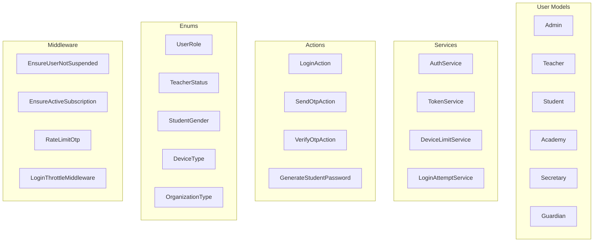

# Auth Domain

**Path:** `backend/app/Domains/Auth/`

The Auth domain handles all authentication and authorization logic for the platform, including multi-guard authentication, role-based access control, and user management.

## Overview



## User Models

### Admin

**File:** `Auth/Models/Admin.php`

Platform administrators with full system access.

```php
class Admin extends Authenticatable
{
    use HasApiTokens, HasRoles, HasUuids;
    
    protected $fillable = [
        'name', 'email', 'password', 'phone',
        'avatar_key', 'is_super_admin',
    ];
    
    protected $casts = [
        'password' => 'hashed',
        'is_super_admin' => 'boolean',
    ];
}
```

**Attributes:**
| Column | Type | Description |
|--------|------|-------------|
| `id` | UUID | Primary key |
| `name` | string | Display name |
| `email` | string | Email address (unique) |
| `password` | string | Hashed password |
| `phone` | string | Phone number |
| `avatar_key` | string | R2 storage key |
| `is_super_admin` | boolean | Super admin flag |

---

### Teacher

**File:** `Auth/Models/Teacher.php`

Teachers who create content and manage students.

```php
class Teacher extends Authenticatable
{
    use HasApiTokens, HasRoles, HasUuids, HasDeviceTokens;
    
    protected $fillable = [
        'name', 'email', 'password', 'phone',
        'avatar_key', 'status', 'is_independent',
        'subscription_plan', 'subscription_expires_at',
        'trial_period_days', 'storage_quota_bytes',
    ];
    
    protected $casts = [
        'password' => 'hashed',
        'is_independent' => 'boolean',
        'subscription_expires_at' => 'datetime',
        'status' => TeacherStatus::class,
    ];
    
    // Relationships
    public function academies(): BelongsToMany
    public function students(): BelongsToMany
    public function secretaries(): HasMany
    public function grades(): HasMany
    public function groups(): HasMany
}
```

**Attributes:**
| Column | Type | Description |
|--------|------|-------------|
| `id` | UUID | Primary key |
| `name` | string | Display name |
| `email` | string | Email (nullable) |
| `phone` | string | Phone number (unique) |
| `password` | string | Hashed password |
| `status` | enum | `active`, `suspended`, `pending` |
| `is_independent` | boolean | Independent or academy-employed |
| `subscription_plan` | string | Current subscription plan |
| `subscription_expires_at` | timestamp | Subscription expiry |
| `trial_period_days` | int | Trial period length |
| `storage_quota_bytes` | bigint | Storage limit |

---

### Student

**File:** `Auth/Models/Student.php`

Students who consume content and take exams.

```php
class Student extends Authenticatable
{
    use HasApiTokens, HasRoles, HasUuids, HasDeviceTokens;
    
    protected $fillable = [
        'name', 'password', 'phone', 'parent_phone',
        'guardian_id', 'avatar_key', 'gender',
        'education_type', 'location',
    ];
    
    protected $casts = [
        'password' => 'hashed',
        'gender' => StudentGender::class,
        'education_type' => StudentEducationType::class,
    ];
    
    // Relationships
    public function guardian(): BelongsTo
    public function enrollments(): HasMany
    public function examAttempts(): HasMany
    public function points(): HasMany
}
```

**Attributes:**
| Column | Type | Description |
|--------|------|-------------|
| `id` | UUID | Primary key |
| `name` | string | Display name |
| `phone` | string | Phone number |
| `password` | string | Hashed password |
| `parent_phone` | string | Parent's phone |
| `guardian_id` | UUID | Linked guardian |
| `gender` | enum | `male`, `female` |
| `education_type` | enum | Education system type |
| `location` | string | Geographic location |

---

### Academy

**File:** `Auth/Models/Academy.php`

Educational institutions with multiple teachers.

```php
class Academy extends Model
{
    use HasUuids;
    
    protected $fillable = [
        'name', 'email', 'phone', 'address',
        'logo_key', 'qr_code', 'status',
        'subscription_plan', 'subscription_expires_at',
        'trial_period_days', 'storage_quota_bytes',
    ];
    
    // Relationships
    public function teachers(): BelongsToMany
    public function secretaries(): HasMany
    public function grades(): HasMany
    public function groups(): HasMany
    public function students(): HasMany
}
```

---

### Secretary

**File:** `Auth/Models/Secretary.php`

Administrative assistants for academies.

```php
class Secretary extends Authenticatable
{
    use HasApiTokens, HasRoles, HasUuids;
    
    protected $fillable = [
        'name', 'email', 'password', 'phone',
        'academy_id', 'avatar_key', 'is_active',
    ];
    
    public function academy(): BelongsTo
    public function teachers(): BelongsToMany
}
```

---

### Guardian

**File:** `Auth/Models/Guardian.php`

Parents/guardians who monitor student progress.

```php
class Guardian extends Authenticatable
{
    use HasApiTokens, HasRoles, HasUuids;
    
    protected $fillable = [
        'name', 'email', 'password', 'phone',
    ];
    
    public function students(): HasMany
    public function deviceTokens(): HasMany
}
```

---

## Enums

### UserRole

**File:** `Auth/Enums/UserRole.php`

```php
enum UserRole: string
{
    case SUPER_ADMIN  = 'super_admin';
    case ADMIN        = 'admin';
    case ORG_ADMIN    = 'org_admin';
    case TEACHER      = 'teacher';
    case SECRETARY    = 'secretary';
    case STUDENT      = 'student';
    case PARENT       = 'parent';
    
    public function label(): string   // Arabic label
    public function isManagementRole(): bool
}
```

| Case | Value | Arabic Label | Management |
|------|-------|--------------|------------|
| `SUPER_ADMIN` | `super_admin` | مدير النظام | ✅ |
| `ADMIN` | `admin` | مشرف | ✅ |
| `ORG_ADMIN` | `org_admin` | مدير المنظمة | ✅ |
| `TEACHER` | `teacher` | مدرس | ✅ |
| `SECRETARY` | `secretary` | سكرتير | ✅ |
| `STUDENT` | `student` | طالب | ❌ |
| `PARENT` | `parent` | ولي أمر | ❌ |

---

### TeacherStatus

**File:** `Auth/Enums/TeacherStatus.php`

```php
enum TeacherStatus: string
{
    case ACTIVE    = 'active';
    case SUSPENDED = 'suspended';
    case PENDING   = 'pending';
    
    public function label(): string
    public function color(): string
}
```

| Case | Value | Arabic Label | Color |
|------|-------|--------------|-------|
| `ACTIVE` | `active` | نشط | success |
| `SUSPENDED` | `suspended` | موقوف | danger |
| `PENDING` | `pending` | قيد المراجعة | warning |

---

### StudentGender

**File:** `Auth/Enums/StudentGender.php`

```php
enum StudentGender: string
{
    case MALE   = 'male';
    case FEMALE = 'female';
    
    public function label(): string
}
```

---

### DeviceType

**File:** `Auth/Enums/DeviceType.php`

```php
enum DeviceType: string
{
    case ANDROID = 'android';
    case IOS     = 'ios';
    case WEB     = 'web';
}
```

---

### OrganizationType

**File:** `Auth/Enums/OrganizationType.php`

```php
enum OrganizationType: string
{
    case SCHOOL      = 'school';
    case ACADEMY     = 'academy';
    case CENTER      = 'center';
    case INSTITUTION = 'institution';
}
```

---

## Services

### AuthService

**File:** `Auth/Services/AuthService.php`

Handles user authentication across multiple user types.

```php
class AuthService
{
    /**
     * Authenticate user by identifier and password
     */
    public function login(string $identifier, string $password): array|false
    {
        // Try Admin (by username or email)
        // Try Teacher (by phone)
        // Try Student (by phone)
        
        return [
            'user' => $user,
            'token' => $token,
            'user_type' => $userType,
        ];
    }
}
```

---

### TokenService

**File:** `Auth/Services/TokenService.php`

Manages API tokens for authentication.

```php
class TokenService
{
    public function createToken(Authenticatable $user, string $name, ?DateTime $expiresAt = null): string
    public function refreshToken(Authenticatable $user): string
    public function revokeToken(Authenticatable $user, ?string $tokenId = null): void
    public function revokeAllTokens(Authenticatable $user): void
    public function validateToken(string $token): ?Authenticatable
}
```

---

### DeviceLimitService

**File:** `Auth/Services/DeviceLimitService.php`

Manages device token limits per user.

```php
class DeviceLimitService
{
    /**
     * Check if user can add more devices
     */
    public function checkLimit(Authenticatable $user): bool;
    
    /**
     * Register a new device token
     */
    public function registerDevice(Authenticatable $user, string $token, string $type): DeviceToken;
    
    /**
     * Revoke a device token
     */
    public function revokeDevice(string $tokenId): void;
    
    /**
     * Get all active devices for user
     */
    public function getActiveDevices(Authenticatable $user): Collection;
    
    /**
     * Cleanup expired tokens
     */
    public function cleanupExpiredTokens(): int;
}
```

**Configuration:**
```php
// config/auth.php
'device_limits' => [
    'teacher' => 3,
    'student' => 2,
    'guardian' => 2,
]
```

---

### LoginAttemptService

**File:** `Auth/Services/LoginAttemptService.php`

Tracks and throttles login attempts.

```php
class LoginAttemptService
{
    public function recordAttempt(string $identifier, bool $successful, ?string $ip = null): void
    public function getRecentAttempts(string $identifier): int
    public function isBlocked(string $identifier): bool
    public function clearAttempts(string $identifier): void
}
```

---

## Actions

### LoginAction

**File:** `Auth/Actions/LoginAction.php`

Handles the complete login flow.

```php
class LoginAction
{
    public function execute(array $credentials): array
    {
        // 1. Validate credentials
        // 2. Check user status (suspended?)
        // 3. Create Sanctum token
        // 4. Log login attempt
        // 5. Dispatch UserLoggedIn event
        
        return [
            'user' => $user,
            'token' => $token,
        ];
    }
}
```

---

### SendOtpAction

**File:** `Auth/Actions/SendOtpAction.php`

Sends OTP for phone verification.

```php
class SendOtpAction
{
    public function execute(string $phone): string
    {
        // 1. Rate limit check
        // 2. Generate OTP
        // 3. Store in cache
        // 4. Send via SMS
        
        return $otp; // For testing only
    }
}
```

---

### VerifyOtpAction

**File:** `Auth/Actions/VerifyOtpAction.php`

Verifies OTP code.

```php
class VerifyOtpAction
{
    public function execute(string $phone, string $otp): bool
    {
        // 1. Retrieve stored OTP
        // 2. Compare
        // 3. Clear from cache
        // 4. Return result
    }
}
```

---

## Middleware

### EnsureUserNotSuspended

**File:** `Auth/Http/Middleware/EnsureUserNotSuspended.php`

```php
class EnsureUserNotSuspended
{
    public function handle(Request $request, Closure $next, string $guard): Response
    {
        $user = $request->user();
        
        if ($user && method_exists($user, 'isSuspended') && $user->isSuspended()) {
            return response()->json([
                'message' => 'Your account has been suspended.',
                'code' => 'ACCOUNT_SUSPENDED'
            ], 403);
        }
        
        return $next($request);
    }
}
```

---

### EnsureActiveSubscription

**File:** `Auth/Http/Middleware/EnsureActiveSubscription.php`

```php
class EnsureActiveSubscription
{
    public function handle(Request $request, Closure $next): Response
    {
        $user = $request->user();
        
        if ($user && !$user->hasActiveSubscription()) {
            return response()->json([
                'message' => 'Subscription required.',
                'code' => 'SUBSCRIPTION_REQUIRED'
            ], 402);
        }
        
        return $next($request);
    }
}
```

---

### RateLimitOtp

**File:** `Auth/Http/Middleware/RateLimitOtp.php`

Limits OTP request frequency.

```php
class RateLimitOtp
{
    // Max 3 OTP requests per minute per phone
    public function handle(Request $request, Closure $next): Response
    {
        $key = 'otp:' . $request->phone;
        
        if (Cache::has($key) && Cache::get($key) >= 3) {
            return response()->json([
                'message' => 'Too many OTP requests. Try again later.',
            ], 429);
        }
        
        return $next($request);
    }
}
```

---

## Policies

### StudentPolicy

**File:** `Auth/Policies/StudentPolicy.php`

```php
class StudentPolicy
{
    public function view(User $user, Student $student): bool
    public function create(User $user): bool
    public function update(User $user, Student $student): bool
    public function delete(User $user, Student $student): bool
    public function viewGrades(User $user, Student $student): bool
    public function viewAttendance(User $user, Student $student): bool
}
```

| Method | Teacher | Admin | Guardian | Student (self) |
|--------|---------|-------|----------|----------------|
| `view` | ✅ (owning) | ✅ | ✅ | ✅ |
| `create` | ✅ | ✅ | ❌ | ❌ |
| `update` | ✅ (owning) | ✅ | ❌ | ✅ |
| `delete` | ❌ | ✅ | ❌ | ❌ |
| `viewGrades` | ✅ (owning) | ✅ | ✅ | ✅ |
| `viewAttendance` | ✅ (owning) | ✅ | ✅ | ✅ |

---

## Events

### UserLoggedIn

**File:** `Auth/Events/UserLoggedIn.php`

```php
class UserLoggedIn
{
    public function __construct(
        public Authenticatable $user,
        public string $guard,
        public string $ipAddress,
        public string $userAgent,
    ) {}
}
```

**Listeners:**
- `LogLoginAudit` - Records login in audit log

---

## DTOs

### LoginData

**File:** `Auth/DTOs/LoginData.php`

```php
class LoginData
{
    public function __construct(
        public string $identifier,
        public string $password,
        public ?string $guard = null,
    ) {}
    
    public static function fromRequest(Request $request): self
}
```

---

### TeacherData

**File:** `Auth/DTOs/TeacherData.php`

```php
class TeacherData
{
    public function __construct(
        public string $name,
        public string $phone,
        public ?string $email = null,
        public ?string $password = null,
        public bool $isIndependent = true,
    ) {}
}
```

---

### StudentData

**File:** `Auth/DTOs/StudentData.php`

```php
class StudentData
{
    public function __construct(
        public string $name,
        public string $phone,
        public ?string $parentPhone = null,
        public ?string $password = null,
        public ?StudentGender $gender = null,
        public ?StudentEducationType $educationType = null,
    ) {}
}
```

---

## Notifications

### AdminNotification

**File:** `Auth/Notifications/AdminNotification.php`

```php
class AdminNotification extends Notification
{
    public function via($notifiable): array
    public function toDatabase($notifiable): array
    public function toFcm($notifiable): FcmMessage
}
```

---

### TeacherNotification

**File:** `Auth/Notifications/TeacherNotification.php`

Notifications sent to teachers via FCM and database.

---

### StudentNotification

**File:** `Auth/Notifications/StudentNotification.php`

Notifications sent to students.

---

### ParentNotification

**File:** `Auth/Notifications/ParentNotification.php`

Notifications sent to guardians about their children.

---

## Resources

### TeacherResource

**File:** `Auth/Resources/TeacherResource.php`

```php
class TeacherResource extends JsonResource
{
    public function toArray($request): array
    {
        return [
            'id' => $this->id,
            'name' => $this->name,
            'email' => $this->email,
            'phone' => $this->phone,
            'status' => $this->status->value,
            'status_label' => $this->status->label(),
            'avatar_url' => $this->avatar_url,
            'is_independent' => $this->is_independent,
            'subscription' => [
                'plan' => $this->subscription_plan,
                'expires_at' => $this->subscription_expires_at,
            ],
            'created_at' => $this->created_at,
        ];
    }
}
```

---

### StudentResource

**File:** `Auth/Resources/StudentResource.php`

```php
class StudentResource extends JsonResource
{
    public function toArray($request): array
    {
        return [
            'id' => $this->id,
            'name' => $this->name,
            'phone' => $this->phone,
            'parent_phone' => $this->parent_phone,
            'gender' => $this->gender?->value,
            'gender_label' => $this->gender?->label(),
            'avatar_url' => $this->avatar_url,
            'enrollments_count' => $this->enrollments_count,
            'points' => $this->total_points,
            'created_at' => $this->created_at,
        ];
    }
}
```

---

## Observers

### StudentObserver

**File:** `Auth/Observers/StudentObserver.php`

```php
class StudentObserver
{
    public function created(Student $student): void
    {
        // Assign student role
        // Generate initial password if needed
        // Send welcome notification
    }
    
    public function updated(Student $student): void
    {
        // Sync cached data
    }
}
```

---

## Exceptions

### ExpiredRefreshTokenException

**File:** `Auth/Exceptions/ExpiredRefreshTokenException.php`

Thrown when refresh token has expired.

---

### InvalidRefreshTokenException

**File:** `Auth/Exceptions/InvalidRefreshTokenException.php`

Thrown when refresh token is invalid.

---

### StudentNotFoundException

**File:** `Auth/Exceptions/StudentNotFoundException.php`

Thrown when student lookup fails.

---

## References

- [`backend/app/Domains/Auth/`](/backend/app/Domains/Auth/) - Source code
- [`backend/config/auth.php`](/backend/config/auth.php) - Auth configuration
- [Authentication Documentation](/backend/auth) - Auth overview
- [API Authentication](/backend/api/authentication) - API auth endpoints

## Related Domains

- [Enrollments Domain](/backend/domains/enrollments) - Student enrollment
- [Notifications Domain](/backend/domains/notifications) - User notifications
- [Subscriptions Domain](/backend/domains/subscriptions) - Subscription management
