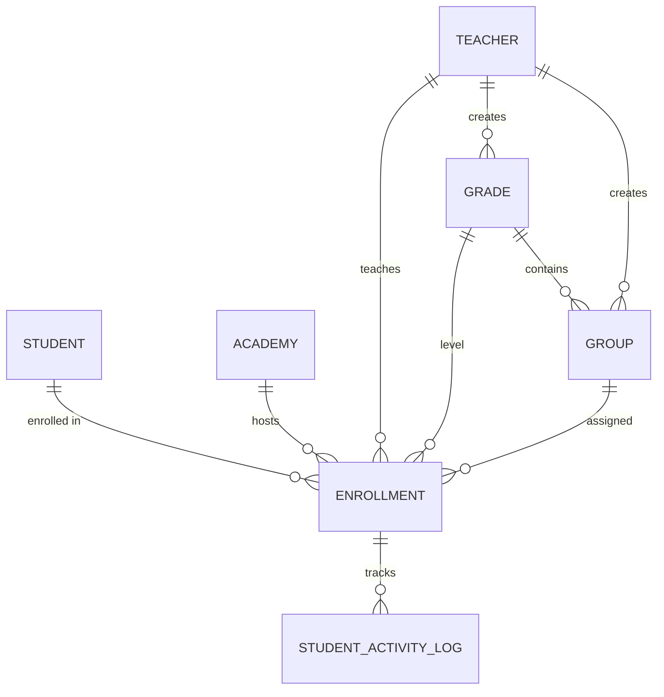
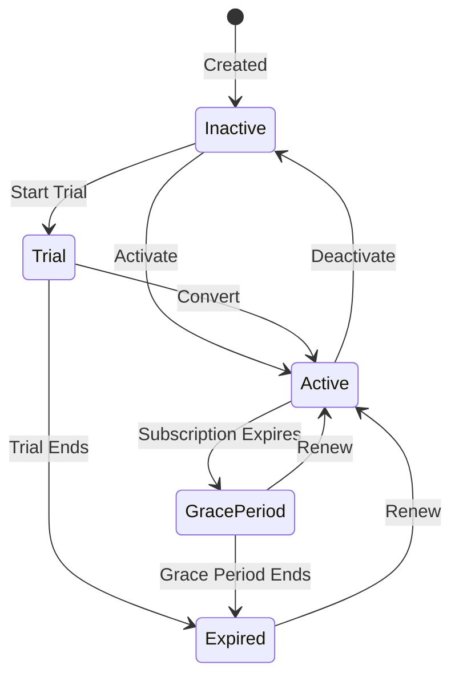

# Enrollments Domain

**Path:** `backend/app/Domains/Enrollments/`

The Enrollments domain manages student enrollment with teachers, grade levels, groups, and student activity logging.

## Overview



## Models

### Enrollment

**File:** `Enrollments/Models/Enrollment.php`

Represents a student's enrollment with a specific teacher.

```php
class Enrollment extends Model
{
    use HasUuids, SoftDeletes;
    
    protected $fillable = [
        'student_id', 'teacher_id', 'academy_id',
        'grade_id', 'group_id', 'balance',
        'is_active', 'subscription_start', 'subscription_end',
        'teacher_notes',
    ];
    
    protected $casts = [
        'is_active' => 'boolean',
        'subscription_start' => 'date',
        'subscription_end' => 'date',
        'balance' => 'decimal:2',
    ];
    
    // Relationships
    public function student(): BelongsTo
    public function teacher(): BelongsTo
    public function academy(): BelongsTo
    public function grade(): BelongsTo
    public function group(): BelongsTo
    public function activityLogs(): HasMany
}
```

**Database Table:** `enrollments`

| Column | Type | Description |
|--------|------|-------------|
| `id` | UUID | Primary key |
| `student_id` | UUID | FK to students |
| `teacher_id` | UUID | FK to teachers |
| `academy_id` | UUID | FK to academies (nullable) |
| `grade_id` | UUID | FK to grades (nullable) |
| `group_id` | UUID | FK to groups (nullable) |
| `balance` | decimal(10,2) | Outstanding balance |
| `is_active` | boolean | Enrollment status |
| `subscription_start` | date | Subscription start |
| `subscription_end` | date | Subscription end |
| `teacher_notes` | text | Private notes |

**Indexes:**
- `idx_enrollments_lookup` (teacher_id, grade_id, is_active)
- `enrollments_teacher_active_index` (teacher_id, is_active)
- `enrollments_grade_active_index` (grade_id, is_active)
- Unique: (student_id, teacher_id, academy_id)

---

### Grade

**File:** `Enrollments/Models/Grade.php`

Grade level (e.g., "First Grade", "Grade 10").

```php
class Grade extends Model
{
    use HasUuids;
    
    protected $fillable = [
        'name', 'description', 'teacher_id', 'academy_id',
    ];
    
    public function teacher(): BelongsTo
    public function academy(): BelongsTo
    public function groups(): HasMany
    public function enrollments(): HasMany
}
```

---

### Group

**File:** `Enrollments/Models/Group.php`

Student group within a grade (e.g., "Group A", "Science Group").

```php
class Group extends Model
{
    use HasUuids;
    
    protected $fillable = [
        'name', 'description', 'grade_id', 'teacher_id',
        'max_students', 'is_active',
    ];
    
    protected $casts = [
        'is_active' => 'boolean',
        'max_students' => 'integer',
    ];
    
    public function grade(): BelongsTo
    public function teacher(): BelongsTo
    public function enrollments(): HasMany
    public function students(): BelongsToMany
}
```

---

### StudentActivityLog

**File:** `Enrollments/Models/StudentActivityLog.php`

Tracks student actions for analytics.

```php
class StudentActivityLog extends Model
{
    use HasUuids;
    
    protected $fillable = [
        'student_id', 'enrollment_id', 'action',
        'subject_type', 'subject_id', 'metadata',
        'ip_address', 'user_agent',
    ];
    
    protected $casts = [
        'metadata' => 'array',
        'action' => StudentActivityAction::class,
    ];
    
    public function student(): BelongsTo
    public function enrollment(): BelongsTo
    public function subject(): MorphTo
}
```

---

## Enums

### EnrollmentStatus

**File:** `Enrollments/Enums/EnrollmentStatus.php`

```php
enum EnrollmentStatus: string
{
    case ACTIVE          = 'active';
    case SUSPENDED       = 'suspended';
    case EXPIRED         = 'expired';
    case BLOCKED_BY_PLAN = 'blocked_by_plan';
    
    public function label(): string
    {
        return match($this) {
            self::ACTIVE          => 'نشط',
            self::SUSPENDED       => 'موقوف',
            self::EXPIRED         => 'منتهي',
            self::BLOCKED_BY_PLAN => 'محظور بسبب الباقة',
        };
    }
    
    public function isActive(): bool
    {
        return $this === self::ACTIVE;
    }
}
```

| Case | Value | Arabic Label | Description |
|------|-------|--------------|-------------|
| `ACTIVE` | `active` | نشط | Enrollment is active |
| `SUSPENDED` | `suspended` | موقوف | Suspended by teacher/admin |
| `EXPIRED` | `expired` | منتهي | Subscription period ended |
| `BLOCKED_BY_PLAN` | `blocked_by_plan` | محظور بسبب الباقة | Blocked by plan limits |

---

### GroupType

**File:** `Enrollments/Enums/GroupType.php`

```php
enum GroupType: string
{
    case REGULAR   = 'regular';
    case ADVANCED  = 'advanced';
    case REMEDIAL  = 'remedial';
    case CUSTOM    = 'custom';
}
```

---

### SeatStatus

**File:** `Enrollments/Enums/SeatStatus.php`

```php
enum SeatStatus: string
{
    case AVAILABLE = 'available';
    case OCCUPIED  = 'occupied';
    case RESERVED  = 'reserved';
}
```

---

### StudentActivityAction

**File:** `Enrollments/Enums/StudentActivityAction.php`

```php
enum StudentActivityAction: string
{
    case LOGIN           = 'login';
    case LOGOUT          = 'logout';
    case EXAM_STARTED    = 'exam_started';
    case EXAM_COMPLETED  = 'exam_completed';
    case VIDEO_WATCHED   = 'video_watched';
    case ATTENDANCE      = 'attendance';
    case POINTS_EARNED   = 'points_earned';
}
```

---

## DTOs

### CreateEnrollmentDTO

**File:** `Enrollments/DTOs/CreateEnrollmentDTO.php`

```php
class CreateEnrollmentDTO
{
    public function __construct(
        public string $studentId,
        public string $teacherId,
        public ?string $academyId = null,
        public ?string $gradeId = null,
        public ?string $groupId = null,
        public float $balance = 0,
        public ?string $teacherNotes = null,
    ) {}
    
    public static function fromRequest(Request $request): self
}
```

---

### CreateGroupDTO

**File:** `Enrollments/DTOs/CreateGroupDTO.php`

```php
class CreateGroupDTO
{
    public function __construct(
        public string $name,
        public ?string $description = null,
        public string $gradeId,
        public ?int $maxStudents = null,
        public bool $isActive = true,
    ) {}
}
```

---

### GradeData

**File:** `Enrollments/DTOs/GradeData.php`

```php
class GradeData
{
    public function __construct(
        public string $name,
        public ?string $description = null,
        public ?string $teacherId = null,
        public ?string $academyId = null,
    ) {}
}
```

---

### TeacherGradeData

**File:** `Enrollments/DTOs/TeacherGradeData.php`

```php
class TeacherGradeData extends GradeData
{
    public static function fromRequest(Request $request, Teacher $teacher): self
}
```

---

### GroupData

**File:** `Enrollments/DTOs/GroupData.php`

```php
class GroupData
{
    public function __construct(
        public string $name,
        public string $gradeId,
        public ?string $description = null,
        public ?int $maxStudents = null,
    ) {}
}
```

---

### TeacherGroupData

**File:** `Enrollments/DTOs/TeacherGroupData.php`

```php
class TeacherGroupData extends GroupData
{
    public static function fromRequest(Request $request): self
}
```

---

## Actions

### CreateEnrollmentAction

**File:** `Enrollments/Actions/CreateEnrollmentAction.php`

```php
class CreateEnrollmentAction
{
    public function execute(CreateEnrollmentDTO $dto): Enrollment
    {
        // 1. Validate student exists
        // 2. Check for duplicate enrollment
        // 3. Create enrollment record
        // 4. Assign to grade/group if provided
        // 5. Dispatch EnrollmentCreated event
        
        return $enrollment;
    }
}
```

---

### ValidateGroupGrade

**File:** `Enrollments/Actions/ValidateGroupGrade.php`

```php
class ValidateGroupGrade
{
    public function execute(string $gradeId, ?string $groupId): bool
    {
        // Validate that group belongs to grade
        if ($groupId) {
            $group = Group::find($groupId);
            return $group && $group->grade_id === $gradeId;
        }
        
        return true;
    }
}
```

---

## Repositories

### EnrollmentRepository (Interface)

**File:** `Enrollments/Repositories/Contracts/EnrollmentRepository.php`

```php
interface EnrollmentRepository
{
    public function find(string $id): ?Enrollment;
    public function findByStudentAndTeacher(string $studentId, string $teacherId): ?Enrollment;
    public function getActiveByTeacher(string $teacherId): Collection;
    public function getActiveByStudent(string $studentId): Collection;
    public function create(array $data): Enrollment;
    public function update(string $id, array $data): Enrollment;
    public function delete(string $id): bool;
    public function suspend(string $id): bool;
    public function activate(string $id): bool;
}
```

---

### EloquentEnrollmentRepository

**File:** `Enrollments/Repositories/Eloquent/EloquentEnrollmentRepository.php`

```php
class EloquentEnrollmentRepository implements EnrollmentRepository
{
    public function __construct(
        private Enrollment $model
    ) {}
    
    public function getActiveByTeacher(string $teacherId): Collection
    {
        return $this->model
            ->where('teacher_id', $teacherId)
            ->where('is_active', true)
            ->with(['student', 'grade', 'group'])
            ->get();
    }
    
    // ... other methods
}
```

---

### GroupRepository (Interface)

**File:** `Enrollments/Repositories/Contracts/GroupRepository.php`

```php
interface GroupRepository
{
    public function find(string $id): ?Group;
    public function getByGrade(string $gradeId): Collection;
    public function getByTeacher(string $teacherId): Collection;
    public function create(array $data): Group;
    public function update(string $id, array $data): Group;
    public function delete(string $id): bool;
    public function getStudentCount(string $id): int;
}
```

---

### EloquentGroupRepository

**File:** `Enrollments/Repositories/Eloquent/EloquentGroupRepository.php`

```php
class EloquentGroupRepository implements GroupRepository
{
    // Implementation of GroupRepository interface
}
```

---

## Observers

### EnrollmentObserver

**File:** `Enrollments/Observers/EnrollmentObserver.php`

```php
class EnrollmentObserver
{
    public function created(Enrollment $enrollment): void
    {
        // Update student count in group
        // Send welcome notification
        // Initialize gamification points
    }
    
    public function updated(Enrollment $enrollment): void
    {
        // Handle status changes
        // Sync group membership
    }
    
    public function deleted(Enrollment $enrollment): void
    {
        // Cleanup related data
        // Update group counts
    }
}
```

---

## Policies

### EnrollmentPolicy

**File:** `Enrollments/Policies/EnrollmentPolicy.php`

```php
class EnrollmentPolicy
{
    public function view(User $user, Enrollment $enrollment): bool
    {
        // Teacher can view their own enrollments
        // Student can view their own enrollment
        // Academy can view their enrollments
    }
    
    public function create(User $user): bool
    {
        // Teachers and secretaries can create
    }
    
    public function update(User $user, Enrollment $enrollment): bool
    {
        // Owner teacher can update
    }
    
    public function delete(User $user, Enrollment $enrollment): bool
    {
        // Only admins can delete
    }
}
```

---

### GradePolicy

**File:** `Enrollments/Policies/GradePolicy.php`

```php
class GradePolicy
{
    public function view(User $user, Grade $grade): bool
    public function create(User $user): bool
    public function update(User $user, Grade $grade): bool
    public function delete(User $user, Grade $grade): bool
}
```

---

### GroupPolicy

**File:** `Enrollments/Policies/GroupPolicy.php`

```php
class GroupPolicy
{
    public function view(User $user, Group $group): bool
    public function create(User $user): bool
    public function update(User $user, Group $group): bool
    public function delete(User $user, Group $group): bool
}
```

---

## Resources

### State Pattern

The Enrollments domain implements the **State Pattern** to manage enrollment lifecycle states. Each state encapsulates the behavior and allowed transitions for an enrollment.



#### AbstractEnrollmentState

**File:** `Enrollments/States/AbstractEnrollmentState.php`

Base class for all enrollment states:

```php
abstract class AbstractEnrollmentState
{
    public function canActivate(): bool { return false; }
    public function canDeactivate(): bool { return false; }
    public function canRenew(): bool { return true; }
    public function canAccessContent(): bool { return false; }
    public function isTrial(): bool { return false; }
    public function isActive(): bool { return false; }
    public function isExpired(): bool { return false; }
    public function getColor(): string { return 'gray'; }
    public function getAllowedTransitions(): array { return []; }
}
```

#### State Implementations

| State | Color | Content Access | Allowed Transitions |
|-------|-------|---------------|-------------------|
| **ActiveState** | Green (success) | Yes | Deactivate, Expire, GracePeriod |
| **InactiveState** | Yellow (warning) | No | Active, Trial |
| **TrialState** | Blue (info) | Yes | Active, Expire |
| **GracePeriodState** | Yellow (warning) | Yes | Active (renew), Expire |
| **ExpiredState** | Red (danger) | No | Active (renew) |

#### EnrollmentStateFactory

**File:** `Enrollments/States/EnrollmentStateFactory.php`

```php
class EnrollmentStateFactory
{
    public function createFromName(string $stateName): AbstractEnrollmentState
    public function createFromEnrollment(Enrollment $enrollment): AbstractEnrollmentState
    public function getAvailableStates(): array
    public function getAllStates(): array
}
```

---

### EnrollmentResource

**File:** `Enrollments/Resources/EnrollmentResource.php`

```php
class EnrollmentResource extends JsonResource
{
    public function toArray($request): array
    {
        return [
            'id' => $this->id,
            'student' => new StudentResource($this->whenLoaded('student')),
            'teacher' => new TeacherResource($this->whenLoaded('teacher')),
            'grade' => new GradeResource($this->whenLoaded('grade')),
            'group' => new GroupResource($this->whenLoaded('group')),
            'balance' => $this->balance,
            'is_active' => $this->is_active,
            'subscription_start' => $this->subscription_start?->format('Y-m-d'),
            'subscription_end' => $this->subscription_end?->format('Y-m-d'),
            'teacher_notes' => $this->when(
                $request->user()->isTeacher(),
                $this->teacher_notes
            ),
            'created_at' => $this->created_at,
        ];
    }
}
```

---

### GradeResource

**File:** `Enrollments/Resources/GradeResource.php`

```php
class GradeResource extends JsonResource
{
    public function toArray($request): array
    {
        return [
            'id' => $this->id,
            'name' => $this->name,
            'description' => $this->description,
            'groups_count' => $this->whenCounted('groups'),
            'students_count' => $this->whenCounted('enrollments'),
            'groups' => GroupResource::collection($this->whenLoaded('groups')),
        ];
    }
}
```

---

### GroupResource

**File:** `Enrollments/Resources/GroupResource.php`

```php
class GroupResource extends JsonResource
{
    public function toArray($request): array
    {
        return [
            'id' => $this->id,
            'name' => $this->name,
            'description' => $this->description,
            'grade_id' => $this->grade_id,
            'grade' => new GradeResource($this->whenLoaded('grade')),
            'max_students' => $this->max_students,
            'students_count' => $this->students_count ?? $this->enrollments()->count(),
            'is_active' => $this->is_active,
        ];
    }
}
```

---

## Database Migrations

### create_enrollments_table

**File:** `database/migrations/2025_12_12_000001_create_enrollments_table.php`

```php
Schema::create('enrollments', function (Blueprint $table) {
    $table->uuid('id')->primary();
    
    $table->foreignUuid('student_id')->constrained('students')->onDelete('cascade');
    $table->foreignUuid('teacher_id')->constrained('teachers')->onDelete('cascade');
    $table->foreignUuid('grade_id')->nullable()->constrained('grades')->onDelete('set null');
    $table->foreignUuid('group_id')->nullable()->constrained('groups')->onDelete('set null');
    $table->uuid('academy_id')->nullable();
    
    $table->decimal('balance', 10, 2)->default(0);
    $table->boolean('is_active')->default(true);
    $table->date('subscription_start')->nullable();
    $table->date('subscription_end')->nullable();
    $table->text('teacher_notes')->nullable();
    
    $table->timestamps();
    $table->softDeletes();
    
    // Indexes
    $table->index(['teacher_id', 'is_active']);
    $table->index(['grade_id', 'is_active']);
    $table->index(['teacher_id', 'grade_id', 'is_active']);
    $table->unique(['student_id', 'teacher_id', 'academy_id']);
});
```

---

### create_grades_table

**File:** `database/migrations/2025_12_10_000002_create_grades_table.php`

```php
Schema::create('grades', function (Blueprint $table) {
    $table->uuid('id')->primary();
    $table->string('name');
    $table->text('description')->nullable();
    $table->foreignUuid('teacher_id')->nullable()->constrained()->nullOnDelete();
    $table->foreignUuid('academy_id')->nullable()->constrained()->nullOnDelete();
    $table->timestamps();
});
```

---

### create_groups_table

**File:** `database/migrations/2025_12_10_000003_create_groups_table.php`

```php
Schema::create('groups', function (Blueprint $table) {
    $table->uuid('id')->primary();
    $table->string('name');
    $table->text('description')->nullable();
    $table->foreignUuid('grade_id')->constrained()->cascadeOnDelete();
    $table->foreignUuid('teacher_id')->nullable()->constrained()->nullOnDelete();
    $table->unsignedInteger('max_students')->nullable();
    $table->boolean('is_active')->default(true);
    $table->timestamps();
});
```

---

### create_student_activity_logs_table

**File:** `database/migrations/2025_12_12_000002_create_student_activity_logs_table.php`

```php
Schema::create('student_activity_logs', function (Blueprint $table) {
    $table->uuid('id')->primary();
    $table->foreignUuid('student_id')->constrained()->cascadeOnDelete();
    $table->foreignUuid('enrollment_id')->nullable()->constrained()->nullOnDelete();
    $table->string('action');
    $table->string('subject_type')->nullable();
    $table->uuid('subject_id')->nullable();
    $table->json('metadata')->nullable();
    $table->string('ip_address', 45)->nullable();
    $table->string('user_agent')->nullable();
    $table->timestamp('created_at')->useCurrent();
    
    $table->index(['student_id', 'created_at']);
    $table->index(['action', 'created_at']);
});
```

---

## Usage Examples

### Creating an Enrollment

```php
use App\Domains\Enrollments\Actions\CreateEnrollmentAction;
use App\Domains\Enrollments\DTOs\CreateEnrollmentDTO;

$dto = new CreateEnrollmentDTO(
    studentId: $student->id,
    teacherId: $teacher->id,
    gradeId: $grade->id,
    groupId: $group->id,
);

$enrollment = app(CreateEnrollmentAction::class)->execute($dto);
```

### Getting Active Students for Teacher

```php
use App\Domains\Enrollments\Repositories\Contracts\EnrollmentRepository;

$enrollments = app(EnrollmentRepository::class)
    ->getActiveByTeacher($teacher->id)
    ->load(['student', 'grade', 'group']);
```

### Logging Student Activity

```php
use App\Domains\Enrollments\Models\StudentActivityLog;
use App\Domains\Enrollments\Enums\StudentActivityAction;

StudentActivityLog::create([
    'student_id' => $student->id,
    'enrollment_id' => $enrollment->id,
    'action' => StudentActivityAction::VIDEO_WATCHED,
    'subject_type' => Video::class,
    'subject_id' => $video->id,
    'metadata' => ['watched_seconds' => 300],
    'ip_address' => $request->ip(),
]);
```

---

## References

- [`backend/app/Domains/Enrollments/`](/backend/app/Domains/Enrollments/) - Source code
- [`backend/database/migrations/`](/backend/database/migrations/) - Migrations
- [Auth Domain](/backend/domains/auth) - User models
- [Subscriptions Domain](/backend/domains/subscriptions) - Subscription management

## Related Domains

- [Auth Domain](/backend/domains/auth) - Student and Teacher models
- [Exams Domain](/backend/domains/exams) - Exam attempts
- [Lectures Domain](/backend/domains/lectures) - Lecture attendance
- [Videos Domain](/backend/domains/videos) - Video access
- [Subscriptions Domain](/backend/domains/subscriptions) - Subscription limits
