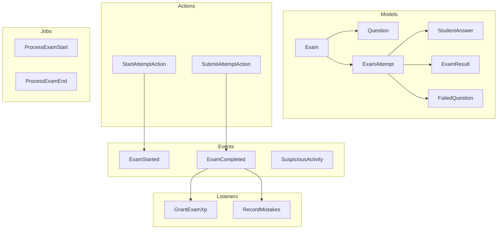

# Exams Domain

**Path:** `backend/app/Domains/Exams/`

The Exams domain handles the complete exam lifecycle: creation, question management, student attempts, automated grading, and results with gamification integration.

## Overview



## Models

### Exam

**File:** `Exams/Models/Exam.php`

```php
class Exam extends Model
{
    use HasUuids, SoftDeletes;
    
    protected $fillable = [
        'title', 'description', 'teacher_id',
        'academy_id', 'grade_id', 'group_id',
        'duration_minutes', 'total_marks',
        'passing_percentage', 'shuffle_questions',
        'shuffle_options', 'show_results',
        'status', 'starts_at', 'ends_at',
    ];
    
    protected $casts = [
        'shuffle_questions' => 'boolean',
        'shuffle_options' => 'boolean',
        'show_results' => 'boolean',
        'starts_at' => 'datetime',
        'ends_at' => 'datetime',
        'status' => ExamStatus::class,
    ];
    
    // Relationships
    public function teacher(): BelongsTo
    public function academy(): BelongsTo
    public function grade(): BelongsTo
    public function group(): BelongsTo
    public function questions(): HasMany
    public function attempts(): HasMany
    public function results(): HasMany
}
```

**Database Table:** `exams`

| Column | Type | Description |
|--------|------|-------------|
| `id` | UUID | Primary key |
| `title` | string | Exam title |
| `description` | text | Exam description |
| `teacher_id` | UUID | FK to teachers |
| `academy_id` | UUID | FK to academies (nullable) |
| `grade_id` | UUID | FK to grades |
| `group_id` | UUID | FK to groups (nullable) |
| `duration_minutes` | int | Time limit |
| `total_marks` | int | Maximum marks |
| `passing_percentage` | decimal | Passing threshold |
| `shuffle_questions` | boolean | Randomize question order |
| `shuffle_options` | boolean | Randomize MCQ options |
| `show_results` | boolean | Show results to students |
| `status` | enum | `draft`, `active`, `closed` |
| `starts_at` | timestamp | Availability start |
| `ends_at` | timestamp | Availability end |

---

### Question

**File:** `Exams/Models/Question.php`

```php
class Question extends Model
{
    use HasUuids;
    
    protected $fillable = [
        'exam_id', 'type', 'content',
        'options', 'correct_answer',
        'marks', 'order',
    ];
    
    protected $casts = [
        'options' => 'array',
        'correct_answer' => 'array',
        'type' => QuestionType::class,
    ];
    
    public function exam(): BelongsTo
    public function answers(): HasMany
}
```

**Database Table:** `questions`

| Column | Type | Description |
|--------|------|-------------|
| `id` | UUID | Primary key |
| `exam_id` | UUID | FK to exams |
| `type` | enum | `mcq`, `true_false`, `essay` |
| `content` | text | Question text |
| `options` | json | MCQ options array |
| `correct_answer` | json | Correct answer(s) |
| `marks` | int | Points for question |
| `order` | int | Display order |

---

### ExamAttempt

**File:** `Exams/Models/ExamAttempt.php`

```php
class ExamAttempt extends Model
{
    use HasUuids;
    
    protected $fillable = [
        'exam_id', 'student_id',
        'started_at', 'completed_at',
        'status', 'ip_address',
        'device_info', 'suspicious_activity',
        'time_spent_seconds',
    ];
    
    protected $casts = [
        'started_at' => 'datetime',
        'completed_at' => 'datetime',
        'suspicious_activity' => 'boolean',
        'device_info' => 'array',
        'status' => ExamAttemptStatus::class,
    ];
    
    public function exam(): BelongsTo
    public function student(): BelongsTo
    public function answers(): HasMany
    public function result(): HasOne
}
```

**Database Table:** `exam_attempts`

| Column | Type | Description |
|--------|------|-------------|
| `id` | UUID | Primary key |
| `exam_id` | UUID | FK to exams |
| `student_id` | UUID | FK to students |
| `started_at` | timestamp | Attempt start time |
| `completed_at` | timestamp | Attempt end time |
| `status` | enum | `in_progress`, `completed`, `expired` |
| `ip_address` | string | Client IP |
| `device_info` | json | Browser/device info |
| `suspicious_activity` | boolean | Flagged for review |
| `time_spent_seconds` | int | Total time spent |

---

### ExamResult

**File:** `Exams/Models/ExamResult.php`

```php
class ExamResult extends Model
{
    use HasUuids;
    
    protected $fillable = [
        'exam_attempt_id', 'student_id', 'exam_id',
        'marks_obtained', 'total_marks',
        'percentage', 'is_passed',
        'rank', 'answers_summary',
    ];
    
    protected $casts = [
        'marks_obtained' => 'decimal:2',
        'percentage' => 'decimal:2',
        'is_passed' => 'boolean',
        'answers_summary' => 'array',
    ];
    
    public function attempt(): BelongsTo
    public function student(): BelongsTo
    public function exam(): BelongsTo
}
```

**Database Table:** `exam_results`

| Column | Type | Description |
|--------|------|-------------|
| `id` | UUID | Primary key |
| `exam_attempt_id` | UUID | FK to exam_attempts |
| `student_id` | UUID | FK to students |
| `exam_id` | UUID | FK to exams |
| `marks_obtained` | decimal | Score achieved |
| `total_marks` | int | Maximum possible |
| `percentage` | decimal | Score percentage |
| `is_passed` | boolean | Passed exam |
| `rank` | int | Ranking among attempts |

---

### StudentAnswer

**File:** `Exams/Models/StudentAnswer.php`

```php
class StudentAnswer extends Model
{
    use HasUuids;
    
    protected $fillable = [
        'exam_attempt_id', 'question_id', 'student_id',
        'answer', 'is_correct', 'marks_obtained',
    ];
    
    protected $casts = [
        'answer' => 'array',
        'is_correct' => 'boolean',
        'marks_obtained' => 'decimal:2',
    ];
    
    public function attempt(): BelongsTo
    public function question(): BelongsTo
    public function student(): BelongsTo
}
```

---

### FailedQuestion

**File:** `Exams/Models/FailedQuestion.php`

Tracks questions students got wrong for review.

```php
class FailedQuestion extends Model
{
    use HasUuids;
    
    protected $fillable = [
        'student_id', 'exam_id', 'question_id',
        'correct_answer', 'student_answer',
        'reviewed_at', 'review_count',
    ];
    
    protected $casts = [
        'correct_answer' => 'array',
        'student_answer' => 'array',
        'reviewed_at' => 'datetime',
    ];
}
```

---

## Enums

### ExamStatus

**File:** `Exams/Enums/ExamStatus.php`

```php
enum ExamStatus: string
{
    case DRAFT  = 'draft';
    case ACTIVE = 'active';
    case CLOSED = 'closed';
    
    public function label(): string
    {
        return match($this) {
            self::DRAFT  => 'مسودة',
            self::ACTIVE => 'نشط',
            self::CLOSED => 'منتهي',
        };
    }
}
```

| Case | Value | Arabic Label | Description |
|------|-------|--------------|-------------|
| `DRAFT` | `draft` | مسودة | Being created/edited |
| `ACTIVE` | `active` | نشط | Available for students |
| `CLOSED` | `closed` | منتهي | No longer available |

---

### ExamAttemptStatus

**File:** `Exams/Enums/ExamAttemptStatus.php`

```php
enum ExamAttemptStatus: string
{
    case IN_PROGRESS = 'in_progress';
    case COMPLETED   = 'completed';
    case EXPIRED     = 'expired';
    case ABANDONED   = 'abandoned';
    
    public function label(): string
    {
        return match($this) {
            self::IN_PROGRESS => 'قيد الإجراء',
            self::COMPLETED   => 'مكتمل',
            self::EXPIRED     => 'منتهي',
            self::ABANDONED   => 'متروك',
        };
    }
}
```

---

### QuestionType

**File:** `Exams/Enums/QuestionType.php`

```php
enum QuestionType: string
{
    case MCQ       = 'mcq';
    case TRUE_FALSE = 'true_false';
    case ESSAY     = 'essay';
    
    public function label(): string
    {
        return match($this) {
            self::MCQ        => 'اختيار من متعدد',
            self::TRUE_FALSE => 'صح أو خطأ',
            self::ESSAY      => 'مقالي',
        };
    }
    
    public function isAutoGradable(): bool
    {
        return in_array($this, [self::MCQ, self::TRUE_FALSE]);
    }
}
```

| Case | Value | Arabic Label | Auto-Gradable |
|------|-------|--------------|---------------|
| `MCQ` | `mcq` | اختيار من متعدد | ✅ |
| `TRUE_FALSE` | `true_false` | صح أو خطأ | ✅ |
| `ESSAY` | `essay` | مقالي | ❌ |

---

### ExamMode

**File:** `Exams/Enums/ExamMode.php`

```php
enum ExamMode: string
{
    case PRACTICE   = 'practice';
    case ASSESSMENT = 'assessment';
    case FINAL      = 'final';
}
```

---

## Actions

### StartAttemptAction

**File:** `Exams/Actions/StartAttemptAction.php`

Handles starting a new exam attempt.

```php
class StartAttemptAction
{
    public function execute(Exam $exam, Student $student): ExamAttempt
    {
        // 1. Validate exam is active
        // 2. Check if student has remaining attempts
        // 3. Check time window
        // 4. Create attempt record
        // 5. Dispatch ExamStarted event
        // 6. Return attempt
        
        return ExamAttempt::create([
            'exam_id' => $exam->id,
            'student_id' => $student->id,
            'started_at' => now(),
            'status' => ExamAttemptStatus::IN_PROGRESS,
            'ip_address' => request()->ip(),
            'device_info' => $this->getDeviceInfo(),
        ]);
    }
}
```

**Validation Rules:**
- Exam must be in `ACTIVE` status
- Current time must be within exam window
- Student must not have exceeded max attempts
- Student must be enrolled in the target grade/group

---

### SubmitAttemptAction

**File:** `Exams/Actions/SubmitAttemptAction.php`

Handles submitting an exam attempt and calculating results.

```php
class SubmitAttemptAction
{
    public function execute(ExamAttempt $attempt, array $answers): ExamResult
    {
        DB::transaction(function () use ($attempt, $answers) {
            // 1. Validate attempt is in progress
            // 2. Store all answers
            // 3. Calculate marks for auto-gradable questions
            // 4. Create exam result
            // 5. Update attempt status
            // 6. Dispatch ExamCompleted event
            
            foreach ($answers as $questionId => $answer) {
                $this->storeAnswer($attempt, $questionId, $answer);
            }
            
            $result = $this->calculateResult($attempt);
            
            event(new ExamCompleted($attempt, $result));
            
            return $result;
        });
    }
}
```

---

## Events

### ExamStarted

**File:** `Exams/Events/ExamStarted.php`

```php
class ExamStarted
{
    public function __construct(
        public ExamAttempt $attempt,
    ) {}
}
```

**Listeners:**
- Log exam start in activity log

---

### ExamCompleted

**File:** `Exams/Events/ExamCompleted.php`

```php
class ExamCompleted
{
    public function __construct(
        public ExamAttempt $attempt,
        public ExamResult $result,
    ) {}
}
```

**Listeners:**
- `GrantExamXp` - Award XP to student
- `RecordMistakes` - Store failed questions for review

---

### SuspiciousActivity

**File:** `Exams/Events/SuspiciousActivity.php`

```php
class SuspiciousActivity
{
    public function __construct(
        public ExamAttempt $attempt,
        public string $type,
        public array $details = [],
    ) {}
}
```

**Triggered when:**
- Tab/window switch detected
- Multiple devices detected
- Time manipulation suspected
- Copy/paste attempts

---

## Listeners

### GrantExamXp

**File:** `Exams/Listeners/GrantExamXp.php`

Awards XP to student based on exam performance.

```php
class GrantExamXp
{
    public function handle(ExamCompleted $event): void
    {
        $xp = $this->calculateXp($event->result);
        
        app(GrantXpAction::class)->execute(
            $event->attempt->student,
            $xp,
            'exam_completed',
            [
                'exam_id' => $event->attempt->exam_id,
                'score' => $event->result->percentage,
            ]
        );
    }
    
    private function calculateXp(ExamResult $result): int
    {
        $baseXp = 10; // Base XP for completing
        
        if ($result->is_passed) {
            $baseXp += 20; // Bonus for passing
        }
        
        if ($result->percentage >= 90) {
            $baseXp += 30; // Excellence bonus
        }
        
        return $baseXp;
    }
}
```

---

### RecordMistakes

**File:** `Exams/Listeners/RecordMistakes.php`

Stores failed questions for student review.

```php
class RecordMistakes
{
    public function handle(ExamCompleted $event): void
    {
        $wrongAnswers = $event->attempt->answers()
            ->where('is_correct', false)
            ->get();
        
        foreach ($wrongAnswers as $answer) {
            FailedQuestion::create([
                'student_id' => $event->attempt->student_id,
                'exam_id' => $event->attempt->exam_id,
                'question_id' => $answer->question_id,
                'correct_answer' => $answer->question->correct_answer,
                'student_answer' => $answer->answer,
            ]);
        }
    }
}
```

---

## Jobs

### ProcessExamStart

**File:** `Exams/Jobs/ProcessExamStart.php`

Background job for exam activation.

```php
class ProcessExamStart implements ShouldQueue
{
    use Dispatchable, InteractsWithQueue, Queueable, SerializesModels;
    
    public function __construct(
        public string $examId,
    ) {}
    
    public function handle(): void
    {
        $exam = Exam::find($this->examId);
        
        // Send notifications to enrolled students
        // Update exam status if needed
    }
}
```

---

### ProcessExamEnd

**File:** `Exams/Jobs/ProcessExamEnd.php`

Background job for exam closure.

```php
class ProcessExamEnd implements ShouldQueue
{
    public function __construct(
        public string $examId,
    ) {}
    
    public function handle(): void
    {
        $exam = Exam::find($this->examId);
        
        // Mark expired attempts
        // Update exam status
        // Generate result notifications
    }
}
```

---

## Builders

### ExamAttemptBuilder

**File:** `Exams/Builders/ExamAttemptBuilder.php`

Custom query builder for exam attempts.

```php
class ExamAttemptBuilder extends Builder
{
    public function forStudent(string $studentId): self
    {
        return $this->where('student_id', $studentId);
    }
    
    public function forExam(string $examId): self
    {
        return $this->where('exam_id', $examId);
    }
    
    public function inProgress(): self
    {
        return $this->where('status', ExamAttemptStatus::IN_PROGRESS);
    }
    
    public function completed(): self
    {
        return $this->where('status', ExamAttemptStatus::COMPLETED);
    }
    
    public function completedToday(): self
    {
        return $this->whereDate('completed_at', today());
    }
    
    public function withSuspiciousActivity(): self
    {
        return $this->where('suspicious_activity', true);
    }
}
```

---

## Policies

### ExamPolicy

**File:** `Exams/Policies/ExamPolicy.php`

```php
class ExamPolicy
{
    public function view(User $user, Exam $exam): bool
    public function create(User $user): bool
    public function update(User $user, Exam $exam): bool
    public function delete(User $user, Exam $exam): bool
    public function activate(User $user, Exam $exam): bool
    public function startAttempt(User $user, Exam $exam): bool
}
```

| Method | Teacher | Admin | Student |
|--------|---------|-------|---------|
| `view` | ✅ (owning) | ✅ | ✅ (enrolled) |
| `create` | ✅ | ✅ | ❌ |
| `update` | ✅ (owning) | ✅ | ❌ |
| `delete` | ✅ (owning) | ✅ | ❌ |
| `activate` | ✅ (owning) | ✅ | ❌ |
| `startAttempt` | ❌ | ❌ | ✅ (enrolled) |

---

## Notifications

### ExamActivatedNotification

**File:** `Exams/Notifications/ExamActivatedNotification.php`

Sent to students when an exam becomes available.

---

### ExamResultNotification

**File:** `Exams/Notifications/ExamResultNotification.php`

Sent to students when results are available.

---

### ExamAbsentNotification

**File:** `Exams/Notifications/ExamAbsentNotification.php`

Sent to students who didn't take the exam.

---

### ExamStatusNotification

**File:** `Exams/Notifications/ExamStatusNotification.php`

General exam status updates.

---

## Resources

### ExamResource

**File:** `Exams/Resources/ExamResource.php`

```php
class ExamResource extends JsonResource
{
    public function toArray($request): array
    {
        return [
            'id' => $this->id,
            'title' => $this->title,
            'description' => $this->description,
            'duration_minutes' => $this->duration_minutes,
            'total_marks' => $this->total_marks,
            'passing_percentage' => $this->passing_percentage,
            'status' => $this->status->value,
            'status_label' => $this->status->label(),
            'starts_at' => $this->starts_at,
            'ends_at' => $this->ends_at,
            'questions_count' => $this->questions_count,
            'grade' => new GradeResource($this->whenLoaded('grade')),
            'group' => new GroupResource($this->whenLoaded('group')),
        ];
    }
}
```

---

### StudentExamResource

**File:** `Exams/Resources/StudentExamResource.php`

For student view (includes questions without answers).

---

### ExamResultDetailResource

**File:** `Exams/Resources/ExamResultDetailResource.php`

```php
class ExamResultDetailResource extends JsonResource
{
    public function toArray($request): array
    {
        return [
            'id' => $this->id,
            'marks_obtained' => $this->marks_obtained,
            'total_marks' => $this->total_marks,
            'percentage' => $this->percentage,
            'is_passed' => $this->is_passed,
            'rank' => $this->rank,
            'answers_summary' => $this->answers_summary,
            'completed_at' => $this->attempt->completed_at,
            'time_spent' => $this->attempt->time_spent_seconds,
        ];
    }
}
```

---

## Observers

### ExamObserver

**File:** `Exams/Observers/ExamObserver.php`

```php
class ExamObserver
{
    public function created(Exam $exam): void
    {
        // Log creation
    }
    
    public function updating(Exam $exam): void
    {
        // Prevent status changes from draft if no questions
        if ($exam->isDirty('status') && 
            $exam->status === ExamStatus::ACTIVE &&
            $exam->questions()->count() === 0) {
            throw new \Exception('Cannot activate exam without questions');
        }
    }
    
    public function updated(Exam $exam): void
    {
        // Schedule jobs for start/end times
        if ($exam->wasChanged('starts_at')) {
            // Dispatch ProcessExamStart job
        }
    }
}
```

---

## Exceptions

### ExamNotFoundException

**File:** `Exams/Exceptions/ExamNotFoundException.php`

Thrown when exam lookup fails.

---

## DTOs

### StudentExamData

**File:** `Exams/DTOs/StudentExamData.php`

```php
class StudentExamData
{
    public function __construct(
        public string $examId,
        public string $studentId,
        public ?array $answers = null,
    ) {}
}
```

---

### TeacherExamData

**File:** `Exams/DTOs/TeacherExamData.php`

```php
class TeacherExamData
{
    public function __construct(
        public string $title,
        public ?string $description = null,
        public int $durationMinutes = 60,
        public int $totalMarks = 100,
        public float $passingPercentage = 50.0,
        public bool $shuffleQuestions = false,
        public bool $shuffleOptions = false,
        public bool $showResults = true,
        public ?string $gradeId = null,
        public ?string $groupId = null,
        public ?Carbon $startsAt = null,
        public ?Carbon $endsAt = null,
    ) {}
}
```

---

## Usage Examples

### Creating an Exam

```php
use App\Domains\Exams\DTOs\TeacherExamData;
use App\Domains\Exams\Models\Exam;

$examData = new TeacherExamData(
    title: 'Midterm Exam',
    description: 'Chapters 1-5',
    durationMinutes: 90,
    totalMarks: 100,
    passingPercentage: 60.0,
    gradeId: $grade->id,
);

$exam = Exam::create([
    ...$examData->toArray(),
    'teacher_id' => $teacher->id,
    'status' => ExamStatus::DRAFT,
]);
```

### Starting an Attempt

```php
use App\Domains\Exams\Actions\StartAttemptAction;

$attempt = app(StartAttemptAction::class)->execute($exam, $student);
```

### Submitting Answers

```php
use App\Domains\Exams\Actions\SubmitAttemptAction;

$answers = [
    'question-uuid-1' => ['option_a'],
    'question-uuid-2' => true,
    'question-uuid-3' => 'Essay answer text...',
];

$result = app(SubmitAttemptAction::class)->execute($attempt, $answers);
```

---

## References

- [`backend/app/Domains/Exams/`](/backend/app/Domains/Exams/) - Source code
- [Gamification Domain](/backend/domains/gamification) - XP and points
- [Auth Domain](/backend/domains/auth) - Student model
- [Enrollments Domain](/backend/domains/enrollments) - Enrollment validation

## Related Domains

- [Gamification Domain](/backend/domains/gamification) - XP rewards
- [Auth Domain](/backend/domains/auth) - Student model
- [Enrollments Domain](/backend/domains/enrollments) - Grade/Group access
- [Notifications Domain](/backend/domains/notifications) - Exam notifications
