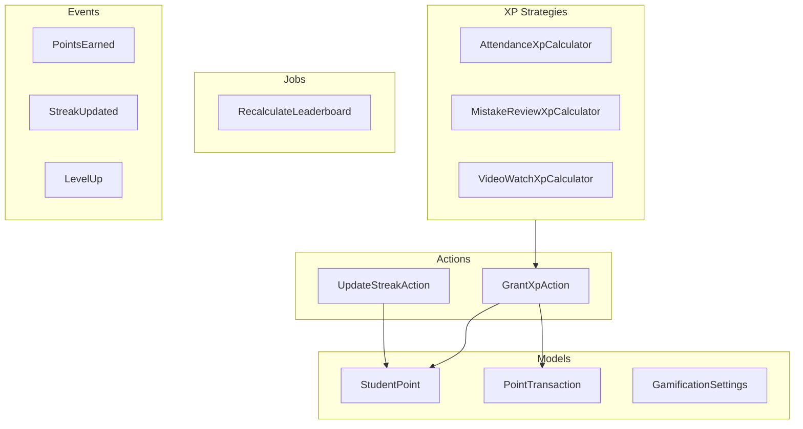
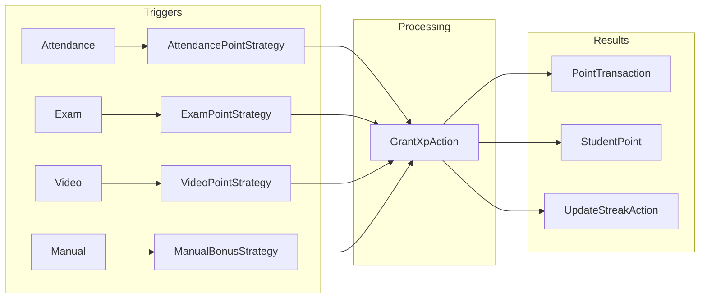

# Gamification Domain

**Path:** `backend/app/Domains/Gamification/`

The Gamification domain implements game mechanics to increase student engagement through points, XP, streaks, and leaderboards.

## Overview



## Models

### StudentPoint

**File:** `Gamification/Models/StudentPoint.php`

Tracks total points and streak for each student.

```php
class StudentPoint extends Model
{
    use HasUuids;
    
    protected $fillable = [
        'student_id',
        'total_points',
        'current_streak',
        'longest_streak',
        'last_activity_date',
        'level',
        'xp_to_next_level',
    ];
    
    protected $casts = [
        'total_points' => 'integer',
        'current_streak' => 'integer',
        'longest_streak' => 'integer',
        'last_activity_date' => 'date',
        'level' => 'integer',
        'xp_to_next_level' => 'integer',
    ];
    
    public function student(): BelongsTo
    {
        return $this->belongsTo(Student::class);
    }
}
```

**Database Table:** `student_points`

| Column | Type | Description |
|--------|------|-------------|
| `id` | UUID | Primary key |
| `student_id` | UUID | FK to students |
| `total_points` | int | Total accumulated points |
| `current_streak` | int | Current consecutive days |
| `longest_streak` | int | Best streak achieved |
| `last_activity_date` | date | Last activity date |
| `level` | int | Current level |
| `xp_to_next_level` | int | XP needed for next level |

---

### PointTransaction

**File:** `Gamification/Models/PointTransaction.php`

Records each point earning/spending event.

```php
class PointTransaction extends Model
{
    use HasUuids;
    
    protected $fillable = [
        'student_id',
        'points',
        'type',
        'source_type',
        'source_id',
        'description',
        'balance_after',
    ];
    
    protected $casts = [
        'points' => 'integer',
        'type' => PointTransactionType::class,
    ];
    
    public function student(): BelongsTo
    public function source(): MorphTo
}
```

**Database Table:** `point_transactions`

| Column | Type | Description |
|--------|------|-------------|
| `id` | UUID | Primary key |
| `student_id` | UUID | FK to students |
| `points` | int | Points earned/spent |
| `type` | enum | Transaction type |
| `source_type` | string | Source model type |
| `source_id` | UUID | Source model ID |
| `description` | string | Description |
| `balance_after` | int | Balance after transaction |
| `created_at` | timestamp | Transaction time |

---

### GamificationSettings

**File:** `Gamification/Models/GamificationSettings.php`

Configuration for gamification features.

```php
class GamificationSettings extends Model
{
    use HasUuids;
    
    protected $fillable = [
        'teacher_id',
        'points_per_attendance',
        'points_per_exam',
        'points_per_video',
        'streak_bonus_multiplier',
        'level_up_threshold',
        'is_enabled',
    ];
    
    protected $casts = [
        'points_per_attendance' => 'integer',
        'points_per_exam' => 'integer',
        'points_per_video' => 'integer',
        'streak_bonus_multiplier' => 'decimal:2',
        'level_up_threshold' => 'integer',
        'is_enabled' => 'boolean',
    ];
}
```

---

## Enums

### PointTransactionType

**File:** `Gamification/Enums/PointTransactionType.php`

```php
enum PointTransactionType: string
{
    case EARNED   = 'earned';
    case SPENT    = 'spent';
    case BONUS    = 'bonus';
    case PENALTY  = 'penalty';
    case EXPIRED  = 'expired';
}
```

---

### QuestType

**File:** `Gamification/Enums/QuestType.php`

```php
enum QuestType: string
{
    case DAILY   = 'daily';
    case WEEKLY  = 'weekly';
    case MONTHLY = 'monthly';
    case SPECIAL = 'special';
}
```

---

## Actions

### GrantXpAction

**File:** `Gamification/Actions/GrantXpAction.php`

Awards XP points to a student.

```php
class GrantXpAction
{
    public function execute(
        Student $student,
        int $points,
        string $sourceType,
        ?string $sourceId = null,
        ?string $description = null,
    ): PointTransaction {
        return DB::transaction(function () use ($student, $points, $sourceType, $sourceId, $description) {
            // Get or create student points record
            $studentPoint = StudentPoint::firstOrCreate(
                ['student_id' => $student->id],
                ['total_points' => 0, 'current_streak' => 0, 'level' => 1]
            );
            
            // Update total points
            $studentPoint->increment('total_points', $points);
            
            // Check for level up
            $this->checkLevelUp($studentPoint);
            
            // Create transaction record
            return PointTransaction::create([
                'student_id' => $student->id,
                'points' => $points,
                'type' => PointTransactionType::EARNED,
                'source_type' => $sourceType,
                'source_id' => $sourceId,
                'description' => $description,
                'balance_after' => $studentPoint->total_points,
            ]);
        });
    }
    
    private function checkLevelUp(StudentPoint $studentPoint): void
    {
        $threshold = GamificationSettings::first()->level_up_threshold ?? 100;
        
        while ($studentPoint->xp_to_next_level <= 0) {
            $studentPoint->increment('level');
            $studentPoint->xp_to_next_level = $threshold * $studentPoint->level;
            
            event(new LevelUp($studentPoint->student, $studentPoint->level));
        }
    }
}
```

---

### UpdateStreakAction

**File:** `Gamification/Actions/UpdateStreakAction.php`

Updates student streak based on daily activity.

```php
class UpdateStreakAction
{
    public function execute(Student $student): StudentPoint
    {
        $studentPoint = StudentPoint::firstOrCreate(
            ['student_id' => $student->id],
            ['total_points' => 0, 'current_streak' => 0, 'level' => 1]
        );
        
        $lastActivity = $studentPoint->last_activity_date;
        $today = today();
        
        if ($lastActivity?->isYesterday()) {
            // Continue streak
            $studentPoint->increment('current_streak');
        } elseif ($lastActivity?->isToday()) {
            // Already updated today
            return $studentPoint;
        } else {
            // Streak broken
            $studentPoint->update(['current_streak' => 1]);
        }
        
        // Update longest streak
        if ($studentPoint->current_streak > $studentPoint->longest_streak) {
            $studentPoint->update(['longest_streak' => $studentPoint->current_streak]);
        }
        
        $studentPoint->update(['last_activity_date' => $today]);
        
        // Award streak bonus
        if ($studentPoint->current_streak % 7 === 0) {
            $bonus = 10 * ($studentPoint->current_streak / 7);
            app(GrantXpAction::class)->execute(
                $student,
                $bonus,
                'streak_bonus',
                null,
                "Weekly streak bonus: {$studentPoint->current_streak} days"
            );
        }
        
        return $studentPoint;
    }
}
```

---

## Strategies

The Gamification domain uses two strategy interfaces:

- **`PointCalculationStrategyInterface`** - Transactional point calculations with context, source tracking
- **`XpCalculationStrategy`** - Non-transactional XP for leveling (simpler interface)

### Point Strategies

| Strategy | Context | Default Points | Description |
|----------|---------|---------------|-------------|
| `AttendancePointStrategy` | Attendance | Per lecture | Fixed points for attending lectures |
| `ExamPointStrategy` | Exam | Score-based | Points based on exam score percentage |
| `VideoPointStrategy` | Video | 10 | Fixed points per completed video |
| `ManualBonusStrategy` | Bonus | Immutable | Teacher-awarded bonus points |

### XP Calculators

| Calculator | Context | Base XP | Bonus Logic |
|-----------|---------|---------|-------------|
| `AttendanceXpCalculator` | Attendance | Per attendance | Streak bonus: 5+ days, 10+ days |
| `ExamXpCalculator` | Exam | Percentage-based | First place bonus, retake bonus |
| `MistakeReviewXpCalculator` | Mistake review | 5 XP | Per mastered question |



---

### AttendanceXpCalculator

**File:** `Gamification/Strategies/AttendanceXpCalculator.php`

```php
class AttendanceXpCalculator
{
    public function calculate(Student $student, Attendance $attendance): int
    {
        $settings = GamificationSettings::where('teacher_id', $student->enrollments()->first()?->teacher_id)->first();
        
        $baseXp = $settings?->points_per_attendance ?? 5;
        
        // Apply streak bonus
        $streakBonus = $this->getStreakMultiplier($student);
        
        return (int) ($baseXp * $streakBonus);
    }
    
    private function getStreakMultiplier(Student $student): float
    {
        $studentPoint = StudentPoint::where('student_id', $student->id)->first();
        
        if (!$studentPoint || $studentPoint->current_streak < 7) {
            return 1.0;
        }
        
        return 1.0 + ($studentPoint->current_streak / 100);
    }
}
```

---

### MistakeReviewXpCalculator

**File:** `Gamification/Strategies/MistakeReviewXpCalculator.php`

```php
class MistakeReviewXpCalculator
{
    public function calculate(Student $student, int $reviewedCount): int
    {
        // Award XP for reviewing mistakes
        return $reviewedCount * 2; // 2 XP per mistake reviewed
    }
}
```

---

### VideoWatchXpCalculator

**File:** `Gamification/Strategies/VideoWatchXpCalculator.php`

```php
class VideoWatchXpCalculator
{
    public function calculate(Student $student, Video $video, float $watchPercentage): int
    {
        $settings = GamificationSettings::where('teacher_id', $video->teacher_reference_id)->first();
        
        $baseXp = $settings?->points_per_video ?? 10;
        
        // Only award full XP if video is completed
        if ($watchPercentage >= 95) {
            return $baseXp;
        }
        
        // Partial credit for partial watch
        return (int) ($baseXp * ($watchPercentage / 100));
    }
}
```

---

## Jobs

### RecalculateLeaderboard

**File:** `Gamification/Jobs/RecalculateLeaderboard.php`

```php
class RecalculateLeaderboard implements ShouldQueue
{
    use Dispatchable, InteractsWithQueue, Queueable, SerializesModels;
    
    public function __construct(
        public string $teacherId,
        public ?string $period = null, // 'weekly', 'monthly', 'all_time'
    ) {}
    
    public function handle(): void
    {
        $query = StudentPoint::query()
            ->join('enrollments', 'student_points.student_id', '=', 'enrollments.student_id')
            ->where('enrollments.teacher_id', $this->teacherId)
            ->where('enrollments.is_active', true)
            ->orderByDesc('student_points.total_points');
        
        if ($this->period === 'weekly') {
            $query->where('student_points.updated_at', '>=', now()->subWeek());
        }
        
        // Cache leaderboard
        Cache::put(
            "leaderboard:{$this->teacherId}:{$this->period}",
            $query->get(['student_points.student_id', 'student_points.total_points']),
            now()->addHours(1)
        );
    }
}
```

---

## Events

### PointsEarned

**File:** `Gamification/Events/PointsEarned.php`

```php
class PointsEarned
{
    public function __construct(
        public Student $student,
        public int $points,
        public int $newTotal,
        public string $source,
    ) {}
}
```

---

### StreakUpdated

**File:** `Gamification/Events/StreakUpdated.php`

```php
class StreakUpdated
{
    public function __construct(
        public Student $student,
        public int $currentStreak,
        public int $longestStreak,
    ) {}
}
```

---

### LevelUp

**File:** `Gamification/Events/LevelUp.php`

```php
class LevelUp
{
    public function __construct(
        public Student $student,
        public int $newLevel,
    ) {}
}
```

---

### BadgeEarned

**File:** `Gamification/Events/BadgeEarned.php`

Dispatched when a student earns an achievement badge.

```php
class BadgeEarned
{
    public function __construct(
        public Student $student,
        public string $badgeType,
        public array $context = [],
    ) {}
}
```

---

### XpGranted

**File:** `Gamification/Events/XpGranted.php`

Dispatched when XP points are granted to a student.

```php
class XpGranted
{
    public function __construct(
        public Student $student,
        public int $points,
        public string $source,
    ) {}
}
```

---

## Actions

### CheckBadgeEligibility

**File:** `Gamification/Actions/CheckBadgeEligibility.php`

Checks if a student qualifies for any achievement badges.

```php
class CheckBadgeEligibility
{
    public function execute(Student $student): array
    {
        // Check all badge criteria against student's achievements
        // Returns array of newly earned badges
    }
}
```

---

## Rules

### ValidPointTransactionType

**File:** `Gamification/Rules/ValidPointTransactionType.php`

Validation rule ensuring point transaction types are valid.

```php
class ValidPointTransactionType implements ValidationRule
{
    public function validate(string $attribute, mixed $value, Closure $fail): void
    {
        if (!PointTransactionType::tryFrom($value)) {
            $fail('The :attribute must be a valid point transaction type.');
        }
    }
}
```

---

## Usage Examples

### Awarding XP for Exam Completion

```php
use App\Domains\Gamification\Actions\GrantXpAction;

app(GrantXpAction::class)->execute(
    $student,
    30, // 30 XP points
    'exam_completed',
    $exam->id,
    "Completed exam: {$exam->title}"
);
```

### Awarding XP for Video Watch

```php
use App\Domains\Gamification\Strategies\VideoWatchXpCalculator;
use App\Domains\Gamification\Actions\GrantXpAction;

$xp = app(VideoWatchXpCalculator::class)->calculate($student, $video, 100);

app(GrantXpAction::class)->execute(
    $student,
    $xp,
    'video_watched',
    $video->id,
    "Watched video: {$video->title}"
);
```

### Getting Leaderboard

```php
use App\Domains\Gamification\Jobs\RecalculateLeaderboard;

// Dispatch job to recalculate
RecalculateLeaderboard::dispatch($teacher->id, 'weekly');

// Get cached leaderboard
$leaderboard = Cache::get("leaderboard:{$teacher->id}:weekly");
```

---

## References

- [`backend/app/Domains/Gamification/`](/backend/app/Domains/Gamification/) - Source code
- [Exams Domain](/backend/domains/exams) - Exam completion triggers
- [Videos Domain](/backend/domains/videos) - Video watch triggers
- [Auth Domain](/backend/domains/auth) - Student model

## Related Domains

- [Exams Domain](/backend/domains/exams) - Exam XP rewards
- [Videos Domain](/backend/domains/videos) - Video XP rewards
- [Lectures Domain](/backend/domains/lectures) - Attendance XP rewards
- [Auth Domain](/backend/domains/auth) - Student model
