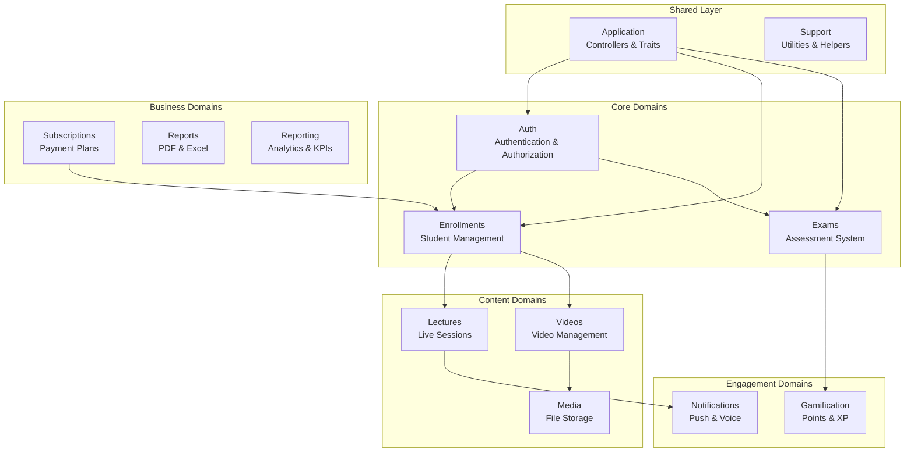

# Backend Domains

The Neetaq backend follows **Domain-Driven Design (DDD)** principles. Each domain is a self-contained module with its own models, services, actions, enums, and policies.

## Domain Map



## Domain Summary

| Domain | Path | Purpose |
|--------|------|---------|
| **Application** | `app/Domains/Application/` | Shared controllers, traits, helpers, middleware |
| **Auth** | `app/Domains/Auth/` | Authentication, authorization, user models |
| **Enrollments** | `app/Domains/Enrollments/` | Student enrollment, grades, groups |
| **Exams** | `app/Domains/Exams/` | Exam creation, attempts, results |
| **Gamification** | `app/Domains/Gamification/` | Points, XP, streaks, leaderboards |
| **Lectures** | `app/Domains/Lectures/` | Lecture sessions, attendance tracking |
| **Media** | `app/Domains/Media/` | File storage, R2 adapters, image processing |
| **Notifications** | `app/Domains/Notifications/` | FCM, voice, database notifications |
| **Reports** | `app/Domains/Reports/` | PDF/Excel report generation |
| **Reporting** | `app/Domains/Reporting/` | Analytics, KPIs, alerts, report builders |
| **Subscriptions** | `app/Domains/Subscriptions/` | Subscription plans, payments |
| **Videos** | `app/Domains/Videos/` | Video management, streaming, quizzes |

## Domain Structure Pattern

Each domain follows a consistent internal structure:

```
DomainName/
├── Actions/          # Single-responsibility command classes
├── Builders/         # Custom query builders
├── Channels/         # Notification channel strategies
├── Contracts/        # Interfaces and contracts
├── DTOs/             # Data Transfer Objects
├── Enums/            # Enumeration classes
├── Events/           # Domain events
├── Exceptions/       # Domain-specific exceptions
├── Factories/        # Factory classes
├── Jobs/             # Queue jobs
├── Listeners/        # Event listeners
├── Models/           # Eloquent models
├── Notifications/    # Notification classes
├── Observers/        # Model observers
├── Policies/         # Authorization policies
├── Repositories/     # Data repositories (interface + Eloquent)
├── Resources/        # API resources
├── Services/         # Domain services
├── Specifications/   # Business rule specifications
├── Support/          # Supporting utilities
└── Traits/           # Reusable traits
```

## Cross-Domain Communication

Domains communicate through:

### Events
- `UserLoggedIn` (Auth)
- `ExamCompleted`, `ExamStarted` (Exams)
- `SubscriptionExpired`, `SubscriptionExpiringSoon` (Subscriptions)
- `NewNotificationEvent` (Notifications)
- `SuspiciousActivity` (Exams)

### Listeners
- `LogLoginAudit` (Auth)
- `GrantExamXp`, `RecordMistakes` (Exams → Gamification)
- `BroadcastNotificationSent` (Notifications)
- `SuspendEnrollmentsOnExpiry` (Subscriptions → Enrollments)

## Architectural Patterns Used

| Pattern | Domain | Implementation |
|---------|--------|----------------|
| **Repository** | Enrollments | `EnrollmentRepository`, `GroupRepository` |
| **Action** | Auth, Exams | `LoginAction`, `StartAttemptAction` |
| **Strategy** | Gamification | `AttendanceXpCalculator`, `MistakeReviewXpCalculator` |
| **Specification** | Subscriptions | `PlanActive`, `SeatAvailable` |
| **Factory** | Notifications | `NotificationFactory` |
| **Channel Strategy** | Notifications | `DatabaseChannelStrategy`, `FcmChannelStrategy` |
| **Adapter** | Media | `CloudflareR2Adapter`, `LocalAdapter` |
| **Builder** | Exams | `ExamAttemptBuilder` |
| **Builder** | Reporting | `AcademySnapshotBuilder`, `AdminExecutiveSnapshotBuilder`, `TeacherSummaryBuilder` |
| **State** | Enrollments | `ActiveState`, `TrialState`, `GracePeriodState`, `ExpiredState` |
| **Specification Combinators** | Subscriptions | `AndSpecification`, `OrSpecification`, `NotSpecification` |

## Quick Navigation

### By User Role

| Role | Primary Domains |
|------|-----------------|
| **Admin** | Auth, Application, Reports, Reporting |
| **Academy** | Auth, Enrollments, Lectures, Reports, Reporting, Subscriptions |
| **Teacher** | Auth, Enrollments, Exams, Lectures, Videos, Gamification, Notifications, Reporting |
| **Student** | Auth, Exams, Videos, Gamification, Lectures |
| **Guardian** | Auth, Notifications |
| **Secretary** | Auth, Enrollments, Lectures |

### By Feature

| Feature | Domain | Key Classes |
|---------|--------|-------------|
| Login | Auth | `LoginAction`, `AuthService` |
| Student Management | Enrollments | `Enrollment`, `EnrollmentRepository` |
| Exam Taking | Exams | `StartAttemptAction`, `SubmitAttemptAction` |
| Video Streaming | Videos | `Video`, `VideoAccessGrantService` |
| Push Notifications | Notifications | `NotificationService`, `FcmChannelStrategy` |
| Points & XP | Gamification | `GrantXpAction`, `UpdateStreakAction` |
| Attendance | Lectures | `Lecture`, `Attendance` |
| Report Generation | Reports | `PdfExporter`, `ExcelExporter` |
| Analytics & KPIs | Reporting | `GenerateAdminReportAction`, `AlertEngine` |

## References

- [`backend/app/Domains/`](/backend/app/Domains/) - Source code
- [Architecture Overview](/backend/architecture) - Detailed architecture
- [API Reference](/backend/api/) - API endpoints

## Next Steps

- [Application Domain](/backend/domains/application) - Shared utilities and controllers
- [Auth Domain](/backend/domains/auth) - Authentication system
- [Enrollments Domain](/backend/domains/enrollments) - Student enrollment
