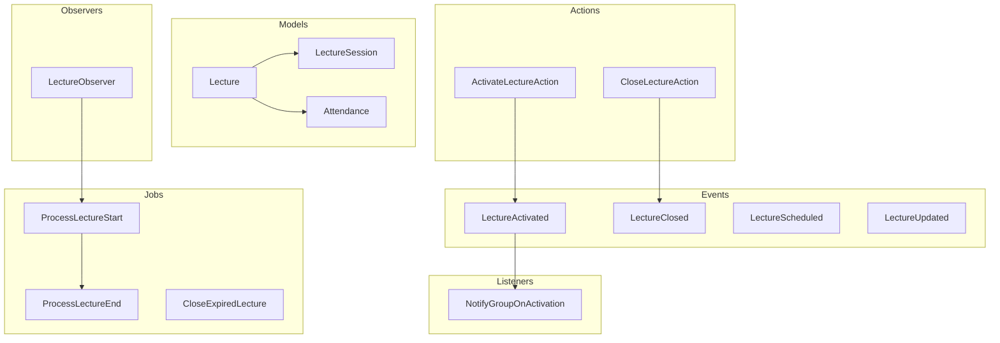
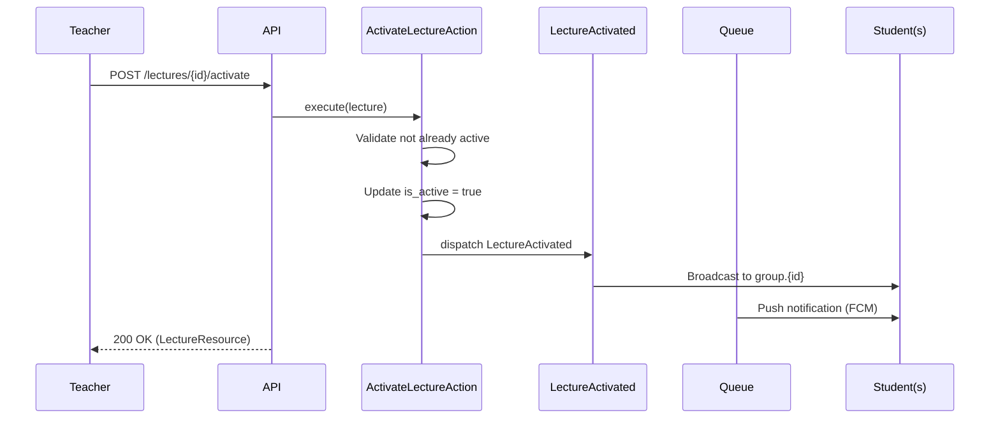
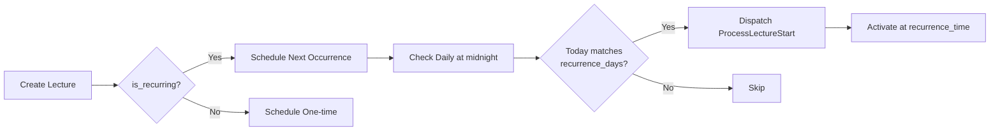

# Lectures Domain

**Path:** `backend/app/Domains/Lectures/`

The Lectures domain handles lecture scheduling, real-time activation/deactivation, attendance tracking via QR codes or manual entry, and recurring lecture management.

## Overview



## Models

### Lecture

**File:** [`Lectures/Models/Lecture.php`](backend/app/Domains/Lectures/Models/Lecture.php)

The main model representing a lecture. Supports both one-time and recurring lectures.

```php
class Lecture extends Model
{
    use GuardsSensitiveFields;
    use HasFactory, HasUuids;

    protected $fillable = [
        'teacher_id',
        'academy_id',
        'grade_id',
        'group_id',
        'title',
        'description',
        'start_time',
        'end_time',
        'qr_code',
        'qr_code_expires_at',
        'is_recurring',
        'recurrence_days',
        'recurrence_time',
        'duration_minutes',
        'parent_id',
        'cancelled_dates',
    ];

    protected function casts(): array
    {
        return [
            'start_time' => 'datetime',
            'end_time' => 'datetime',
            'qr_code_expires_at' => 'datetime',
            'is_active' => 'boolean',
            'is_recurring' => 'boolean',
            'recurrence_days' => 'array',
            'cancelled_dates' => 'array',
        ];
    }
}
```

**Database Table:** `lectures`

| Column | Type | Description |
|--------|------|-------------|
| `id` | UUID | Primary key |
| `teacher_id` | UUID | FK to teachers |
| `academy_id` | UUID | FK to academies (nullable) |
| `grade_id` | UUID | FK to grades |
| `group_id` | UUID | FK to groups (nullable) |
| `title` | string | Lecture title |
| `description` | text | Lecture description |
| `start_time` | timestamp | When lecture starts |
| `end_time` | timestamp | When lecture ends |
| `qr_code` | string | QR code for attendance |
| `qr_code_expires_at` | timestamp | QR code expiration |
| `is_active` | boolean | Whether lecture is currently active |
| `is_recurring` | boolean | Whether this is a recurring lecture |
| `recurrence_days` | json | Days of week for recurrence (e.g., ["sunday", "wednesday"]) |
| `recurrence_time` | time | Time for recurring lectures |
| `duration_minutes` | integer | Duration in minutes |
| `parent_id` | UUID | FK to parent lecture (for recurring instances) |
| `cancelled_dates` | json | Dates cancelled for recurring lectures |

**Relationships:**

| Method | Type | Related Model |
|--------|------|---------------|
| `teacher()` | BelongsTo | Teacher |
| `academy()` | BelongsTo | Academy |
| `grade()` | BelongsTo | Grade |
| `group()` | BelongsTo | Group |
| `attendances()` | HasMany | Attendance |
| `parent()` | BelongsTo | Lecture (self-referencing) |
| `children()` | HasMany | Lecture (self-referencing) |
| `sessions()` | HasMany | LectureSession |
| `currentSession()` | HasOne | LectureSession |

**Scopes:**

```php
// Filter lectures by academy
Lecture::forAcademy($academyId)->get();

// Filter lectures by academy's teachers
Lecture::forAcademyTeachers($academyId)->get();
```

---

### LectureSession

**File:** [`Lectures/Models/LectureSession.php`](backend/app/Domains/Lectures/Models/LectureSession.php)

Represents individual sessions of a recurring lecture.

```php
class LectureSession extends Model
{
    use HasFactory, HasUuids;

    protected $fillable = [
        'lecture_id',
        'date',
        'title',
        'description',
        'is_cancelled',
    ];

    protected function casts(): array
    {
        return [
            'date' => 'date',
            'is_cancelled' => 'boolean',
        ];
    }

    public function lecture(): BelongsTo
    {
        return $this->belongsTo(Lecture::class);
    }
}
```

**Database Table:** `lecture_sessions`

| Column | Type | Description |
|--------|------|-------------|
| `id` | UUID | Primary key |
| `lecture_id` | UUID | FK to lectures |
| `date` | date | Session date |
| `title` | string | Override title (nullable) |
| `description` | text | Override description (nullable) |
| `is_cancelled` | boolean | Whether session is cancelled |

---

### Attendance

**File:** [`Lectures/Models/Attendance.php`](backend/app/Domains/Lectures/Models/Attendance.php)

Tracks student attendance for lectures.

```php
class Attendance extends Model
{
    use GuardsSensitiveFields;
    use HasUuids;

    protected $fillable = [
        'lecture_id',
        'student_id',
    ];

    protected function casts(): array
    {
        return [
            'status' => \App\Domains\Lectures\Enums\StudentAttendanceStatus::class,
        ];
    }

    public function lecture(): BelongsTo
    {
        return $this->belongsTo(Lecture::class);
    }

    public function student(): BelongsTo
    {
        return $this->belongsTo(Student::class);
    }
}
```

**Database Table:** `attendances`

| Column | Type | Description |
|--------|------|-------------|
| `id` | UUID | Primary key |
| `lecture_id` | UUID | FK to lectures |
| `student_id` | UUID | FK to students |
| `status` | enum | Attendance status (present/absent/late) |

## Enums

### LectureStatus

**File:** [`Lectures/Enums/LectureStatus.php`](backend/app/Domains/Lectures/Enums/LectureStatus.php)

Represents the lifecycle status of a lecture.

| Case | Value | Label (AR) | Color |
|------|-------|------------|-------|
| `SCHEDULED` | `scheduled` | مجدولة | info |
| `ACTIVE` | `active` | نشطة | success |
| `CLOSED` | `closed` | منتهية | secondary |
| `CANCELLED` | `cancelled` | ملغاة | danger |

```php
enum LectureStatus: string
{
    case SCHEDULED = 'scheduled';
    case ACTIVE    = 'active';
    case CLOSED    = 'closed';
    case CANCELLED = 'cancelled';

    public function label(): string
    {
        return match($this) {
            self::SCHEDULED => 'مجدولة',
            self::ACTIVE    => 'نشطة',
            self::CLOSED    => 'منتهية',
            self::CANCELLED => 'ملغاة',
        };
    }

    public function color(): string
    {
        return match($this) {
            self::SCHEDULED => 'info',
            self::ACTIVE    => 'success',
            self::CLOSED    => 'secondary',
            self::CANCELLED => 'danger',
        };
    }
}
```

---

### AttendanceStatus

**File:** [`Lectures/Enums/AttendanceStatus.php`](backend/app/Domains/Lectures/Enums/AttendanceStatus.php)

Represents the attendance status of a student.

| Case | Value | Label (AR) | Color |
|------|-------|------------|-------|
| `PRESENT` | `present` | حاضر | success |
| `ABSENT` | `absent` | غائب | danger |
| `LATE` | `late` | متأخر | warning |
| `EXCUSED` | `excused` | مستأذن | info |

```php
enum AttendanceStatus: string
{
    case PRESENT = 'present';
    case ABSENT  = 'absent';
    case LATE    = 'late';
    case EXCUSED = 'excused';

    public function label(): string
    {
        return match($this) {
            self::PRESENT => 'حاضر',
            self::ABSENT  => 'غائب',
            self::LATE    => 'متأخر',
            self::EXCUSED => 'مستأذن',
        };
    }

    public function color(): string
    {
        return match($this) {
            self::PRESENT => 'success',
            self::ABSENT  => 'danger',
            self::LATE    => 'warning',
            self::EXCUSED => 'info',
        };
    }
}
```

---

### AttendanceMethod

**File:** [`Lectures/Enums/AttendanceMethod.php`](backend/app/Domains/Lectures/Enums/AttendanceMethod.php)

Represents how attendance was recorded.

| Case | Value | Label (AR) |
|------|-------|------------|
| `QR_CODE` | `qr_code` | QR Code |
| `MANUAL` | `manual` | يدوي |
| `AUTO` | `auto` | تلقائي |

```php
enum AttendanceMethod: string
{
    case QR_CODE  = 'qr_code';
    case MANUAL   = 'manual';
    case AUTO     = 'auto';

    public function label(): string
    {
        return match($this) {
            self::QR_CODE => 'QR Code',
            self::MANUAL  => 'يدوي',
            self::AUTO    => 'تلقائي',
        };
    }
}
```

---

### StudentAttendanceStatus

**File:** [`Lectures/Enums/StudentAttendanceStatus.php`](backend/app/Domains/Lectures/Enums/StudentAttendanceStatus.php)

Simplified attendance status for students.

| Case | Value |
|------|-------|
| `PRESENT` | `present` |
| `ABSENT` | `absent` |
| `LATE` | `late` |

```php
enum StudentAttendanceStatus: string
{
    case PRESENT = 'present';
    case ABSENT = 'absent';
    case LATE = 'late';
}
```

## Actions

### ActivateLectureAction

**File:** [`Lectures/Actions/ActivateLectureAction.php`](backend/app/Domains/Lectures/Actions/ActivateLectureAction.php)

Activates a lecture and broadcasts real-time notification to students.

```php
final class ActivateLectureAction
{
    /**
     * Activate a lecture and broadcast to students.
     *
     * @throws DomainException If lecture is already active
     */
    public function execute(Lecture $lecture): Lecture
    {
        if ($lecture->is_active) {
            throw new DomainException('المحاضرة مفعّلة بالفعل.');
        }

        $lecture->update([
            'is_active'  => true,
            'start_time' => now(),
        ]);

        event(new LectureActivated($lecture->refresh()));

        return $lecture;
    }
}
```

**Usage:**

```php
use App\Domains\Lectures\Actions\ActivateLectureAction;

$action = app(ActivateLectureAction::class);
$activeLecture = $action->execute($lecture);
```

---

### CloseLectureAction

**File:** [`Lectures/Actions/CloseLectureAction.php`](backend/app/Domains/Lectures/Actions/CloseLectureAction.php)

Closes an active lecture and broadcasts the event.

```php
final class CloseLectureAction
{
    /**
     * Close an active lecture.
     *
     * @throws DomainException If lecture is not active
     */
    public function execute(Lecture $lecture): Lecture
    {
        if (! $lecture->is_active) {
            throw new DomainException('المحاضرة غير نشطة أصلاً.');
        }

        $lecture->update([
            'is_active' => false,
            'end_time'  => now(),
        ]);

        event(new LectureClosed($lecture->refresh()));

        return $lecture;
    }
}
```

**Usage:**

```php
use App\Domains\Lectures\Actions\CloseLectureAction;

$action = app(CloseLectureAction::class);
$closedLecture = $action->execute($lecture);
```

## Events

### LectureActivated

**File:** [`Lectures/Events/LectureActivated.php`](backend/app/Domains/Lectures/Events/LectureActivated.php)

Broadcast when a lecture is activated. Implements `ShouldBroadcast` for real-time updates.

```php
class LectureActivated implements ShouldBroadcast
{
    use Dispatchable, InteractsWithSockets, SerializesModels;

    public function __construct(
        public readonly Lecture $lecture,
    ) {}

    public function broadcastOn(): array
    {
        return [
            new Channel("group.{$this->lecture->group_id}"),
        ];
    }

    public function broadcastAs(): string
    {
        return 'lecture.activated';
    }

    public function broadcastWith(): array
    {
        return [
            'lecture_id' => $this->lecture->id,
            'title'      => $this->lecture->title,
            'group_id'   => $this->lecture->group_id,
            'teacher_id' => $this->lecture->teacher_id,
            'started_at' => now()->toIso8601String(),
        ];
    }
}
```

**Broadcast Channel:** `group.{group_id}`

**Event Name:** `lecture.activated`

---

### LectureClosed

**File:** [`Lectures/Events/LectureClosed.php`](backend/app/Domains/Lectures/Events/LectureClosed.php)

Broadcast when a lecture is closed.

```php
class LectureClosed implements ShouldBroadcast
{
    use Dispatchable, InteractsWithSockets, SerializesModels;

    public function __construct(
        public readonly Lecture $lecture,
    ) {}

    public function broadcastOn(): array
    {
        return [
            new Channel("group.{$this->lecture->group_id}"),
        ];
    }

    public function broadcastAs(): string
    {
        return 'lecture.closed';
    }

    public function broadcastWith(): array
    {
        return [
            'lecture_id' => $this->lecture->id,
            'group_id'   => $this->lecture->group_id,
            'closed_at'  => now()->toIso8601String(),
        ];
    }
}
```

**Broadcast Channel:** `group.{group_id}`

**Event Name:** `lecture.closed`

---

### LectureScheduled

**File:** [`Lectures/Events/LectureScheduled.php`](backend/app/Domains/Lectures/Events/LectureScheduled.php)

Dispatched when a new lecture is scheduled (not broadcast).

```php
class LectureScheduled
{
    use Dispatchable, InteractsWithSockets, SerializesModels;

    public function __construct(
        public readonly Lecture $lecture,
    ) {}
}
```

---

### LectureUpdated

**File:** [`Lectures/Events/LectureUpdated.php`](backend/app/Domains/Lectures/Events/LectureUpdated.php)

Broadcast to teacher's private channel when lecture is updated.

```php
class LectureUpdated implements ShouldBroadcast
{
    use Dispatchable, InteractsWithSockets, SerializesModels;

    public Lecture $lecture;

    public function broadcastOn(): array
    {
        return [
            new PrivateChannel('teacher.' . $this->lecture->teacher_id),
        ];
    }

    public function broadcastAs(): string
    {
        return 'lecture.updated';
    }

    public function broadcastWith(): array
    {
        return [
            'lecture_id' => $this->lecture->id,
            'is_active'  => $this->lecture->is_active,
            'exists'     => $this->lecture->exists,
        ];
    }
}
```

**Broadcast Channel:** `private-teacher.{teacher_id}`

**Event Name:** `lecture.updated`

## Listeners

### NotifyGroupOnActivation

**File:** [`Lectures/Listeners/NotifyGroupOnActivation.php`](backend/app/Domains/Lectures/Listeners/NotifyGroupOnActivation.php)

Sends push notifications to all students in a group when a lecture is activated.

```php
class NotifyGroupOnActivation implements ShouldQueue
{
    public function handle(LectureActivated $event): void
    {
        $lecture  = $event->lecture;
        $groupId  = $lecture->group_id;

        if (! $groupId) {
            return;
        }

        // Gather FCM tokens for active students in the group
        $studentIds = Enrollment::where('group_id', $groupId)
            ->where('is_active', true)
            ->pluck('student_id');

        $tokens = DeviceToken::whereIn('tokenable_id', $studentIds)
            ->where('tokenable_type', Student::class)
            ->pluck('token');

        if ($tokens->isEmpty()) {
            return;
        }

        // Send batch notifications via FCM
        // FCMService::sendToTokens($tokens, [
        //     'title' => 'بدأت المحاضرة 🎓',
        //     'body'  => $lecture->title,
        //     'data'  => ['lecture_id' => $lecture->id],
        // ]);
    }
}
```

**Listens to:** `LectureActivated`

**Queue:** Yes (implements `ShouldQueue`)

## Jobs

### ProcessLectureStart

**File:** [`Lectures/Jobs/ProcessLectureStart.php`](backend/app/Domains/Lectures/Jobs/ProcessLectureStart.php)

Automatically activates lectures at their scheduled start time.

```php
class ProcessLectureStart implements ShouldQueue
{
    use Dispatchable, InteractsWithQueue, Queueable, SerializesModels;

    public function __construct(
        protected Lecture $lecture,
    ) {}

    public function handle(): void
    {
        $this->lecture->refresh();

        // Skip if not time yet
        if (
            ! $this->lecture->is_recurring
            && $this->lecture->start_time
            && $this->lecture->start_time->isFuture()
            && $this->lecture->start_time->diffInMinutes(now()) > 1
        ) {
            Log::info("ProcessLectureStart: Skipped premature activation");
            return;
        }

        if (! $this->lecture->is_active) {
            $this->lecture->update(['is_active' => true]);
            $this->lecture->refresh();

            LectureUpdated::dispatch($this->lecture);

            $this->lecture->teacher->notify(
                new LectureStatusNotification($this->lecture, 'active')
            );

            // Schedule end job
            $endTime = $this->lecture->is_recurring
                ? now()->copy()->addMinutes($this->lecture->duration_minutes)
                : $this->lecture->end_time;

            if ($endTime) {
                $delay = max(0, now()->diffInSeconds($endTime, false));
                ProcessLectureEnd::dispatch($this->lecture)->delay($delay);
            }
        }
    }
}
```

---

### ProcessLectureEnd

**File:** [`Lectures/Jobs/ProcessLectureEnd.php`](backend/app/Domains/Lectures/Jobs/ProcessLectureEnd.php)

Automatically closes lectures and marks absent students.

```php
class ProcessLectureEnd implements ShouldQueue
{
    use Dispatchable, InteractsWithQueue, Queueable, SerializesModels;

    public function __construct(
        protected Lecture $lecture,
    ) {}

    public function handle(): void
    {
        // Deactivate the lecture
        if ($this->lecture->is_active) {
            $this->lecture->update(['is_active' => false]);
            $this->lecture->refresh();

            LectureUpdated::dispatch($this->lecture);
            $this->lecture->teacher->notify(
                new LectureStatusNotification($this->lecture, 'finished')
            );
        }

        // Mark absent students
        $teacher = $this->lecture->teacher;
        $activeStudents = $teacher->activeStudents()
            ->wherePivot('grade_id', $this->lecture->grade_id)
            ->get();

        foreach ($activeStudents as $student) {
            $hasAttended = $this->lecture->attendances()
                ->where('student_id', $student->id)
                ->exists();

            if (! $hasAttended) {
                // Create attendance record as absent
                Attendance::create([
                    'lecture_id' => $this->lecture->id,
                    'student_id' => $student->id,
                    'status' => StudentAttendanceStatus::ABSENT,
                ]);

                // Notify student of absence
                $student->notify(
                    new StudentAbsentNotification(
                        $this->lecture->title,
                        $teacher->name,
                        $teacher->academy?->name ?? ''
                    )
                );
            }
        }
    }
}
```

---

### CloseExpiredLecture

**File:** [`Lectures/Jobs/CloseExpiredLecture.php`](backend/app/Domains/Lectures/Jobs/CloseExpiredLecture.php)

Scheduled job to close all lectures that have exceeded their end time.

```php
class CloseExpiredLecture implements ShouldQueue
{
    use Dispatchable, InteractsWithQueue, Queueable, SerializesModels;

    public function handle(CloseLectureAction $action): void
    {
        // Find active lectures past their end time
        Lecture::query()
            ->where('is_active', true)
            ->whereNotNull('end_time')
            ->where('end_time', '<=', now())
            ->get()
            ->each(function (Lecture $lecture) use ($action) {
                try {
                    $action->execute($lecture);
                } catch (\Throwable) {
                    // Continue with other lectures
                }
            });
    }
}
```

**Schedule:** Every 15 minutes via Laravel Scheduler

## Observers

### LectureObserver

**File:** [`Lectures/Observers/LectureObserver.php`](backend/app/Domains/Lectures/Observers/LectureObserver.php)

Observes Lecture model events and schedules jobs.

```php
class LectureObserver
{
    /**
     * Handle the Lecture "created" event.
     */
    public function created(Lecture $lecture): void
    {
        CacheService::forgetLecture($lecture->id, $lecture->teacher_id);
        
        if ($lecture->is_recurring) {
            $this->scheduleRecurringLecture($lecture);
        } elseif ($lecture->start_time) {
            if ($lecture->start_time->isFuture()) {
                $delay = max(0, now()->diffInSeconds($lecture->start_time, false));
                ProcessLectureStart::dispatch($lecture)->delay($delay);
            } elseif ($lecture->end_time->isFuture()) {
                ProcessLectureStart::dispatch($lecture);
            }
        }
    }

    /**
     * Handle the Lecture "updated" event.
     */
    public function updated(Lecture $lecture): void
    {
        CacheService::forgetLecture($lecture->id, $lecture->teacher_id);

        if ($lecture->is_recurring) {
            if ($lecture->wasChanged(['recurrence_days', 'recurrence_time', 'duration_minutes'])) {
                $this->scheduleRecurringLecture($lecture);
            }
        } elseif ($lecture->wasChanged('start_time') && $lecture->start_time) {
            // Reschedule if start_time changed
            if ($lecture->start_time->isFuture()) {
                $delay = max(0, now()->diffInSeconds($lecture->start_time, false));
                ProcessLectureStart::dispatch($lecture)->delay($delay);
            } elseif ($lecture->end_time->isFuture()) {
                ProcessLectureStart::dispatch($lecture);
            }
        }
    }

    /**
     * Handle the Lecture "deleted" event.
     */
    public function deleted(Lecture $lecture): void
    {
        CacheService::forgetLecture($lecture->id, $lecture->teacher_id);
    }
}
```

**Events Observed:**
- `created` - Schedules activation job
- `updated` - Reschedules if timing changed
- `deleted` - Clears cache

## DTOs

### LectureData

**File:** [`Lectures/DTOs/LectureData.php`](backend/app/Domains/Lectures/DTOs/LectureData.php)

Data transfer object for lecture creation.

```php
readonly class LectureData
{
    public function __construct(
        public string $teacherId,
        public string $title,
        public string $gradeId,
        public string $recurrenceTime,
        public int $durationMinutes,
        public ?string $description = null,
        public ?string $groupId = null,
        public ?string $date = null,
        public bool $isRecurring = false,
        public array $recurrenceDays = [],
    ) {}

    public static function fromRequest(Request $request): self
    {
        return new self(
            teacherId: $request->validated('teacher_id'),
            title: $request->validated('title'),
            gradeId: $request->validated('grade_id'),
            recurrenceTime: $request->validated('recurrence_time'),
            durationMinutes: (int) $request->validated('duration_minutes'),
            description: $request->validated('description'),
            groupId: $request->validated('group_id'),
            date: $request->validated('date'),
            isRecurring: (bool) $request->validated('is_recurring', false),
            recurrenceDays: $request->validated('recurrence_days', []),
        );
    }

    public function toArray(): array
    {
        return array_filter([
            'teacher_id' => $this->teacherId,
            'title' => $this->title,
            'description' => $this->description,
            'grade_id' => $this->gradeId,
            'group_id' => $this->groupId,
            'date' => $this->date,
            'is_recurring' => $this->isRecurring,
            'recurrence_days' => $this->recurrenceDays,
            'recurrence_time' => $this->recurrenceTime,
            'duration_minutes' => $this->durationMinutes,
        ], fn($value) => $value !== null);
    }
}
```

---

### TeacherLectureData

**File:** [`Lectures/DTOs/TeacherLectureData.php`](backend/app/Domains/Lectures/DTOs/TeacherLectureData.php)

DTO for teacher lecture operations with Carbon date support.

```php
final readonly class TeacherLectureData
{
    public function __construct(
        public ?string $title,
        public ?string $description,
        public ?string $gradeId,
        public ?string $groupId,
        public ?Carbon $date,
        public ?bool $isRecurring,
        public ?array $recurrenceDays,
        public ?string $recurrenceTime,
        public ?int $durationMinutes,
    ) {}

    public static function fromRequest(Request $request): self
    {
        $validated = method_exists($request, 'validated') 
            ? $request->validated() 
            : $request->all();
        
        return new self(
            title: $validated['title'] ?? null,
            description: $validated['description'] ?? null,
            gradeId: $validated['grade_id'] ?? null,
            groupId: $validated['group_id'] ?? null,
            date: isset($validated['date']) && $validated['date'] 
                ? Carbon::parse($validated['date']) 
                : null,
            isRecurring: isset($validated['is_recurring']) 
                ? (bool) $validated['is_recurring'] 
                : null,
            recurrenceDays: $validated['recurrence_days'] ?? null,
            recurrenceTime: $validated['recurrence_time'] ?? null,
            durationMinutes: isset($validated['duration_minutes']) 
                ? (int) $validated['duration_minutes'] 
                : null,
        );
    }

    public function toArray(): array
    {
        return array_filter([
            'title' => $this->title,
            'description' => $this->description,
            'grade_id' => $this->gradeId,
            'group_id' => $this->groupId,
            'is_recurring' => $this->isRecurring,
            'recurrence_days' => $this->recurrenceDays,
            'recurrence_time' => $this->recurrenceTime,
            'duration_minutes' => $this->durationMinutes,
        ], fn($value) => $value !== null);
    }
}
```

---

### AttendanceData

**File:** [`Lectures/DTOs/AttendanceData.php`](backend/app/Domains/Lectures/DTOs/AttendanceData.php)

DTO for attendance data.

```php
readonly class AttendanceData
{
    public function __construct(
        public string $teacher_id,
        public string $date,
        public ?string $notes,
    ) {}

    public static function fromRequest(Request $request): self
    {
        return new self(
            teacher_id: $request->validated('teacher_id'),
            date: $request->validated('date'),
            notes: $request->validated('notes'),
        );
    }

    public function toArray(): array
    {
        return [
            'teacher_id' => $this->teacher_id,
            'date' => $this->date,
            'notes' => $this->notes,
        ];
    }
}
```

## Policies

### LecturePolicy

**File:** [`Lectures/Policies/LecturePolicy.php`](backend/app/Domains/Lectures/Policies/LecturePolicy.php)

Authorization policy for lecture operations. Supports both Teacher and Secretary users.

```php
class LecturePolicy
{
    /**
     * Resolve the effective teacher from the user.
     */
    private function resolveTeacher(Teacher|Secretary $user): ?Teacher
    {
        if ($user instanceof Teacher) {
            return $user;
        }

        if ($user instanceof Secretary) {
            return $user->teachers()->first();
        }

        return null;
    }

    /**
     * Determine whether the user can view the lecture.
     */
    public function view(Teacher|Secretary $user, Lecture $lecture): bool
    {
        $teacher = $this->resolveTeacher($user);
        return $teacher && $lecture->teacher_id === $teacher->id;
    }

    /**
     * Determine whether the user can update the lecture.
     */
    public function update(Teacher|Secretary $user, Lecture $lecture): bool
    {
        $teacher = $this->resolveTeacher($user);
        return $teacher && $lecture->teacher_id === $teacher->id;
    }

    /**
     * Determine whether the user can delete the lecture.
     */
    public function delete(Teacher|Secretary $user, Lecture $lecture): bool
    {
        $teacher = $this->resolveTeacher($user);
        return $teacher && $lecture->teacher_id === $teacher->id;
    }

    /**
     * Determine whether the user can toggle lecture active status.
     */
    public function toggleActive(Teacher|Secretary $user, Lecture $lecture): bool
    {
        $teacher = $this->resolveTeacher($user);
        return $teacher && $lecture->teacher_id === $teacher->id;
    }

    /**
     * Determine whether the user can end a lecture.
     */
    public function endLecture(Teacher|Secretary $user, Lecture $lecture): bool
    {
        $teacher = $this->resolveTeacher($user);
        return $teacher && $lecture->teacher_id === $teacher->id;
    }

    /**
     * Determine whether the user can view lecture attendees.
     */
    public function viewAttendees(Teacher|Secretary $user, Lecture $lecture): bool
    {
        $teacher = $this->resolveTeacher($user);
        return $teacher && $lecture->teacher_id === $teacher->id;
    }

    /**
     * Determine whether the user can export lecture attendees.
     */
    public function exportAttendees(Teacher|Secretary $user, Lecture $lecture): bool
    {
        $teacher = $this->resolveTeacher($user);
        return $teacher && $lecture->teacher_id === $teacher->id;
    }

    /**
     * Determine whether the user can cancel a lecture session.
     */
    public function cancelSession(Teacher|Secretary $user, Lecture $lecture): bool
    {
        $teacher = $this->resolveTeacher($user);
        return $teacher && $lecture->teacher_id === $teacher->id;
    }
}
```

**Policy Methods:**

| Method | Description |
|--------|-------------|
| `view` | Can view lecture details |
| `update` | Can update lecture |
| `delete` | Can delete lecture |
| `toggleActive` | Can activate/deactivate lecture |
| `endLecture` | Can end an active lecture |
| `viewAttendees` | Can view attendance list |
| `exportAttendees` | Can export attendance data |
| `cancelSession` | Can cancel a recurring session |

## Resources

### LectureResource

**File:** [`Lectures/Resources/LectureResource.php`](backend/app/Domains/Lectures/Resources/LectureResource.php)

API resource for lecture responses (teacher/secretary view).

```php
class LectureResource extends JsonResource
{
    public function toArray(Request $request): array
    {
        return [
            'id' => $this->id,
            'title' => $this->title,
            'description' => $this->description,
            'price' => $this->price,
            'start_time' => $this->start_time?->toIso8601String(),
            'end_time' => $this->end_time?->toIso8601String(),
            'date' => $this->start_time?->format('Y-m-d'),
            'time' => $this->formatTime(),
            'duration' => $this->formatDuration(),
            'enrolled' => $this->attendances_count,
            'present_count' => $this->present_count ?? 0,
            'status' => $this->getStatus(),
            'is_active' => $this->is_active,
            'teacher' => $this->whenLoaded('teacher', fn() => [
                'id' => $this->teacher->id,
                'name' => $this->teacher->name,
            ]),
            'grade' => $this->whenLoaded('grade', fn() => [
                'id' => $this->grade->id,
                'name' => $this->grade->name,
            ]),
            'grade_id' => $this->grade_id,
            'group' => $this->whenLoaded('group', fn() => [
                'id' => $this->group->id,
                'name' => $this->group->name,
            ]),
            'group_id' => $this->group_id,
            'created_at' => $this->created_at,
            'is_recurring' => $this->is_recurring,
            'recurrence_days' => $this->recurrence_days,
            'cancelled_dates' => $this->cancelled_dates,
            'current_session_end_time' => $this->getCurrentSessionEndTime(),
            'current_session' => $this->whenLoaded('current_session', fn() => [
                'id' => $this->current_session->id,
                'title' => $this->current_session->title,
                'description' => $this->current_session->description,
                'is_cancelled' => $this->current_session->is_cancelled,
            ]),
        ];
    }
}
```

---

### StudentLectureResource

**File:** [`Lectures/Resources/StudentLectureResource.php`](backend/app/Domains/Lectures/Resources/StudentLectureResource.php)

API resource for student-facing lecture data.

```php
class StudentLectureResource extends JsonResource
{
    public function toArray($request): array
    {
        return [
            'id' => $this->id,
            'title' => $this->title,
            'description' => $this->description,
            'date' => $this->start_time->format('Y-m-d'),
            'time' => $this->start_time->format('H:i'),
            'iso_start_time' => $this->start_time->toIso8601String(),
            'iso_end_time' => $this->end_time->toIso8601String(),
            'duration' => $this->start_time->diffInMinutes($this->end_time),
            'is_recurring' => $this->is_recurring,
            'recurrence_days' => $this->recurrence_days,
            'is_active' => $this->is_active,
            'is_attended' => $this->is_attended ?? false,
            'grade' => $this->whenLoaded('grade', function () {
                return [
                    'id' => $this->grade->id ?? null,
                    'name' => $this->grade->name ?? null,
                ];
            }),
            'group' => $this->whenLoaded('group', function () {
                return [
                    'id' => $this->group->id ?? null,
                    'name' => $this->group->name ?? null,
                ];
            }),
            'teacher' => $this->whenLoaded('teacher', function () {
                return [
                    'id' => $this->teacher->id,
                    'name' => $this->teacher->name,
                ];
            }),
        ];
    }
}
```

---

### StudentAttendanceResource

**File:** [`Lectures/Resources/StudentAttendanceResource.php`](backend/app/Domains/Lectures/Resources/StudentAttendanceResource.php)

API resource for attendance data.

```php
class StudentAttendanceResource extends JsonResource
{
    public function toArray($request): array
    {
        return [
            'id' => $this->id,
            'status' => $this->status, // present, absent, late
            'created_at' => $this->created_at?->format('Y-m-d H:i:s'),
            'lecture' => $this->whenLoaded('lecture', function () {
                return [
                    'id' => $this->lecture->id,
                    'title' => $this->lecture->title,
                    'start_time' => $this->lecture->start_time?->format('Y-m-d H:i:s'),
                ];
            }),
        ];
    }
}
```

## Notifications

### LectureActivatedNotification

**File:** [`Lectures/Notifications/LectureActivatedNotification.php`](backend/app/Domains/Lectures/Notifications/LectureActivatedNotification.php)

Sent to students when a lecture becomes active.

```php
class LectureActivatedNotification extends BaseNotification
{
    public function __construct(
        private string $lectureTitle,
        private string $teacherName,
        private string $lectureId,
    ) {}

    protected function getData(): array
    {
        return [
            'title'         => 'محاضرة جديدة متاحة',
            'message'       => "تم تفعيل محاضرة: {$this->lectureTitle} بواسطة {$this->teacherName}",
            'sender_name'   => $this->teacherName,
            'type'          => 'lecture_activated',
            'lecture_id'    => $this->lectureId,
            'lecture_title' => $this->lectureTitle,
        ];
    }

    public function broadcastType(): string
    {
        return 'lecture_activated';
    }
}
```

---

### StudentAbsentNotification

**File:** [`Lectures/Notifications/StudentAbsentNotification.php`](backend/app/Domains/Lectures/Notifications/StudentAbsentNotification.php)

Sent to students when marked as absent.

```php
class StudentAbsentNotification extends BaseNotification
{
    public function __construct(
        private string $lectureTitle,
        private string $teacherName,
        private string $academyName,
    ) {}

    protected function getData(): array
    {
        return [
            'title'         => 'تسجيل غياب',
            'message'       => "لقد تم تسجيلك غائب في محاضرة: {$this->lectureTitle} للمدرس {$this->teacherName} في أكاديمية {$this->academyName}",
            'type'          => 'absent',
            'lecture_title' => $this->lectureTitle,
            'teacher_name'  => $this->teacherName,
            'academy_name'  => $this->academyName,
        ];
    }

    public function broadcastType(): string
    {
        return 'student_absent';
    }
}
```

## Exceptions

### LectureNotFoundException

**File:** [`Lectures/Exceptions/LectureNotFoundException.php`](backend/app/Domains/Lectures/Exceptions/LectureNotFoundException.php)

Thrown when a lecture cannot be found.

```php
class LectureNotFoundException extends ApiException
{
    protected int $statusCode = 404;
    protected string $errorType = 'lecture_not_found';

    public function __construct(string $message = 'المحاضرة غير موجودة')
    {
        parent::__construct($message);
    }
}
```

## Workflow Diagram



## Recurring Lectures

Recurring lectures follow a special workflow:



**Recurrence Days Format:**

```php
// In recurrence_days column (JSON array)
["sunday", "monday", "tuesday", "wednesday", "thursday"]

// With recurrence_time and duration_minutes
[
    "recurrence_days" => ["sunday", "wednesday"],
    "recurrence_time" => "14:00:00",
    "duration_minutes" => 90
]
```
