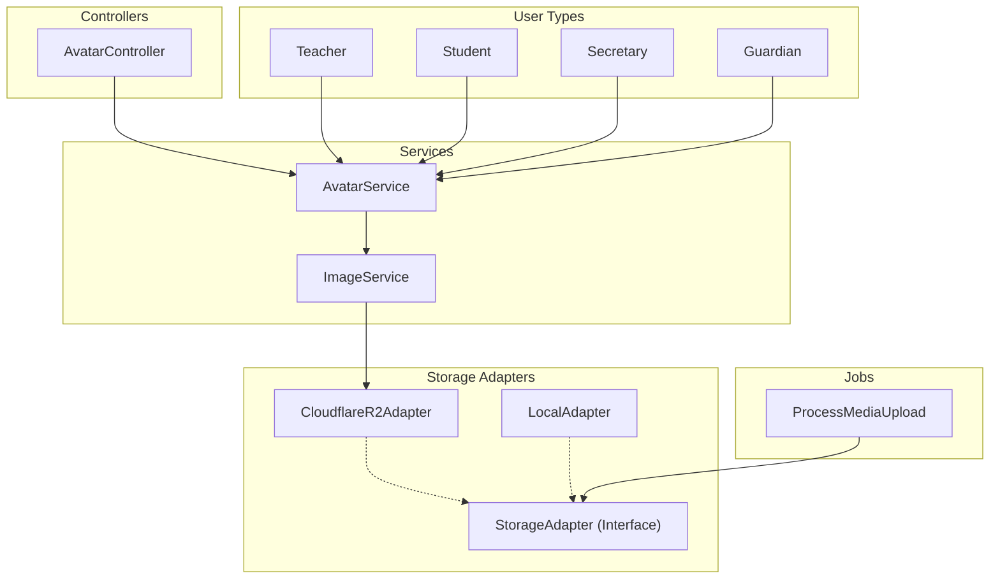

# Media Domain

**Path:** `backend/app/Domains/Media/`

The Media domain handles image processing, avatar management for all user types, and provides a flexible storage abstraction layer supporting both Cloudflare R2 and local filesystem storage.

## Overview



## Architecture

The Media domain follows the **Adapter Pattern** to provide a unified interface for file storage operations, allowing easy switching between storage backends (Cloudflare R2, local filesystem, or S3).

### Directory Structure

```
backend/app/Domains/Media/
├── Adapters/
│   ├── StorageAdapter.php        # Interface for storage operations
│   ├── CloudflareR2Adapter.php   # Cloudflare R2 implementation
│   └── LocalAdapter.php          # Local filesystem implementation
├── Services/
│   ├── AvatarService.php         # User avatar management
│   └── ImageService.php          # Image processing and upload
└── Jobs/
    └── ProcessMediaUpload.php    # Async media upload job
```

## Storage Adapters

### StorageAdapter Interface

**File:** [`Media/Adapters/StorageAdapter.php`](backend/app/Domains/Media/Adapters/StorageAdapter.php)

The interface defining the contract for all storage adapters:

```php
interface StorageAdapter
{
    /**
     * Upload file and return the stored path
     */
    public function upload(UploadedFile $file, string $path): string;

    /**
     * Delete file by path
     */
    public function delete(string $path): bool;

    /**
     * Get public URL for file
     */
    public function url(string $path): string;

    /**
     * Check if file exists
     */
    public function exists(string $path): bool;
}
```

### CloudflareR2Adapter

**File:** [`Media/Adapters/CloudflareR2Adapter.php`](backend/app/Domains/Media/Adapters/CloudflareR2Adapter.php)

Adapter for Cloudflare R2 object storage (S3-compatible):

```php
final class CloudflareR2Adapter implements StorageAdapter
{
    private string $disk = 'r2';
    private string $publicUrl;

    public function __construct()
    {
        $this->publicUrl = rtrim(config('filesystems.disks.r2.url', ''), '/');
    }

    public function upload(UploadedFile $file, string $path): string
    {
        return $file->store($path, $this->disk);
    }

    public function delete(string $path): bool
    {
        return Storage::disk($this->disk)->delete($path);
    }

    public function url(string $path): string
    {
        if ($this->publicUrl) {
            return $this->publicUrl . '/' . ltrim($path, '/');
        }
        return Storage::disk($this->disk)->url($path);
    }

    public function exists(string $path): bool
    {
        return Storage::disk($this->disk)->exists($path);
    }
}
```

### LocalAdapter

**File:** [`Media/Adapters/LocalAdapter.php`](backend/app/Domains/Media/Adapters/LocalAdapter.php)

Adapter for local filesystem storage:

```php
final class LocalAdapter implements StorageAdapter
{
    private string $disk;

    public function __construct(string $disk = 'public')
    {
        $this->disk = $disk;
    }

    public function upload(UploadedFile $file, string $path): string
    {
        return $file->store($path, $this->disk);
    }

    public function delete(string $path): bool
    {
        return Storage::disk($this->disk)->delete($path);
    }

    public function url(string $path): string
    {
        return Storage::disk($this->disk)->url($path);
    }

    public function exists(string $path): bool
    {
        return Storage::disk($this->disk)->exists($path);
    }
}
```

## Services

### ImageService

**File:** [`Media/Services/ImageService.php`](backend/app/Domains/Media/Services/ImageService.php)

Handles image processing, validation, and upload to Cloudflare R2.

#### Key Features

- **Image Validation**: Uses `FileUploadValidator` for secure file validation
- **Image Processing**: Resizes images to 300x300 pixels with cover cropping
- **Format Conversion**: Converts all images to WebP format at 60% quality
- **Secure Filename Generation**: Creates unique filenames with timestamps and random bytes

#### Methods

| Method | Parameters | Returns | Description |
|--------|------------|---------|-------------|
| `processAndUpload()` | `UploadedFile $file`, `string $directory`, `string $filename` | `string` | Process and upload image to R2 |
| `delete()` | `string $path` | `bool` | Delete image from R2 |
| `getUrl()` | `string $path` | `string` | Get public URL for image |
| `generateFilename()` | `string $prefix` | `string` | Generate unique filename |
| `validateImage()` | `UploadedFile $file` | `void` | Validate image using secure validator |

#### Usage Example

```php
$imageService = app(ImageService::class);

// Generate unique filename
$filename = $imageService->generateFilename('avatar_user123');

// Process and upload image
$path = $imageService->processAndUpload(
    $request->file('image'),
    'avatars',
    $filename
);
// Returns: "avatars/avatar_user123_1703123456_abcd1234.webp"

// Get public URL
$url = $imageService->getUrl($path);
// Returns: "https://your-r2-domain.com/avatars/avatar_user123_1703123456_abcd1234.webp"

// Delete image
$imageService->delete($path);
```

### AvatarService

**File:** [`Media/Services/AvatarService.php`](backend/app/Domains/Media/Services/AvatarService.php)

Manages user avatars for all user types (Teacher, Student, Secretary, Guardian).

#### Supported User Types

| User Type | Model Class | Type Identifier |
|-----------|-------------|-----------------|
| Teacher | `App\Domains\Auth\Models\Teacher` | `teacher` |
| Student | `App\Domains\Auth\Models\Student` | `student` |
| Secretary | `App\Domains\Auth\Models\Secretary` | `secretary` |
| Guardian | `App\Domains\Auth\Models\Guardian` | `parent` |

#### Methods

| Method | Parameters | Returns | Description |
|--------|------------|---------|-------------|
| `uploadAvatar()` | `$user`, `string $type`, `UploadedFile $file` | `array` | Upload avatar for user |
| `deleteAvatar()` | `$user`, `string $type` | `bool` | Delete user's avatar |
| `getAvatarUrl()` | `$user`, `string $type` | `?string` | Get avatar URL for user |
| `detectUserType()` | `$user` | `string` | Detect user type from model instance |

#### Usage Example

```php
$avatarService = app(AvatarService::class);

// Upload avatar
$result = $avatarService->uploadAvatar(
    $student,
    'student',
    $request->file('avatar')
);
// Returns: ['url' => 'https://...', 'key' => 'avatars/student_123_...webp']

// Get avatar URL
$url = $avatarService->getAvatarUrl($student, 'student');

// Delete avatar
$avatarService->deleteAvatar($student, 'student');

// Detect user type automatically
$userType = AvatarService::detectUserType(Auth::user());
```

## Jobs

### ProcessMediaUpload

**File:** [`Media/Jobs/ProcessMediaUpload.php`](backend/app/Domains/Media/Jobs/ProcessMediaUpload.php)

Queue job for asynchronous media upload processing.

#### Properties

| Property | Type | Description |
|----------|------|-------------|
| `$tries` | `int` | Number of retry attempts (3) |
| `$tempPath` | `string` | Temporary file path in storage/app/temp |
| `$targetPath` | `string` | Target path in storage |
| `$modelType` | `string` | Model type: 'teacher', 'student', 'question' |
| `$modelId` | `string` | Model UUID |
| `$attribute` | `string` | Attribute to update: 'avatar', 'attachment' |

#### Supported Model Types

```php
$modelClass = match ($this->modelType) {
    'teacher'  => \App\Domains\Auth\Models\Teacher::class,
    'student'  => \App\Domains\Auth\Models\Student::class,
    'question' => \App\Domains\Exams\Models\Question::class,
    default    => null,
};
```

#### Usage Example

```php
use App\Domains\Media\Jobs\ProcessMediaUpload;

// Store file temporarily
$tempPath = $request->file('avatar')->store('temp');

// Dispatch job
ProcessMediaUpload::dispatch(
    tempPath: storage_path('app/' . $tempPath),
    targetPath: 'avatars',
    modelType: 'student',
    modelId: $student->id,
    attribute: 'avatar_key'
);
```

## Configuration

### Cloudflare R2 Configuration

**File:** [`config/filesystems.php`](backend/config/filesystems.php)

The R2 disk configuration reads credentials from the database settings table with environment fallback:

```php
'r2' => [
    'driver'                  => 's3',
    'key'                     => _r2_setting('cloudflare_r2_access_key_id', 'R2_ACCESS_KEY_ID'),
    'secret'                  => _r2_setting('cloudflare_r2_secret_access_key', 'R2_SECRET_ACCESS_KEY'),
    'region'                  => 'auto',
    'bucket'                  => _r2_setting('cloudflare_r2_bucket', 'R2_BUCKET_NAME'),
    'endpoint'                => _r2_setting('cloudflare_r2_endpoint', 'R2_ENDPOINT'),
    'url'                     => _r2_setting('cloudflare_r2_public_url', 'R2_PUBLIC_DOMAIN'),
    'use_path_style_endpoint' => false,
    'throw'                   => true,
],
```

### Environment Variables

```env
# Cloudflare R2 Configuration
R2_ACCESS_KEY_ID=your_access_key
R2_SECRET_ACCESS_KEY=your_secret_key
R2_BUCKET_NAME=your_bucket_name
R2_ACCOUNT_ID=your_account_id
R2_ENDPOINT=https://your_account_id.r2.cloudflarestorage.com
R2_PUBLIC_DOMAIN=https://your-custom-domain.com
```

## API Endpoints

### Avatar Endpoints

**Controller:** [`Application/Http/Controllers/Media/AvatarController.php`](backend/app/Domains/Application/Http/Controllers/Media/AvatarController.php)

| Method | Endpoint | Description |
|--------|----------|-------------|
| POST | `/api/avatar/upload` | Upload avatar for authenticated user |
| DELETE | `/api/avatar` | Delete avatar for authenticated user |
| GET | `/api/avatar` | Get avatar URL for authenticated user |

#### Upload Avatar

```http
POST /api/avatar/upload
Content-Type: multipart/form-data

avatar: [image file]
```

**Validation Rules:**
- Required image file
- Allowed MIME types: `jpeg`, `png`, `jpg`, `gif`, `webp`
- Maximum file size: 5MB (5120 KB)

**Response:**
```json
{
  "success": true,
  "message": "تم رفع الصورة بنجاح",
  "data": {
    "url": "https://r2-domain.com/avatars/teacher_123_1703123456_abcd.webp",
    "key": "avatars/teacher_123_1703123456_abcd.webp"
  }
}
```

## Security

### File Upload Validation

The `FileUploadValidator` service provides comprehensive file validation:

**File:** [`Application/Services/FileUploadValidator.php`](backend/app/Domains/Application/Services/FileUploadValidator.php)

#### Allowed File Types

| Type | MIME Types | Extensions | Max Size |
|------|------------|------------|----------|
| Image | `image/jpeg`, `image/png`, `image/gif`, `image/webp` | `jpg`, `jpeg`, `png`, `gif`, `webp` | 10MB |
| Video | `video/mp4`, `video/quicktime`, `video/x-msvideo`, `video/webm` | `mp4`, `mov`, `avi`, `webm` | 100MB |
| Document | `application/pdf`, `application/msword`, etc. | `pdf`, `doc`, `docx` | 20MB |
| Audio | `audio/mpeg`, `audio/wav`, `audio/ogg`, `audio/webm` | `mp3`, `wav`, `ogg`, `weba` | 50MB |

#### Security Checks

1. **MIME Type Validation**: Verifies actual file content type
2. **Extension Validation**: Checks against allowed extensions
3. **Size Validation**: Enforces maximum file sizes
4. **Extension Spoofing Detection**: Detects mismatched extensions and content
5. **Malicious Content Scanning**: Scans for potentially dangerous patterns

```php
// Malicious patterns detected
$maliciousPatterns = [
    '/<\?php/i',           // PHP tags
    '/<\?=/i',             // PHP short echo
    '/<script/i',          // Script tags
    '/javascript:/i',      // JavaScript protocol
    '/on\w+\s*=/i',        // Event handlers
    '/<%/i',               // ASP tags
    '/<svg/i',             // SVG (potential XSS)
    '/data:/i',            // Data URIs
];
```

## Database Schema

### Avatar Storage

Avatars are stored using the `avatar_key` column on user tables:

| Table | Column | Type | Description |
|-------|--------|------|-------------|
| `teachers` | `avatar_key` | `string nullable` | R2 path to avatar |
| `students` | `avatar_key` | `string nullable` | R2 path to avatar |
| `secretaries` | `avatar_key` | `string nullable` | R2 path to avatar |
| `guardians` | `avatar_key` | `string nullable` | R2 path to avatar |

### Media Table (Spatie Media Library)

**Migration:** `2026_03_03_001901_create_media_table.php`

The application uses `spatie/laravel-medialibrary` for advanced media management:

```php
Schema::create('media', function (Blueprint $table) {
    $table->id();
    $table->morphs('model');
    $table->uuid('uuid')->nullable()->unique();
    $table->string('collection_name');
    $table->string('name');
    $table->string('file_name');
    $table->string('mime_type')->nullable();
    $table->unsignedBigInteger('size');
    $table->json('manipulations');
    $table->json('custom_properties');
    $table->json('generated_conversions');
    $table->json('responsive_images');
    $table->unsignedInteger('order_column')->nullable()->index();
    $table->timestamps();
});
```

## Integration with Other Domains

### Auth Domain

User resources use `ImageService` to resolve avatar URLs:

```php
// backend/app/Domains/Auth/Resources/StudentResource.php
'avatar' => $this->avatar_key 
    ? app(\App\Domains\Media\Services\ImageService::class)->getUrl($this->avatar_key) 
    : null,
```

### Gamification Domain

Leaderboards include avatar URLs using `ImageService`:

```php
// backend/app/Domains/Gamification/Services/PointService.php
'avatar_key' => $item->student->avatar_key
    ? app(ImageService::class)->getUrl($item->student->avatar_key)
    : null,
```

### Application Domain

The `DashboardService` and `TeacherService` use `ImageService` for avatar resolution in academy dashboards.

## Best Practices

### Image Processing

1. **Always use WebP format** for optimal compression and browser support
2. **Resize avatars to 300x300** pixels for consistency
3. **Use 60% quality** for WebP to balance quality and file size
4. **Generate unique filenames** to prevent collisions

### Storage

1. **Use R2 for production** for better performance and CDN integration
2. **Store paths, not URLs** in the database for flexibility
3. **Delete old files** before uploading new ones to prevent orphaned files

### Security

1. **Always validate uploads** using `FileUploadValidator`
2. **Check for malicious content** in uploaded files
3. **Detect extension spoofing** to prevent disguised uploads
4. **Use secure filename generation** to prevent path traversal

## Error Handling

### DomainException

The Media domain throws `DomainException` for validation errors:

```php
throw new DomainException(implode(', ', $errors));
```

### Common Errors

| Error | Cause | Solution |
|-------|-------|----------|
| Invalid file type | MIME type not in allowed list | Check allowed MIME types |
| Invalid file extension | Extension not in allowed list | Use supported extension |
| File too large | Exceeds max size for type | Reduce file size |
| File extension does not match content | Extension spoofing detected | Use genuine file |
| File contains potentially malicious content | Malicious patterns found | Use clean file |
