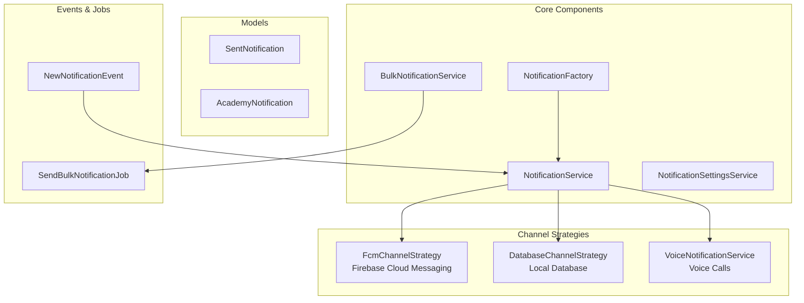

# Notifications Domain

**Path:** `backend/app/Domains/Notifications/`

The Notifications domain provides a comprehensive multi-channel notification system supporting FCM push notifications, database storage, and voice calls with a strategy pattern for channel selection.

## Overview



## Models

### SentNotification

**File:** `Notifications/Models/SentNotification.php`

```php
class SentNotification extends Model
{
    use HasUuids;
    
    protected $fillable = [
        'notifiable_type', 'notifiable_id',
        'type', 'title', 'body',
        'data', 'read_at',
        'voice_url', 'voice_duration',
        'scheduled_at', 'sent_at',
    ];
    
    protected $casts = [
        'data' => 'array',
        'read_at' => 'datetime',
        'scheduled_at' => 'datetime',
        'sent_at' => 'datetime',
    ];
    
    public function notifiable(): MorphTo
    {
        return $this->morphTo();
    }
}
```

**Database Table:** `sent_notifications`

| Column | Type | Description |
|--------|------|-------------|
| `id` | UUID | Primary key |
| `notifiable_type` | string | Recipient model type |
| `notifiable_id` | UUID | Recipient model ID |
| `type` | enum | Notification type |
| `title` | string | Notification title |
| `body` | text | Notification body |
| `data` | json | Additional data |
| `read_at` | timestamp | When read |
| `voice_url` | string | Voice file URL |
| `voice_duration` | int | Voice duration (seconds) |
| `scheduled_at` | timestamp | Scheduled time |
| `sent_at` | timestamp | Actual send time |

---

### AcademyNotification

**File:** `Notifications/Models/AcademyNotification.php`

```php
class AcademyNotification extends Model
{
    use HasUuids;
    
    protected $fillable = [
        'academy_id', 'type', 'title', 'body',
        'target_type', 'recipient_meta',
        'sent_by_type', 'sent_by_id',
        'scheduled_at', 'sent_at',
    ];
    
    protected $casts = [
        'recipient_meta' => 'array',
        'scheduled_at' => 'datetime',
        'sent_at' => 'datetime',
        'target_type' => NotificationTargetType::class,
    ];
    
    public function academy(): BelongsTo
    public function sender(): MorphTo
}
```

---

## Enums

### NotificationType

**File:** `Notifications/Enums/NotificationType.php`

```php
enum NotificationType: string
{
    case INFO    = 'info';
    case WARNING = 'warning';
    case SUCCESS = 'success';
    case DANGER  = 'danger';
    
    public function color(): string
    {
        return match($this) {
            self::INFO    => 'blue',
            self::WARNING => 'yellow',
            self::SUCCESS => 'green',
            self::DANGER  => 'red',
        };
    }
    
    public function icon(): string
    {
        return match($this) {
            self::INFO    => 'information-circle',
            self::WARNING => 'exclamation-triangle',
            self::SUCCESS => 'check-circle',
            self::DANGER  => 'x-circle',
        };
    }
}
```

---

### NotificationTargetType

**File:** `Notifications/Enums/NotificationTargetType.php`

```php
enum NotificationTargetType: string
{
    case ALL_STUDENTS    = 'all_students';
    case ALL_TEACHERS    = 'all_teachers';
    case SPECIFIC_GRADE  = 'specific_grade';
    case SPECIFIC_GROUP  = 'specific_group';
    case INDIVIDUAL      = 'individual';
    case ALL_ACADEMY     = 'all_academy';
}
```

---

### AnnouncementContentType

**File:** `Notifications/Enums/AnnouncementContentType.php`

```php
enum AnnouncementContentType: string
{
    case TEXT  = 'text';
    case IMAGE = 'image';
    case VIDEO = 'video';
    case FILE  = 'file';
}
```

---

## Services

### NotificationService

**File:** `Notifications/Services/NotificationService.php`

Central service for sending notifications through multiple channels.

```php
class NotificationService
{
    /**
     * Send notification to a single user
     */
    public function send(
        Authenticatable $user,
        Notification $notification,
        array $channels = ['database', 'fcm']
    ): void;
    
    /**
     * Send notification to multiple users
     */
    public function sendToMany(
        Collection $users,
        Notification $notification,
        array $channels = ['database', 'fcm']
    ): void;
    
    /**
     * Get notifications for user
     */
    public function getNotifications(
        Authenticatable $user,
        int $perPage = 15
    ): LengthAwarePaginator;
    
    /**
     * Mark notification as read
     */
    public function markAsRead(string $notificationId): void;
    
    /**
     * Mark all notifications as read
     */
    public function markAllAsRead(Authenticatable $user): void;
    
    /**
     * Delete notification
     */
    public function delete(string $notificationId): void;
    
    /**
     * Get unread count
     */
    public function getUnreadCount(Authenticatable $user): int;
}
```

---

### BulkNotificationService

**File:** `Notifications/Services/BulkNotificationService.php`

Handles bulk notification sending with batching.

```php
class BulkNotificationService
{
    /**
     * Send bulk notification to target audience
     */
    public function sendBulk(
        string $title,
        string $body,
        NotificationTargetType $targetType,
        array $targetIds = [],
        ?string $academyId = null,
        array $options = []
    ): int;
    
    /**
     * Queue bulk notification job
     */
    public function queueBulk(
        string $title,
        string $body,
        NotificationTargetType $targetType,
        array $targetIds = [],
        ?string $academyId = null
    ): void;
    
    /**
     * Get estimated recipient count
     */
    public function estimateRecipients(
        NotificationTargetType $targetType,
        array $targetIds = [],
        ?string $academyId = null
    ): int;
}
```

---

### NotificationSettingsService

**File:** `Notifications/Services/NotificationSettingsService.php`

Manages user notification preferences.

```php
class NotificationSettingsService
{
    /**
     * Get user notification settings
     */
    public function getSettings(Authenticatable $user): array;
    
    /**
     * Update user notification settings
     */
    public function updateSettings(Authenticatable $user, array $settings): void;
    
    /**
     * Check if channel is enabled for user
     */
    public function isChannelEnabled(Authenticatable $user, string $channel): bool;
    
    /**
     * Enable/disable channel for user
     */
    public function setChannelEnabled(Authenticatable $user, string $channel, bool $enabled): void;
}
```

---

### VoiceNotificationService

**File:** `Notifications/Services/VoiceNotificationService.php`

Handles voice call notifications.

```php
class VoiceNotificationService
{
    /**
     * Send voice notification
     */
    public function send(
        Authenticatable $user,
        string $message,
        array $options = []
    ): array;
    
    /**
     * Check daily voice limit
     */
    public function checkDailyLimit(Authenticatable $user): bool;
    
    /**
     * Get remaining voice quota
     */
    public function getRemainingQuota(Authenticatable $user): int;
    
    /**
     * Generate voice from text
     */
    public function textToSpeech(string $text): string;
}
```

---

## Channel Strategies

### NotificationChannelInterface

**File:** `Notifications/Contracts/NotificationChannelInterface.php`

```php
interface NotificationChannelInterface
{
    /**
     * Send notification through this channel
     */
    public function send(Authenticatable $user, Notification $notification): bool;
    
    /**
     * Get channel identifier
     */
    public function getChannelName(): string;
    
    /**
     * Check if channel is available
     */
    public function isAvailable(): bool;
}
```

---

### FcmChannelStrategy

**File:** `Notifications/Channels/FcmChannelStrategy.php`

Firebase Cloud Messaging implementation.

```php
class FcmChannelStrategy implements NotificationChannelInterface
{
    public function send(Authenticatable $user, Notification $notification): bool
    {
        $deviceTokens = $user->deviceTokens()
            ->where('is_active', true)
            ->pluck('device_token');
        
        if ($deviceTokens->isEmpty()) {
            return false;
        }
        
        $message = FcmMessage::create()
            ->setNotification(
                FcmNotification::create()
                    ->setTitle($notification->title)
                    ->setBody($notification->body)
            )
            ->setData($notification->data ?? []);
        
        return $this->messaging->sendMulticast($message, $deviceTokens->toArray());
    }
    
    public function getChannelName(): string
    {
        return 'fcm';
    }
    
    public function isAvailable(): bool
    {
        return config('services.firebase.project_id') !== null;
    }
}
```

---

### DatabaseChannelStrategy

**File:** `Notifications/Channels/DatabaseChannelStrategy.php`

Database storage implementation.

```php
class DatabaseChannelStrategy implements NotificationChannelInterface
{
    public function send(Authenticatable $user, Notification $notification): bool
    {
        SentNotification::create([
            'notifiable_type' => get_class($user),
            'notifiable_id' => $user->id,
            'type' => $notification->type ?? NotificationType::INFO,
            'title' => $notification->title,
            'body' => $notification->body,
            'data' => $notification->data ?? [],
            'sent_at' => now(),
        ]);
        
        return true;
    }
    
    public function getChannelName(): string
    {
        return 'database';
    }
    
    public function isAvailable(): bool
    {
        return true;
    }
}
```

---

## Factory

### NotificationFactory

**File:** `Notifications/Factories/NotificationFactory.php`

Creates notification instances based on type.

```php
class NotificationFactory
{
    /**
     * Create notification by type
     */
    public static function create(
        string $type,
        array $data = []
    ): Notification {
        return match($type) {
            'exam_result' => new ExamResultNotification($data),
            'exam_activated' => new ExamActivatedNotification($data),
            'video_published' => new VideoPublishedStudentNotification($data),
            'lecture_reminder' => new LectureReminderNotification($data),
            default => new GenericNotification($data),
        };
    }
    
    /**
     * Create from DTO
     */
    public static function createFromDto(NotificationData $dto): Notification
    {
        return static::create($dto->type, $dto->toArray());
    }
}
```

---

## DTOs

### NotificationData

**File:** `Notifications/DTOs/NotificationData.php`

```php
class NotificationData
{
    public function __construct(
        public string $type,
        public string $title,
        public string $body,
        public ?string $recipientType = null,
        public ?string $recipientId = null,
        public array $data = [],
        public ?string $voiceUrl = null,
        public ?int $voiceDuration = null,
    ) {}
    
    public static function fromArray(array $data): self
    {
        return new self(
            type: $data['type'],
            title: $data['title'],
            body: $data['body'],
            recipientType: $data['recipient_type'] ?? null,
            recipientId: $data['recipient_id'] ?? null,
            data: $data['data'] ?? [],
            voiceUrl: $data['voice_url'] ?? null,
            voiceDuration: $data['voice_duration'] ?? null,
        );
    }
}
```

---

## Events

### NewNotificationEvent

**File:** `Notifications/Events/NewNotificationEvent.php`

```php
class NewNotificationEvent implements ShouldBroadcast
{
    use Dispatchable, InteractsWithSockets, SerializesModels;
    
    public function __construct(
        public SentNotification $notification,
        public Authenticatable $recipient,
    ) {}
    
    public function broadcastOn(): Channel
    {
        return new PrivateChannel("notifications.{$this->recipient->id}");
    }
    
    public function broadcastWith(): array
    {
        return [
            'id' => $this->notification->id,
            'type' => $this->notification->type,
            'title' => $this->notification->title,
            'body' => $this->notification->body,
            'data' => $this->notification->data,
            'created_at' => $this->notification->created_at->toIso8601String(),
        ];
    }
}
```

---

## Listeners

### BroadcastNotificationSent

**File:** `Notifications/Listeners/BroadcastNotificationSent.php`

```php
class BroadcastNotificationSent
{
    public function handle(NewNotificationEvent $event): void
    {
        // Additional processing after broadcast
        // Log notification sent
        // Update analytics
    }
}
```

---

## Jobs

### SendBulkNotificationJob

**File:** `Notifications/Jobs/SendBulkNotificationJob.php`

```php
class SendBulkNotificationJob implements ShouldQueue
{
    use Dispatchable, InteractsWithQueue, Queueable, SerializesModels;
    
    public function __construct(
        public string $title,
        public string $body,
        public NotificationTargetType $targetType,
        public array $targetIds = [],
        public ?string $academyId = null,
        public array $options = [],
    ) {}
    
    public function handle(NotificationService $notificationService): void
    {
        $recipients = $this->getRecipients();
        
        // Process in chunks to avoid memory issues
        foreach ($recipients->chunk(100) as $chunk) {
            foreach ($chunk as $recipient) {
                $notificationService->send(
                    $recipient,
                    new GenericNotification([
                        'title' => $this->title,
                        'body' => $this->body,
                    ])
                );
            }
        }
    }
    
    private function getRecipients(): Collection
    {
        return match($this->targetType) {
            NotificationTargetType::ALL_STUDENTS => Student::query(),
            NotificationTargetType::ALL_TEACHERS => Teacher::query(),
            NotificationTargetType::SPECIFIC_GRADE => Student::whereIn('grade_id', $this->targetIds),
            NotificationTargetType::SPECIFIC_GROUP => Student::whereIn('group_id', $this->targetIds),
            NotificationTargetType::INDIVIDUAL => Student::whereIn('id', $this->targetIds),
            default => collect(),
        };
    }
}
```

---

## Support

### FirebaseCredentialsResolver

**File:** `Notifications/Support/FirebaseCredentialsResolver.php`

Resolves Firebase credentials from various sources.

```php
class FirebaseCredentialsResolver
{
    /**
     * Get Firebase credentials
     */
    public static function resolve(): array
    {
        // 1. Try Docker secret
        // 2. Try environment variable
        // 3. Try file path
        
        $path = config('services.firebase.credentials');
        
        if (file_exists($path)) {
            return json_decode(file_get_contents($path), true);
        }
        
        return [];
    }
}
```

---

## Resources

### NotificationResource

**File:** `Notifications/Resources/NotificationResource.php`

```php
class NotificationResource extends JsonResource
{
    public function toArray($request): array
    {
        return [
            'id' => $this->id,
            'type' => $this->type->value,
            'type_label' => $this->type->label(),
            'title' => $this->title,
            'body' => $this->body,
            'data' => $this->data,
            'read_at' => $this->read_at,
            'is_read' => $this->read_at !== null,
            'voice_url' => $this->voice_url,
            'voice_duration' => $this->voice_duration,
            'created_at' => $this->created_at,
            'created_at_human' => $this->created_at->diffForHumans(),
        ];
    }
}
```

---

### StudentNotificationResource

**File:** `Notifications/Resources/StudentNotificationResource.php`

Extended resource for student-specific notifications.

---

## Base Notification

### BaseNotification

**File:** `Notifications/BaseNotification.php`

```php
abstract class BaseNotification extends Notification
{
    public string $title;
    public string $body;
    public ?NotificationType $type = NotificationType::INFO;
    public array $data = [];
    
    /**
     * Get notification channels
     */
    public function via($notifiable): array
    {
        $channels = ['database'];
        
        if ($notifiable->deviceTokens()->exists()) {
            $channels[] = 'fcm';
        }
        
        return $channels;
    }
    
    /**
     * Get database representation
     */
    public function toDatabase($notifiable): array
    {
        return [
            'type' => $this->type->value,
            'title' => $this->title,
            'body' => $this->body,
            'data' => $this->data,
        ];
    }
    
    /**
     * Get FCM representation
     */
    public function toFcm($notifiable): FcmMessage
    {
        return FcmMessage::create()
            ->setNotification(
                FcmNotification::create()
                    ->setTitle($this->title)
                    ->setBody($this->body)
            )
            ->setData($this->data);
    }
}
```

---

## Usage Examples

### Sending a Simple Notification

```php
use App\Domains\Notifications\Services\NotificationService;

$notificationService = app(NotificationService::class);

$notificationService->send($student, new ExamResultNotification([
    'title' => 'نتيجة الامتحان',
    'body' => 'حصلت على 85% في امتحان الرياضيات',
    'data' => [
        'exam_id' => $exam->id,
        'score' => 85,
    ],
]));
```

### Sending Bulk Notifications

```php
use App\Domains\Notifications\Services\BulkNotificationService;
use App\Domains\Notifications\Enums\NotificationTargetType;

$bulkService = app(BulkNotificationService::class);

$bulkService->queueBulk(
    title: 'إعلان هام',
    body: 'سيتم تعطيل النظام للصيانة غداً',
    targetType: NotificationTargetType::ALL_STUDENTS,
    academyId: $academy->id,
);
```

### Sending Voice Notification

```php
use App\Domains\Notifications\Services\VoiceNotificationService;

$voiceService = app(VoiceNotificationService::class);

if ($voiceService->checkDailyLimit($teacher)) {
    $result = $voiceService->send($student, 'تذكر أن لديك امتحان غداً');
}
```

---

## References

- [`backend/app/Domains/Notifications/`](/backend/app/Domains/Notifications/) - Source code
- [Auth Domain](/backend/domains/auth) - Device tokens
- [Videos Domain](/backend/domains/videos) - Video notifications
- [Exams Domain](/backend/domains/exams) - Exam notifications

## Related Domains

- [Auth Domain](/backend/domains/auth) - Device token management
- [Videos Domain](/backend/domains/videos) - Video notifications
- [Exams Domain](/backend/domains/exams) - Exam notifications
- [Lectures Domain](/backend/domains/lectures) - Lecture reminders
