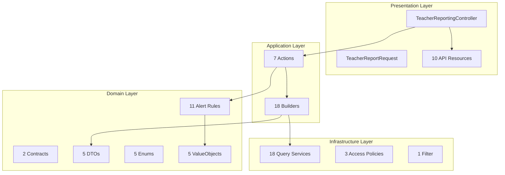

# Reporting Domain

**Path:** `backend/app/Domains/Reporting/`

The Reporting domain provides advanced analytics, KPI tracking, alert engine, and report builders. It follows a clean 4-layer architecture separating application logic, domain rules, infrastructure queries, and presentation.

> **Note:** This is different from the [Reports Domain](./reports) which handles PDF/Excel export. Reporting focuses on real-time analytics and dashboards.

## Overview



## Application Layer

### Actions

| Action | Purpose |
|--------|---------|
| `GenerateAdminReportAction` | Main admin report with KPIs, sections, alerts |
| `GenerateAdminDrilldownAction` | Drill-down data with pagination/sorting |
| `GenerateTeacherReportAction` | Teacher reports with various sections |
| `GenerateTeacherDrilldownAction` | Teacher drill-down data |
| `BuildReportContextAction` | Core context building for report filters |
| `BuildAcademyReportContextAction` | Academy-specific filter context |
| `ResolveComparisonContextAction` | Period comparison (PreviousPeriod, SamePeriodLastYear) |
| `ExportAdminReportAction` | Export with authorization checks |

### Builders

#### Academy Builders

| Builder | Output |
|---------|--------|
| `AcademySnapshotBuilder` | KPI cards for academy snapshots |
| `AttendanceQualityBuilder` | Attendance rate, by teacher/group, trends |
| `SessionExecutionBuilder` | Session execution summary |
| `StudentDistributionBuilder` | Distribution by grade, group, teacher |
| `SubscriptionUsageBuilder` | Subscription usage metrics |
| `TeacherPerformanceBuilder` | Teacher performance with sorting |
| `TimeComparisonBuilder` | Time comparison between periods |

#### Admin Builders

| Builder | Output |
|---------|--------|
| `AdminExecutiveSnapshotBuilder` | Executive KPI cards |
| `AdminEntityPerformanceBuilder` | Top growing/declining/near limit |
| `AdminExportBuilder` | Export payload with summary, breakdowns, rows |
| `AdminPlanBreakdownBuilder` | Subscription plan breakdown |
| `AdminRevenueTrendBuilder` | Revenue trends with time series |

#### Teacher Builders

| Builder | Output |
|---------|--------|
| `TeacherAttendanceBuilder` | Teacher attendance metrics |
| `TeacherGroupBreakdownBuilder` | Group-level metrics |
| `TeacherIncomeTrendBuilder` | Income trends with monthly buckets |
| `TeacherStudentActivityBuilder` | Student activity metrics |
| `TeacherSubscriptionBuilder` | Subscription details |
| `TeacherSummaryBuilder` | Summary KPI cards |

#### Shared Builders

| Builder | Purpose |
|---------|---------|
| `BreakdownBuilder` | Generic paginated breakdown with sorting |
| `SummaryBuilder` | KPI cards from metric definitions |

---

## Domain Layer

### Contracts

| Contract | Methods |
|----------|---------|
| `AlertRule` | `evaluate(context): ?AlertResult`, `isEnabled(): bool` |
| `ReportAccessPolicy` | `canView(user): bool`, `canDrilldown(user): bool`, `canExport(user): bool` |

### DTOs

| DTO | Key Properties |
|-----|---------------|
| `AlertResult` | key, severity, message, context, source, drilldown |
| `DrilldownDescriptor` | key, title, supported filters, table schema, default sort |
| `ExportPayload` | summary KPIs, breakdown data, detailed rows, filter metadata |
| `KpiCardResult` | key, title, current/baseline values, change%, direction, status, drilldown |
| `TrendMetricResult` | series, current/baseline values, change%, direction |

### Enums

| Enum | Values | Description |
|------|--------|-------------|
| `AlertSeverity` | Info, Warning, Critical | Alert priority levels with labels and colors |
| `ComparisonMode` | PreviousPeriod, SamePeriodLastYear | How to compare periods |
| `Direction` | Up, Down, Stable | Trend direction with labels and colors |
| `GranularityHint` | Day, Week, Month | Inferred from date ranges |
| `ReportingPeriodPreset` | Today, Last7Days, ThisMonth, LastMonth, Last3Months, ThisYear, CustomRange | Quick period selection |

### Alert Rules

#### Core Alert Engine

| Service | Purpose |
|---------|---------|
| `AlertEngine` | Evaluates all rules against context, sorted by severity |
| `TeacherAlertEngine` | Specialized engine for teacher-specific rules |
| `DrilldownRegistry` | Manages drill-down descriptors |
| `KpiCardFactory` | Creates KPI cards with trend calculations |
| `TrendCalculationService` | Calculates change % and direction with configurable thresholds |

#### Alert Rules

| Rule | Severity Thresholds |
|------|-------------------|
| `AttendanceDropRule` | >=20% drop = Critical, >=10% = Warning |
| `HighInactivityRule` | >=50% inactive students |
| `RevenueDropRule` | >=20% drop = Critical, >=10% = Warning |
| `StrongGrowthRule` | >=25% growth = Info |
| `UsageNearLimitRule` | >=90% = Critical, >=75% = Warning |
| `TeacherAttendanceDrop` | Teacher attendance decline |
| `TeacherIncomeDrop` | Teacher income decline |
| `TeacherIncomeConcentration` | Income concentrated in few students |
| `TeacherNearPlanLimit` | Approaching plan seat limit |
| `TeacherRenewalApproaching` | Subscription renewal upcoming |
| `TeacherStudentInactivity` | High student inactivity |

### ValueObjects

| ValueObject | Purpose |
|-------------|---------|
| `AcademyReportFilters` | Extends ReportFilters with teacher, grade, group, status filters |
| `ComparisonPeriod` | Start/end dates with comparison mode |
| `ReportFilters` | Base filter class with period, comparison, entity filters |
| `ReportingPeriod` | Time period with timezone, preset, granularity inference |
| `TeacherScope` | Teacher scope with optional academy/group filters |

---

## Infrastructure Layer

### Query Services

#### Academy Queries

| Query Service | Data |
|---------------|------|
| `AcademyAttendanceQueries` | Attendance rate by overall, teacher, group, trends |
| `AcademySessionQueries` | Session execution data (scheduled, delivered, canceled) |
| `AcademyStudentQueries` | Student metrics (total/active/inactive, by grade/group/teacher) |
| `AcademySubscriptionQueries` | Subscription details and usage percentages |
| `AcademyTeacherQueries` | Teacher metrics (total/active, student load, performance) |
| `AcademyAlertDataProvider` | Academy-specific alert data |

#### Admin Queries

| Query Service | Data |
|---------------|------|
| `AdminAcademySummaryQueryService` | Paginated academy summaries |
| `AdminEntityPerformanceQueryService` | Entity performance analysis |
| `AdminEntityQueryService` | Basic entity counts with baseline comparison |
| `AdminRevenueQueryService` | Revenue metrics, monthly series, by plan |
| `AdminStudentActivityQueryService` | Student activity metrics |
| `AdminSubscriptionQueryService` | Subscription metrics, plan distribution |
| `AdminTeacherSummaryQueryService` | Paginated teacher summaries |

#### Teacher Queries

| Query Service | Data |
|---------------|------|
| `TeacherAttendanceQueryService` | Teacher attendance metrics |
| `TeacherGroupQueryService` | Group-level metrics with income contribution |
| `TeacherIncomeQueryService` | Income metrics (current/period/YTD, monthly buckets) |
| `TeacherStudentQueryService` | Student metrics (total/active/inactive, trend) |
| `TeacherSubscriptionQueryService` | Subscription details and usage |

#### Shared Utilities

| Utility | Purpose |
|---------|---------|
| `SharedDateScope` | Date range filtering utilities |
| `SharedEntityScope` | Entity type filtering utilities |

### Access Policies

| Policy | Access Rule |
|--------|-----------|
| `AdminReportAccessPolicy` | Admin-only access |
| `DefaultReportAccessPolicy` | Open access (always true) |
| `TeacherReportAccessPolicy` | Active teachers only |

---

## Presentation Layer

### Controller

**File:** `Reporting/Presentation/Controllers/TeacherReportingController.php`

### Request Validation

**File:** `Reporting/Presentation/Requests/TeacherReportRequest.php`

Validates report filters with Arabic error messages.

### Resources

| Resource | Purpose |
|----------|---------|
| `AdminReportResource` | Complete admin report response |
| `AdminDrilldownResource` | Drill-down data response |
| `AdminExportResource` | Export data response |
| `AlertResource` | Alert data response |
| `AppliedFiltersResource` | Applied filter parameters |
| `EmptyReportResource` | Empty report placeholder |
| `KpiCardResource` | KPI card data response |
| `ReportErrorResource` | Error response |
| `TeacherReportResource` | Teacher report response |
| `TrendMetricResource` | Trend data response |

---

## API Endpoints

### Teacher Reports (v2 - Reporting Domain)

| Method | Path | Description |
|--------|------|-------------|
| GET | `/api/v1/teacher/reports/overview` | Teacher report overview with KPIs |
| GET | `/api/v1/teacher/reports/drilldown/{key}` | Drill-down into specific metric |

### Admin Reports

| Method | Path | Description |
|--------|------|-------------|
| GET | `/api/v1/admin/reports` | Admin comprehensive report |
| GET | `/api/v1/admin/reports/drilldown/{key}` | Admin drill-down data |
| GET | `/api/v1/admin/reports/export` | Export admin report |

### Academy Reports (Reporting Foundation)

| Method | Path | Description |
|--------|------|-------------|
| GET | `/api/v1/academy/reports/overview` | Academy overview |
| GET | `/api/v1/academy/reports/snapshot` | Academy KPI snapshot |
| GET | `/api/v1/academy/reports/student-distribution` | Student distribution |
| GET | `/api/v1/academy/reports/teacher-performance` | Teacher performance |
| GET | `/api/v1/academy/reports/attendance-quality` | Attendance quality metrics |
| GET | `/api/v1/academy/reports/session-execution` | Session execution summary |
| GET | `/api/v1/academy/reports/subscription-usage` | Subscription usage |
| GET | `/api/v1/academy/reports/time-comparison` | Time comparison metrics |
| GET | `/api/v1/academy/reports/alerts` | Active alerts |

---

## Usage Examples

### Generate Teacher Report

```php
use App\Domains\Reporting\Application\Actions\GenerateTeacherReportAction;

$action = app(GenerateTeacherReportAction::class);
$report = $action->execute(
    teacher: $teacher,
    filters: ReportFilters::fromRequest($request)
);

return new TeacherReportResource($report);
```

### Check Alerts

```php
use App\Domains\Reporting\Domain\Services\AlertEngine;

$alerts = app(AlertEngine::class)->evaluate($context);
// Returns collection of AlertResult sorted by severity
```

---

## References

- [`backend/app/Domains/Reporting/`](/backend/app/Domains/Reporting/) - Source code
- [Reports Domain](/backend/domains/reports) - PDF/Excel export
- [Auth Domain](/backend/domains/auth) - User models
- [Subscriptions Domain](/backend/domains/subscriptions) - Subscription data
- [Enrollments Domain](/backend/domains/enrollments) - Enrollment data
