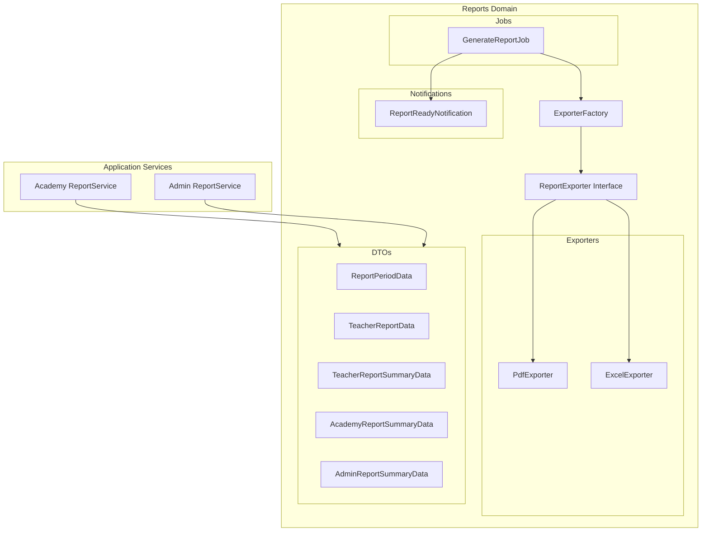
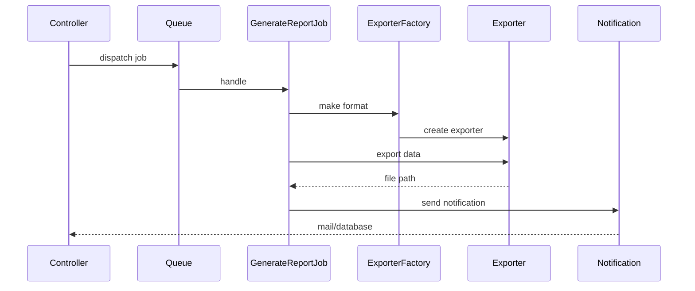

# Reports Domain

The Reports domain provides comprehensive reporting capabilities for the platform, including PDF and Excel exports, subscription analytics, and financial summaries for teachers, academies, and administrators.

## Overview

The Reports domain handles:
- **Report Generation**: Creating detailed reports for different user types
- **Export Formats**: PDF and Excel/CSV exports
- **Async Processing**: Background job processing for large reports
- **Notifications**: User notifications when reports are ready



## Directory Structure

```
backend/app/Domains/Reports/
├── ExporterFactory.php           # Factory for creating exporters
├── Contracts/
│   └── ReportExporter.php        # Exporter interface
├── DTOs/
│   ├── ReportPeriodData.php      # Period information
│   ├── TeacherReportData.php     # Teacher report container
│   ├── TeacherReportSummaryData.php
│   ├── AcademyReportSummaryData.php
│   └── AdminReportSummaryData.php
├── Exporters/
│   ├── PdfExporter.php           # PDF export using dompdf
│   └── ExcelExporter.php         # CSV/Excel export
├── Jobs/
│   └── GenerateReportJob.php     # Async report generation
└── Notifications/
    └── ReportReadyNotification.php
```

## Exporter Pattern

### ReportExporter Interface

All exporters implement the [`ReportExporter`](backend/app/Domains/Reports/Contracts/ReportExporter.php) interface:

```php
interface ReportExporter
{
    /**
     * Execute export and return file path or binary content
     *
     * @param array<string, mixed> $data
     * @param array<string, mixed> $options
     */
    public function export(array $data, array $options = []): string;

    /**
     * Get MIME type for this format
     */
    public function getMimeType(): string;

    /**
     * Get file extension
     */
    public function getExtension(): string;
}
```

### ExporterFactory

The [`ExporterFactory`](backend/app/Domains/Reports/ExporterFactory.php) creates the appropriate exporter:

```php
// Create exporter for specific format
$exporter = ExporterFactory::make('pdf');
$path = $exporter->export($data, ['title' => 'Student Report']);

// Get supported formats
$formats = ExporterFactory::supportedFormats();
// Returns: ['pdf', 'excel', 'csv']
```

#### Factory Methods

| Method | Parameters | Return | Description |
|--------|------------|--------|-------------|
| `make()` | `string $format` | `ReportExporter` | Create exporter instance |
| `supportedFormats()` | - | `array<string>` | Get list of supported formats |

## Exporters

### PdfExporter

Generates PDF reports using dompdf with Arabic support.

```php
$pdfExporter = new PdfExporter();

$path = $pdfExporter->export($data, [
    'view'        => 'reports.default',  // Blade template
    'title'       => 'تقرير الطلاب',
    'filename'    => 'student-report',
    'orientation' => 'portrait',         // portrait|landscape
]);
```

#### PDF Options

| Option | Type | Default | Description |
|--------|------|---------|-------------|
| `view` | string | `'reports.default'` | Blade template path |
| `title` | string | `'تقرير'` | Report title |
| `filename` | string | `'report'` | Output filename (without extension) |
| `orientation` | string | `'portrait'` | Page orientation |

### ExcelExporter

Exports data as CSV format compatible with Excel.

```php
$excelExporter = new ExcelExporter();

$path = $excelExporter->export($data, [
    'headers'  => ['Name', 'Email', 'Score'],
    'rows'     => $students,
    'filename' => 'students-export',
]);
```

#### Excel Options

| Option | Type | Default | Description |
|--------|------|---------|-------------|
| `headers` | array | Column keys from data | Column headers |
| `rows` | array | Data array | Data rows |
| `filename` | string | `'report'` | Output filename |

::: tip UTF-8 Support
The ExcelExporter automatically adds BOM for proper UTF-8 display in Excel.
:::

## DTOs

### ReportPeriodData

Represents a report period with start/end dates.

```php
$period = ReportPeriodData::fromArray([
    'start_date' => '2024-01-01',
    'end_date'   => '2024-12-31',
]);

// Properties
$period->startDate;      // Carbon instance
$period->endDate;        // Carbon instance
$period->durationMonths; // 12

// Convert to array
$period->toArray();
// ['start' => '2024-01-01', 'end' => '2024-12-31', 'duration_months' => 12]
```

### TeacherReportSummaryData

Summary statistics for teacher reports.

| Property | Type | Description |
|----------|------|-------------|
| `totalStudents` | int | Total enrolled students |
| `activeStudents` | int | Currently active students |
| `newEnrollments` | int | New enrollments in period |
| `totalSecretaries` | int | Associated secretaries |
| `confirmedPayments` | float | Total confirmed payments |
| `payingStudentsCount` | int | Students who paid |
| `pricePerStudent` | float | Price per student (60 EGP) |
| `subscriptionFee` | float | Platform subscription fee |

### AcademyReportSummaryData

Summary statistics for academy reports.

| Property | Type | Description |
|----------|------|-------------|
| `totalTeachers` | int | Total academy teachers |
| `activeTeachers` | int | Active teachers |
| `totalAcademyStudents` | int | Unique students |
| `totalEnrollments` | int | Total enrollments |
| `activeEnrollments` | int | Active enrollments |
| `totalSubscriptions` | int | Subscription months paid |
| `totalPaymentTransactions` | int | Payment count |
| `subscriptionFee` | float | Platform subscription fee |
| `confirmedPayments` | float | Confirmed payment total |
| `remainingBalance` | float | Remaining balance |
| `paymentStatus` | string | paid/partial/unpaid |
| `pricePerStudent` | float | Price per student (40 EGP) |

### AdminReportSummaryData

Platform-wide summary statistics for administrators.

| Property | Type | Description |
|----------|------|-------------|
| `totalAcademies` | int | Total academies |
| `independentTeachersCount` | int | Independent teachers |
| `totalTeachers` | int | All teachers |
| `activeTeachers` | int | Active teachers |
| `suspendedTeachers` | int | Suspended teachers |
| `newTeachers` | int | New in period |
| `totalStudents` | int | All students |
| `newStudents` | int | New in period |
| `totalSecretaries` | int | All secretaries |
| `totalEnrollments` | int | All enrollments |
| `activeEnrollments` | int | Active enrollments |
| `newEnrollments` | int | New in period |
| `totalSubscriptions` | int | Subscription months |
| `academySubscriptions` | int | Academy subscriptions |
| `independentSubscriptions` | int | Independent subscriptions |
| `totalSubscriptionFees` | float | Total fees |
| `confirmedPayments` | float | Confirmed total |
| `independentCommission` | float | Independent commission |
| `academyPlatformShare` | float | Academy share |
| `netPlatformProfit` | float | Net profit |
| `pricePerStudent` | float | Teacher price (60 EGP) |
| `academyStudentPrice` | float | Academy price (40 EGP) |

### TeacherReportData

Complete teacher report container.

```php
$report = new TeacherReportData(
    teacher: [...],               // Teacher information
    period: $periodData,          // ReportPeriodData
    summary: $summaryData,        // TeacherReportSummaryData
    financialDetails: [...],      // Financial breakdown
    monthlyBreakdown: [...],      // Monthly data
    subscriptionBreakdown: [...], // Subscription details
    generatedAt: '2024-01-15',    // Generation timestamp
);

$report->toArray(); // Full array representation
```

## Report Services

### Academy ReportService

Located at [`App\Domains\Application\Services\Academy\ReportService`](backend/app/Domains/Application/Services/Academy/ReportService.php).

#### Methods

| Method | Parameters | Return | Description |
|--------|------------|--------|-------------|
| `generateAttendanceReport()` | `Academy`, `dateFrom`, `dateTo`, `?teacherId` | `array` | Attendance logs with stats |
| `generateTeachersReport()` | `Academy` | `array` | All teachers summary |
| `generateMonthlyReport()` | `Academy`, `month`, `year` | `array` | Monthly financial report |
| `exportToPDF()` | `reportType`, `data` | `Response` | PDF download response |

#### Attendance Report

```php
$report = $reportService->generateAttendanceReport(
    academy: $academy,
    dateFrom: '2024-01-01',
    dateTo: '2024-01-31',
    teacherId: null  // Optional filter
);

// Returns:
// [
//     'academy' => ['id', 'name'],
//     'period' => ['from', 'to'],
//     'logs' => Collection<TeacherAttendanceLog>,
//     'stats' => ['present', 'absent', 'total', ...]
// ]
```

### Admin ReportService

Located at [`App\Domains\Application\Services\Admin\ReportService`](backend/app/Domains/Application/Services/Admin/ReportService.php).

#### Methods

| Method | Parameters | Return | Description |
|--------|------------|--------|-------------|
| `getTeachersList()` | - | `Collection` | Teachers for selection |
| `getAcademiesList()` | - | `Collection` | Academies for selection |
| `generatePdf()` | `report`, `type`, `title` | `string` | PDF binary content |
| `getTeacherReport()` | `Teacher`, `startDate`, `endDate` | `TeacherReportData` | Full teacher report |
| `getAcademyReport()` | `Academy`, `startDate`, `endDate` | `array` | Full academy report |

#### Teacher Report Generation

```php
$report = $reportService->getTeacherReport(
    teacher: $teacher,
    startDate: Carbon::parse('2024-01-01'),
    endDate: Carbon::parse('2024-12-31')
);

// Returns TeacherReportData with:
// - teacher info
// - period data
// - summary statistics
// - financial details
// - monthly breakdown
// - subscription breakdown
```

## GenerateReportJob

Async job for background report generation.

```php
use App\Domains\Reports\Jobs\GenerateReportJob;

GenerateReportJob::dispatch(
    format: 'pdf',
    reportType: 'exam_results',
    data: $reportData,
    options: ['title' => 'نتائج الامتحانات'],
    notifyUserId: $teacherId,
    notifyUserType: 'teacher'
);
```

### Job Properties

| Property | Type | Description |
|----------|------|-------------|
| `format` | string | Export format: pdf/excel/csv |
| `reportType` | string | Report type identifier |
| `data` | array | Report data |
| `options` | array | Export options |
| `notifyUserId` | ?string | User to notify |
| `notifyUserType` | ?string | User type: teacher/admin/academy |
| `tries` | int | Max attempts (2) |

### Flow



## ReportReadyNotification

Sent when async report generation completes.

### Channels

- **Mail**: Email with download link
- **Database**: In-app notification

### Report Type Labels

| Type | Arabic Label |
|------|-------------|
| `exam_results` | نتائج الامتحانات |
| `attendance` | سجل الحضور |
| `students` | قائمة الطلاب |
| `grades` | المستويات الدراسية |
| `payments` | سجل المدفوعات |
| default | التقارير |

## API Endpoints

### Teacher Endpoints

| Method | Endpoint | Description |
|--------|----------|-------------|
| GET | `/api/v1/teacher/reports/my-report` | Get teacher report data |
| GET | `/api/v1/teacher/reports/my-report/pdf` | Download PDF report |

### Academy Endpoints

| Method | Endpoint | Description |
|--------|----------|-------------|
| GET | `/api/v1/academy/reports/attendance` | Attendance report |
| GET | `/api/v1/academy/reports/teachers` | Teachers report |
| GET | `/api/v1/academy/reports/monthly` | Monthly financial report |
| GET | `/api/v1/academy/reports/export-pdf` | Export report as PDF |

## PDF Templates

### Available Templates

| Template | Path | Description |
|----------|------|-------------|
| Default | `reports.default` | Generic report template |
| Teacher Report | `pdf.teacher_report` | Detailed teacher report |
| Academy Monthly | `reports.academy.monthly` | Academy monthly summary |
| Academy Attendance | `reports.academy.attendance` | Attendance logs |
| Academy Teachers | `reports.academy.teachers` | Teachers overview |

### Template Features

All PDF templates support:
- **RTL Layout**: Right-to-left text direction
- **Arabic Fonts**: XB Riyaz, DejaVu Sans
- **Responsive Tables**: Styled data tables
- **Header/Footer**: Consistent branding
- **Charts**: Visual data representation

### Custom Template Usage

```php
$pdfExporter->export($data, [
    'view' => 'reports.custom-template',
    'title' => 'Custom Report',
]);
```

## Usage Examples

### Generate Teacher PDF Report

```php
use App\Domains\Application\Services\Admin\ReportService;
use Carbon\Carbon;

$reportService = app(ReportService::class);

$report = $reportService->getTeacherReport(
    teacher: $teacher,
    startDate: Carbon::now()->startOfYear(),
    endDate: Carbon::now()->endOfYear()
);

$pdfContent = $reportService->generatePdf(
    report: $report->toArray(),
    type: 'teacher',
    title: 'تقرير المدرس: ' . $teacher->name
);

return response($pdfContent)
    ->header('Content-Type', 'application/pdf')
    ->header('Content-Disposition', 'attachment; filename="teacher-report.pdf"');
```

### Export Academy Data to CSV

```php
use App\Domains\Reports\ExporterFactory;

$exporter = ExporterFactory::make('excel');

$path = $exporter->export([], [
    'headers' => ['Teacher', 'Students', 'Revenue'],
    'rows' => [
        ['Ahmed', 50, 3000],
        ['Sara', 35, 2100],
    ],
    'filename' => 'academy-teachers',
]);

return response()->download($path);
```

### Async Report Generation

```php
use App\Domains\Reports\Jobs\GenerateReportJob;

// Dispatch background job
GenerateReportJob::dispatch(
    format: 'pdf',
    reportType: 'attendance',
    data: $attendanceData,
    options: [
        'view' => 'reports.academy.attendance',
        'title' => 'تقرير الحضور الشهري',
    ],
    notifyUserId: $academy->id,
    notifyUserType: 'academy'
);
```

## Best Practices

### Performance

1. **Use Eager Loading**: Prevent N+1 queries when fetching related data
2. **Batch Queries**: Load all needed data before processing
3. **Queue Large Reports**: Use `GenerateReportJob` for reports with many records
4. **Cache Templates**: Blade templates are cached automatically

### Memory Management

```php
// For large datasets, chunk the data
PaymentLog::where('teacher_id', $teacherId)
    ->chunk(1000, function ($payments) use ($exporter) {
        // Process in batches
    });
```

### Error Handling

```php
try {
    $exporter = ExporterFactory::make($format);
    $path = $exporter->export($data, $options);
} catch (DomainException $e) {
    // Unsupported format
    Log::error('Export failed', ['error' => $e->getMessage()]);
    throw $e;
}
```

## Configuration

### PDF Settings

PDF generation uses dompdf configured in `config/dompdf.php`:

```php
return [
    'show_warnings' => false,
    'orientation' => 'portrait',
    'default_font' => 'xbriyaz',
    'enable_php' => false,
];
```

### Storage Path

Reports are stored in `storage/app/reports/`:

```php
// Ensure directory exists
if (!is_dir(storage_path('app/reports'))) {
    mkdir(storage_path('app/reports'), 0755, true);
}
```

## Related Documentation

- [Subscriptions Domain](./subscriptions.md) - Payment tracking
- [Enrollments Domain](./enrollments.md) - Student enrollment data
- [Auth Domain](./auth.md) - User models and roles
