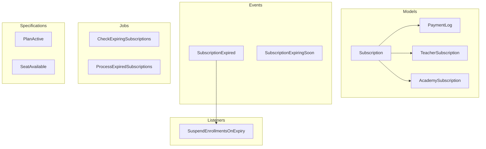

# Subscriptions Domain

**Path:** `backend/app/Domains/Subscriptions/`

The Subscriptions domain handles subscription lifecycle management, payment tracking, seat limits, and automatic enrollment suspension on expiry.

## Overview



## Enums

### SubscriptionStatus

**File:** `Subscriptions/Enums/SubscriptionStatus.php`

```php
enum SubscriptionStatus: string
{
    case ACTIVE    = 'active';
    case PENDING   = 'pending';
    case PARTIAL   = 'partial';
    case PAID      = 'paid';
    case EXPIRED   = 'expired';
    case CANCELLED = 'cancelled';
    
    public function label(): string
    {
        return match($this) {
            self::ACTIVE    => 'نشط',
            self::PENDING   => 'غير مدفوع',
            self::PARTIAL   => 'مدفوع جزئياً',
            self::PAID      => 'مدفوع',
            self::EXPIRED   => 'منتهي',
            self::CANCELLED => 'ملغي',
        };
    }
    
    public function color(): string
    {
        return match($this) {
            self::ACTIVE    => 'success',
            self::PENDING   => 'warning',
            self::PARTIAL   => 'info',
            self::PAID      => 'success',
            self::EXPIRED   => 'danger',
            self::CANCELLED => 'secondary',
        };
    }
}
```

| Case | Value | Arabic Label | Color |
|------|-------|--------------|-------|
| `ACTIVE` | `active` | نشط | success |
| `PENDING` | `pending` | غير مدفوع | warning |
| `PARTIAL` | `partial` | مدفوع جزئياً | info |
| `PAID` | `paid` | مدفوع | success |
| `EXPIRED` | `expired` | منتهي | danger |
| `CANCELLED` | `cancelled` | ملغي | secondary |

---

### PaymentMethod

**File:** `Subscriptions/Enums/PaymentMethod.php`

```php
enum PaymentMethod: string
{
    case ADMIN = 'admin';
    case CASH = 'cash';
    case BANK_TRANSFER = 'bank_transfer';
    case CARD = 'card';
}
```

---

### PaymentLogStatus

**File:** `Subscriptions/Enums/PaymentLogStatus.php`

```php
enum PaymentLogStatus: string
{
    case PENDING   = 'pending';
    case COMPLETED = 'completed';
    case CANCELLED = 'cancelled';
    case EXPIRED   = 'expired';
}
```

---

### PaymentPriceSource

**File:** `Subscriptions/Enums/PaymentPriceSource.php`

```php
enum PaymentPriceSource: string
{
    case MANUAL     = 'manual';
    case CALCULATED = 'calculated';
    case DISCOUNTED = 'discounted';
}
```

---

### PeriodType

**File:** `Subscriptions/Enums/PeriodType.php`

```php
enum PeriodType: string
{
    case MONTHLY   = 'monthly';
    case QUARTERLY = 'quarterly';
    case YEARLY    = 'yearly';
}
```

---

### SubscriptionType

**File:** `Subscriptions/Enums/SubscriptionType.php`

```php
enum SubscriptionType: string
{
    case TEACHER = 'teacher';
    case ACADEMY = 'academy';
}
```

---

### TeacherSubscriptionStatus

**File:** `Subscriptions/Enums/TeacherSubscriptionStatus.php`

```php
enum TeacherSubscriptionStatus: string
{
    case TRIAL     = 'trial';
    case ACTIVE    = 'active';
    case EXPIRED   = 'expired';
    case SUSPENDED = 'suspended';
}
```

---

## Events

### SubscriptionExpired

**File:** `Subscriptions/Events/SubscriptionExpired.php`

```php
class SubscriptionExpired
{
    public function __construct(
        public string $subscriptionId,
        public string $subscriberType,
        public string $subscriberId,
    ) {}
}
```

**Listeners:**
- `SuspendEnrollmentsOnExpiry` - Suspends all active enrollments

---

### SubscriptionExpiringSoon

**File:** `Subscriptions/Events/SubscriptionExpiringSoon.php`

```php
class SubscriptionExpiringSoon
{
    public function __construct(
        public string $subscriptionId,
        public string $subscriberType,
        public string $subscriberId,
        public int $daysUntilExpiry,
    ) {}
}
```

**Listeners:**
- Send notification to subscriber
- Send notification to admin

---

## Jobs

### CheckExpiringSubscriptions

**File:** `Subscriptions/Jobs/CheckExpiringSubscriptions.php`

Runs daily to check for subscriptions expiring soon.

```php
class CheckExpiringSubscriptions implements ShouldQueue
{
    public function handle(): void
    {
        // Find subscriptions expiring in next 7 days
        $expiringSoon = Subscription::whereBetween('expires_at', [now(), now()->addDays(7)])
            ->where('status', SubscriptionStatus::ACTIVE)
            ->get();
        
        foreach ($expiringSoon as $subscription) {
            event(new SubscriptionExpiringSoon(
                $subscription->id,
                $subscription->subscriber_type,
                $subscription->subscriber_id,
                now()->diffInDays($subscription->expires_at)
            ));
        }
    }
}
```

---

### ProcessExpiredSubscriptions

**File:** `Subscriptions/Jobs/ProcessExpiredSubscriptions.php`

Processes subscriptions that have expired.

```php
class ProcessExpiredSubscriptions implements ShouldQueue
{
    public function handle(): void
    {
        $expired = Subscription::where('expires_at', '<', now())
            ->whereIn('status', [SubscriptionStatus::ACTIVE, SubscriptionStatus::PENDING])
            ->get();
        
        foreach ($expired as $subscription) {
            $subscription->update(['status' => SubscriptionStatus::EXPIRED]);
            
            event(new SubscriptionExpired(
                $subscription->id,
                $subscription->subscriber_type,
                $subscription->subscriber_id
            ));
        }
    }
}
```

---

## Specifications

### PlanActive

**File:** `Subscriptions/Specifications/PlanActive.php`

Business rule specification for checking if subscription plan is active.

```php
class PlanActive
{
    public function isSatisfied(Subscription $subscription): bool
    {
        return in_array($subscription->status, [
            SubscriptionStatus::ACTIVE,
            SubscriptionStatus::PAID,
        ]);
    }
}
```

---

### SeatAvailable

**File:** `Subscriptions/Specifications/SeatAvailable.php`

Checks if seat is available for new enrollment.

```php
class SeatAvailable
{
    public function isSatisfied(Subscription $subscription): bool
    {
        $usedSeats = Enrollment::where('teacher_id', $subscription->subscriber_id)
            ->where('is_active', true)
            ->count();
        
        return $usedSeats < $subscription->max_seats;
    }
}
```

---

## Listeners

### SuspendEnrollmentsOnExpiry

**File:** `Subscriptions/Listeners/SuspendEnrollmentsOnExpiry.php`

```php
class SuspendEnrollmentsOnExpiry
{
    public function handle(SubscriptionExpired $event): void
    {
        if ($event->subscriberType === 'teacher') {
            Enrollment::where('teacher_id', $event->subscriberId)
                ->where('is_active', true)
                ->update([
                    'is_active' => false,
                    'status' => EnrollmentStatus::BLOCKED_BY_PLAN,
                ]);
        }
    }
}
```

---

## DTOs

### PaymentData

**File:** `Subscriptions/DTOs/PaymentData.php`

```php
class PaymentData
{
    public function __construct(
        public float $amount,
        public string $subscriptionId,
        public PaymentMethod $method,
        public ?string $reference = null,
        public ?array $metadata = null,
    ) {}
}
```

---

### TeacherPaymentData

**File:** `Subscriptions/DTOs/TeacherPaymentData.php`

```php
class TeacherPaymentData
{
    public function __construct(
        public string $teacherId,
        public float $amount,
        public PeriodType $periodType,
        public ?string $planName = null,
        public ?float $discount = null,
    ) {}
}
```

---

## Exceptions

### QuotaExceededException

**File:** `Subscriptions/Exceptions/QuotaExceededException.php`

Thrown when subscription quota is exceeded.

```php
class QuotaExceededException extends DomainException
{
    public function __construct(string $message = 'Subscription quota exceeded')
    {
        parent::__construct($message);
    }
}
```

---

## Usage Examples

### Checking Subscription Status

```php
use App\Domains\Subscriptions\Specifications\PlanActive;

$isPlanActive = (new PlanActive())->isSatisfied($subscription);

if (!$isPlanActive) {
    throw new QuotaExceededException('Subscription is not active');
}
```

### Checking Seat Availability

```php
use App\Domains\Subscriptions\Specifications\SeatAvailable;

$hasSeat = (new SeatAvailable())->isSatisfied($subscription);

if (!$hasSeat) {
    throw new QuotaExceededException('No seats available in subscription');
}
```

### Processing Payment

```php
use App\Domains\Subscriptions\DTOs\PaymentData;
use App\Domains\Subscriptions\Enums\PaymentMethod;

$paymentData = new PaymentData(
    amount: 100.00,
    subscriptionId: $subscription->id,
    method: PaymentMethod::CASH,
);

// Create payment log
PaymentLog::create([
    'subscription_id' => $paymentData->subscriptionId,
    'amount' => $paymentData->amount,
    'method' => $paymentData->method,
    'status' => PaymentLogStatus::COMPLETED,
]);
```

---

## Database Tables

### subscriptions

| Column | Type | Description |
|--------|------|-------------|
| `id` | UUID | Primary key |
| `subscriber_type` | string | Polymorphic type |
| `subscriber_id` | UUID | Polymorphic ID |
| `plan_name` | string | Plan name |
| `status` | enum | Subscription status |
| `amount` | decimal | Total amount |
| `paid_amount` | decimal | Amount paid |
| `max_seats` | int | Maximum seats |
| `starts_at` | timestamp | Start date |
| `expires_at` | timestamp | Expiry date |
| `period_type` | enum | Period type |

---

### teacher_subscriptions

| Column | Type | Description |
|--------|------|-------------|
| `id` | UUID | Primary key |
| `teacher_id` | UUID | FK to teachers |
| `plan_name` | string | Plan name |
| `status` | enum | Status |
| `max_students` | int | Max students |
| `starts_at` | timestamp | Start date |
| `expires_at` | timestamp | Expiry date |

---

### academy_subscriptions

| Column | Type | Description |
|--------|------|-------------|
| `id` | UUID | Primary key |
| `academy_id` | UUID | FK to academies |
| `plan_name` | string | Plan name |
| `status` | enum | Status |
| `max_teachers` | int | Max teachers |
| `max_students` | int | Max students |
| `starts_at` | timestamp | Start date |
| `expires_at` | timestamp | Expiry date |

---

### payment_logs

| Column | Type | Description |
|--------|------|-------------|
| `id` | UUID | Primary key |
| `subscription_id` | UUID | FK to subscriptions |
| `amount` | decimal | Payment amount |
| `method` | enum | Payment method |
| `status` | enum | Payment status |
| `reference` | string | Payment reference |
| `paid_at` | timestamp | Payment date |

---

## References

- [`backend/app/Domains/Subscriptions/`](/backend/app/Domains/Subscriptions/) - Source code
- [Enrollments Domain](/backend/domains/enrollments) - Enrollment management
- [Auth Domain](/backend/domains/auth) - Teacher/Academy models

## Related Domains

- [Auth Domain](/backend/domains/auth) - Teacher and Academy models
- [Enrollments Domain](/backend/domains/enrollments) - Enrollment suspension
- [Notifications Domain](/backend/domains/notifications) - Subscription notifications
