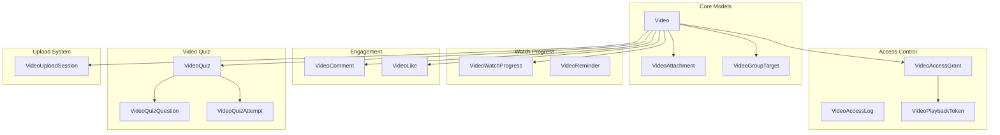

# Videos Domain

**Path:** `backend/app/Domains/Videos/`

The Videos domain provides comprehensive video management including upload processing, access control, streaming with playback tokens, video quizzes, comments, likes, and watch progress tracking.

## Overview



## Models

### Video

**File:** `Videos/Models/Video.php`

```php
class Video extends Model
{
    use HasUuids, SoftDeletes;
    
    protected $fillable = [
        'owner_type', 'owner_id',
        'uploader_type', 'uploader_id',
        'teacher_reference_id', 'teacher_reference_name',
        'academy_id', 'grade_id', 'lecture_id',
        'title', 'description',
        'status', 'processing_status',
        'scheduled_at', 'published_at',
        'available_from', 'available_until',
        'original_path', 'processed_path', 'thumbnail_path',
        'video_mime', 'video_size_bytes',
        'duration_seconds', 'width', 'height',
        'codec', 'frame_rate',
    ];
    
    protected $casts = [
        'status' => VideoStatus::class,
        'processing_status' => VideoProcessingStatus::class,
        'scheduled_at' => 'datetime',
        'published_at' => 'datetime',
        'available_from' => 'datetime',
        'available_until' => 'datetime',
    ];
    
    // Relationships
    public function owner(): MorphTo
    public function uploader(): MorphTo
    public function teacherReference(): BelongsTo
    public function academy(): BelongsTo
    public function grade(): BelongsTo
    public function lecture(): BelongsTo
    public function groupTargets(): HasMany
    public function attachments(): HasMany
    public function accessGrants(): HasMany
    public function watchProgress(): HasMany
    public function comments(): HasMany
    public function likes(): HasMany
    public function quiz(): HasOne
    public function reminders(): HasMany
    public function playbackTokens(): HasMany
}
```

**Database Table:** `videos`

| Column | Type | Description |
|--------|------|-------------|
| `id` | UUID | Primary key |
| `owner_type` | string | Polymorphic owner type |
| `owner_id` | UUID | Polymorphic owner ID |
| `uploader_type` | string | Who uploaded |
| `uploader_id` | UUID | Uploader ID |
| `teacher_reference_id` | UUID | FK to teachers |
| `academy_id` | UUID | FK to academies |
| `grade_id` | UUID | FK to grades |
| `lecture_id` | UUID | FK to lectures (nullable) |
| `title` | string | Video title |
| `description` | text | Video description |
| `status` | enum | Video status |
| `processing_status` | enum | Processing state |
| `scheduled_at` | timestamp | Scheduled publish |
| `published_at` | timestamp | When published |
| `available_from` | timestamp | Availability start |
| `available_until` | timestamp | Availability end |
| `original_path` | string | R2 original path |
| `processed_path` | string | R2 processed path |
| `thumbnail_path` | string | R2 thumbnail path |
| `video_mime` | string | MIME type |
| `video_size_bytes` | bigint | File size |
| `duration_seconds` | int | Video length |
| `width` | int | Video width |
| `height` | int | Video height |
| `codec` | string | Video codec |
| `frame_rate` | decimal | FPS |

---

### VideoGroupTarget

**File:** `Videos/Models/VideoGroupTarget.php`

Links videos to specific student groups.

```php
class VideoGroupTarget extends Model
{
    use HasUuids;
    
    protected $fillable = ['video_id', 'group_id'];
    
    public function video(): BelongsTo
    public function group(): BelongsTo
}
```

---

### VideoAttachment

**File:** `Videos/Models/VideoAttachment.php`

Files attached to videos (PDFs, documents, etc.).

```php
class VideoAttachment extends Model
{
    use HasUuids;
    
    protected $fillable = [
        'video_id', 'title', 'file_name',
        'file_path', 'mime_type', 'file_size',
        'uploaded_by_type', 'uploaded_by_id',
    ];
    
    public function video(): BelongsTo
    public function uploader(): MorphTo
}
```

---

### VideoAccessGrant

**File:** `Videos/Models/VideoAccessGrant.php`

Grants video access to specific students.

```php
class VideoAccessGrant extends Model
{
    use HasUuids;
    
    protected $fillable = [
        'video_id', 'student_id', 'teacher_id',
        'enrollment_id', 'granted_group_id',
        'granted_at', 'revoked_at', 'revoked_reason',
        'eligibility_snapshot',
    ];
    
    protected $casts = [
        'granted_at' => 'datetime',
        'revoked_at' => 'datetime',
        'eligibility_snapshot' => 'array',
    ];
    
    public function video(): BelongsTo
    public function student(): BelongsTo
    public function teacher(): BelongsTo
    public function enrollment(): BelongsTo
    public function grantedGroup(): BelongsTo
}
```

---

### VideoPlaybackToken

**File:** `Videos/Models/VideoPlaybackToken.php`

Secure tokens for video streaming.

```php
class VideoPlaybackToken extends Model
{
    use HasUuids;
    
    protected $fillable = [
        'video_id', 'student_id',
        'device_fingerprint', 'session_identifier',
        'user_agent_hash', 'ip_address',
        'token_hash', 'expires_at', 'issued_at',
        'last_used_at', 'revoked_at', 'revoked_reason',
    ];
    
    protected $casts = [
        'expires_at' => 'datetime',
        'issued_at' => 'datetime',
        'last_used_at' => 'datetime',
        'revoked_at' => 'datetime',
    ];
    
    public function video(): BelongsTo
    public function student(): BelongsTo
}
```

---

### VideoWatchProgress

**File:** `Videos/Models/VideoWatchProgress.php`

Tracks student watch progress.

```php
class VideoWatchProgress extends Model
{
    use HasUuids;
    
    protected $fillable = [
        'video_id', 'student_id', 'status',
        'started_at', 'last_watched_at', 'completed_at',
        'watched_seconds', 'watched_percentage',
        'last_position_seconds', 'last_playback_token_id',
    ];
    
    protected $casts = [
        'started_at' => 'datetime',
        'last_watched_at' => 'datetime',
        'completed_at' => 'datetime',
        'watched_percentage' => 'decimal:2',
        'status' => VideoWatchStatus::class,
    ];
    
    public function video(): BelongsTo
    public function student(): BelongsTo
}
```

---

### VideoComment

**File:** `Videos/Models/VideoComment.php`

```php
class VideoComment extends Model
{
    use HasUuids, SoftDeletes;
    
    protected $fillable = [
        'video_id', 'parent_id',
        'author_type', 'author_id',
        'body', 'is_hidden',
        'hidden_by_type', 'hidden_by_id', 'hidden_at',
    ];
    
    protected $casts = [
        'is_hidden' => 'boolean',
        'hidden_at' => 'datetime',
    ];
    
    public function video(): BelongsTo
    public function parent(): BelongsTo
    public function replies(): HasMany
    public function author(): MorphTo
}
```

---

### VideoLike

**File:** `Videos/Models/VideoLike.php`

```php
class VideoLike extends Model
{
    use HasUuids;
    
    protected $fillable = ['video_id', 'student_id'];
    
    public function video(): BelongsTo
    public function student(): BelongsTo
}
```

---

### VideoReminder

**File:** `Videos/Models/VideoReminder.php`

Reminds students to watch videos.

```php
class VideoReminder extends Model
{
    use HasUuids;
    
    protected $fillable = [
        'video_id', 'student_id', 'guardian_id',
        'attempts', 'next_reminder_at', 'last_reminded_at',
        'stopped_at', 'stop_reason',
    ];
    
    protected $casts = [
        'next_reminder_at' => 'datetime',
        'last_reminded_at' => 'datetime',
        'stopped_at' => 'datetime',
    ];
}
```

---

### VideoAccessLog

**File:** `Videos/Models/VideoAccessLog.php`

Logs all video access attempts.

```php
class VideoAccessLog extends Model
{
    protected $fillable = [
        'video_id', 'student_id', 'action', 'result',
        'reason', 'device_fingerprint', 'session_identifier',
        'user_agent_hash', 'ip_address', 'meta',
    ];
    
    protected $casts = [
        'meta' => 'array',
    ];
}
```

---

### VideoUploadSession

**File:** `Videos/Models/VideoUploadSession.php`

Tracks multipart upload sessions.

```php
class VideoUploadSession extends Model
{
    use HasUuids;
    
    protected $fillable = [
        'video_id', 'uploader_type', 'uploader_id',
        'multipart_upload_id', 'r2_key',
        'status', 'total_parts', 'uploaded_parts',
        'file_size', 'expires_at',
    ];
    
    protected $casts = [
        'uploaded_parts' => 'array',
        'expires_at' => 'datetime',
        'status' => VideoUploadSessionStatus::class,
    ];
}
```

---

### VideoQuiz

**File:** `Videos/Models/VideoQuiz.php`

```php
class VideoQuiz extends Model
{
    use HasUuids;
    
    protected $fillable = [
        'video_id', 'title', 'description',
        'passing_score', 'max_attempts',
        'shuffle_questions',
    ];
    
    public function video(): BelongsTo
    public function questions(): HasMany
    public function attempts(): HasMany
}
```

---

### VideoQuizQuestion

**File:** `Videos/Models/VideoQuizQuestion.php`

```php
class VideoQuizQuestion extends Model
{
    use HasUuids;
    
    protected $fillable = [
        'video_quiz_id', 'question_text',
        'options', 'correct_answer',
        'points', 'order',
    ];
    
    protected $casts = [
        'options' => 'array',
        'correct_answer' => 'array',
    ];
}
```

---

### VideoQuizAttempt

**File:** `Videos/Models/VideoQuizAttempt.php`

```php
class VideoQuizAttempt extends Model
{
    use HasUuids;
    
    protected $fillable = [
        'video_quiz_id', 'student_id',
        'answers', 'score', 'is_passed',
        'attempt_number', 'completed_at',
    ];
    
    protected $casts = [
        'answers' => 'array',
        'completed_at' => 'datetime',
    ];
}
```

---

## Enums

### VideoStatus

**File:** `Videos/Enums/VideoStatus.php`

```php
enum VideoStatus: string
{
    case DRAFT      = 'draft';
    case UPLOADING  = 'uploading';
    case UPLOADED   = 'uploaded';
    case PROCESSING = 'processing';
    case READY      = 'ready';
    case SCHEDULED  = 'scheduled';
    case PUBLISHED  = 'published';
    case FAILED     = 'failed';
    case DELETED    = 'deleted';
    
    public function label(): string
    {
        return match($this) {
            self::DRAFT      => 'مسودة',
            self::UPLOADING  => 'جاري الرفع',
            self::UPLOADED   => 'تم الرفع',
            self::PROCESSING => 'جاري المعالجة',
            self::READY      => 'جاهز',
            self::SCHEDULED  => 'مجدول',
            self::PUBLISHED  => 'منشور',
            self::FAILED     => 'فشل',
            self::DELETED    => 'محذوف',
        };
    }
    
    public function isAccessible(): bool
    {
        return $this === self::PUBLISHED;
    }
}
```

| Case | Value | Arabic Label | Accessible |
|------|-------|--------------|------------|
| `DRAFT` | `draft` | مسودة | ❌ |
| `UPLOADING` | `uploading` | جاري الرفع | ❌ |
| `UPLOADED` | `uploaded` | تم الرفع | ❌ |
| `PROCESSING` | `processing` | جاري المعالجة | ❌ |
| `READY` | `ready` | جاهز | ❌ |
| `SCHEDULED` | `scheduled` | مجدول | ❌ |
| `PUBLISHED` | `published` | منشور | ✅ |
| `FAILED` | `failed` | فشل | ❌ |
| `DELETED` | `deleted` | محذوف | ❌ |

---

### VideoProcessingStatus

**File:** `Videos/Enums/VideoProcessingStatus.php`

```php
enum VideoProcessingStatus: string
{
    case PENDING     = 'pending';
    case TRANSCODING = 'transcoding';
    case THUMBNAIL   = 'thumbnail';
    case COMPLETED   = 'completed';
    case FAILED      = 'failed';
}
```

---

### VideoOwnerType

**File:** `Videos/Enums/VideoOwnerType.php`

```php
enum VideoOwnerType: string
{
    case TEACHER = 'teacher';
    case ACADEMY = 'academy';
}
```

---

### VideoUploadSessionStatus

**File:** `Videos/Enums/VideoUploadSessionStatus.php`

```php
enum VideoUploadSessionStatus: string
{
    case PENDING   = 'pending';
    case UPLOADING = 'uploading';
    case COMPLETED = 'completed';
    case ABORTED   = 'aborted';
    case EXPIRED   = 'expired';
}
```

---

### VideoWatchStatus

**File:** `Videos/Enums/VideoWatchStatus.php`

```php
enum VideoWatchStatus: string
{
    case NOT_STARTED = 'not_started';
    case IN_PROGRESS = 'in_progress';
    case COMPLETED   = 'completed';
}
```

---

## Services

### VideoAccessGrantService

**File:** `Videos/Services/VideoAccessGrantService.php`

Manages video access grants for students.

```php
class VideoAccessGrantService
{
    /**
     * Grant access to all eligible students for a video
     */
    public function grantAccessToGroups(Video $video, array $groupIds): int
    {
        $granted = 0;
        
        foreach ($groupIds as $groupId) {
            $group = Group::find($groupId);
            
            foreach ($group->activeStudents as $student) {
                $this->grantAccess($video, $student);
                $granted++;
            }
        }
        
        return $granted;
    }
    
    /**
     * Grant access to a specific student
     */
    public function grantAccess(Video $video, Student $student): VideoAccessGrant
    {
        return VideoAccessGrant::updateOrCreate(
            [
                'video_id' => $video->id,
                'student_id' => $student->id,
            ],
            [
                'teacher_id' => $video->teacher_reference_id,
                'granted_at' => now(),
                'revoked_at' => null,
            ]
        );
    }
    
    /**
     * Revoke access for a student
     */
    public function revokeAccess(Video $video, Student $student, string $reason): void
    {
        VideoAccessGrant::where([
            'video_id' => $video->id,
            'student_id' => $student->id,
        ])->update([
            'revoked_at' => now(),
            'revoked_reason' => $reason,
        ]);
    }
}
```

---

### VideoAccessLoggerService

**File:** `Videos/Services/VideoAccessLoggerService.php`

Logs video access attempts.

```php
class VideoAccessLoggerService
{
    public function logAccess(
        Video $video,
        ?Student $student,
        string $action,
        string $result,
        ?string $reason = null,
        array $meta = []
    ): VideoAccessLog {
        return VideoAccessLog::create([
            'video_id' => $video->id,
            'student_id' => $student?->id,
            'action' => $action,
            'result' => $result,
            'reason' => $reason,
            'device_fingerprint' => request()->fingerprint(),
            'session_identifier' => session()->getId(),
            'user_agent_hash' => hash('sha256', request()->userAgent()),
            'ip_address' => request()->ip(),
            'meta' => $meta,
        ]);
    }
}
```

---

### R2MultipartService

**File:** `Videos/Services/R2MultipartService.php`

Handles multipart uploads to Cloudflare R2.

```php
class R2MultipartService
{
    /**
     * Initiate a multipart upload
     */
    public function initiateUpload(string $key): string
    {
        return $this->s3Client->createMultipartUpload([
            'Bucket' => config('filesystems.disks.r2.bucket'),
            'Key' => $key,
        ])->get('UploadId');
    }
    
    /**
     * Get presigned URL for a part
     */
    public function getPartUploadUrl(string $key, string $uploadId, int $partNumber): string
    {
        // Returns presigned URL for direct browser upload
    }
    
    /**
     * Complete multipart upload
     */
    public function completeUpload(string $key, string $uploadId, array $parts): void
    {
        // Combines all parts into final object
    }
    
    /**
     * Abort multipart upload
     */
    public function abortUpload(string $key, string $uploadId): void
    {
        // Cancels upload and cleans up parts
    }
}
```

---

## Jobs

### ProcessUploadedVideoJob

**File:** `Videos/Jobs/ProcessUploadedVideoJob.php`

Processes uploaded videos (transcoding, thumbnail generation).

```php
class ProcessUploadedVideoJob implements ShouldQueue
{
    use Dispatchable, InteractsWithQueue, Queueable, SerializesModels;
    
    public function __construct(
        public string $videoId,
    ) {}
    
    public function handle(): void
    {
        $video = Video::find($this->videoId);
        
        // 1. Transcode video
        // 2. Generate thumbnail
        // 3. Extract metadata
        // 4. Update video status
    }
}
```

---

### PublishScheduledVideoJob

**File:** `Videos/Jobs/PublishScheduledVideoJob.php`

Publishes videos at scheduled time.

```php
class PublishScheduledVideoJob implements ShouldQueue
{
    public function __construct(
        public string $videoId,
    ) {}
    
    public function handle(): void
    {
        $video = Video::find($this->videoId);
        
        if ($video->status === VideoStatus::SCHEDULED) {
            $video->update([
                'status' => VideoStatus::PUBLISHED,
                'published_at' => now(),
            ]);
            
            // Grant access to target groups
            app(VideoAccessGrantService::class)
                ->grantAccessToGroups($video, $video->groupTargets->pluck('group_id'));
            
            // Send notifications
        }
    }
}
```

---

### RevokeExpiredVideoPlaybackTokensJob

**File:** `Videos/Jobs/RevokeExpiredVideoPlaybackTokensJob.php`

Cleans up expired playback tokens.

```php
class RevokeExpiredVideoPlaybackTokensJob implements ShouldQueue
{
    public function handle(): void
    {
        VideoPlaybackToken::where('expires_at', '<', now())
            ->whereNull('revoked_at')
            ->update([
                'revoked_at' => now(),
                'revoked_reason' => 'expired',
            ]);
    }
}
```

---

### ProcessDueVideoRemindersJob

**File:** `Videos/Jobs/ProcessDueVideoRemindersJob.php`

Sends video watch reminders.

---

## Policies

### VideoPolicy

**File:** `Videos/Policies/VideoPolicy.php`

```php
class VideoPolicy
{
    public function view(User $user, Video $video): bool
    public function create(User $user): bool
    public function update(User $user, Video $video): bool
    public function delete(User $user, Video $video): bool
    public function stream(User $user, Video $video): bool
    public function comment(User $user, Video $video): bool
    public function like(User $user, Video $video): bool
}
```

| Method | Teacher | Student |
|--------|---------|---------|
| `view` | ✅ (owning) | ✅ (has access) |
| `create` | ✅ | ❌ |
| `update` | ✅ (owning) | ❌ |
| `delete` | ✅ (owning) | ❌ |
| `stream` | ✅ (owning) | ✅ (has access + valid token) |
| `comment` | ❌ | ✅ (has access) |
| `like` | ❌ | ✅ (has access) |

---

## DTOs

### CreateVideoData

**File:** `Videos/DTOs/CreateVideoData.php`

```php
class CreateVideoData
{
    public function __construct(
        public string $title,
        public ?string $description = null,
        public string $ownerType,
        public string $ownerId,
        public string $gradeId,
        public ?string $lectureId = null,
        public ?string $academyId = null,
        public ?string $teacherReferenceId = null,
        public array $groupIds = [],
        public ?Carbon $scheduledAt = null,
        public ?Carbon $availableFrom = null,
        public ?Carbon $availableUntil = null,
    ) {}
}
```

---

### UpdateVideoData

**File:** `Videos/DTOs/UpdateVideoData.php`

```php
class UpdateVideoData
{
    public function __construct(
        public ?string $title = null,
        public ?string $description = null,
        public ?array $groupIds = null,
        public ?Carbon $scheduledAt = null,
        public ?Carbon $availableFrom = null,
        public ?Carbon $availableUntil = null,
    ) {}
}
```

---

### VideoActorContext

**File:** `Videos/DTOs/VideoActorContext.php`

```php
class VideoActorContext
{
    public function __construct(
        public string $actorType,
        public string $actorId,
        public ?string $academyId = null,
    ) {}
}
```

---

## Resources

### VideoResource

**File:** `Videos/Resources/VideoResource.php`

```php
class VideoResource extends JsonResource
{
    public function toArray($request): array
    {
        return [
            'id' => $this->id,
            'title' => $this->title,
            'description' => $this->description,
            'status' => $this->status->value,
            'status_label' => $this->status->label(),
            'duration_seconds' => $this->duration_seconds,
            'duration_formatted' => $this->duration_formatted,
            'thumbnail_url' => $this->thumbnail_url,
            'published_at' => $this->published_at,
            'views_count' => $this->views_count,
            'likes_count' => $this->likes_count,
            'comments_count' => $this->comments_count,
            'has_quiz' => $this->quiz()->exists(),
            'grade' => new GradeResource($this->whenLoaded('grade')),
            'group_targets' => GroupResource::collection($this->whenLoaded('groupTargets')),
            'attachments' => VideoAttachmentResource::collection($this->whenLoaded('attachments')),
        ];
    }
}
```

---

### VideoAttachmentResource

**File:** `Videos/Resources/VideoAttachmentResource.php`

---

### VideoCommentResource

**File:** `Videos/Resources/VideoCommentResource.php`

---

### VideoWatchProgressResource

**File:** `Videos/Resources/VideoWatchProgressResource.php`

---

## Notifications

### VideoPublishedStudentNotification

**File:** `Videos/Notifications/VideoPublishedStudentNotification.php`

Sent to students when a new video is published.

---

### VideoPublishedGuardianNotification

**File:** `Videos/Notifications/VideoPublishedGuardianNotification.php`

Sent to guardians when their child has a new video.

---

### VideoCompletedGuardianNotification

**File:** `Videos/Notifications/VideoCompletedGuardianNotification.php`

Sent to guardians when their child completes a video.

---

### VideoReminderNotification

**File:** `Videos/Notifications/VideoReminderNotification.php`

Sent to students to remind them to watch videos.

---

### VideoMissedNotification

**File:** `Videos/Notifications/VideoMissedNotification.php`

Sent when a student hasn't watched an assigned video.

---

## Usage Examples

### Initiating Video Upload

```php
use App\Domains\Videos\Services\R2MultipartService;

$multipartService = app(R2MultipartService::class);

$video = Video::create([
    'title' => 'Lesson 1',
    'status' => VideoStatus::UPLOADING,
    'owner_type' => Teacher::class,
    'owner_id' => $teacher->id,
]);

$uploadSession = VideoUploadSession::create([
    'video_id' => $video->id,
    'multipart_upload_id' => $multipartService->initiateUpload($key),
    'r2_key' => $key,
    'status' => VideoUploadSessionStatus::PENDING,
]);

// Return presigned URLs for each part
$urls = [];
for ($i = 1; $i <= $totalParts; $i++) {
    $urls[$i] = $multipartService->getPartUploadUrl($key, $uploadId, $i);
}
```

### Granting Video Access

```php
use App\Domains\Videos\Services\VideoAccessGrantService;

$grantService = app(VideoAccessGrantService::class);

// Grant to all students in groups
$grantedCount = $grantService->grantAccessToGroups($video, ['group-uuid-1', 'group-uuid-2']);
```

### Creating Playback Token

```php
$token = VideoPlaybackToken::create([
    'video_id' => $video->id,
    'student_id' => $student->id,
    'device_fingerprint' => $request->fingerprint(),
    'user_agent_hash' => hash('sha256', $request->userAgent()),
    'ip_address' => $request->ip(),
    'token_hash' => hash('sha256', Str::random(64)),
    'expires_at' => now()->addHours(4),
    'issued_at' => now(),
]);

return [
    'playback_token' => $token->token_hash,
    'stream_url' => route('videos.stream', ['video' => $video->id, 'token' => $token->token_hash]),
];
```

### Tracking Watch Progress

```php
VideoWatchProgress::updateOrCreate(
    [
        'video_id' => $video->id,
        'student_id' => $student->id,
    ],
    [
        'last_watched_at' => now(),
        'watched_seconds' => $watchedSeconds,
        'watched_percentage' => ($watchedSeconds / $video->duration_seconds) * 100,
        'last_position_seconds' => $currentPosition,
        'status' => $watchedPercentage >= 95 
            ? VideoWatchStatus::COMPLETED 
            : VideoWatchStatus::IN_PROGRESS,
    ]
);
```

---

## References

- [`backend/app/Domains/Videos/`](/backend/app/Domains/Videos/) - Source code
- [`backend/database/migrations/2026_03_06_000400_create_videos_feature_tables.php`](/backend/database/migrations/2026_03_06_000400_create_videos_feature_tables.php) - Migrations
- [Media Domain](/backend/domains/media) - R2 storage
- [Auth Domain](/backend/domains/auth) - Student model
- [Gamification Domain](/backend/domains/gamification) - Video points

## Related Domains

- [Media Domain](/backend/domains/media) - R2 storage adapters
- [Auth Domain](/backend/domains/auth) - Student model
- [Enrollments Domain](/backend/domains/enrollments) - Group access
- [Notifications Domain](/backend/domains/notifications) - Video notifications
- [Gamification Domain](/backend/domains/gamification) - Video watch points
