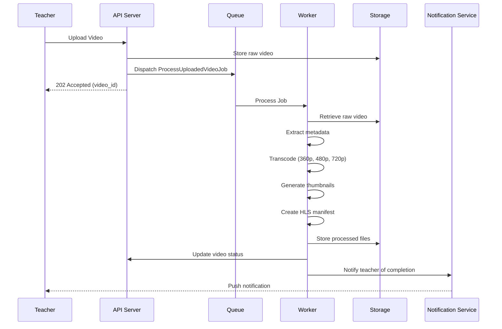
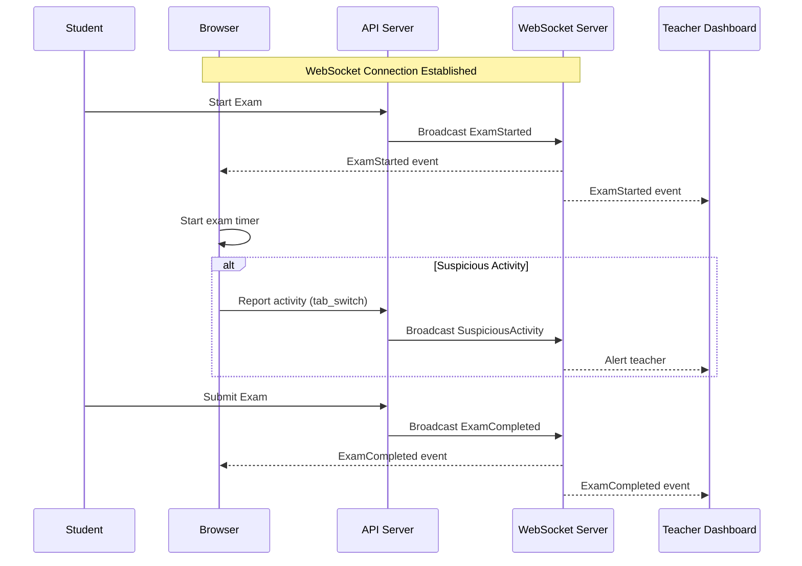
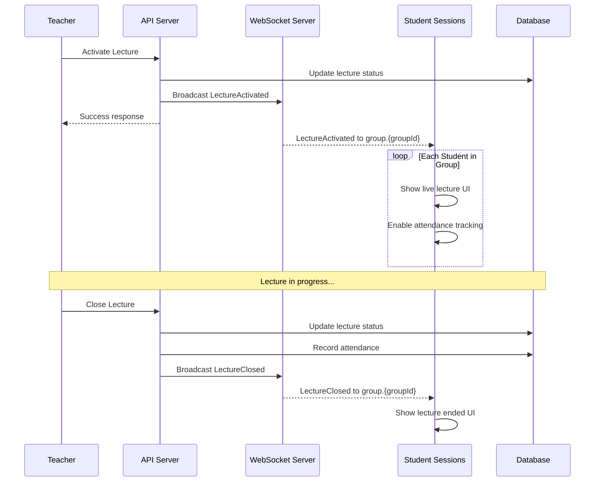

# Jobs & Events Documentation

This document provides comprehensive documentation for the backend's queue system, jobs, events, and real-time broadcasting capabilities.

## Overview

The application uses Laravel's queue system for background job processing and Laravel Echo for real-time broadcasting. This enables:

- **Asynchronous Processing**: Heavy operations like video transcoding and report generation run in the background
- **Real-time Updates**: Live notifications and event broadcasting to connected clients
- **Scalability**: Offloading intensive tasks to queue workers improves response times

### Architecture

```
┌─────────────────┐     ┌─────────────────┐     ┌─────────────────┐
│   Application   │────▶│    Queue        │────▶│    Worker       │
│   (Dispatch)    │     │   (Database)    │     │   (Process)     │
└─────────────────┘     └─────────────────┘     └─────────────────┘
         │                                              │
         │              ┌─────────────────┐             │
         └─────────────▶│   Broadcasting  │◀────────────┘
                        │   (Reverb/      │
                        │    Pusher)      │
                        └─────────────────┘
                                 │
                                 ▼
                        ┌─────────────────┐
                        │   Frontend      │
                        │   (Laravel Echo)│
                        └─────────────────┘
```

---

## Queue Jobs

### Jobs Listing

| Job | Domain | Purpose | Queue | Timeout | Tries |
|-----|--------|---------|-------|---------|-------|
| `SendBulkNotificationJob` | Notifications | Sends bulk FCM notifications | `default` | - | - |
| `GenerateReportJob` | Reports | Generates PDF/Excel reports async | `default` | - | - |
| `ProcessUploadedVideoJob` | Videos | Transcodes uploaded videos | `videos` | 7200s | 3 |
| `PublishScheduledVideoJob` | Videos | Publishes scheduled videos | `default` | - | - |
| `RevokeExpiredVideoPlaybackTokensJob` | Videos | Cleans expired playback tokens | `default` | - | - |
| `ProcessDueVideoRemindersJob` | Videos | Processes video reminders | `default` | - | - |

---

### Job Details

#### SendBulkNotificationJob

**Location**: `backend/app/Domains/Notifications/Jobs/SendBulkNotificationJob.php`

Sends Firebase Cloud Messaging (FCM) notifications to multiple users in bulk.

```php
use App\Domains\Notifications\Jobs\SendBulkNotificationJob;

// Dispatch the job
SendBulkNotificationJob::dispatch(
    $userIds,           // Array of user IDs
    $title,             // Notification title
    $body,              // Notification body
    $data               // Additional data payload
);
```

**Use Cases**:
- Broadcasting announcements to all students
- Sending batch reminders for upcoming events
- Mass notifications for system updates

---

#### GenerateReportJob

**Location**: `backend/app/Domains/Reports/Jobs/GenerateReportJob.php`

Generates PDF or Excel reports asynchronously to avoid blocking requests.

```php
use App\Domains\Reports\Jobs\GenerateReportJob;

// Dispatch report generation
GenerateReportJob::dispatch(
    $reportType,        // Type: 'pdf' or 'excel'
    $filters,           // Report filters
    $userId             // User requesting the report
);

// With chain for post-processing
Bus::chain([
    new GenerateReportJob($type, $filters, $userId),
    new SendReportNotificationJob($userId),
])->dispatch();
```

**Supported Report Types**:
- Student progress reports
- Attendance summaries
- Payment histories
- Exam results

---

#### ProcessUploadedVideoJob

**Location**: `backend/app/Domains/Videos/Jobs/ProcessUploadedVideoJob.php`

Handles video transcoding and processing after upload.

```php
use App\Domains\Videos\Jobs\ProcessUploadedVideoJob;

// Dispatch with video ID
ProcessUploadedVideoJob::dispatch($videoId)
    ->onQueue('videos')
    ->timeout(7200)
    ->tries(3);
```

**Processing Pipeline**:
1. Video validation and metadata extraction
2. Transcoding to multiple resolutions (360p, 480p, 720p, 1080p)
3. Thumbnail generation
4. HLS manifest creation
5. Storage optimization

**Configuration**:
- **Timeout**: 7200 seconds (2 hours)
- **Tries**: 3 attempts with exponential backoff
- **Queue**: `videos` (dedicated queue for video processing)

---

#### PublishScheduledVideoJob

**Location**: `backend/app/Domains/Videos/Jobs/PublishScheduledVideoJob.php`

Publishes videos that were scheduled for future release.

```php
use App\Domains\Videos\Jobs\PublishScheduledVideoJob;

// Typically dispatched by scheduler
// In app/Console/Kernel.php
$schedule->job(new PublishScheduledVideoJob)
    ->everyMinute();
```

**Flow**:
1. Query videos with `scheduled_at <= now()` and `status = 'scheduled'`
2. Update status to `published`
3. Notify subscribed students
4. Fire `VideoPublished` event

---

#### RevokeExpiredVideoPlaybackTokensJob

**Location**: `backend/app/Domains/Videos/Jobs/RevokeExpiredVideoPlaybackTokensJob.php`

Cleans up expired video playback tokens for security.

```php
use App\Domains\Videos\Jobs\RevokeExpiredVideoPlaybackTokensJob;

// Run via scheduler
$schedule->job(new RevokeExpiredVideoPlaybackTokensJob)
    ->hourly();
```

**Purpose**:
- Maintains security by removing expired tokens
- Reduces database bloat
- Ensures token integrity

---

#### ProcessDueVideoRemindersJob

**Location**: `backend/app/Domains/Videos/Jobs/ProcessDueVideoRemindersJob.php`

Processes video reminders that are due to be sent.

```php
use App\Domains\Videos\Jobs\ProcessDueVideoRemindersJob;

// Run via scheduler
$schedule->job(new ProcessDueVideoRemindersJob)
    ->everyFiveMinutes();
```

**Functionality**:
- Checks for due reminders
- Sends notifications to students
- Updates reminder status

---

## Broadcasting Events

### Events Listing

| Event | Domain | Channel Type | Channel Name | Broadcast Type |
|-------|--------|--------------|--------------|----------------|
| `NewNotificationEvent` | Notifications | Private | `notifications.{userType}.{userId}` | `ShouldBroadcastNow` |
| `ExamStarted` | Exams | Public | `exam.{examId}` | `ShouldBroadcast` |
| `ExamCompleted` | Exams | Public | `exam.{examId}` | `ShouldBroadcast` |
| `SuspiciousActivity` | Exams | Public | `exam.{examId}` | `ShouldBroadcast` |
| `LectureActivated` | Lectures | Public | `group.{groupId}` | `ShouldBroadcast` |
| `LectureClosed` | Lectures | Public | `group.{groupId}` | `ShouldBroadcast` |
| `LectureUpdated` | Lectures | Private | `teacher.{teacherId}` | `ShouldBroadcast` |

---

### Event Details

#### NewNotificationEvent

**Location**: `backend/app/Domains/Notifications/Events/NewNotificationEvent.php`

Broadcasts new notifications to users in real-time using `ShouldBroadcastNow` for immediate delivery.

```php
use App\Domains\Notifications\Events\NewNotificationEvent;

// Dispatch the event
event(new NewNotificationEvent(
    $userType,      // 'student', 'teacher', 'parent', 'admin'
    $userId,        // User's ID
    $notification   // Notification data
));
```

**Channel**: `private-notifications.{userType}.{userId}`

**Payload**:
```json
{
    "id": "uuid",
    "type": "notification_type",
    "title": "Notification Title",
    "message": "Notification message",
    "data": {},
    "created_at": "2024-01-15T10:30:00Z"
}
```

---

#### ExamStarted

**Location**: `backend/app/Domains/Exams/Events/ExamStarted.php`

Broadcasts when an exam session begins.

```php
use App\Domains\Exams\Events\ExamStarted;

event(new ExamStarted($examId, $examData));
```

**Channel**: `exam.{examId}` (Public)

**Payload**:
```json
{
    "exam_id": 1,
    "started_at": "2024-01-15T10:00:00Z",
    "duration_minutes": 60
}
```

---

#### ExamCompleted

**Location**: `backend/app/Domains/Exams/Events/ExamCompleted.php`

Broadcasts when a student completes an exam.

```php
use App\Domains\Exams\Events\ExamCompleted;

event(new ExamCompleted($examId, $studentId, $result));
```

**Channel**: `exam.{examId}` (Public)

**Payload**:
```json
{
    "exam_id": 1,
    "student_id": 123,
    "score": 85,
    "completed_at": "2024-01-15T10:45:00Z"
}
```

---

#### SuspiciousActivity

**Location**: `backend/app/Domains/Exams/Events/SuspiciousActivity.php`

Reports suspicious behavior during exams for proctoring.

```php
use App\Domains\Exams\Events\SuspiciousActivity;

event(new SuspiciousActivity(
    $examId,
    $studentId,
    $type,      // 'tab_switch', 'window_blur', 'copy_paste'
    $metadata
));
```

**Channel**: `exam.{examId}` (Public)

**Activity Types**:
| Type | Description |
|------|-------------|
| `tab_switch` | Student switched browser tabs |
| `window_blur` | Browser window lost focus |
| `copy_paste` | Copy or paste action detected |

**Payload**:
```json
{
    "exam_id": 1,
    "student_id": 123,
    "type": "tab_switch",
    "timestamp": "2024-01-15T10:30:00Z",
    "metadata": {
        "count": 3
    }
}
```

---

#### LectureActivated

**Location**: `backend/app/Domains/Lectures/Events/LectureActivated.php`

Broadcasts when a teacher activates a lecture session.

```php
use App\Domains\Lectures\Events\LectureActivated;

event(new LectureActivated($groupId, $lectureId, $lectureData));
```

**Channel**: `group.{groupId}` (Public)

**Payload**:
```json
{
    "lecture_id": 1,
    "group_id": 5,
    "teacher_id": 10,
    "activated_at": "2024-01-15T09:00:00Z",
    "subject": "Mathematics"
}
```

---

#### LectureClosed

**Location**: `backend/app/Domains/Lectures/Events/LectureClosed.php`

Broadcasts when a teacher ends a lecture session.

```php
use App\Domains\Lectures\Events\LectureClosed;

event(new LectureClosed($groupId, $lectureId));
```

**Channel**: `group.{groupId}` (Public)

**Payload**:
```json
{
    "lecture_id": 1,
    "group_id": 5,
    "closed_at": "2024-01-15T10:30:00Z",
    "duration_minutes": 90
}
```

---

#### LectureUpdated

**Location**: `backend/app/Domains/Lectures/Events/LectureUpdated.php`

Notifies teachers when their lecture data is updated.

```php
use App\Domains\Lectures\Events\LectureUpdated;

event(new LectureUpdated($teacherId, $lectureId, $changes));
```

**Channel**: `private-teacher.{teacherId}` (Private)

**Payload**:
```json
{
    "lecture_id": 1,
    "changes": {
        "title": "New Title",
        "scheduled_at": "2024-01-16T09:00:00Z"
    },
    "updated_at": "2024-01-15T14:00:00Z"
}
```

---

## Broadcasting Notifications

The system includes specialized notification classes that implement `ShouldBroadcast` for real-time delivery.

### Base Notification Structure

**Location**: `backend/app/Domains/Notifications/BaseNotification.php`

```php
abstract class BaseNotification extends Notification implements ShouldBroadcast
{
    protected string $title;
    protected string $message;
    protected array $data = [];

    public function broadcastOn()
    {
        return new PrivateChannel(
            "notifications.{$this->userType}.{$this->userId}"
        );
    }

    public function toArray($notifiable)
    {
        return [
            'title' => $this->title,
            'message' => $this->message,
            'data' => $this->data,
        ];
    }
}
```

### Notification Classes by Domain

#### Auth Domain

| Class | Purpose |
|-------|---------|
| `StudentNotification` | Notifications for student users |
| `TeacherNotification` | Notifications for teacher users |
| `ParentNotification` | Notifications for parent/guardian users |
| `AdminNotification` | Notifications for admin users |

#### Exams Domain

| Class | Purpose |
|-------|---------|
| `ExamAbsentNotification` | Notifies when student misses an exam |
| `ExamResultNotification` | Delivers exam results to students |

#### Lectures Domain

| Class | Purpose |
|-------|---------|
| `StudentAttendanceNotification` | Notifies about attendance status |

### Usage Example

```php
use App\Domains\Auth\Notifications\StudentNotification;

$student->notify(new StudentNotification(
    title: 'New Assignment',
    message: 'You have a new assignment due tomorrow',
    data: [
        'type' => 'assignment',
        'assignment_id' => $assignmentId,
    ]
));
```

---

## Sequence Diagrams

### Video Processing Flow



### Exam Real-time Events Flow



### Lecture Activation Flow



---

## Laravel Horizon Configuration

Horizon provides a dashboard and code-driven configuration for Laravel Redis queues.

**Configuration File**: `backend/config/horizon.php`

### Accessing Horizon

```bash
# Local development
php artisan horizon

# Production (with supervisor)
php artisan horizon --env=production
```

### Dashboard Access

Navigate to `/horizon` in your application to access the dashboard.

### Environment Configuration

```php
// config/horizon.php
'environments' => [
    'production' => [
        'supervisor-1' => [
            'maxProcesses' => 10,
            'balanceMaxShift' => 1,
            'balanceCooldown' => 3,
        ],
    ],
    
    'local' => [
        'supervisor-1' => [
            'maxProcesses' => 3,
        ],
    ],
],
```

### Queue Priorities

```php
'processes' => [
    'default' => 2,
    'videos' => 3,      // Higher priority for video processing
    'notifications' => 2,
],
```

### Metrics

Horizon tracks:
- Job throughput
- Runtime per job
- Failed jobs
- Queue wait time

---

## Queue Configuration

### Default Configuration

**Queue Connection**: `database`

```env
# .env
QUEUE_CONNECTION=database
```

### Available Drivers

| Driver | Use Case | Configuration |
|--------|----------|---------------|
| `database` | Development, simple setups | Default for this project |
| `redis` | Production, high performance | Required for Horizon |
| `sync` | Testing, debugging | Processes immediately |
| `beanstalkd` | Alternative queue system | Requires beanstalkd server |

### Running Queue Workers

```bash
# Basic worker
php artisan queue:work

# Process specific queue
php artisan queue:work --queue=videos,default

# Daemon worker (production)
php artisan queue:work --daemon --tries=3 --timeout=60

# Process all jobs and stop
php artisan queue:listen --once

# Restart workers after code deployment
php artisan queue:restart
```

### Supervisor Configuration (Production)

```ini
# /etc/supervisor/conf.d/laravel-worker.conf
[program:laravel-worker]
process_name=%(program_name)s_%(process_num)02d
command=php /var/www/backend/artisan queue:work --queue=videos,default --sleep=3 --tries=3 --max-time=3600
autostart=true
autorestart=true
stopasgroup=true
killasgroup=true
user=www-data
numprocs=2
redirect_stderr=true
stdout_logfile=/var/www/backend/storage/logs/worker.log
stopwaitsecs=3600
```

---

## Broadcasting Configuration

### Default Configuration

**Broadcast Connection**: `null` (configurable)

```env
# .env
BROADCAST_CONNECTION=reverb
```

### Available Drivers

| Driver | Use Case | Features |
|--------|----------|----------|
| `reverb` | Recommended for Laravel | First-party, WebSocket server |
| `pusher` | Third-party service | Managed, scalable |
| `ably` | Third-party alternative | Feature-rich |
| `redis` | Self-hosted | Requires Redis pub/sub |
| `log` | Development/debugging | Logs broadcasts |
| `null` | Disabled | No broadcasting |

### Reverb Configuration (Recommended)

```env
BROADCAST_CONNECTION=reverb
REVERB_HOST=127.0.0.1
REVERB_PORT=8080
REVERB_SCHEME=http
```

```bash
# Start Reverb server
php artisan reverb:start

# Start with debugging
php artisan reverb:start --debug
```

### Pusher Configuration

```env
BROADCAST_CONNECTION=pusher
PUSHER_APP_ID=your-app-id
PUSHER_APP_KEY=your-app-key
PUSHER_APP_SECRET=your-app-secret
PUSHER_HOST=api.pusher.com
PUSHER_PORT=443
PUSHER_SCHEME=https
```

---

## Frontend Integration

### Laravel Echo Setup

**Configuration File**: `frontend/src/lib/echo.ts`

```typescript
import Echo from 'laravel-echo';
import Pusher from 'pusher-js';

window.Pusher = Pusher;

const echo = new Echo({
    broadcaster: 'reverb',
    key: import.meta.env.VITE_REVERB_APP_KEY,
    wsHost: import.meta.env.VITE_REVERB_HOST,
    wsPort: import.meta.env.VITE_REVERB_PORT,
    wssPort: import.meta.env.VITE_REVERB_PORT,
    forceTLS: false,
    enabledTransports: ['ws', 'wss'],
    auth: {
        headers: {
            Authorization: `Bearer ${localStorage.getItem('token')}`,
        },
    },
});

export default echo;
```

### Listening to Public Channels

```typescript
import echo from '@/lib/echo';

// Listen to exam events
echo.channel(`exam.${examId}`)
    .listen('ExamStarted', (e) => {
        console.log('Exam started:', e);
        startExamTimer(e.duration_minutes);
    })
    .listen('ExamCompleted', (e) => {
        console.log('Student completed:', e.student_id);
        updateResults(e);
    })
    .listen('SuspiciousActivity', (e) => {
        showAlert(`Suspicious activity: ${e.type}`);
    });

// Leave channel when done
echo.leaveChannel(`exam.${examId}`);
```

### Listening to Private Channels

```typescript
// User notifications
echo.private(`notifications.${userType}.${userId}`)
    .notification((notification) => {
        console.log('New notification:', notification);
        showToast(notification.title);
        updateNotificationBadge();
    });

// Teacher-specific updates
echo.private(`teacher.${teacherId}`)
    .listen('LectureUpdated', (e) => {
        refreshLectureData(e.lecture_id);
    });
```

### React Hook Example

```typescript
import { useEffect, useState } from 'react';
import echo from '@/lib/echo';

function useExamEvents(examId: number) {
    const [events, setEvents] = useState<any[]>([]);

    useEffect(() => {
        if (!examId) return;

        const channel = echo.channel(`exam.${examId}`);

        channel
            .listen('ExamStarted', (e: any) => {
                setEvents((prev) => [...prev, { type: 'started', ...e }]);
            })
            .listen('ExamCompleted', (e: any) => {
                setEvents((prev) => [...prev, { type: 'completed', ...e }]);
            });

        return () => {
            echo.leaveChannel(`exam.${examId}`);
        };
    }, [examId]);

    return events;
}

// Usage
function ExamMonitor({ examId }) {
    const events = useExamEvents(examId);
    
    return (
        <ul>
            {events.map((event, i) => (
                <li key={i}>{event.type}</li>
            ))}
        </ul>
    );
}
```

### Vue 3 Composable Example

```typescript
import { onMounted, onUnmounted, ref } from 'vue';
import echo from '@/lib/echo';

export function useNotifications(userType: string, userId: number) {
    const notifications = ref<any[]>([]);

    onMounted(() => {
        echo.private(`notifications.${userType}.${userId}`)
            .notification((notification: any) => {
                notifications.value.unshift(notification);
            });
    });

    onUnmounted(() => {
        echo.leaveChannel(`notifications.${userType}.${userId}`);
    });

    return { notifications };
}
```

---

## Best Practices

### Jobs

1. **Use Dedicated Queues**: Assign heavy jobs to dedicated queues
   ```php
   ProcessUploadedVideoJob::dispatch($videoId)->onQueue('videos');
   ```

2. **Set Appropriate Timeouts**: Long-running jobs need extended timeouts
   ```php
   public $timeout = 7200; // 2 hours for video processing
   ```

3. **Implement Retry Logic**: Use tries and backoff for resilience
   ```php
   public $tries = 3;
   public $backoff = [10, 30, 60]; // Exponential backoff
   ```

4. **Handle Failures Gracefully**
   ```php
   public function failed(Throwable $exception)
   {
       Log::error('Job failed', [
           'job' => get_class($this),
           'error' => $exception->getMessage(),
       ]);
       
       // Notify relevant parties
   }
   ```

5. **Use Job Middleware** for cross-cutting concerns
   ```php
   public function middleware()
   {
       return [new WithoutOverlapping($this->videoId)];
   }
   ```

### Broadcasting

1. **Use Private Channels for Sensitive Data**
   ```php
   public function broadcastOn()
   {
       return new PrivateChannel(`user.{$this->userId}`);
   }
   ```

2. **Minimize Payload Size**
   ```php
   public function broadcastWith()
   {
       return [
           'id' => $this->model->id,
           'status' => $this->model->status,
           // Avoid sending full models
       ];
   }
   ```

3. **Always Clean Up Listeners**
   ```typescript
   useEffect(() => {
       // Subscribe
       return () => {
           // Unsubscribe to prevent memory leaks
           echo.leaveChannel(channelName);
       };
   }, []);
   ```

4. **Use ShouldBroadcastNow for Urgent Events**
   ```php
   class UrgentNotification implements ShouldBroadcastNow
   {
       // Bypasses queue for immediate delivery
   }
   ```

5. **Implement Channel Authorization**
   ```php
   // routes/channels.php
   Broadcast::channel('notifications.{userType}.{userId}', function ($user, $userType, $userId) {
       return $user->type === $userType && $user->id === (int) $userId;
   });
   ```

---

## Troubleshooting

### Common Issues

#### Jobs Not Processing

**Symptoms**: Jobs stuck in queue, not being processed

**Solutions**:
```bash
# Check if worker is running
ps aux | grep queue:work

# Check failed jobs
php artisan queue:failed

# Retry failed jobs
php artisan queue:retry all

# Check queue connection
php artisan tinker
>>> config('queue.default')
```

#### WebSocket Connection Failed

**Symptoms**: Frontend cannot connect to WebSocket server

**Solutions**:
```bash
# Verify Reverb is running
php artisan reverb:start

# Check environment variables
php artisan tinker
>>> config('broadcasting.connections.reverb')

# Test with Pusher CLI
npm install -g pusher-cli
pusher channels subscribe --channel test
```

#### Events Not Broadcasting

**Symptoms**: Events dispatched but not received on frontend

**Debugging**:
```php
// Add to event class
public function broadcastOn()
{
    Log::info('Broadcasting event', [
        'channel' => $this->channel,
        'data' => $this->broadcastWith(),
    ]);
    
    return [$this->channel];
}
```

```bash
# Check broadcast driver
php artisan tinker
>>> config('broadcasting.default')

# Use log driver for debugging
BROADCAST_CONNECTION=log
# Then check storage/logs/laravel.log
```

#### Memory Leaks in Workers

**Symptoms**: Workers consuming excessive memory over time

**Solutions**:
```bash
# Use --max-jobs to restart periodically
php artisan queue:work --max-jobs=1000

# Use --max-time
php artisan queue:work --max-time=3600

# Use --memory limit
php artisan queue:work --memory=128
```

#### Horizon Dashboard Not Loading

**Symptoms**: 403 Forbidden or blank page

**Solutions**:
```php
// Verify access in config/horizon.php
'gate' => function ($user) {
    return $user->hasRole('admin');
},

// Or for local development
'gate' => function ($user) {
    return app()->environment('local') || $user->hasRole('admin');
},
```

### Debugging Commands

```bash
# Monitor queue in real-time
php artisan queue:listen --verbose

# Check Horizon status
php artisan horizon:status

# Clear all jobs (dangerous!)
php artisan queue:clear

# Monitor specific queue
php artisan queue:work --queue=videos --verbose

# Test broadcasting
php artisan tinker
>>> event(new \App\Domains\Exams\Events\ExamStarted(1, []));
```

### Log Analysis

```bash
# Check for job failures
grep "failed" storage/logs/laravel.log | tail -20

# Monitor worker output
tail -f storage/logs/worker.log

# Check Horizon metrics
# Visit /horizon dashboard for detailed metrics
```

---

## Quick Reference

### Environment Variables

```env
# Queue Configuration
QUEUE_CONNECTION=database

# Broadcasting Configuration
BROADCAST_CONNECTION=reverb

# Reverb Configuration
REVERB_HOST=127.0.0.1
REVERB_PORT=8080
REVERB_SCHEME=http

# Redis (for Horizon)
REDIS_HOST=127.0.0.1
REDIS_PASSWORD=null
REDIS_PORT=6379
```

### Artisan Commands

| Command | Description |
|---------|-------------|
| `php artisan queue:work` | Start queue worker |
| `php artisan queue:listen` | Listen for jobs (restarts on failure) |
| `php artisan queue:restart` | Restart all workers |
| `php artisan queue:retry all` | Retry all failed jobs |
| `php artisan queue:failed` | List failed jobs |
| `php artisan horizon` | Start Horizon |
| `php artisan horizon:pause` | Pause Horizon |
| `php artisan horizon:continue` | Resume Horizon |
| `php artisan reverb:start` | Start WebSocket server |

### Channel Naming Convention

| Pattern | Type | Usage |
|---------|------|-------|
| `exam.{id}` | Public | Exam events |
| `group.{id}` | Public | Group/lecture events |
| `notifications.{type}.{id}` | Private | User notifications |
| `teacher.{id}` | Private | Teacher-specific events |
