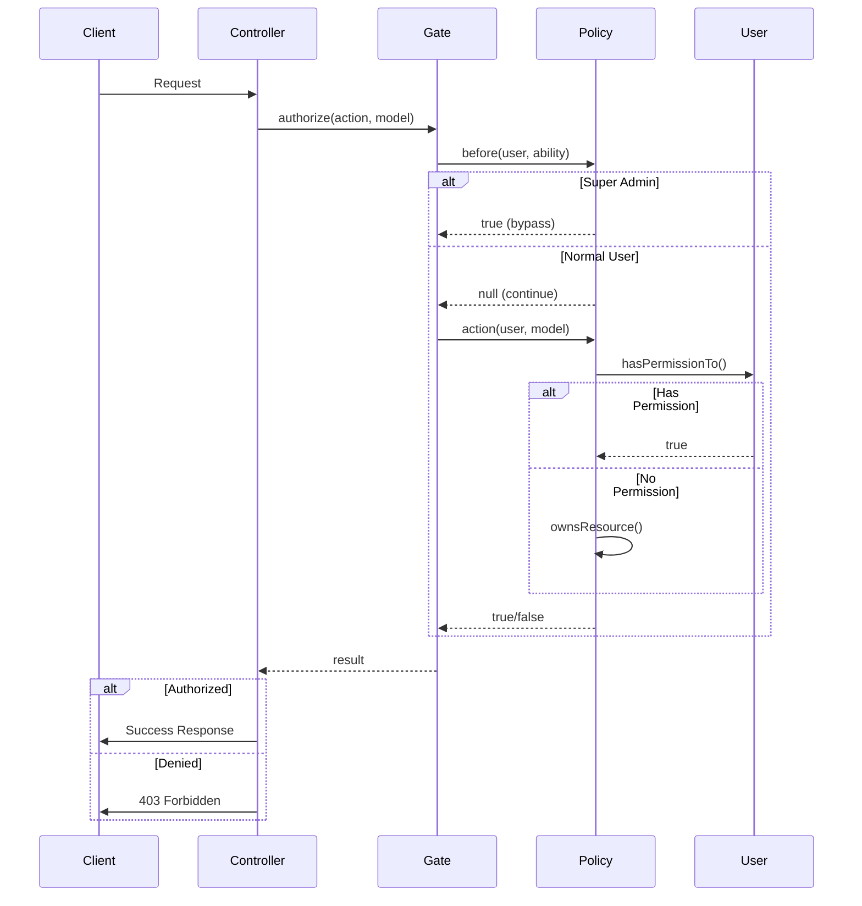

# Policies Documentation

This document describes the authorization system used in the backend, built on Laravel Policies and Spatie's Permission package.

## Overview

The application uses a multi-layered authorization approach:

1. **Laravel Policies** - Resource-based authorization logic
2. **Spatie Permission** - Role and permission management
3. **Form Request Authorization** - Request-level validation and authorization
4. **Gate::authorize()** - Controller-level authorization checks

```mermaid
flowchart TD
    A[Request] --> B{Form Request}
    B -->|authorize()| C{Policy Check}
    C -->|before()| D{Super Admin?}
    D -->|Yes| E[Allow Access]
    D -->|No| F{Has Permission?}
    F -->|Yes| E
    F -->|No| G{Owns Resource?}
    G -->|Yes| E
    G -->|No| H[Deny Access]
    
    style E fill:#90EE90
    style H fill:#FFB6C1
```

## BasePolicy Pattern

All policies in the Application domain extend the [`BasePolicy`](backend/app/Domains/Application/Policies/BasePolicy.php:16) abstract class, which provides:

### Standard CRUD Methods

| Method | Description | Permission Check |
|--------|-------------|------------------|
| `viewAny($user)` | List all resources | `{resource}.view` |
| `view($user, $model)` | View single resource | `{resource}.view` or ownership |
| `create($user)` | Create new resource | `{resource}.create` |
| `update($user, $model)` | Update resource | `{resource}.update` or ownership |
| `delete($user, $model)` | Delete resource | `{resource}.delete` or ownership |
| `restore($user, $model)` | Restore soft-deleted | `{resource}.restore` |
| `forceDelete($user, $model)` | Permanently delete | `{resource}.force-delete` |

### Before Hook (Super Admin Bypass)

The `before()` method allows super-admins to bypass all authorization checks:

```php
public function before($user, string $ability): ?bool
{
    // Super admins bypass all checks
    if ($user->hasRole('admin') || $user->hasRole('super-admin')) {
        return true;
    }

    // Academy users get full access to their resources
    if ($user->hasRole('academy') && $this->isAcademyResource()) {
        return true;
    }

    return null; // Defer to the policy method
}
```

### Abstract Method

Each policy must implement:

```php
abstract protected function getResourceName(): string;
```

Returns the kebab-case plural form for permission checking (e.g., `'video-comments'`, `'exam-attempts'`).

### Helper Methods

The BasePolicy provides user type detection helpers:

```php
protected function isAcademy($user): bool
protected function isTeacher($user): bool
protected function isSecretary($user): bool
protected function isStudent($user): bool
protected function isGuardian($user): bool
protected function resolveTeacher($user): ?Teacher  // Returns teacher for Secretary users
```

## Policy Registration

Policies are registered in [`AppServiceProvider.php`](backend/app/Providers/AppServiceProvider.php:200):

```php
public function boot(): void
{
    // Domain Policies (existing)
    Gate::policy(Enrollment::class, EnrollmentPolicy::class);
    Gate::policy(Grade::class, GradePolicy::class);
    Gate::policy(Group::class, GroupPolicy::class);
    Gate::policy(Lecture::class, LecturePolicy::class);
    Gate::policy(Exam::class, ExamPolicy::class);
    Gate::policy(Video::class, VideoPolicy::class);
    Gate::policy(Student::class, StudentPolicy::class);

    // Application Domain Policies
    Gate::policy(Academy::class, AcademyPolicy::class);
    Gate::policy(Teacher::class, TeacherPolicy::class);
    // ... and many more
}
```

## All Policies Listing

### Auth Domain Policies

| Policy | Model | Location | Methods |
|--------|-------|----------|---------|
| [`StudentPolicy`](backend/app/Domains/Auth/Policies/StudentPolicy.php:19) | Student | Auth | view, update, delete, updatePermissions |
| [`AcademyPolicy`](backend/app/Domains/Application/Policies/AcademyPolicy.php:16) | Academy | Application | viewAny, view, create, update, delete |
| [`TeacherPolicy`](backend/app/Domains/Application/Policies/TeacherPolicy.php:17) | Teacher | Application | viewAny, view, create, update, delete |
| [`SecretaryPolicy`](backend/app/Domains/Application/Policies/SecretaryPolicy.php:18) | Secretary | Application | viewAny, view, create, update, delete |
| [`GuardianPolicy`](backend/app/Domains/Application/Policies/GuardianPolicy.php:18) | Guardian | Application | Standard CRUD |
| [`DeviceTokenPolicy`](backend/app/Domains/Application/Policies/DeviceTokenPolicy.php:17) | DeviceToken | Application | Standard CRUD |
| [`ParentDeviceTokenPolicy`](backend/app/Domains/Application/Policies/ParentDeviceTokenPolicy.php:17) | ParentDeviceToken | Application | Standard CRUD |
| [`LoginAttemptPolicy`](backend/app/Domains/Application/Policies/LoginAttemptPolicy.php:17) | LoginAttempt | Application | Standard CRUD |

### Enrollments Domain Policies

| Policy | Model | Location | Methods |
|--------|-------|----------|---------|
| [`GroupPolicy`](backend/app/Domains/Enrollments/Policies/GroupPolicy.php:17) | Group | Enrollments | view, update, delete |
| [`GradePolicy`](backend/app/Domains/Enrollments/Policies/GradePolicy.php:17) | Grade | Enrollments | view, update, delete |
| [`EnrollmentPolicy`](backend/app/Domains/Enrollments/Policies/EnrollmentPolicy.php:18) | Enrollment | Enrollments | Standard CRUD |
| [`StudentActivityLogPolicy`](backend/app/Domains/Application/Policies/StudentActivityLogPolicy.php:19) | StudentActivityLog | Application | Standard CRUD |

### Exams Domain Policies

| Policy | Model | Location | Methods |
|--------|-------|----------|---------|
| [`ExamPolicy`](backend/app/Domains/Exams/Policies/ExamPolicy.php:17) | Exam | Exams | view, update, delete, viewResults, copy |
| [`QuestionPolicy`](backend/app/Domains/Application/Policies/QuestionPolicy.php:19) | Question | Application | Standard CRUD |
| [`ExamAttemptPolicy`](backend/app/Domains/Application/Policies/ExamAttemptPolicy.php:19) | ExamAttempt | Application | Standard CRUD |
| [`ExamResultPolicy`](backend/app/Domains/Application/Policies/ExamResultPolicy.php:19) | ExamResult | Application | Standard CRUD |
| [`FailedQuestionPolicy`](backend/app/Domains/Application/Policies/FailedQuestionPolicy.php:19) | FailedQuestion | Application | Standard CRUD |
| [`StudentAnswerPolicy`](backend/app/Domains/Application/Policies/StudentAnswerPolicy.php:19) | StudentAnswer | Application | Standard CRUD |

### Lectures Domain Policies

| Policy | Model | Location | Methods |
|--------|-------|----------|---------|
| [`LecturePolicy`](backend/app/Domains/Lectures/Policies/LecturePolicy.php:18) | Lecture | Lectures | view, update, delete, toggleActive, endLecture, viewAttendees, exportAttendees, cancelSession |
| [`AttendancePolicy`](backend/app/Domains/Application/Policies/AttendancePolicy.php:20) | Attendance | Application | Standard CRUD |
| [`LectureSessionPolicy`](backend/app/Domains/Application/Policies/LectureSessionPolicy.php:19) | LectureSession | Application | Standard CRUD |

### Videos Domain Policies

| Policy | Model | Location | Methods |
|--------|-------|----------|---------|
| [`VideoPolicy`](backend/app/Domains/Videos/Policies/VideoPolicy.php:14) | Video | Videos | viewAny, createIndependent, createAcademy, view, update, delete, publish, manageComments |
| [`VideoCommentPolicy`](backend/app/Domains/Application/Policies/VideoCommentPolicy.php:19) | VideoComment | Application | Standard CRUD |
| [`VideoLikePolicy`](backend/app/Domains/Application/Policies/VideoLikePolicy.php:16) | VideoLike | Application | Standard CRUD |
| [`VideoAccessGrantPolicy`](backend/app/Domains/Application/Policies/VideoAccessGrantPolicy.php:18) | VideoAccessGrant | Application | Standard CRUD |
| [`VideoAttachmentPolicy`](backend/app/Domains/Application/Policies/VideoAttachmentPolicy.php:18) | VideoAttachment | Application | Standard CRUD |
| [`VideoWatchProgressPolicy`](backend/app/Domains/Application/Policies/VideoWatchProgressPolicy.php:16) | VideoWatchProgress | Application | Standard CRUD |
| [`VideoAccessLogPolicy`](backend/app/Domains/Application/Policies/VideoAccessLogPolicy.php:20) | VideoAccessLog | Application | Standard CRUD |
| [`VideoPlaybackTokenPolicy`](backend/app/Domains/Application/Policies/VideoPlaybackTokenPolicy.php:19) | VideoPlaybackToken | Application | Standard CRUD |
| [`VideoUploadSessionPolicy`](backend/app/Domains/Application/Policies/VideoUploadSessionPolicy.php:19) | VideoUploadSession | Application | Standard CRUD |
| [`VideoReminderPolicy`](backend/app/Domains/Application/Policies/VideoReminderPolicy.php:20) | VideoReminder | Application | Standard CRUD |
| [`VideoQuizPolicy`](backend/app/Domains/Application/Policies/VideoQuizPolicy.php:19) | VideoQuiz | Application | Standard CRUD |
| [`VideoQuizQuestionPolicy`](backend/app/Domains/Application/Policies/VideoQuizQuestionPolicy.php:19) | VideoQuizQuestion | Application | Standard CRUD |
| [`VideoQuizAttemptPolicy`](backend/app/Domains/Application/Policies/VideoQuizAttemptPolicy.php:19) | VideoQuizAttempt | Application | Standard CRUD |

### Notifications Domain Policies

| Policy | Model | Location | Methods |
|--------|-------|----------|---------|
| [`AcademyNotificationPolicy`](backend/app/Domains/Application/Policies/AcademyNotificationPolicy.php:17) | AcademyNotification | Application | Standard CRUD |
| [`SentNotificationPolicy`](backend/app/Domains/Application/Policies/SentNotificationPolicy.php:17) | SentNotification | Application | Standard CRUD |

### Subscriptions Domain Policies

| Policy | Model | Location | Methods |
|--------|-------|----------|---------|
| [`SubscriptionPolicy`](backend/app/Domains/Application/Policies/SubscriptionPolicy.php:18) | Subscription | Application | Standard CRUD |
| [`TeacherSubscriptionPolicy`](backend/app/Domains/Application/Policies/TeacherSubscriptionPolicy.php:17) | TeacherSubscription | Application | Standard CRUD |
| [`AcademySubscriptionPolicy`](backend/app/Domains/Application/Policies/AcademySubscriptionPolicy.php:17) | AcademySubscription | Application | Standard CRUD |
| [`PaymentLogPolicy`](backend/app/Domains/Application/Policies/PaymentLogPolicy.php:17) | PaymentLog | Application | Standard CRUD |
| [`PlatformPaymentPolicy`](backend/app/Domains/Application/Policies/PlatformPaymentPolicy.php:16) | PlatformPayment | Application | Standard CRUD |

### Gamification Domain Policies

| Policy | Model | Location | Methods |
|--------|-------|----------|---------|
| [`StudentPointPolicy`](backend/app/Domains/Application/Policies/StudentPointPolicy.php:19) | StudentPoint | Application | Standard CRUD |
| [`PointTransactionPolicy`](backend/app/Domains/Application/Policies/PointTransactionPolicy.php:19) | PointTransaction | Application | Standard CRUD |
| [`GamificationSettingPolicy`](backend/app/Domains/Application/Policies/GamificationSettingPolicy.php:16) | GamificationSetting | Application | Standard CRUD |

### Support Domain Policies

| Policy | Model | Location | Methods |
|--------|-------|----------|---------|
| [`SettingPolicy`](backend/app/Domains/Application/Policies/SettingPolicy.php:16) | Setting | Application | Standard CRUD |
| [`SyncErrorPolicy`](backend/app/Domains/Application/Policies/SyncErrorPolicy.php:17) | SyncError | Application | Standard CRUD |
| [`TeacherAttendanceLogPolicy`](backend/app/Domains/Application/Policies/TeacherAttendanceLogPolicy.php:17) | TeacherAttendanceLog | Application | Standard CRUD |
| [`DailyVoiceLimitPolicy`](backend/app/Domains/Application/Policies/DailyVoiceLimitPolicy.php:16) | DailyVoiceLimit | Application | Standard CRUD |

## Usage Examples

### In Controllers

Use `Gate::authorize()` to check authorization before performing actions:

```php
use Illuminate\Support\Facades\Gate;
use App\Domains\Exams\Models\Exam;

class ExamController extends Controller
{
    public function show(Exam $exam)
    {
        Gate::authorize('view', $exam);
        
        return response()->json($exam);
    }

    public function update(UpdateExamRequest $request, Exam $exam)
    {
        Gate::authorize('update', $exam);
        
        // Update logic...
    }

    public function results(Exam $exam)
    {
        Gate::authorize('viewResults', $exam);
        
        return response()->json($exam->results);
    }
}
```

### In Form Requests

Form requests can implement their own authorization logic:

```php
use Illuminate\Foundation\Http\FormRequest;

class StoreExamRequest extends FormRequest
{
    public function authorize(): bool
    {
        // Only authenticated teachers can create exams
        return $this->user() instanceof Teacher;
    }

    public function rules(): array
    {
        return [
            'title' => ['required', 'string', 'max:255'],
            'duration' => ['required', 'integer', 'min:1'],
        ];
    }
}
```

### Policy with Custom Methods

Policies can define custom authorization methods beyond standard CRUD:

```php
// LecturePolicy.php
public function toggleActive(Teacher|Secretary $user, Lecture $lecture): bool
{
    $teacher = $this->resolveTeacher($user);
    return $teacher && $lecture->teacher_id === $teacher->id;
}

public function endLecture(Teacher|Secretary $user, Lecture $lecture): bool
{
    $teacher = $this->resolveTeacher($user);
    return $teacher && $lecture->teacher_id === $teacher->id;
}

public function viewAttendees(Teacher|Secretary $user, Lecture $lecture): bool
{
    $teacher = $this->resolveTeacher($user);
    return $teacher && $lecture->teacher_id === $teacher->id;
}
```

### Secretary Delegation Pattern

The `resolveTeacher()` pattern allows secretaries to act on behalf of their associated teacher:

```php
private function resolveTeacher(Teacher|Secretary $user): ?Teacher
{
    if ($user instanceof Teacher) {
        return $user;
    }

    if ($user instanceof Secretary) {
        return $user->teachers()->first();
    }

    return null;
}
```

This enables:
- Teachers to manage their own resources
- Secretaries to manage their associated teacher's resources
- Consistent authorization logic across user types

### Video Policy Example

The VideoPolicy demonstrates multi-tenant authorization:

```php
class VideoPolicy
{
    public function view($user, Video $video): bool
    {
        if ($user instanceof Admin) {
            return true;
        }

        if ($user instanceof Teacher) {
            return $video->owner_type === VideoOwnerType::INDEPENDENT_TEACHER
                && $video->owner_id === $user->id;
        }

        if ($user instanceof Academy) {
            return $video->owner_type === VideoOwnerType::ACADEMY
                && $video->owner_id === $user->id;
        }

        if ($user instanceof Secretary) {
            return $this->secretaryBelongsToAcademy($user, $video->academy_id);
        }

        return false;
    }
}
```

## Spatie Permission Integration

The application uses `spatie/laravel-permission` for role and permission management:

### Roles

Defined in [`RolesAndPermissionsSeeder.php`](backend/database/seeders/RolesAndPermissionsSeeder.php:9):

| Role | Guard | Description |
|------|-------|-------------|
| Super Admin | admin | Full system access |
| Admin | admin | Administrative access |
| Academy | web | Academy institution |
| Teacher | web | Individual teacher |
| Secretary | web | Academy secretary |
| Student | web | Student user |
| Guardian | web | Parent/Guardian |

### Permission Checking

```php
// In policies
if ($user->hasPermissionTo('videos.view')) {
    return true;
}

// Check role
if ($user->hasRole('admin')) {
    return true;
}

// Check multiple permissions
if ($user->hasAnyPermission(['videos.view', 'videos.edit'])) {
    return true;
}
```

## Authorization Flow Diagram



## Best Practices

### 1. Always Use Policies for Authorization

```php
// ✅ Good
Gate::authorize('update', $exam);

// ❌ Bad - Manual checks in controllers
if ($exam->teacher_id !== $user->id) {
    abort(403);
}
```

### 2. Leverage the before() Hook

Use the before hook for super-admin bypass rather than checking in every method:

```php
// In BasePolicy
public function before($user, string $ability): ?bool
{
    if ($user->hasRole('super-admin')) {
        return true;
    }
    return null;
}
```

### 3. Use Type Hints for User Types

```php
// ✅ Good - Clear type expectations
public function view(Teacher|Secretary|Academy $user, Student $student): bool

// ❌ Bad - Unclear what user types are supported
public function view($user, $student): bool
```

### 4. Implement Custom Methods for Non-CRUD Actions

```php
// For actions beyond standard CRUD
public function publish($user, Video $video): bool
public function exportAttendees($user, Lecture $lecture): bool
public function viewResults($user, Exam $exam): bool
```

### 5. Keep Policies Focused

Each policy should handle authorization for a single model. Avoid cross-model logic unless necessary for ownership checks.

### 6. Use Form Request Authorization

Combine form validation with authorization:

```php
class StoreVideoRequest extends FormRequest
{
    public function authorize(): bool
    {
        $video = $this->route('video');
        return Gate::allows('update', $video);
    }
}
```

### 7. Document Custom Policy Methods

Add PHPDoc comments explaining what each method checks:

```php
/**
 * Determine whether the user can publish the video.
 * 
 * Only video owners with publish permission can publish.
 */
public function publish($user, Video $video): bool
```
