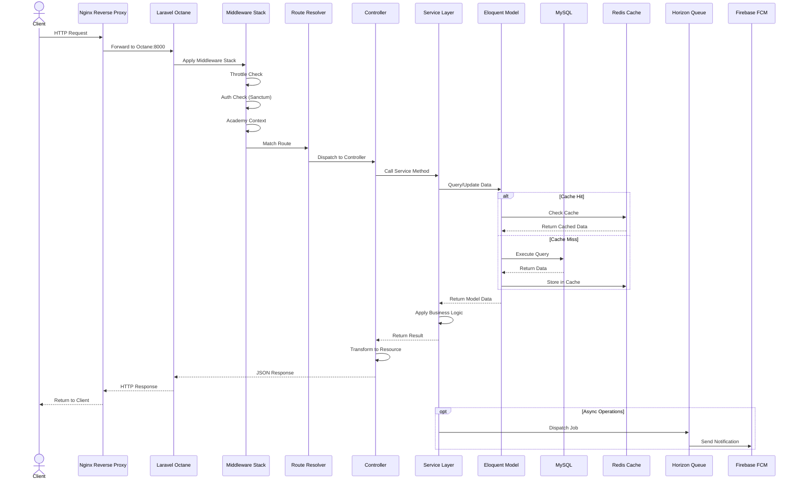
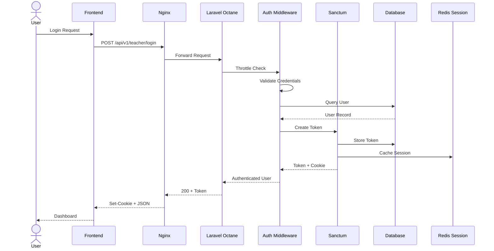
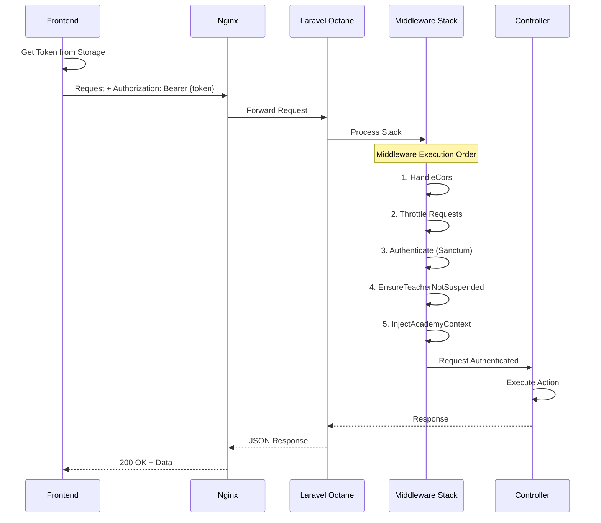
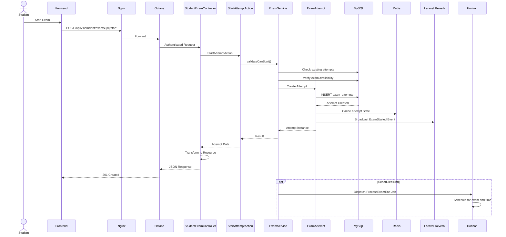
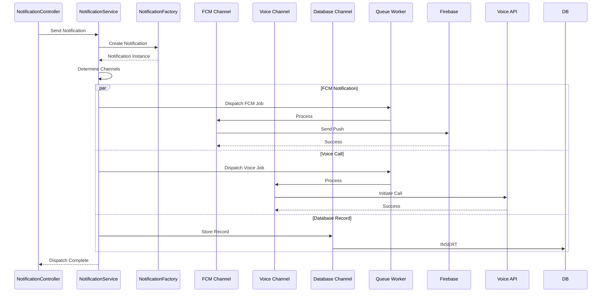
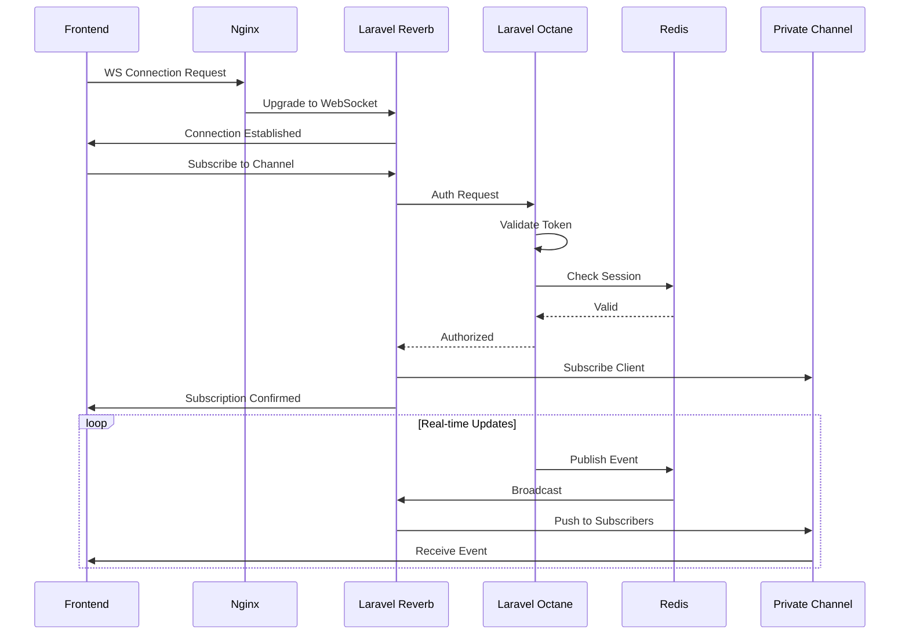
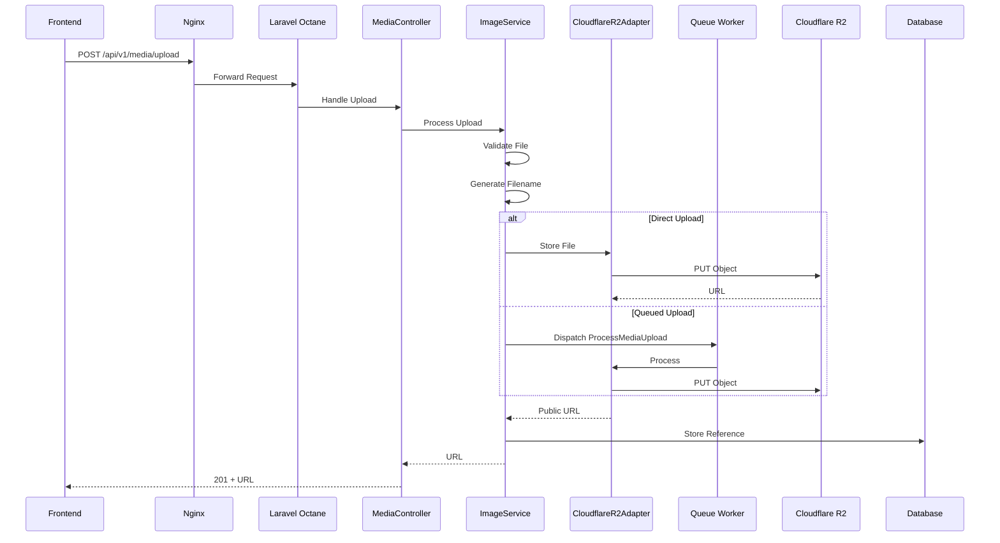
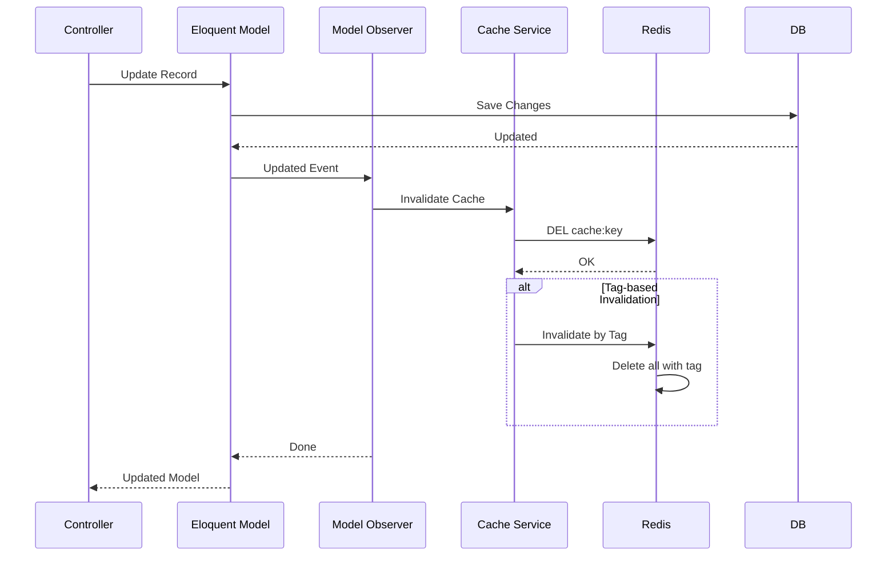
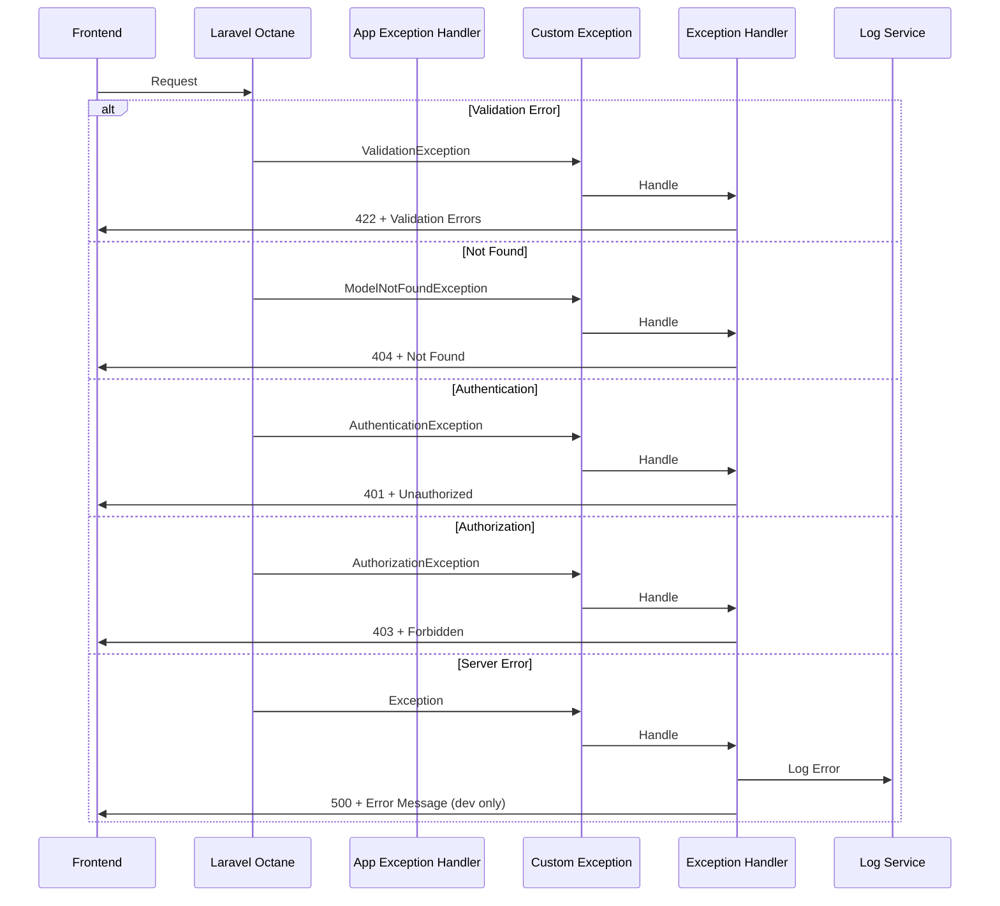

# Request Lifecycle

Complete tracing of an HTTP request through the Neetaq backend architecture.

## Overview Sequence



## Authentication Flow



## Authenticated Request Flow



## Exam Attempt Flow



## Notification Flow



## WebSocket Connection Flow



## File Upload Flow



## Cache Invalidation Flow



## Error Handling Flow



## Request Lifecycle Steps

### 1. Entry Point (Nginx)

```nginx
# nginx/conf.d/default.conf
server {
    listen 80;
    server_name neetaq.com;
    
    location /api {
        proxy_pass http://octane:8000;
        proxy_set_header Host $host;
        proxy_set_header X-Real-IP $remote_addr;
    }
    
    location / {
        proxy_pass http://frontend:3000;
    }
}
```

### 2. Laravel Octane Boot

```php
// Swoole server initialization
1. Load configuration
2. Boot service providers
3. Warm caches
4. Start worker processes
```

### 3. Middleware Pipeline

```php
// bootstrap/app.php
->withMiddleware(function (Middleware $middleware) {
    $middleware->api([
        \Illuminate\Routing\Middleware\ThrottleRequests::class,
        \App\Domains\Auth\Http\Middleware\EnsureTeacherNotSuspended::class,
    ]);
})
```

### 4. Route Resolution

```php
// routes/api.php
Route::middleware('auth:sanctum')
    ->prefix('teacher')
    ->group(function () {
        Route::get('/students', [StudentController::class, 'index']);
    });
```

### 5. Response Formation

```php
// Controller response
return response()->json([
    'status' => true,
    'status_code' => 200,
    'message' => 'Success',
    'data' => $resource,
]);
```

## Performance Considerations

| Stage | Optimization |
|-------|-------------|
| Nginx | Enable gzip, caching headers |
| Octane | Worker count = CPU cores |
| Database | Query optimization, indexes |
| Redis | Connection pooling |
| Queue | Separate queue for notifications |

## References

- [`backend/routes/api.php`](/backend/routes/api.php)
- [`backend/bootstrap/app.php`](/backend/bootstrap/app.php)
- [`backend/app/Domains/Support/Traits/ApiResponseTrait.php`](/backend/app/Domains/Support/Traits/ApiResponseTrait.php)
- [`nginx/conf.d/default.conf`](/nginx/conf.d/default.conf)

## TODO

- [ ] Add distributed tracing with OpenTelemetry
- [ ] Document rate limiting implementation
- [ ] Add request timing metrics
- [ ] Document request/response compression
