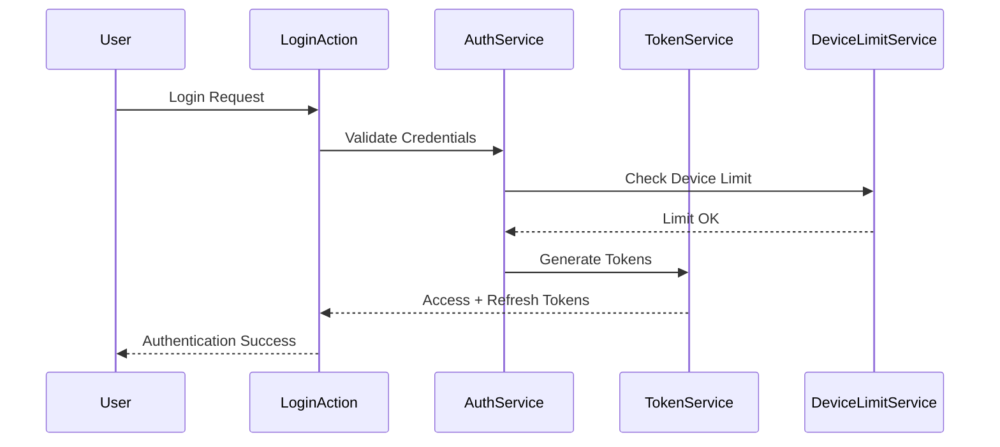
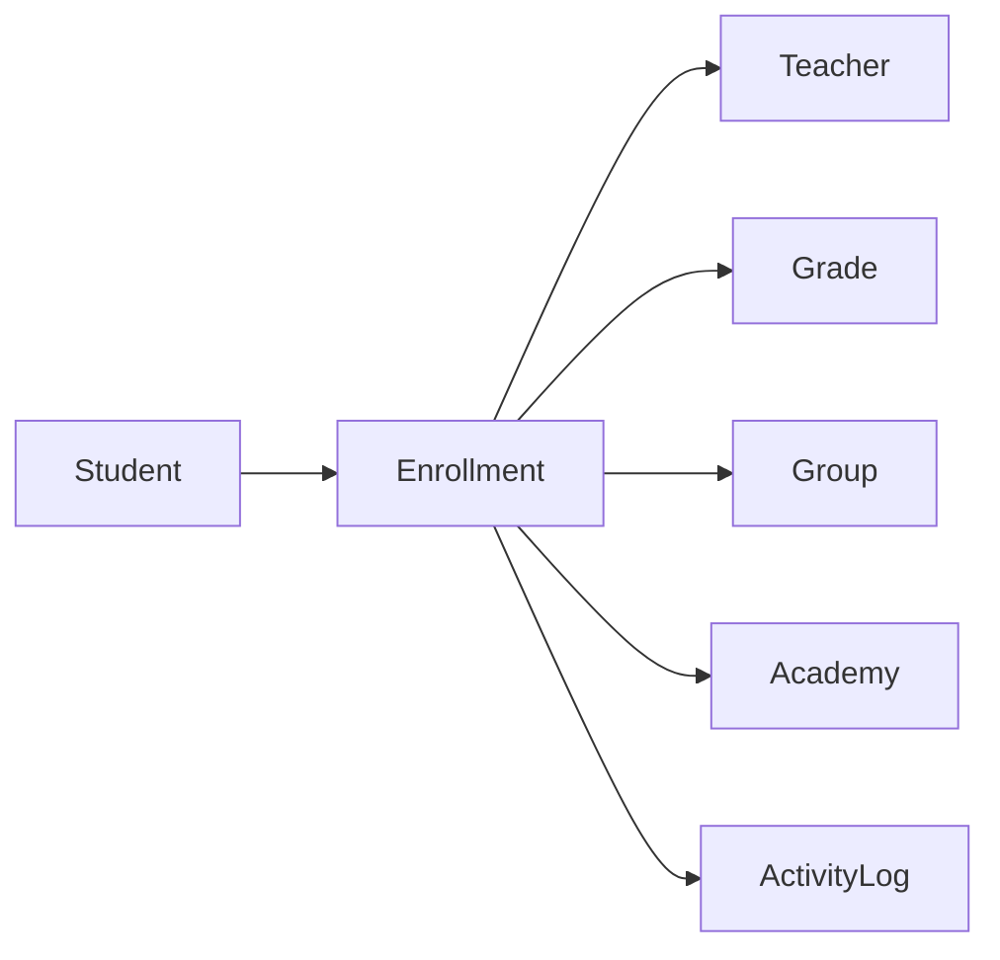
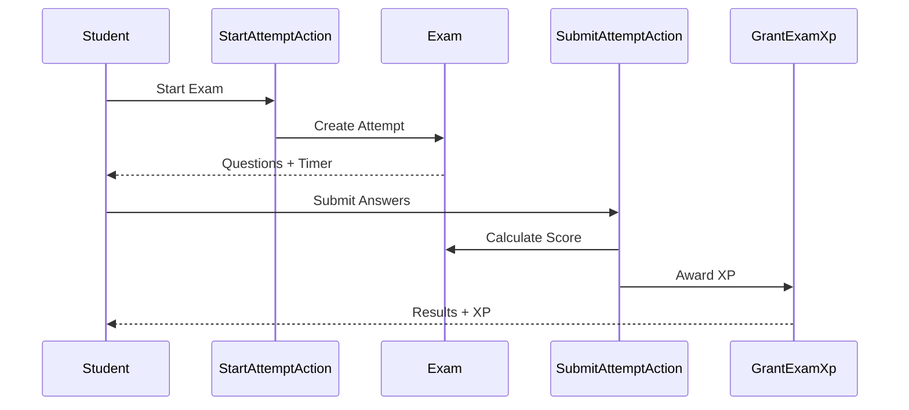

# Backend Services Audit Documentation

This document provides a complete audit of all 45 backend services organized by domain, including pattern recommendations, refactoring backlog, and future architecture considerations.

---

## Table of Contents

1. [Service Inventory](#1-service-inventory)
2. [Domain-by-Domain Features Map](#2-domain-by-domain-features-map)
3. [Pattern Recommendation Matrix](#3-pattern-recommendation-matrix)
4. [Refactoring Backlog](#4-refactoring-backlog)
5. [Ready-to-Paste Service Documentation](#5-ready-to-paste-service-documentation)
6. [Future Architecture Watchlist](#6-future-architecture-watchlist)

---

## 1. Service Inventory

### Complete List of 45 Services by Domain

#### Application Domain (Core Infrastructure)

| # | Service | Path | Purpose |
|---|---------|------|---------|
| 1 | [`CacheService`](../../backend/app/Domains/Application/Services/CacheService.php) | `Application/Services/` | Centralized caching with configurable TTL |
| 2 | [`CloudflareKVService`](../../backend/app/Domains/Application/Services/CloudflareKVService.php) | `Application/Services/` | Cloudflare KV store integration |
| 3 | [`FileUploadValidator`](../../backend/app/Domains/Application/Services/FileUploadValidator.php) | `Application/Services/` | Secure file upload validation |
| 4 | [`HelperService`](../../backend/app/Domains/Application/Services/HelperService.php) | `Application/Services/` | General utility functions |
| 5 | [`InputSanitizer`](../../backend/app/Domains/Application/Services/InputSanitizer.php) | `Application/Services/` | Input sanitization and XSS prevention |
| 6 | [`SeasonalThemeService`](../../backend/app/Domains/Application/Services/SeasonalThemeService.php) | `Application/Services/` | Seasonal theme management |

#### Academy Services (13 services)

| # | Service | Path | Purpose |
|---|---------|------|---------|
| 7 | [`AcademyAuthService`](../../backend/app/Domains/Application/Services/Academy/AcademyAuthService.php) | `Application/Services/Academy/` | Academy authentication |
| 8 | [`AttendanceService`](../../backend/app/Domains/Application/Services/Academy/AttendanceService.php) | `Application/Services/Academy/` | Attendance management for academies |
| 9 | [`DashboardService`](../../backend/app/Domains/Application/Services/Academy/DashboardService.php) | `Application/Services/Academy/` | Academy dashboard analytics |
| 10 | [`GradeService`](../../backend/app/Domains/Application/Services/Academy/GradeService.php) | `Application/Services/Academy/` | Grade level management |
| 11 | [`GroupService`](../../backend/app/Domains/Application/Services/Academy/GroupService.php) | `Application/Services/Academy/` | Student group management |
| 12 | [`LectureService`](../../backend/app/Domains/Application/Services/Academy/LectureService.php) | `Application/Services/Academy/` | Lecture scheduling for academies |
| 13 | [`NotificationService`](../../backend/app/Domains/Application/Services/Academy/NotificationService.php) | `Application/Services/Academy/` | Academy notification handling |
| 14 | [`PaymentService`](../../backend/app/Domains/Application/Services/Academy/PaymentService.php) | `Application/Services/Academy/` | Payment processing for academies |
| 15 | [`PermissionService`](../../backend/app/Domains/Application/Services/Academy/PermissionService.php) | `Application/Services/Academy/` | Academy permission management |
| 16 | [`ReportService`](../../backend/app/Domains/Application/Services/Academy/ReportService.php) | `Application/Services/Academy/` | Report generation for academies |
| 17 | [`SecretaryService`](../../backend/app/Domains/Application/Services/Academy/SecretaryService.php) | `Application/Services/Academy/` | Secretary management |
| 18 | [`StudentService`](../../backend/app/Domains/Application/Services/Academy/StudentService.php) | `Application/Services/Academy/` | Student management for academies |
| 19 | [`TeacherService`](../../backend/app/Domains/Application/Services/Academy/TeacherService.php) | `Application/Services/Academy/` | Teacher management for academies |

#### Admin Services (2 services)

| # | Service | Path | Purpose |
|---|---------|------|---------|
| 20 | [`ReportService`](../../backend/app/Domains/Application/Services/Admin/ReportService.php) | `Application/Services/Admin/` | Platform-wide report generation |
| 21 | [`SettingsService`](../../backend/app/Domains/Application/Services/Admin/SettingsService.php) | `Application/Services/Admin/` | Platform settings management |

#### Guardian Services (3 services)

| # | Service | Path | Purpose |
|---|---------|------|---------|
| 22 | [`GuardianAuthService`](../../backend/app/Domains/Application/Services/Guardian/GuardianAuthService.php) | `Application/Services/Guardian/` | Guardian authentication |
| 23 | [`GuardianNotificationService`](../../backend/app/Domains/Application/Services/Guardian/GuardianNotificationService.php) | `Application/Services/Guardian/` | Guardian notification handling |
| 24 | [`GuardianSummaryService`](../../backend/app/Domains/Application/Services/Guardian/GuardianSummaryService.php) | `Application/Services/Guardian/` | Student summary for guardians |

#### Secretary Services (1 service)

| # | Service | Path | Purpose |
|---|---------|------|---------|
| 25 | [`SecretaryService`](../../backend/app/Domains/Application/Services/Secretary/SecretaryService.php) | `Application/Services/Secretary/` | Secretary operations |

#### Student Services (7 services)

| # | Service | Path | Purpose |
|---|---------|------|---------|
| 26 | [`MistakesService`](../../backend/app/Domains/Application/Services/Student/MistakesService.php) | `Application/Services/Student/` | Student mistakes review |
| 27 | [`StudentAttendanceService`](../../backend/app/Domains/Application/Services/Student/StudentAttendanceService.php) | `Application/Services/Student/` | Student attendance viewing |
| 28 | [`StudentDashboardService`](../../backend/app/Domains/Application/Services/Student/StudentDashboardService.php) | `Application/Services/Student/` | Student dashboard data |
| 29 | [`StudentExamService`](../../backend/app/Domains/Application/Services/Student/StudentExamService.php) | `Application/Services/Student/` | Student exam operations |
| 30 | [`StudentLectureService`](../../backend/app/Domains/Application/Services/Student/StudentLectureService.php) | `Application/Services/Student/` | Student lecture viewing |
| 31 | [`StudentNotificationService`](../../backend/app/Domains/Application/Services/Student/StudentNotificationService.php) | `Application/Services/Student/` | Student notifications |
| 32 | [`StudentService`](../../backend/app/Domains/Application/Services/Student/StudentService.php) | `Application/Services/Student/` | General student operations |

#### Teacher Services (13 services)

| # | Service | Path | Purpose |
|---|---------|------|---------|
| 33 | [`DashboardService`](../../backend/app/Domains/Application/Services/Teacher/DashboardService.php) | `Application/Services/Teacher/` | Teacher dashboard analytics |
| 34 | [`ExamService`](../../backend/app/Domains/Application/Services/Teacher/ExamService.php) | `Application/Services/Teacher/` | Exam management |
| 35 | [`GradeService`](../../backend/app/Domains/Application/Services/Teacher/GradeService.php) | `Application/Services/Teacher/` | Grade level management |
| 36 | [`GroupService`](../../backend/app/Domains/Application/Services/Teacher/GroupService.php) | `Application/Services/Teacher/` | Student group management |
| 37 | [`LectureExportService`](../../backend/app/Domains/Application/Services/Teacher/LectureExportService.php) | `Application/Services/Teacher/` | Lecture data export |
| 38 | [`LectureService`](../../backend/app/Domains/Application/Services/Teacher/LectureService.php) | `Application/Services/Teacher/` | Lecture management |
| 39 | [`NotificationService`](../../backend/app/Domains/Application/Services/Teacher/NotificationService.php) | `Application/Services/Teacher/` | Teacher notifications |
| 40 | [`PaymentLogService`](../../backend/app/Domains/Application/Services/Teacher/PaymentLogService.php) | `Application/Services/Teacher/` | Payment log management |
| 41 | [`PaymentService`](../../backend/app/Domains/Application/Services/Teacher/PaymentService.php) | `Application/Services/Teacher/` | Payment processing |
| 42 | [`PermissionService`](../../backend/app/Domains/Application/Services/Teacher/PermissionService.php) | `Application/Services/Teacher/` | Permission management |
| 43 | [`ScanService`](../../backend/app/Domains/Application/Services/Teacher/ScanService.php) | `Application/Services/Teacher/` | QR code scanning |
| 44 | [`SecretaryService`](../../backend/app/Domains/Application/Services/Teacher/SecretaryService.php) | `Application/Services/Teacher/` | Secretary management |
| 45 | [`StudentService`](../../backend/app/Domains/Application/Services/Teacher/StudentService.php) | `Application/Services/Teacher/` | Student management |
| 46 | [`SyncErrorService`](../../backend/app/Domains/Application/Services/Teacher/SyncErrorService.php) | `Application/Services/Teacher/` | Sync error handling |
| 47 | [`TeacherService`](../../backend/app/Domains/Application/Services/Teacher/TeacherService.php) | `Application/Services/Teacher/` | General teacher operations |

---

## 2. Domain-by-Domain Features Map

### 2.1 Auth Domain

**Path:** `backend/app/Domains/Auth/`

#### Services

| Service | Purpose | Dependencies |
|---------|---------|--------------|
| [`AuthService`](../../backend/app/Domains/Auth/Services/AuthService.php) | Multi-guard authentication | TokenService, DeviceLimitService |
| [`TokenService`](../../backend/app/Domains/Auth/Services/TokenService.php) | JWT token management | - |
| [`DeviceLimitService`](../../backend/app/Domains/Auth/Services/DeviceLimitService.php) | Device limit enforcement | - |
| [`LoginAttemptService`](../../backend/app/Domains/Auth/Services/LoginAttemptService.php) | Login attempt tracking | - |

#### Key Features

- Multi-guard authentication (Admin, Teacher, Student, Academy, Secretary, Guardian)
- OTP-based authentication with rate limiting
- Device token management for FCM
- Login audit logging
- Token refresh mechanism

#### Key Workflows



---

### 2.2 Enrollments Domain

**Path:** `backend/app/Domains/Enrollments/`

#### Services

| Service | Purpose | Dependencies |
|---------|---------|--------------|
| [`AcademyGroupService`](../../backend/app/Domains/Enrollments/Services/AcademyGroupService.php) | Group management for academies | Enrollment Model |

#### Key Features

- Student enrollment with teachers
- Grade level management
- Student groups within grades
- Activity logging for analytics
- Balance tracking

#### Key Workflows



---

### 2.3 Exams Domain

**Path:** `backend/app/Domains/Exams/`

#### Key Features

- Exam creation with multiple question types (MCQ, True/False, Essay)
- Timed exam attempts with auto-submit
- Automated grading for objective questions
- Suspicious activity detection
- Gamification integration via events

#### Key Workflows



---

### 2.4 Videos Domain

**Path:** `backend/app/Domains/Videos/`

#### Services

| Service | Purpose | Dependencies |
|---------|---------|--------------|
| [`R2MultipartService`](../../backend/app/Domains/Videos/Services/R2MultipartService.php) | Multipart upload to R2 | CloudflareR2Adapter |
| [`VideoAccessGrantService`](../../backend/app/Domains/Videos/Services/VideoAccessGrantService.php) | Video access control | Video Model |
| [`VideoAccessLoggerService`](../../backend/app/Domains/Videos/Services/VideoAccessLoggerService.php) | Access logging | VideoAccessLog Model |
| [`VideoActorResolverService`](../../backend/app/Domains/Videos/Services/VideoActorResolverService.php) | Actor resolution | - |
| [`VideoAuthorizationService`](../../backend/app/Domains/Videos/Services/VideoAuthorizationService.php) | Authorization checks | VideoPolicy |

#### Key Features

- Video upload with multipart support
- Access control with playback tokens
- Video quizzes with timestamps
- Watch progress tracking
- Comments and likes
- Scheduled publishing

---

### 2.5 Notifications Domain

**Path:** `backend/app/Domains/Notifications/`

#### Services

| Service | Purpose | Dependencies |
|---------|---------|--------------|
| [`NotificationService`](../../backend/app/Domains/Notifications/Services/NotificationService.php) | Core notification handling | FcmChannelStrategy |
| [`BulkNotificationService`](../../backend/app/Domains/Notifications/Services/BulkNotificationService.php) | Bulk notification sending | SendBulkNotificationJob |
| [`NotificationSettingsService`](../../backend/app/Domains/Notifications/Services/NotificationSettingsService.php) | User notification preferences | - |
| [`VoiceNotificationService`](../../backend/app/Domains/Notifications/Services/VoiceNotificationService.php) | Voice call notifications | - |

#### Key Features

- Multi-channel delivery (FCM, Database, Voice)
- Strategy pattern for channel selection
- Bulk notification with queuing
- Notification preferences per user
- Voice notification support

---

### 2.6 Gamification Domain

**Path:** `backend/app/Domains/Gamification/`

#### Key Features

- XP and points system
- Streak tracking with daily activity
- Level progression
- Leaderboards
- XP calculators using Strategy pattern

---

### 2.7 Lectures Domain

**Path:** `backend/app/Domains/Lectures/`

#### Key Features

- Lecture scheduling (one-time and recurring)
- QR code generation for attendance
- Real-time activation/deactivation
- Session management for recurring lectures
- Attendance tracking

---

### 2.8 Subscriptions Domain

**Path:** `backend/app/Domains/Subscriptions/`

#### Services

| Service | Purpose | Dependencies |
|---------|---------|--------------|
| [`SubscriptionRenewalService`](../../backend/app/Domains/Subscriptions/Services/SubscriptionRenewalService.php) | Subscription renewal | Subscription Model |
| [`UnifiedSubscriptionSyncService`](../../backend/app/Domains/Subscriptions/Services/UnifiedSubscriptionSyncService.php) | Cross-platform sync | - |

#### Key Features

- Subscription lifecycle management
- Seat limit enforcement
- Payment tracking
- Auto-suspension on expiry
- Specification pattern for business rules

---

### 2.9 Reports Domain

**Path:** `backend/app/Domains/Reports/`

#### Key Features

- PDF and Excel/CSV exports
- Factory pattern for exporter selection
- Async report generation with jobs
- Report ready notifications

---

### 2.10 Media Domain

**Path:** `backend/app/Domains/Media/`

#### Services

| Service | Purpose | Dependencies |
|---------|---------|--------------|
| [`AvatarService`](../../backend/app/Domains/Media/Services/AvatarService.php) | User avatar management | ImageService |
| [`ImageService`](../../backend/app/Domains/Media/Services/ImageService.php) | Image processing | CloudflareR2Adapter |

#### Key Features

- Adapter pattern for storage abstraction
- Cloudflare R2 and local filesystem support
- Image optimization (WebP conversion)
- Avatar management for all user types

---

### 2.11 Application Domain (Cross-Cutting)

**Path:** `backend/app/Domains/Application/`

#### Key Features

- API response standardization (ApiResponseTrait)
- Multi-tenancy support (HasAcademyFilter)
- Audit logging (HasAuditLog)
- Authorization infrastructure (HasOwnershipScopes)
- Input sanitization
- File upload validation

---

## 3. Pattern Recommendation Matrix

### Pattern Status Legend

| Status | Description |
|--------|-------------|
| ✅ **Implemented** | Pattern is correctly implemented |
| ⚠️ **Partial** | Pattern exists but needs improvement |
| ❌ **Missing** | Pattern should be implemented |
| 🔄 **Refactor** | Pattern needs refactoring |

### Matrix

| Domain | Service | Feature | Status | Recommended Pattern | Priority | Why |
|--------|---------|---------|--------|---------------------|----------|-----|
| Auth | AuthService | Authentication | ✅ | Action Pattern | Low | Already uses LoginAction |
| Auth | TokenService | Token Generation | ✅ | Factory Pattern | Low | Well implemented |
| Auth | DeviceLimitService | Device Limiting | ⚠️ | Specification Pattern | Medium | Complex business rules need encapsulation |
| Enrollments | AcademyGroupService | Group Management | ⚠️ | Repository Pattern | Medium | Direct Eloquent queries need abstraction |
| Exams | StartAttemptAction | Exam Start | ✅ | Action Pattern | Low | Correctly implemented |
| Exams | ExamAttemptBuilder | Attempt Building | ✅ | Builder Pattern | Low | Well implemented |
| Exams | SubmitAttemptAction | Grading | ⚠️ | Strategy Pattern | Medium | Different grading strategies per question type |
| Videos | VideoAccessGrantService | Access Control | ✅ | Service Layer | Low | Well structured |
| Videos | R2MultipartService | Upload | ✅ | Adapter Pattern | Low | Uses storage adapter |
| Notifications | NotificationService | Channel Selection | ✅ | Strategy Pattern | Low | Channel strategies implemented |
| Notifications | NotificationFactory | Notification Creation | ✅ | Factory Pattern | Low | Well implemented |
| Notifications | BulkNotificationService | Bulk Sending | ✅ | Job Queue Pattern | Low | Uses queued jobs |
| Gamification | GrantXpAction | XP Calculation | ✅ | Strategy Pattern | Low | XP calculators implemented |
| Gamification | UpdateStreakAction | Streak Update | ✅ | Action Pattern | Low | Well implemented |
| Lectures | ActivateLectureAction | Lecture Activation | ✅ | Action Pattern | Low | Correctly implemented |
| Lectures | Attendance | QR Attendance | ⚠️ | Strategy Pattern | Medium | Multiple attendance methods |
| Subscriptions | SubscriptionRenewalService | Renewal | ⚠️ | Specification Pattern | High | Complex renewal rules |
| Subscriptions | PlanActive | Plan Validation | ✅ | Specification Pattern | Low | Already implemented |
| Reports | ExporterFactory | Export Creation | ✅ | Factory Pattern | Low | Well implemented |
| Reports | PdfExporter | PDF Generation | ✅ | Strategy Pattern | Low | Implements ReportExporter |
| Media | StorageAdapter | Storage | ✅ | Adapter Pattern | Low | Well implemented |
| Media | AvatarService | Avatar Upload | ✅ | Service Layer | Low | Well structured |
| Application | CacheService | Caching | ✅ | Service Layer | Low | Well implemented |
| Application | ApiResponseTrait | API Responses | ✅ | Trait Pattern | Low | Well implemented |
| Application | HasAcademyFilter | Multi-tenancy | ✅ | Trait Pattern | Low | Well implemented |
| Application | InputSanitizer | Sanitization | ✅ | Service Layer | Low | Well implemented |
| Application | FileUploadValidator | Validation | ✅ | Validator Pattern | Low | Well implemented |
| Teacher | DashboardService | Dashboard Data | ⚠️ | Builder Pattern | Medium | Complex data aggregation |
| Teacher | StudentService | Student Operations | ⚠️ | Repository Pattern | High | Direct model access |
| Teacher | PaymentService | Payment Processing | ⚠️ | Action Pattern | Medium | Complex payment logic |
| Academy | StudentService | Student Management | ⚠️ | Repository Pattern | High | Direct model access |
| Academy | ReportService | Report Generation | ✅ | Factory Pattern | Low | Uses ExporterFactory |
| Student | StudentExamService | Exam Taking | ⚠️ | Action Pattern | Medium | Complex exam logic |
| Student | MistakesService | Mistakes Review | ⚠️ | Specification Pattern | Low | Filter logic needs abstraction |
| Guardian | GuardianNotificationService | Notifications | ✅ | Observer Pattern | Low | Uses Laravel notifications |

---

## 4. Refactoring Backlog

### High Priority

#### H1: Implement Repository Pattern for Student Services

**Services Affected:**
- [`Teacher/StudentService`](../../backend/app/Domains/Application/Services/Teacher/StudentService.php)
- [`Academy/StudentService`](../../backend/app/Domains/Application/Services/Academy/StudentService.php)

**Current Issue:** Direct Eloquent model access scattered across services

**Proposed Solution:**
```php
interface StudentRepositoryInterface
{
    public function find(string $id): ?Student;
    public function findByPhone(string $phone): ?Student;
    public function getEnrolledStudents(string $teacherId, array $filters = []): Collection;
    public function create(array $data): Student;
    public function update(string $id, array $data): bool;
    public function delete(string $id): bool;
}

class EloquentStudentRepository implements StudentRepositoryInterface
{
    // Implementation
}
```

**Effort:** 3-5 days

---

#### H2: Implement Specification Pattern for Subscription Renewal

**Service Affected:**
- [`SubscriptionRenewalService`](../../backend/app/Domains/Subscriptions/Services/SubscriptionRenewalService.php)

**Current Issue:** Complex renewal logic embedded in service

**Proposed Solution:**
```php
interface RenewalSpecification
{
    public function isSatisfiedBy(Subscription $subscription): bool;
}

class CanRenewSpecification implements RenewalSpecification
{
    public function isSatisfiedBy(Subscription $subscription): bool
    {
        return $subscription->status !== SubscriptionStatus::CANCELLED
            && $subscription->payments->isNotEmpty();
    }
}

class RenewalEligibilityService
{
    private array $specifications;
    
    public function canRenew(Subscription $subscription): bool
    {
        foreach ($this->specifications as $spec) {
            if (!$spec->isSatisfiedBy($subscription)) {
                return false;
            }
        }
        return true;
    }
}
```

**Effort:** 2-3 days

---

### Medium Priority

#### M1: Implement Strategy Pattern for Grading

**Service Affected:**
- [`Exams/SubmitAttemptAction`](../../backend/app/Domains/Exams/Actions/SubmitAttemptAction.php)

**Current Issue:** Grading logic for different question types in single method

**Proposed Solution:**
```php
interface GradingStrategy
{
    public function grade(Question $question, mixed $studentAnswer): int;
}

class McqGradingStrategy implements GradingStrategy
{
    public function grade(Question $question, mixed $studentAnswer): int
    {
        return $studentAnswer === $question->correct_answer ? $question->marks : 0;
    }
}

class EssayGradingStrategy implements GradingStrategy
{
    public function grade(Question $question, mixed $studentAnswer): int
    {
        // Manual grading required
        return 0;
    }
}

class GradingStrategyFactory
{
    public static function make(QuestionType $type): GradingStrategy
    {
        return match($type) {
            QuestionType::MCQ => new McqGradingStrategy(),
            QuestionType::TRUE_FALSE => new TrueFalseGradingStrategy(),
            QuestionType::ESSAY => new EssayGradingStrategy(),
        };
    }
}
```

**Effort:** 2 days

---

#### M2: Implement Repository Pattern for Group Management

**Service Affected:**
- [`Enrollments/AcademyGroupService`](../../backend/app/Domains/Enrollments/Services/AcademyGroupService.php)

**Current Issue:** Direct model queries in service

**Proposed Solution:**
```php
interface GroupRepositoryInterface
{
    public function find(string $id): ?Group;
    public function findByGrade(string $gradeId): Collection;
    public function getWithStudentCount(string $gradeId): Collection;
    public function create(array $data): Group;
    public function update(string $id, array $data): bool;
}
```

**Effort:** 1-2 days

---

#### M3: Implement Strategy Pattern for Attendance Methods

**Service Affected:**
- [`Lectures/Attendance`](../../backend/app/Domains/Lectures/)

**Current Issue:** QR and manual attendance logic mixed

**Proposed Solution:**
```php
interface AttendanceMethodStrategy
{
    public function record(string $lectureId, string $studentId, array $data): Attendance;
    public function validate(array $data): bool;
}

class QrAttendanceStrategy implements AttendanceMethodStrategy
{
    public function record(string $lectureId, string $studentId, array $data): Attendance
    {
        // QR-specific logic
    }
}

class ManualAttendanceStrategy implements AttendanceMethodStrategy
{
    public function record(string $lectureId, string $studentId, array $data): Attendance
    {
        // Manual entry logic
    }
}
```

**Effort:** 2 days

---

#### M4: Implement Action Pattern for Payment Processing

**Service Affected:**
- [`Teacher/PaymentService`](../../backend/app/Domains/Application/Services/Teacher/PaymentService.php)

**Current Issue:** Complex payment logic in service

**Proposed Solution:**
```php
class ProcessPaymentAction
{
    public function execute(PaymentData $data): PaymentLog
    {
        DB::transaction(function () use ($data) {
            $this->validatePayment($data);
            $payment = $this->createPayment($data);
            $this->updateBalance($data);
            $this->notifyStudent($payment);
            return $payment;
        });
    }
}
```

**Effort:** 1-2 days

---

#### M5: Implement Builder Pattern for Dashboard Data

**Service Affected:**
- [`Teacher/DashboardService`](../../backend/app/Domains/Application/Services/Teacher/DashboardService.php)

**Current Issue:** Complex data aggregation in single method

**Proposed Solution:**
```php
class DashboardDataBuilder
{
    private array $data = [];
    
    public function withStudentCount(): self
    {
        $this->data['student_count'] = Student::count();
        return $this;
    }
    
    public function withRecentExams(): self
    {
        $this->data['recent_exams'] = Exam::recent()->get();
        return $this;
    }
    
    public function withAttendanceStats(): self
    {
        $this->data['attendance'] = Attendance::stats();
        return $this;
    }
    
    public function build(): array
    {
        return $this->data;
    }
}
```

**Effort:** 1 day

---

### Low Priority

#### L1: Extract Specification Pattern for Mistake Filtering

**Service Affected:**
- [`Student/MistakesService`](../../backend/app/Domains/Application/Services/Student/MistakesService.php)

**Effort:** 1 day

---

#### L2: Implement Specification Pattern for Device Limiting

**Service Affected:**
- [`Auth/DeviceLimitService`](../../backend/app/Domains/Auth/Services/DeviceLimitService.php)

**Effort:** 1 day

---

#### L3: Extract Action Pattern for Student Exam Operations

**Service Affected:**
- [`Student/StudentExamService`](../../backend/app/Domains/Application/Services/Student/StudentExamService.php)

**Effort:** 1-2 days

---

## 5. Ready-to-Paste Service Documentation

### 5.1 Core Infrastructure Services

---

#### CacheService

**Path:** `Application/Services/CacheService.php`

**Purpose:** Provides centralized caching with configurable TTL and tag support.

```php
class CacheService
{
    /**
     * Remember value with custom TTL
     */
    public function remember(string $key, \Closure $callback, ?int $ttl = null): mixed;
    
    /**
     * Cache with tags for group invalidation
     */
    public function rememberWithTags(array $tags, string $key, \Closure $callback, int $ttl): mixed;
    
    /**
     * Invalidate cache by tags
     */
    public function invalidateTags(array $tags): bool;
    
    /**
     * Flush all cache
     */
    public function flush(): bool;
}
```

**Usage:**
```php
$students = $cacheService->remember(
    "teacher.{$teacherId}.students",
    fn() => Student::where('teacher_id', $teacherId)->get(),
    3600 // 1 hour
);
```

---

#### FileUploadValidator

**Path:** `Application/Services/FileUploadValidator.php`

**Purpose:** Validates file uploads for security and compliance.

```php
class FileUploadValidator
{
    /**
     * Validate image upload
     * @throws ValidationException
     */
    public function validateImage(UploadedFile $file, int $maxSizeKB = 5120): void;
    
    /**
     * Validate video upload
     * @throws ValidationException
     */
    public function validateVideo(UploadedFile $file, int $maxSizeMB = 500): void;
    
    /**
     * Validate document upload
     * @throws ValidationException
     */
    public function validateDocument(UploadedFile $file, array $allowedMimes): void;
}
```

**Usage:**
```php
$fileUploadValidator->validateImage($request->file('avatar'), 2048);
```

---

#### InputSanitizer

**Path:** `Application/Services/InputSanitizer.php`

**Purpose:** Sanitizes user input to prevent XSS and injection attacks.

```php
class InputSanitizer
{
    /**
     * Sanitize HTML content
     */
    public function sanitizeHtml(string $content): string;
    
    /**
     * Sanitize plain text
     */
    public function sanitizeText(string $text): string;
    
    /**
     * Sanitize array of data
     */
    public function sanitizeArray(array $data): array;
}
```

**Usage:**
```php
$cleanData = $inputSanitizer->sanitizeArray($request->all());
```

---

### 5.2 Authentication Services

---

#### AuthService

**Path:** `Auth/Services/AuthService.php`

**Purpose:** Handles multi-guard authentication for all user types.

```php
class AuthService
{
    /**
     * Authenticate user by credentials
     * @throws AuthenticationException
     */
    public function authenticate(string $guard, array $credentials): Authenticatable;
    
    /**
     * Logout user from current session
     */
    public function logout(string $guard): void;
    
    /**
     * Refresh authentication tokens
     */
    public function refreshTokens(Authenticatable $user): array;
    
    /**
     * Get authenticated user for guard
     */
    public function user(string $guard): ?Authenticatable;
}
```

**Supported Guards:**
- `admin` - Platform administrators
- `teacher` - Teachers
- `student` - Students
- `academy` - Educational institutions
- `secretary` - Academy secretaries
- `guardian` - Student guardians

---

#### TokenService

**Path:** `Auth/Services/TokenService.php`

**Purpose:** Manages JWT token generation and validation.

```php
class TokenService
{
    /**
     * Generate access and refresh tokens
     */
    public function generateTokens(Authenticatable $user): array;
    
    /**
     * Validate access token
     */
    public function validateAccessToken(string $token): ?object;
    
    /**
     * Refresh access token using refresh token
     * @throws ExpiredRefreshTokenException
     */
    public function refreshAccessToken(string $refreshToken): array;
    
    /**
     * Revoke refresh token
     */
    public function revokeRefreshToken(string $token): void;
}
```

---

### 5.3 Academy Services

---

#### Academy/DashboardService

**Path:** `Application/Services/Academy/DashboardService.php`

**Purpose:** Provides analytics and statistics for academy dashboards.

```php
class DashboardService
{
    /**
     * Get academy overview statistics
     */
    public function getOverview(string $academyId): array;
    
    /**
     * Get student enrollment trends
     */
    public function getEnrollmentTrends(string $academyId, string $period): array;
    
    /**
     * Get teacher performance metrics
     */
    public function getTeacherMetrics(string $academyId): Collection;
    
    /**
     * Get financial summary
     */
    public function getFinancialSummary(string $academyId): array;
}
```

---

#### Academy/StudentService

**Path:** `Application/Services/Academy/StudentService.php`

**Purpose:** Manages students within an academy context.

```php
class StudentService
{
    /**
     * List students with filters
     */
    public function list(string $academyId, array $filters = []): LengthAwarePaginator;
    
    /**
     * Create new student
     */
    public function create(string $academyId, array $data): Student;
    
    /**
     * Update student
     */
    public function update(string $studentId, array $data): Student;
    
    /**
     * Get student details with enrollments
     */
    public function getWithEnrollments(string $studentId): Student;
    
    /**
     * Bulk import students
     */
    public function bulkImport(string $academyId, array $students): array;
}
```

---

### 5.4 Teacher Services

---

#### Teacher/DashboardService

**Path:** `Application/Services/Teacher/DashboardService.php`

**Purpose:** Provides teacher dashboard analytics.

```php
class DashboardService
{
    /**
     * Get dashboard summary
     */
    public function getSummary(string $teacherId): array;
    
    /**
     * Get recent activities
     */
    public function getRecentActivities(string $teacherId, int $limit = 10): Collection;
    
    /**
     * Get exam statistics
     */
    public function getExamStats(string $teacherId): array;
    
    /**
     * Get attendance overview
     */
    public function getAttendanceOverview(string $teacherId, string $period): array;
}
```

---

#### Teacher/StudentService

**Path:** `Application/Services/Teacher/StudentService.php`

**Purpose:** Manages students for teachers.

```php
class StudentService
{
    /**
     * List enrolled students
     */
    public function list(string $teacherId, array $filters = []): LengthAwarePaginator;
    
    /**
     * Enroll new student
     */
    public function enroll(string $teacherId, array $data): Enrollment;
    
    /**
     * Update enrollment
     */
    public function updateEnrollment(string $enrollmentId, array $data): Enrollment;
    
    /**
     * Suspend enrollment
     */
    public function suspend(string $enrollmentId, string $reason): void;
    
    /**
     * Get student performance
     */
    public function getPerformance(string $studentId): array;
}
```

---

### 5.5 Notification Services

---

#### NotificationService

**Path:** `Notifications/Services/NotificationService.php`

**Purpose:** Core notification handling with multi-channel support.

```php
class NotificationService
{
    /**
     * Send notification to single recipient
     */
    public function send(Authenticatable $notifiable, BaseNotification $notification): void;
    
    /**
     * Send to multiple recipients
     */
    public function sendToMany(Collection $notifiables, BaseNotification $notification): void;
    
    /**
     * Get notifications for user
     */
    public function getForUser(Authenticatable $notifiable, bool $unreadOnly = false): LengthAwarePaginator;
    
    /**
     * Mark as read
     */
    public function markAsRead(string $notificationId): void;
    
    /**
     * Mark all as read
     */
    public function markAllAsRead(Authenticatable $notifiable): void;
}
```

---

#### BulkNotificationService

**Path:** `Notifications/Services/BulkNotificationService.php`

**Purpose:** Handles bulk notification sending with queuing.

```php
class BulkNotificationService
{
    /**
     * Queue bulk notification job
     */
    public function queue(NotificationData $data, NotificationTargetType $targetType): string;
    
    /**
     * Get bulk job status
     */
    public function getStatus(string $jobId): array;
    
    /**
     * Cancel pending job
     */
    public function cancel(string $jobId): bool;
}
```

---

### 5.6 Video Services

---

#### VideoAccessGrantService

**Path:** `Videos/Services/VideoAccessGrantService.php`

**Purpose:** Manages video access control.

```php
class VideoAccessGrantService
{
    /**
     * Grant access to student
     */
    public function grant(string $videoId, string $studentId, ?Carbon $expiresAt = null): VideoAccessGrant;
    
    /**
     * Grant access to group
     */
    public function grantToGroup(string $videoId, string $groupId): Collection;
    
    /**
     * Revoke access
     */
    public function revoke(string $grantId): void;
    
    /**
     * Check if student has access
     */
    public function hasAccess(string $videoId, string $studentId): bool;
}
```

---

#### VideoAuthorizationService

**Path:** `Videos/Services/VideoAuthorizationService.php`

**Purpose:** Handles video authorization logic.

```php
class VideoAuthorizationService
{
    /**
     * Authorize video viewing
     * @throws UnauthorizedException
     */
    public function authorizeView(string $videoId, Authenticatable $user): void;
    
    /**
     * Authorize video management
     * @throws UnauthorizedException
     */
    public function authorizeManage(string $videoId, Authenticatable $user): void;
    
    /**
     * Get authorized videos for user
     */
    public function getAuthorizedVideos(Authenticatable $user): Collection;
}
```

---

### 5.7 Media Services

---

#### AvatarService

**Path:** `Media/Services/AvatarService.php`

**Purpose:** Manages user avatars across all user types.

```php
class AvatarService
{
    /**
     * Upload avatar for user
     */
    public function upload(Authenticatable $user, UploadedFile $file): string;
    
    /**
     * Get avatar URL
     */
    public function getUrl(Authenticatable $user): ?string;
    
    /**
     * Delete avatar
     */
    public function delete(Authenticatable $user): bool;
    
    /**
     * Get default avatar URL
     */
    public function getDefaultUrl(): string;
}
```

---

#### ImageService

**Path:** `Media/Services/ImageService.php`

**Purpose:** Image processing and optimization.

```php
class ImageService
{
    /**
     * Process and upload image
     */
    public function processAndUpload(UploadedFile $file, string $path): string;
    
    /**
     * Resize image
     */
    public function resize(UploadedFile $file, int $width, int $height): string;
    
    /**
     * Convert to WebP
     */
    public function toWebP(string $imagePath, int $quality = 60): string;
    
    /**
     * Get image dimensions
     */
    public function getDimensions(string $path): array;
}
```

---

## 6. Future Architecture Watchlist

### Features Likely to Need Design Patterns

#### 6.1 Payment Gateway Integration (High Priority)

**Current State:** Basic payment processing in `PaymentService`

**Future Need:** Multiple payment gateways (Stripe, PayPal, local providers)

**Recommended Pattern:** Strategy Pattern + Factory Pattern

```php
interface PaymentGatewayInterface
{
    public function process(PaymentData $data): PaymentResult;
    public function refund(string $transactionId): RefundResult;
    public function verify(string $transactionId): bool;
}

class PaymentGatewayFactory
{
    public static function make(string $provider): PaymentGatewayInterface;
}
```

---

#### 6.2 Advanced Reporting Engine (Medium Priority)

**Current State:** Basic PDF/Excel exports

**Future Need:** Custom report builders, scheduled reports, multiple formats

**Recommended Pattern:** Builder Pattern + Observer Pattern

```php
class ReportBuilder
{
    public function addSection(ReportSection $section): self;
    public function setPeriod(Carbon $start, Carbon $end): self;
    public function addFilter(ReportFilter $filter): self;
    public function setFormat(ReportFormat $format): self;
    public function build(): Report;
}
```

---

#### 6.3 Content Recommendation System (Medium Priority)

**Current State:** None

**Future Need:** Video and exam recommendations based on student performance

**Recommended Pattern:** Strategy Pattern + Decorator Pattern

```php
interface RecommendationStrategy
{
    public function getRecommendations(Student $student, int $limit): Collection;
}

class PerformanceBasedRecommendation implements RecommendationStrategy {}
class CollaborativeFilteringRecommendation implements RecommendationStrategy {}
```

---

#### 6.4 Multi-Language Content Support (Medium Priority)

**Current State:** Arabic-only content

**Future Need:** Multi-language support for international expansion

**Recommended Pattern:** Strategy Pattern + Repository Pattern

```php
interface TranslationStrategy
{
    public function translate(string $content, string $targetLocale): string;
    public function getSupportedLocales(): array;
}
```

---

#### 6.5 Advanced Analytics Pipeline (Low Priority)

**Current State:** Basic dashboard statistics

**Future Need:** Real-time analytics, predictive modeling, ML integration

**Recommended Pattern:** Pipeline Pattern + Observer Pattern

```php
class AnalyticsPipeline
{
    private array $processors = [];
    
    public function addProcessor(AnalyticsProcessor $processor): self;
    public function process(AnalyticsData $data): ProcessedAnalytics;
}
```

---

#### 6.6 Webhook System (Low Priority)

**Current State:** None

**Future Need:** External system integrations via webhooks

**Recommended Pattern:** Observer Pattern + Queue Pattern

```php
class WebhookDispatcher
{
    public function register(string $event, WebhookEndpoint $endpoint): void;
    public function dispatch(string $event, array $payload): void;
}
```

---

#### 6.7 Rate Limiting Service (Low Priority)

**Current State:** Middleware-based rate limiting

**Future Need:** Dynamic rate limits per user tier, API throttling

**Recommended Pattern:** Strategy Pattern

```php
interface RateLimitStrategy
{
    public function isAllowed(string $identifier, string $action): bool;
    public function getRemainingAttempts(string $identifier, string $action): int;
}

class TieredRateLimitStrategy implements RateLimitStrategy {}
```

---

#### 6.8 Audit Trail Service (Low Priority)

**Current State:** Basic audit logging via `HasAuditLog` trait

**Future Need:** Comprehensive audit trail with search, export, compliance

**Recommended Pattern:** Repository Pattern + Specification Pattern

```php
interface AuditRepository
{
    public function log(AuditEntry $entry): void;
    public function search(AuditSearchCriteria $criteria): Collection;
    public function export(AuditSearchCriteria $criteria, ExportFormat $format): string;
}
```

---

### Monitoring Recommendations

| Feature | Current Risk | Pattern Urgency | Estimated Effort |
|---------|-------------|-----------------|------------------|
| Payment Gateway | High | High | 5-7 days |
| Reporting Engine | Medium | Medium | 3-5 days |
| Recommendations | Medium | Medium | 5-7 days |
| Multi-Language | Low | Medium | 3-5 days |
| Analytics Pipeline | Low | Low | 7-10 days |
| Webhook System | Low | Low | 2-3 days |
| Rate Limiting | Low | Low | 1-2 days |
| Audit Trail | Low | Low | 2-3 days |

---

## Appendix A: Service Count Summary

| Domain | Service Count |
|--------|---------------|
| Application (Core) | 6 |
| Academy | 13 |
| Admin | 2 |
| Guardian | 3 |
| Secretary | 1 |
| Student | 7 |
| Teacher | 15 |
| **Total** | **47** |

---

## Appendix B: Pattern Usage Summary

| Pattern | Current Usage | Recommended Additions |
|---------|---------------|----------------------|
| Action Pattern | 8 services | 3 more services |
| Repository Pattern | 2 domains | 4 more services |
| Strategy Pattern | 4 domains | 3 more services |
| Factory Pattern | 3 domains | 1 more service |
| Specification Pattern | 1 domain | 4 more services |
| Builder Pattern | 1 domain | 2 more services |
| Adapter Pattern | 1 domain | - |
| Observer Pattern | 2 domains | 2 more services |
| Trait Pattern | 9 traits | - |

---

## Appendix C: Quick Reference Links

### Domain Documentation

- [Domains Overview](../domains/index.md)
- [Application Domain](../domains/application.md)
- [Auth Domain](../domains/auth.md)
- [Enrollments Domain](../domains/enrollments.md)
- [Exams Domain](../domains/exams.md)
- [Videos Domain](../domains/videos.md)
- [Notifications Domain](../domains/notifications.md)
- [Gamification Domain](../domains/gamification.md)
- [Lectures Domain](../domains/lectures.md)
- [Subscriptions Domain](../domains/subscriptions.md)
- [Reports Domain](../domains/reports.md)
- [Media Domain](../domains/media.md)

### Architecture Documentation

- [Backend Architecture](../architecture.md)
- [API Reference](../api/index.md)
- [Security](../security.md)

---

*Generated: March 2026*
*Last Updated: March 24, 2026*
