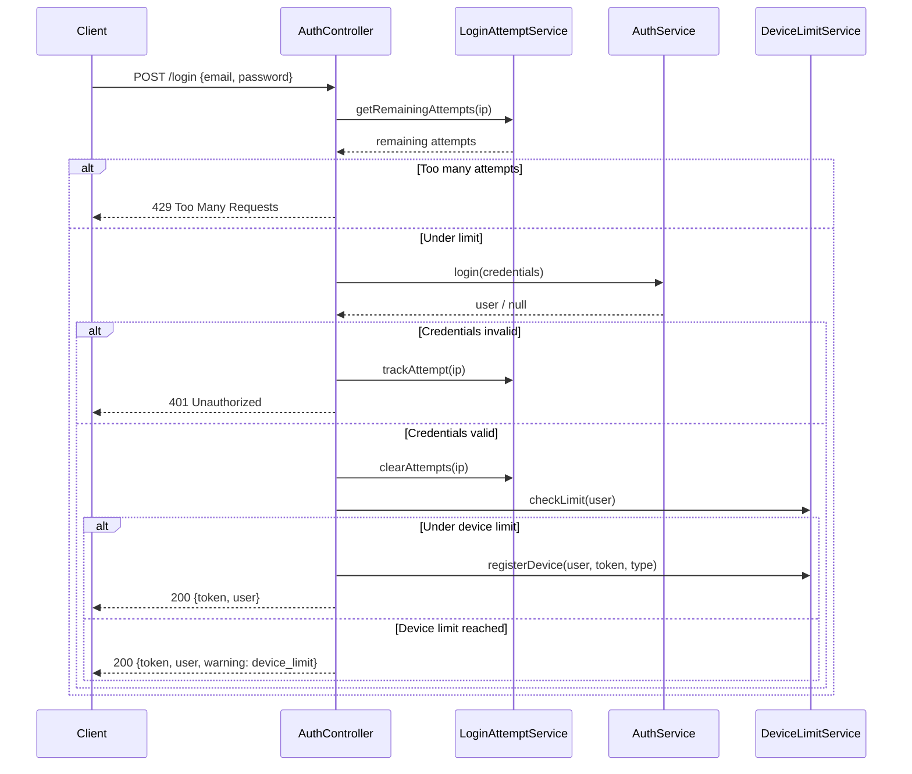

# Authentication Services

The Auth domain provides three services that handle authentication, device management, and login throttling.

## AuthService

The primary authentication service responsible for credential validation and token management.

### Methods

| Method | Description |
|--------|-------------|
| `login(array $credentials)` | Authenticates a user and returns a token |
| `logout($user)` | Invalidates the current token |
| `refresh($user)` | Refreshes an expired token |
| `validateCredentials(array $credentials)` | Validates credentials without issuing a token |

### Usage

```php
$authService = app(AuthService::class);

// Login
$result = $authService->login([
    'email'    => 'user@example.com',
    'password' => 'secret',
]);

// Logout
$authService->logout($user);
```

## DeviceLimitService

Enforces multi-device limits per user type to control concurrent sessions.

### Configuration: Max Devices Per User Type

```php
// config/auth.php
'device_limits' => [
    'student' => 2,
    'teacher' => 3,
    'academy' => 5,
    'secretary' => 3,
    'admin' => 10,
],
```

### Methods

| Method | Description |
|--------|-------------|
| `checkLimit($user)` | Checks whether the user can register another device |
| `registerDevice($user, $token, $type)` | Registers a new device token for the user |
| `revokeDevice($tokenId)` | Removes a device token, freeing a slot |

### Enforcement Flow

1. **Check limit** - Call `checkLimit($user)` to see if the user has reached their device maximum.
2. **Register or reject** - If under the limit, call `registerDevice()` to store the new token. If at the limit, return an error prompting the user to revoke an existing device.

```php
$deviceService = app(DeviceLimitService::class);

if ($deviceService->checkLimit($user)) {
    $deviceService->registerDevice($user, $fcmToken, 'android');
} else {
    return response()->json(['error' => 'Device limit reached'], 403);
}
```

## LoginAttemptService

Tracks and throttles login attempts by IP address to prevent brute-force attacks.

### Methods

| Method | Description |
|--------|-------------|
| `trackAttempt(string $ip)` | Records a failed login attempt for the given IP |
| `getRemainingAttempts(string $ip)` | Returns the number of attempts remaining before lockout |
| `clearAttempts(string $ip)` | Resets the attempt counter on successful login |

### Rate Limiting

- **Threshold**: 5 attempts per minute per IP.
- Exceeding the threshold triggers a lockout period.
- Successful authentication clears the attempt counter.

```php
$attemptService = app(LoginAttemptService::class);

$remaining = $attemptService->getRemainingAttempts($ip);
if ($remaining <= 0) {
    return response()->json(['error' => 'Too many attempts'], 429);
}
```

## Login Flow

The following sequence diagram illustrates the full login flow across all three auth services:



## See Also

- [Device Limit Service](./device-limit) - Detailed device limit documentation
- [HasDeviceTokens Trait](../traits/has-device-tokens) - Device token model trait
