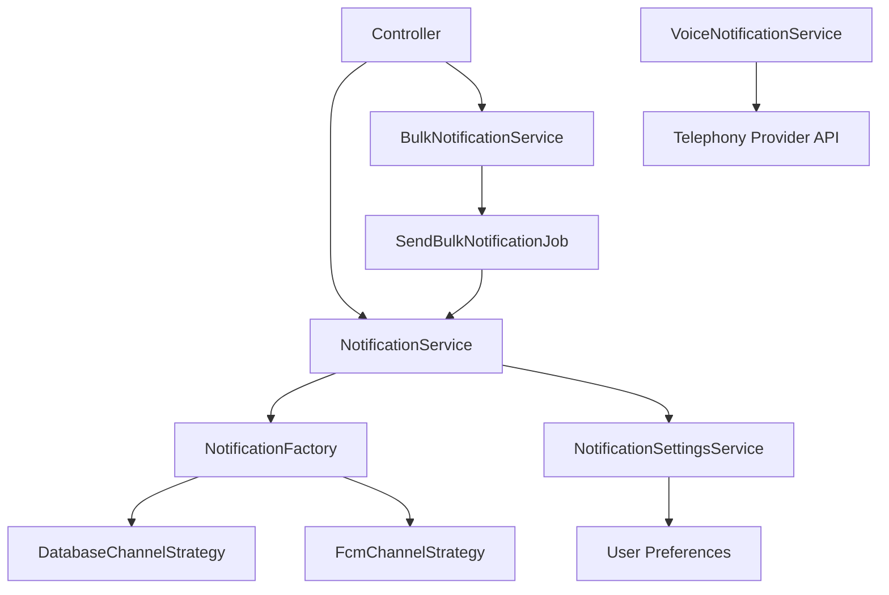

# Notification Services

The Notifications domain provides four services and supporting infrastructure for multi-channel notification delivery across the Neetaq platform.

## NotificationService

The primary service for sending individual notifications through multiple channels.

### Methods

| Method | Description |
|--------|-------------|
| `send($notifiable, $notification)` | Sends a notification to a notifiable entity |
| `sendToUser(int $userId, $notification)` | Sends a notification to a specific user |
| `sendToRole(string $role, $notification)` | Broadcasts a notification to all users with a given role |

### Usage

```php
$notificationService = app(NotificationService::class);

// Send to a specific user
$notificationService->sendToUser($userId, new ExamCreatedNotification($exam));

// Send to all teachers
$notificationService->sendToRole('teacher', new SystemMaintenanceNotification());
```

## BulkNotificationService

Handles high-volume notification dispatch via queued jobs.

### Methods

| Method | Description |
|--------|-------------|
| `sendBulk(array $recipients, $notification)` | Queues notifications for multiple recipients |
| `processQueue()` | Processes the next batch of queued notifications |

### Usage

```php
$bulkService = app(BulkNotificationService::class);

$bulkService->sendBulk($studentIds, new ExamResultNotification($exam));
```

The service dispatches `SendBulkNotificationJob` instances to the queue, allowing large batches to be processed asynchronously without blocking the request.

## NotificationSettingsService

Manages per-user notification preferences and channel opt-in/opt-out.

### Methods

| Method | Description |
|--------|-------------|
| `getSettings(int $userId)` | Retrieves notification preferences for a user |
| `updateSettings(int $userId, array $settings)` | Updates notification preferences |
| `isChannelEnabled(int $userId, string $channel)` | Checks if a specific channel is enabled for a user |

### Usage

```php
$settingsService = app(NotificationSettingsService::class);

// Check before sending
if ($settingsService->isChannelEnabled($userId, 'fcm')) {
    $notificationService->sendToUser($userId, $notification);
}

// Update preferences
$settingsService->updateSettings($userId, [
    'fcm'      => true,
    'database' => true,
    'voice'    => false,
]);
```

## VoiceNotificationService

Handles voice call notifications via telephony integration.

### Methods

| Method | Description |
|--------|-------------|
| `initiateCall(string $phoneNumber, string $message)` | Initiates a voice call with a synthesized message |
| `handleCallback(array $payload)` | Processes callback responses from the telephony provider |

### Usage

```php
$voiceService = app(VoiceNotificationService::class);

$voiceService->initiateCall('+201234567890', 'Your exam results are now available.');
```

## Factory Pattern: NotificationFactory

The `NotificationFactory` determines which channel strategies to use based on the notification type and user preferences:

```php
class NotificationFactory
{
    public function resolveChannels(Notification $notification, User $user): array
    {
        // Returns an array of channel strategy instances
        // based on notification type and user settings
    }
}
```

## Channel Strategies

Notifications are delivered through pluggable channel strategies:

### DatabaseChannelStrategy

Persists notifications in the database for in-app retrieval.

```php
class DatabaseChannelStrategy implements ChannelStrategy
{
    public function send($notifiable, $notification): void
    {
        // Store notification in the database
    }
}
```

### FcmChannelStrategy

Delivers push notifications via Firebase Cloud Messaging.

```php
class FcmChannelStrategy implements ChannelStrategy
{
    public function send($notifiable, $notification): void
    {
        // Send FCM push notification using device tokens
    }
}
```

## Jobs

### SendBulkNotificationJob

A queued job that processes bulk notification dispatch:

```php
class SendBulkNotificationJob implements ShouldQueue
{
    public function __construct(
        public array $recipientIds,
        public string $notificationClass,
        public array $notificationData,
    ) {}

    public function handle(
        NotificationService $notificationService,
    ): void {
        foreach ($this->recipientIds as $userId) {
            $notificationService->sendToUser($userId, $notification);
        }
    }
}
```

**Queue Configuration:**

| Setting | Value |
|---------|-------|
| Queue | `notifications` |
| Timeout | 120 seconds |
| Tries | 3 |
| Backoff | 30 seconds |

## Architecture Diagram



## See Also

- [Notification Domain](../domains/notifications) - Domain models and migrations
- [Jobs & Events](../jobs-events) - Background job reference
