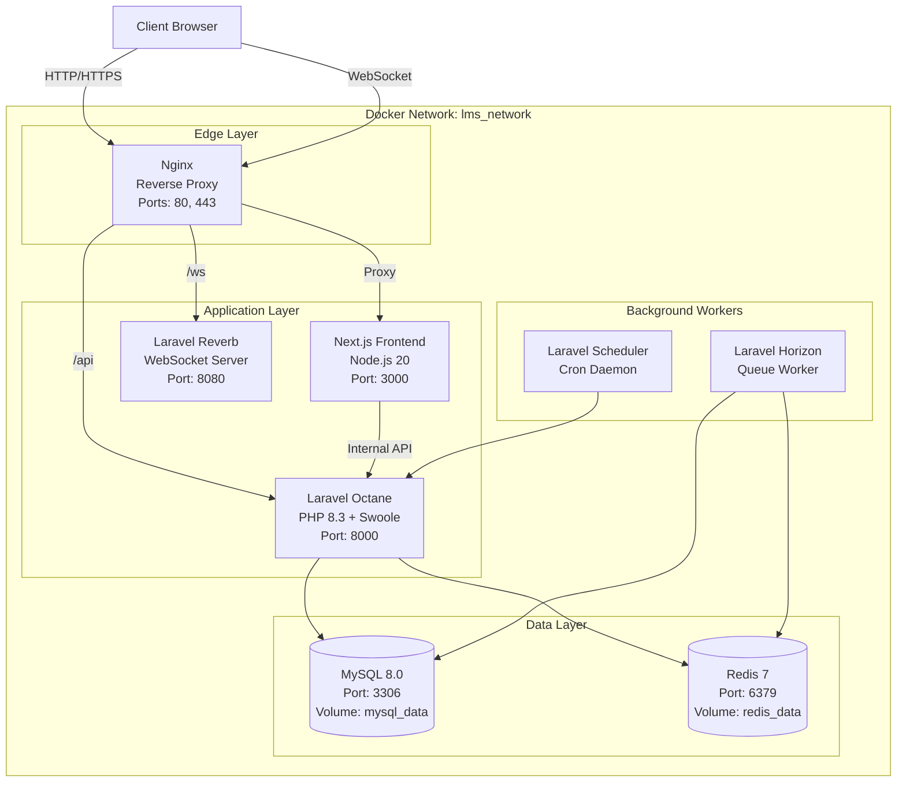
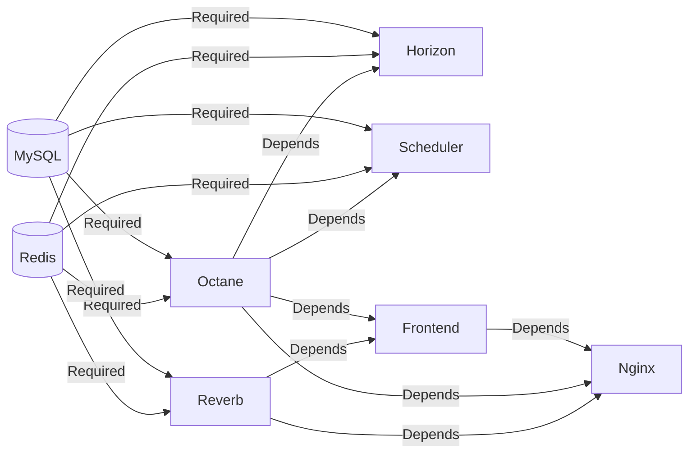

# Docker Architecture Overview

The Neetaq platform uses Docker Compose for container orchestration with separate configurations for development and production environments.

## Container Architecture



## Services Reference

### 1. MySQL Database

| Property | Value |
|----------|-------|
| **Image** | `mysql:8.0` |
| **Container** | `lms_mysql` |
| **Internal Port** | `3306` |
| **External Port** | `3307` |
| **Volume** | `mysql_data` |

```yaml
services:
  mysql:
    image: mysql:8.0
    container_name: lms_mysql
    environment:
      MYSQL_DATABASE: ${DB_DATABASE:-lms}
      MYSQL_ROOT_PASSWORD: ${DB_PASSWORD:-secret}
      MYSQL_USER: ${DB_USERNAME:-lms_user}
      MYSQL_PASSWORD: ${DB_PASSWORD:-secret}
    volumes:
      - mysql_data:/var/lib/mysql
    ports:
      - "3307:3306"
    healthcheck:
      test: ["CMD", "mysqladmin", "ping", "-h", "localhost"]
      interval: 10s
      timeout: 5s
      retries: 10
      start_period: 30s
```

### 2. Redis Cache & Queue

| Property | Value |
|----------|-------|
| **Image** | `redis:7-alpine` |
| **Container** | `lms_redis` |
| **Internal Port** | `6379` |
| **External Port** | `6380` |
| **Volume** | `redis_data` |

```yaml
services:
  redis:
    image: redis:7-alpine
    container_name: lms_redis
    ports:
      - "6380:6379"
    volumes:
      - redis_data:/data
    healthcheck:
      test: ["CMD", "redis-cli", "ping"]
      interval: 10s
      timeout: 5s
      retries: 5
```

### 3. Laravel Octane (Backend API)

| Property | Value |
|----------|-------|
| **Build Context** | `./backend` |
| **Dockerfile** | `Dockerfile.dev` |
| **Container** | `lms_octane` |
| **Port** | `8000:8000` |
| **Server** | Swoole |

```yaml
services:
  octane:
    build:
      context: ./backend
      dockerfile: Dockerfile.dev
    container_name: lms_octane
    ports:
      - "8000:8000"
    volumes:
      - ./backend:/var/www/backend
      - /var/www/backend/vendor
      - /var/www/backend/storage
    environment:
      - APP_ENV=${APP_ENV:-local}
      - OCTANE_SERVER=swoole
      - SWOOLE_HTTP_HOST=0.0.0.0
      - SWOOLE_HTTP_PORT=8000
    healthcheck:
      test: ["CMD-SHELL", "curl -f http://localhost:8000/health || exit 1"]
      interval: 30s
      timeout: 10s
      retries: 3
```

### 4. Laravel Horizon (Queue Worker)

| Property | Value |
|----------|-------|
| **Container** | `lms_horizon` |
| **Purpose** | Process background jobs |
| **Queue Driver** | Redis |

```yaml
services:
  horizon:
    build:
      context: ./backend
      dockerfile: Dockerfile.dev
    container_name: lms_horizon
    command: php artisan horizon
```

### 5. Laravel Reverb (WebSocket)

| Property | Value |
|----------|-------|
| **Container** | `lms_reverb` |
| **Port** | `8080:8080` |
| **Protocol** | WebSocket |

```yaml
services:
  reverb:
    build:
      context: ./backend
      dockerfile: Dockerfile.dev
    container_name: lms_reverb
    ports:
      - "8080:8080"
    command: php artisan reverb:start --host=0.0.0.0 --port=8080
```

### 6. Laravel Scheduler (Cron)

| Property | Value |
|----------|-------|
| **Container** | `lms_scheduler` |
| **Purpose** | Run scheduled tasks |

```yaml
services:
  scheduler:
    build:
      context: ./backend
      dockerfile: Dockerfile.dev
    container_name: lms_scheduler
    command: php artisan schedule:work
```

### 7. Next.js Frontend

| Property | Value |
|----------|-------|
| **Build Context** | `./frontend` |
| **Dockerfile** | `Dockerfile.dev` |
| **Container** | `lms_frontend` |
| **Port** | `3000:3000` |

```yaml
services:
  frontend:
    build:
      context: ./frontend
      dockerfile: Dockerfile.dev
    container_name: lms_frontend
    ports:
      - "3000:3000"
    volumes:
      - ./frontend:/app
      - /app/node_modules
      - /app/.next
    environment:
      - NODE_ENV=development
```

### 8. Nginx Reverse Proxy

| Property | Value |
|----------|-------|
| **Image** | `nginx:alpine` |
| **Container** | `lms_nginx` |
| **Ports** | `80:80`, `443:443` |

```yaml
services:
  nginx:
    image: nginx:alpine
    container_name: lms_nginx
    ports:
      - "80:80"
      - "443:443"
    volumes:
      - ./nginx/conf.d:/etc/nginx/conf.d
      - ./nginx/ssl:/etc/nginx/ssl
```

## Port Mapping Summary

| Service | Internal Port | External Port | Purpose |
|---------|--------------|---------------|---------|
| MySQL | 3306 | 3307 | Database access |
| Redis | 6379 | 6380 | Cache/Queue access |
| Octane | 8000 | 8000 | Backend API |
| Reverb | 8080 | 8080 | WebSocket server |
| Frontend | 3000 | 3000 | Next.js dev server |
| Nginx | 80/443 | 80/443 | Reverse proxy |

## Volumes

### Named Volumes

| Volume | Service | Path | Purpose |
|--------|---------|------|---------|
| `mysql_data` | MySQL | `/var/lib/mysql` | Persistent database storage |
| `redis_data` | Redis | `/data` | Persistent Redis storage |

### Bind Mounts

| Source | Container | Purpose |
|--------|-----------|---------|
| `./backend` | `/var/www/backend` | Live code changes |
| `./frontend` | `/app` | Live code changes |
| `./nginx/conf.d` | `/etc/nginx/conf.d` | Nginx configuration |
| `./nginx/ssl` | `/etc/nginx/ssl` | SSL certificates |
| `./secrets` | `/var/www/backend/storage` | Credentials |

### Anonymous Volumes

Used for dependency isolation:

```yaml
volumes:
  - /var/www/backend/vendor    # Composer deps (isolated)
  - /var/www/backend/storage   # Storage (isolated)
  - /app/node_modules          # NPM deps (isolated)
  - /app/.next                 # Build cache (isolated)
```

## Network Configuration

### Bridge Network

```yaml
networks:
  lms_network:
    driver: bridge
```

All services communicate via the `lms_network` bridge network using service names as hostnames:

- `mysql` → resolves to MySQL container
- `redis` → resolves to Redis container
- `octane` → resolves to Octane container
- `reverb` → resolves to Reverb container

### Production Network Aliases

```yaml
networks:
  lms_network:
    aliases:
      - neetaq.com
      - www.neetaq.com
```

## Health Checks

| Service | Check Method | Interval | Timeout | Retries |
|---------|-------------|----------|---------|---------|
| MySQL | `mysqladmin ping` | 10s | 5s | 10 |
| Redis | `redis-cli ping` | 10s | 5s | 5 |
| Octane | HTTP GET /health | 30s | 10s | 3 |
| Frontend | HTTP GET / | 30s | 10s | 3 |
| Reverb | TCP connection | 30s | 5s | 3 |

### Health Check Commands

```bash
# Check MySQL health
docker inspect --format='{{.State.Health.Status}}' lms_mysql

# Check all services
docker compose ps

# View health check logs
docker compose logs mysql | grep health
```

## Service Dependencies



## Resource Limits (Production)

```yaml
services:
  octane:
    deploy:
      resources:
        limits:
          cpus: '2.0'
          memory: 2G
        reservations:
          cpus: '1.0'
          memory: 1G
  
  mysql:
    deploy:
      resources:
        limits:
          cpus: '1.0'
          memory: 1G
```

## Development vs Production

| Aspect | Development | Production |
|--------|-------------|------------|
| **Dockerfile** | `Dockerfile.dev` | `Dockerfile` |
| **Volumes** | Bind mounts for hot reload | Named volumes only |
| **Workers** | `auto` | Fixed count |
| **Watch** | Enabled | Disabled |
| **Debug** | Enabled | Disabled |
| **Secrets** | Bind mounts | Docker secrets |
| **SSL** | Optional | Required |

## Common Operations

### View Container Status

```bash
docker compose ps
```

### View Resource Usage

```bash
docker stats
```

### Execute Commands

```bash
# Backend shell
docker compose exec octane sh

# Frontend shell
docker compose exec frontend sh

# MySQL CLI
docker compose exec mysql mysql -u lms_user -p lms

# Redis CLI
docker compose exec redis redis-cli
```

### Logs

```bash
# All services
docker compose logs -f

# Specific service
docker compose logs -f octane

# Last 100 lines
docker compose logs --tail=100 octane
```

## References

- [`docker-compose.yml`](/docker-compose.yml) - Development configuration
- [`docker-compose.prod.yml`](/docker-compose.prod.yml) - Production configuration
- [`backend/Dockerfile`](/backend/Dockerfile) - Production backend image
- [`backend/Dockerfile.dev`](/backend/Dockerfile.dev) - Development backend image
- [`frontend/Dockerfile.dev`](/frontend/Dockerfile.dev) - Development frontend image
- [`frontend/Dockerfile.prod`](/frontend/Dockerfile.prod) - Production frontend image
- [`nginx/conf.d/default.conf`](/nginx/conf.d/default.conf) - Nginx configuration

## TODO

- [ ] Add Docker Swarm configuration
- [ ] Document Kubernetes migration path
- [ ] Add monitoring with Prometheus/Grafana
- [ ] Document backup/restore procedures
- [ ] Add SSL auto-renewal with Certbot
