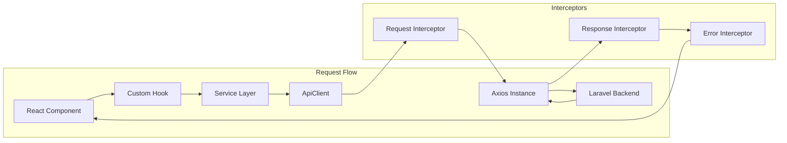

# API Client

The Neetaq frontend uses a centralized API client with automatic academy context injection, token management, and comprehensive error handling.

## Architecture



## ApiClient Implementation

```typescript
// lib/apiClient.ts
import axios, { AxiosInstance, AxiosRequestConfig, AxiosResponse } from 'axios';
import { API_CONFIG, getVersionedApiUrl } from '@/config/api-config';
import { getCSRFToken } from './csrf';
import { getAccessToken, refreshAccessToken } from './tokenManager';
import { ApiError, handleApiError } from './errorHandler';

export type HttpMethod = 'GET' | 'POST' | 'PUT' | 'PATCH' | 'DELETE';

interface RequestOptions extends Omit<AxiosRequestConfig, 'headers' | 'method'> {
  headers?: Record<string, string>;
  params?: Record<string, string | number | boolean | undefined>;
  skipAuth?: boolean;
  skipAcademy?: boolean;
}

class ApiClient {
  private instance: AxiosInstance;
  private academyContext: string | null = null;

  constructor() {
    this.instance = axios.create({
      baseURL: getVersionedApiUrl(),
      timeout: API_CONFIG.timeout,
      headers: {
        'Content-Type': 'application/json',
        'Accept': 'application/json',
      },
    });

    this.setupInterceptors();
  }

  /**
   * Set the current academy context
   * Called by AcademyProvider when academy changes
   */
  setAcademyContext(academyId: string | null): void {
    this.academyContext = academyId;
  }

  /**
   * Get the current academy context
   */
  getAcademyContext(): string | null {
    return this.academyContext;
  }

  /**
   * Setup request and response interceptors
   */
  private setupInterceptors(): void {
    // Request interceptor
    this.instance.interceptors.request.use(
      (config) => this.handleRequest(config),
      (error) => Promise.reject(error)
    );

    // Response interceptor
    this.instance.interceptors.response.use(
      (response) => response,
      (error) => this.handleError(error)
    );
  }

  /**
   * Handle outgoing requests
   */
  private handleRequest(config: any): any {
    // Add CSRF token
    const xsrfToken = getCSRFToken();
    if (xsrfToken) {
      config.headers['X-XSRF-TOKEN'] = xsrfToken;
    }

    // Add auth token (unless skipped)
    if (!config.skipAuth) {
      const token = getAccessToken();
      if (token) {
        config.headers['Authorization'] = `Bearer ${token}`;
      }
    }

    // Add academy context header (unless skipped)
    if (!config.skipAcademy) {
      const academyId = this.academyContext || this.getAcademyFromLegacy();
      if (academyId) {
        config.headers['X-Academy-Id'] = academyId;
      }
    }

    return config;
  }

  /**
   * Get academy ID from legacy localStorage
   * TODO: Remove once all components use AcademyContext
   */
  private getAcademyFromLegacy(): string | null {
    if (typeof window === 'undefined') return null;
    try {
      const saved = localStorage.getItem('currentAcademy');
      if (saved) {
        const parsed = JSON.parse(saved);
        return parsed.id;
      }
    } catch {
      return null;
    }
    return null;
  }

  /**
   * Handle response errors
   */
  private async handleError(error: any): Promise<any> {
    const originalRequest = error.config;

    // Handle 401 Unauthorized
    if (error.response?.status === 401 && !originalRequest._retry) {
      originalRequest._retry = true;

      try {
        // Attempt token refresh
        const newToken = await refreshAccessToken();
        if (newToken) {
          originalRequest.headers['Authorization'] = `Bearer ${newToken}`;
          return this.instance(originalRequest);
        }
      } catch (refreshError) {
        // Refresh failed, redirect to login
        window.location.href = '/login';
        return Promise.reject(refreshError);
      }
    }

    // Transform to ApiError
    const apiError = handleApiError(error);
    return Promise.reject(apiError);
  }

  /**
   * Generic request method
   */
  async request<T = any>(
    method: HttpMethod,
    url: string,
    options: RequestOptions = {}
  ): Promise<T> {
    const { skipAuth, skipAcademy, ...axiosOptions } = options;

    const response: AxiosResponse<T> = await this.instance.request({
      method,
      url,
      ...axiosOptions,
      skipAuth,
      skipAcademy,
    });

    return response.data;
  }

  // Convenience methods
  async get<T = any>(url: string, options?: RequestOptions): Promise<T> {
    return this.request<T>('GET', url, options);
  }

  async post<T = any>(url: string, data?: any, options?: RequestOptions): Promise<T> {
    return this.request<T>('POST', url, { ...options, data });
  }

  async put<T = any>(url: string, data?: any, options?: RequestOptions): Promise<T> {
    return this.request<T>('PUT', url, { ...options, data });
  }

  async patch<T = any>(url: string, data?: any, options?: RequestOptions): Promise<T> {
    return this.request<T>('PATCH', url, { ...options, data });
  }

  async delete<T = any>(url: string, options?: RequestOptions): Promise<T> {
    return this.request<T>('DELETE', url, options);
  }
}

// Export singleton instance
export const apiClient = new ApiClient();
```

## API Configuration

```typescript
// config/api-config.ts
/**
 * Unified API Configuration
 * 
 * API Versioning:
 * - All endpoints use /api/v1 prefix
 * - Version can be changed in one place for future updates
 */

export const API_CONFIG = {
  // Main API base URL
  baseUrl: process.env.NEXT_PUBLIC_API_URL || 'http://localhost:8000',

  // Internal API URL (used for server-side requests)
  internalUrl: process.env.INTERNAL_API_URL || process.env.NEXT_PUBLIC_API_URL || 'http://localhost:8000',

  // API Version
  version: 'v1',

  // API timeout settings
  timeout: 30000, // 30 seconds

  // Retry configuration
  retry: {
    attempts: 3,
    delay: 1000, // 1 second base delay
  },

  // Rate limiting
  rateLimit: {
    maxRequests: 100,
    windowMs: 60000, // 1 minute
  }
} as const;

// Helper to get clean base URL
export function getApiBaseUrl(): string {
  const baseUrl = API_CONFIG.baseUrl;
  
  if (!baseUrl || baseUrl === '/api') {
    return 'http://localhost:8000';
  }
  
  return baseUrl.replace(/\/api\/?$/, '').replace(/\/$/, '');
}

// Helper to get API URL with /api suffix
export function getApiUrl(): string {
  return `${getApiBaseUrl()}/api`;
}

// Helper to get versioned API URL
export function getVersionedApiUrl(): string {
  return `${getApiBaseUrl()}/api/${API_CONFIG.version}`;
}

// All API endpoints in one place
export const API_ENDPOINTS = {
  // Authentication endpoints
  auth: {
    loginAdmin: '/admin/login',
    loginTeacher: '/teacher/login',
    loginStudent: '/student/login',
    loginSecretary: '/login/secretary',
    loginParent: '/parent/login',
    loginAcademy: '/academy/login',

    logoutAdmin: '/admin/logout',
    logoutTeacher: '/teacher/logout',
    logoutStudent: '/student/logout',
    logoutSecretary: '/secretary/logout',
    logoutParent: '/parent/logout',
    logoutAcademy: '/academy/logout',

    me: (role: string) => `/${role}/me`,
    refresh: '/auth/refresh',
  },

  // Teacher endpoints
  teacher: {
    dashboard: '/teacher/dashboard/stats',
    students: '/teacher/students',
    student: (id: string) => `/teacher/students/${id}`,
    exams: '/teacher/exams',
    exam: (id: string) => `/teacher/exams/${id}`,
    lectures: '/teacher/lectures',
    lecture: (id: string) => `/teacher/lectures/${id}`,
    groups: '/teacher/groups',
    grades: '/teacher/grades',
  },

  // Student endpoints
  student: {
    dashboard: '/student/dashboard',
    exams: '/student/exams',
    exam: (id: string) => `/student/exams/${id}`,
    attemptExam: (id: string) => `/student/exams/${id}/start`,
    submitExam: (id: string) => `/student/exams/${id}/submit`,
    lectures: '/student/lectures',
  },

  // Admin endpoints
  admin: {
    dashboard: '/admin/dashboard/stats',
    teachers: '/admin/teachers',
    academies: '/admin/academies',
    students: '/admin/students',
  },

  // Academy endpoints
  academy: {
    dashboard: '/academy/dashboard',
    students: '/academy/students',
    teachers: '/academy/teachers',
    attendance: '/academy/attendance',
  },
} as const;
```

## Token Management

```typescript
// lib/tokenManager.ts
const TOKEN_KEY = 'access_token';
const REFRESH_TOKEN_KEY = 'refresh_token';

export function getAccessToken(): string | null {
  if (typeof window === 'undefined') return null;
  return localStorage.getItem(TOKEN_KEY);
}

export function setAccessToken(token: string): void {
  if (typeof window === 'undefined') return;
  localStorage.setItem(TOKEN_KEY, token);
}

export function getRefreshToken(): string | null {
  if (typeof window === 'undefined') return null;
  return localStorage.getItem(REFRESH_TOKEN_KEY);
}

export function setRefreshToken(token: string): void {
  if (typeof window === 'undefined') return;
  localStorage.setItem(REFRESH_TOKEN_KEY, token);
}

export function clearTokens(): void {
  if (typeof window === 'undefined') return;
  localStorage.removeItem(TOKEN_KEY);
  localStorage.removeItem(REFRESH_TOKEN_KEY);
}

export async function refreshAccessToken(): Promise<string | null> {
  const refreshToken = getRefreshToken();
  if (!refreshToken) return null;

  try {
    const response = await fetch(
      `${API_CONFIG.baseUrl}/api/v1/auth/refresh`,
      {
        method: 'POST',
        headers: { 'Content-Type': 'application/json' },
        body: JSON.stringify({ refresh_token: refreshToken }),
      }
    );

    if (!response.ok) throw new Error('Refresh failed');

    const data = await response.json();
    setAccessToken(data.token);
    if (data.refresh_token) {
      setRefreshToken(data.refresh_token);
    }

    return data.token;
  } catch (error) {
    clearTokens();
    return null;
  }
}
```

## Error Handling

```typescript
// lib/errorHandler.ts
export interface ApiError {
  message: string;
  statusCode: number;
  errors?: Record<string, string[]>;
  code?: string;
  data?: any;
}

export function handleApiError(error: any): ApiError {
  // Axios error
  if (error.response) {
    const { data, status } = error.response;
    return {
      message: data?.message || 'An error occurred',
      statusCode: status,
      errors: data?.errors,
      code: data?.code,
      data: data?.data,
    };
  }

  // Network error
  if (error.request) {
    return {
      message: 'Network error. Please check your connection.',
      statusCode: 0,
    };
  }

  // Other errors
  return {
    message: error.message || 'An unexpected error occurred',
    statusCode: 500,
  };
}

// React hook for error handling
export function useApiError() {
  const [error, setError] = useState<ApiError | null>(null);

  const handleError = useCallback((err: any) => {
    const apiError = handleApiError(err);
    setError(apiError);
    
    // Show toast notification
    toast.error(apiError.message);
    
    return apiError;
  }, []);

  const clearError = useCallback(() => {
    setError(null);
  }, []);

  return { error, handleError, clearError };
}
```

## Service Layer Example

```typescript
// services/studentService.ts
import { apiClient } from '@/lib/apiClient';
import { API_ENDPOINTS } from '@/config/api-config';
import { Student, CreateStudentData, UpdateStudentData } from '@/types/models';

export const studentService = {
  async getAll(): Promise<Student[]> {
    return apiClient.get(API_ENDPOINTS.teacher.students);
  },

  async getById(id: string): Promise<Student> {
    return apiClient.get(API_ENDPOINTS.teacher.student(id));
  },

  async create(data: CreateStudentData): Promise<Student> {
    return apiClient.post(API_ENDPOINTS.teacher.students, data);
  },

  async update(id: string, data: UpdateStudentData): Promise<Student> {
    return apiClient.put(API_ENDPOINTS.teacher.student(id), data);
  },

  async delete(id: string): Promise<void> {
    return apiClient.delete(API_ENDPOINTS.teacher.student(id));
  },

  async toggleStatus(id: string, isActive: boolean): Promise<Student> {
    return apiClient.put(
      `${API_ENDPOINTS.teacher.student(id)}/toggle-status`,
      { is_active: isActive }
    );
  },
};
```

## React Query Integration

```typescript
// hooks/useApi.ts
import { useQuery, useMutation, useQueryClient, UseQueryOptions } from '@tanstack/react-query';
import { apiClient } from '@/lib/apiClient';

// Generic hook for GET requests
export function useApiQuery<T>(
  key: string[],
  url: string,
  options?: UseQueryOptions<T>
) {
  return useQuery<T>({
    queryKey: key,
    queryFn: () => apiClient.get(url),
    ...options,
  });
}

// Generic hook for mutations
export function useApiMutation<T, D = any>(
  method: 'POST' | 'PUT' | 'PATCH' | 'DELETE',
  url: string | ((data: D) => string),
  options?: {
    invalidateKeys?: string[][];
    onSuccess?: (data: T) => void;
    onError?: (error: any) => void;
  }
) {
  const queryClient = useQueryClient();

  return useMutation({
    mutationFn: async (data: D) => {
      const endpoint = typeof url === 'function' ? url(data) : url;
      
      switch (method) {
        case 'POST':
          return apiClient.post(endpoint, data);
        case 'PUT':
          return apiClient.put(endpoint, data);
        case 'PATCH':
          return apiClient.patch(endpoint, data);
        case 'DELETE':
          return apiClient.delete(endpoint);
        default:
          throw new Error(`Unsupported method: ${method}`);
      }
    },
    onSuccess: (data) => {
      options?.invalidateKeys?.forEach((key) => {
        queryClient.invalidateQueries({ queryKey: key });
      });
      options?.onSuccess?.(data);
    },
    onError: options?.onError,
  });
}

// Usage example
export function useStudents() {
  return useApiQuery<Student[]>(['students'], '/teacher/students');
}

export function useCreateStudent() {
  return useApiMutation<Student, CreateStudentData>('POST', '/teacher/students', {
    invalidateKeys: [['students']],
  });
}
```

## References

- [`frontend/src/lib/apiClient.ts`](/frontend/src/lib/apiClient.ts)
- [`frontend/src/config/api-config.ts`](/frontend/src/config/api-config.ts)
- [`frontend/src/lib/tokenManager.ts`](/frontend/src/lib/tokenManager.ts)
- [`frontend/src/lib/errorHandler.ts`](/frontend/src/lib/errorHandler.ts)

## TODO

- [ ] Add request/response logging configuration
- [ ] Document offline support with background sync
- [ ] Add request deduplication documentation
- [ ] Document optimistic updates pattern
