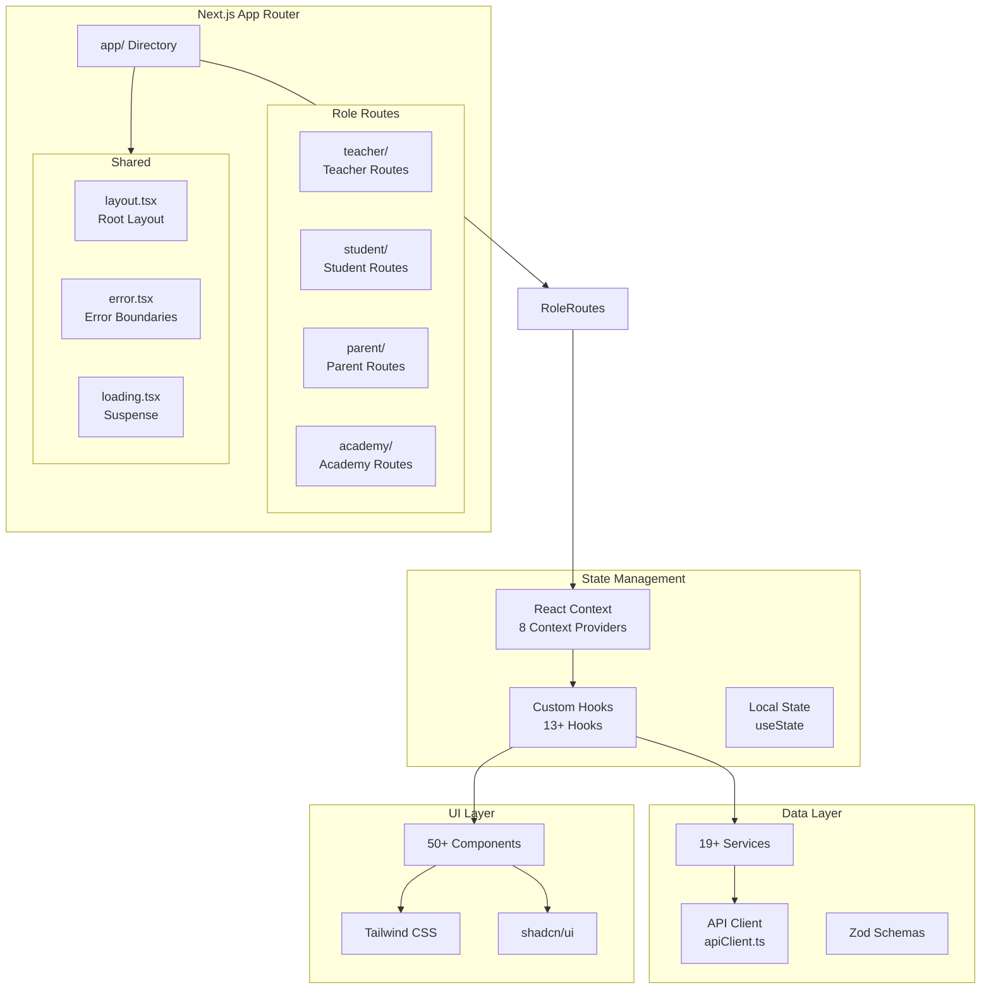

# Frontend Architecture

The Neetaq frontend is built with Next.js 15, React 18, and TypeScript, following modern React patterns with server and client components.

## Architecture Overview



## Directory Structure

```
frontend/src/
├── app/                          # Next.js App Router
│   ├── teacher/                  # Teacher role routes
│   │   ├── dashboard/
│   │   ├── students/             # Student management (add, edit, payment)
│   │   ├── lectures/             # Lecture management (create, attendance)
│   │   ├── exams/                # Exam management (add, edit, results)
│   │   ├── attendance/           # Attendance tracking
│   │   ├── grades/               # Grade management
│   │   ├── groups/               # Group management
│   │   ├── secretaries/          # Secretary management
│   │   ├── gamification/         # Gamification features
│   │   ├── notifications/        # Notifications (students, developer)
│   │   ├── reports/              # Teacher reports & analytics
│   │   ├── videos/               # Video management (create, view)
│   │   ├── subscription/         # Subscription management
│   │   ├── profile/              # Profile settings
│   │   └── layout.tsx
│   │
│   ├── student/                  # Student role routes
│   │   ├── dashboard/
│   │   ├── exams/                # Take exams
│   │   ├── lectures/             # View lectures
│   │   ├── attend/               # QR attendance check-in
│   │   ├── leaderboard/          # Gamification leaderboard
│   │   ├── mistakes/             # Mistake tracking & quiz
│   │   ├── notifications/        # Student notifications
│   │   ├── teachers/             # Teacher information
│   │   ├── videos/               # Video viewing
│   │   ├── profile/              # Profile settings
│   │   └── layout.tsx
│   │
│   ├── parent/                   # Parent role routes
│   │   ├── dashboard/
│   │   ├── children/             # Children management
│   │   ├── profile/              # Profile settings
│   │   ├── [childId]/summary/    # Child progress summary
│   │   └── layout.tsx
│   │
│   ├── academy/                  # Academy role routes
│   │   ├── dashboard/
│   │   ├── students/             # Student management
│   │   ├── teachers/             # Teacher management
│   │   ├── lectures/             # Lecture management
│   │   ├── exams/                # Exam management
│   │   ├── attendance/           # Attendance tracking
│   │   ├── grades/               # Grade management
│   │   ├── groups/               # Group management
│   │   ├── secretaries/          # Secretary management
│   │   ├── gamification/         # Gamification features
│   │   ├── notifications/        # Notifications
│   │   ├── reports/              # Academy reports & analytics
│   │   ├── videos/               # Video management
│   │   ├── billing/              # Billing & payments
│   │   ├── subscription/         # Subscription management
│   │   ├── profile/              # Profile settings
│   │   └── layout.tsx
│   │
│   ├── login/                    # Login page
│   ├── maintenance/              # Maintenance page
│   ├── layout.tsx                # Root layout
│   ├── page.tsx                  # Landing page
│   └── not-found.tsx             # 404 page
│
├── components/                   # React Components
│   ├── ui/                       # Base UI components (Button, Input, Select, etc.)
│   ├── auth/                     # Auth components (LoginCard, RequireAuth, etc.)
│   ├── dashboard/                # Dashboard components (Navbar, Sidebar, DataTable, etc.)
│   ├── video/                    # Video components (SecureVideoPlayer, WatermarkOverlay, etc.)
│   ├── reports/                  # Report components (DrilldownTable, KpiCard, etc.)
│   ├── notifications/            # Notification components
│   ├── payments/                 # Payment components
│   ├── performance/              # Performance monitoring components
│   ├── shared/                   # Shared utility components
│   ├── student/                  # Student-specific components
│   ├── subscription/             # Subscription components
│   ├── landing/                  # Landing page components
│   └── providers/                # Provider components
│
├── contexts/                     # React Contexts (8 providers)
│   ├── CoreAuthContext.tsx        # Base auth state (login, logout, session)
│   ├── EnhancedAuthContext.tsx    # Composed auth + selection + notifications
│   ├── SelectionContext.tsx       # Role-specific selections (teacher, child, academy)
│   ├── StudentTeacherContext.tsx  # Student-teacher dashboard data
│   ├── AcademyContext.tsx         # Multi-tenant academy selection
│   ├── NotificationContext.tsx    # Real-time notifications (Echo + FCM)
│   ├── PerformanceContext.tsx     # Web Vitals monitoring
│   └── SettingsContext.tsx        # Global settings + Firebase init + seasonal themes
│
├── hooks/                        # Custom Hooks (13+ hooks)
│   ├── useAuth.ts                # Auth hook (re-exports EnhancedAuthContext)
│   ├── useApiState.ts            # API state management (SWR, caching, optimistic)
│   ├── useUI.ts                  # UI utilities (modals, media queries, clipboard)
│   ├── usePerformance.ts         # Web Vitals & network optimization
│   ├── useNotifications.ts       # Echo + FCM unified notification hook
│   ├── useTranslation.ts         # i18n translation hook
│   ├── useForm.ts                # Form validation & auto-save
│   ├── useCSRFInit.ts            # CSRF token initialization
│   ├── useVideoPlayback.ts       # Secure video playback with tokens
│   ├── useVideoUpload.ts         # Chunked upload with retry & progress
│   └── home/useHeaderEffects.ts  # Landing page header effects
│
├── lib/                          # Utilities & Infrastructure
│   ├── apiClient.ts              # Centralized API client
│   ├── axios.ts                  # Axios instance configuration
│   ├── csrf.ts                   # CSRF token management
│   ├── echo.ts                   # Laravel Echo (Reverb WebSocket)
│   ├── firebase.ts               # Firebase FCM initialization
│   ├── tokenManager.ts           # Token storage & refresh
│   ├── errorHandler.ts           # Error handling utilities
│   ├── security.ts               # XSS prevention & input sanitization
│   ├── security.config.js        # CSP header generation
│   ├── seasonalTheme.ts          # Dynamic seasonal themes
│   └── testing-utils.tsx         # Test helpers
│
├── services/                     # API Services (19+ services)
│   ├── api/baseApi.ts            # Base fetch wrapper with auth & CSRF
│   ├── authService.ts            # Authentication per role
│   ├── teacherService.ts         # Core teacher operations
│   ├── academyService.ts         # Academy management
│   ├── videoService.ts           # Video upload, playback, quizzes
│   ├── lectureService.ts         # Lecture management
│   ├── notificationService.ts    # Notifications & voice messages
│   ├── subscriptionService.ts    # Subscription management
│   ├── paymentService.ts         # Payment processing
│   ├── secretaryService.ts       # Secretary CRUD
│   ├── gradeService.ts           # Grade CRUD
│   ├── groupService.ts           # Group CRUD
│   ├── avatarService.ts          # Avatar upload
│   ├── settingsService.ts        # Public settings
│   ├── teacherReportService.ts   # Teacher report analytics
│   ├── academyReportService.ts   # Academy report analytics
│   ├── roles.ts                  # Role-based permissions
│   └── teacher/                  # Teacher modular services
│       ├── teacherService.ts     # Comprehensive teacher service
│       └── modules/              # Sub-modules (dashboard, students, etc.)
│
├── types/                        # TypeScript Types (11 type files)
│   ├── api.types.ts              # API response types
│   ├── auth.types.ts             # Auth & user types (5 roles)
│   ├── components.types.ts       # UI component prop types
│   ├── dashboard.ts              # Dashboard type re-exports
│   ├── student.types.ts          # Student module types
│   ├── teacher.types.ts          # Teacher module types
│   ├── subscription.types.ts     # Subscription & billing types
│   ├── video.types.ts            # Video system types
│   ├── teacher-report.types.ts   # Teacher report types
│   ├── academyReport.types.ts    # Academy report types
│   └── index.ts                  # Barrel exports
│
├── schemas/                      # Zod Validation Schemas
│   ├── report.schema.ts          # Report validation schemas
│   └── teacher-report.schema.ts  # Teacher report schemas
│
├── i18n/                         # Internationalization
│   ├── config.ts                 # next-intl config (ar, en locales)
│   ├── index.ts                  # i18n exports
│   └── messages/
│       ├── ar.json               # Arabic translations
│       └── en.json               # English translations
│
├── styles/                       # CSS Styles
│   ├── globals.css               # Global styles
│   ├── components.css            # Component styles
│   ├── landing.css               # Landing page styles
│   ├── layout.css                # Layout styles
│   └── pages/login.css           # Login page styles
│
├── config/                       # Configuration
│   ├── api-config.ts             # API endpoints & config
│   └── performance.ts            # Bundle optimization & thresholds
│
├── utils/                        # Utility Functions
│   ├── authHelpers.ts            # Auth storage & cookie helpers
│   ├── generateInvoicePDF.ts     # PDF invoice generation
│   ├── studentTeacherAccess.ts   # Student-teacher access control
│   └── logger.ts                 # Logging utilities
│
└── middleware.ts                 # Route protection & role-based redirects
```

## Routing Architecture

Routes are organized by role using directory-based paths. Each role has its own route prefix and layout.

### Route Structure by Role

| Role | Path Prefix | Key Routes |
|------|------------|------------|
| Teacher | `/teacher/` | dashboard, students, lectures, exams, attendance, grades, groups, secretaries, gamification, notifications, reports, videos, subscription, profile |
| Student | `/student/` | dashboard, exams, lectures, attend, leaderboard, mistakes, notifications, teachers, videos, profile |
| Parent | `/parent/` | dashboard, children, profile, `[childId]/summary` |
| Academy | `/academy/` | dashboard, students, teachers, lectures, exams, attendance, grades, groups, secretaries, gamification, notifications, reports, videos, billing, subscription, profile |

### Middleware

The middleware (`middleware.ts`) handles:
- Cookie-based authentication checking
- Role-based redirects to the correct dashboard
- Protected route enforcement
- Role-to-dashboard mapping: `student → /student/dashboard`, `teacher → /teacher/dashboard`, `parent → /parent/children`, `academy → /academy/dashboard`

## State Management

The app uses React Context for global state with 8 providers:

| Context | Purpose |
|---------|---------|
| `CoreAuthContext` | Base auth state (login, logout, session validation) |
| `EnhancedAuthContext` | Composes CoreAuth + Selection + FCM notifications |
| `SelectionContext` | Role-specific selections (teacher for students, child for parents, academy for teachers) |
| `StudentTeacherContext` | Student-to-teacher dashboard data |
| `AcademyContext` | Multi-tenant academy selection with API context injection |
| `NotificationContext` | Real-time notifications via Echo + Firebase |
| `PerformanceContext` | Web Vitals monitoring and analytics |
| `SettingsContext` | Global settings, Firebase init, seasonal themes |

See [Authentication](/frontend/authentication) and [State Management](/frontend/state-management) for details.

## Data Fetching Patterns

Data fetching uses a combination of custom hooks (`useApiState`) and direct service calls:

- **`useApiState`** — Generic data fetcher with stale-while-revalidate caching
- **`useCachedApiState`** — Cross-component cache via Map
- **`useOptimisticMutation`** — Optimistic UI updates with rollback
- **`useInfiniteScroll`** — Paginated data loading

See [API Client](/frontend/api-client) for details.

## References

- [Routing](/frontend/routing) — Complete route map
- [Authentication](/frontend/authentication) — Auth system details
- [State Management](/frontend/state-management) — Contexts and hooks
- [Services Reference](/frontend/services-reference) — All service modules
- [Components Reference](/frontend/components-reference) — Component catalog
