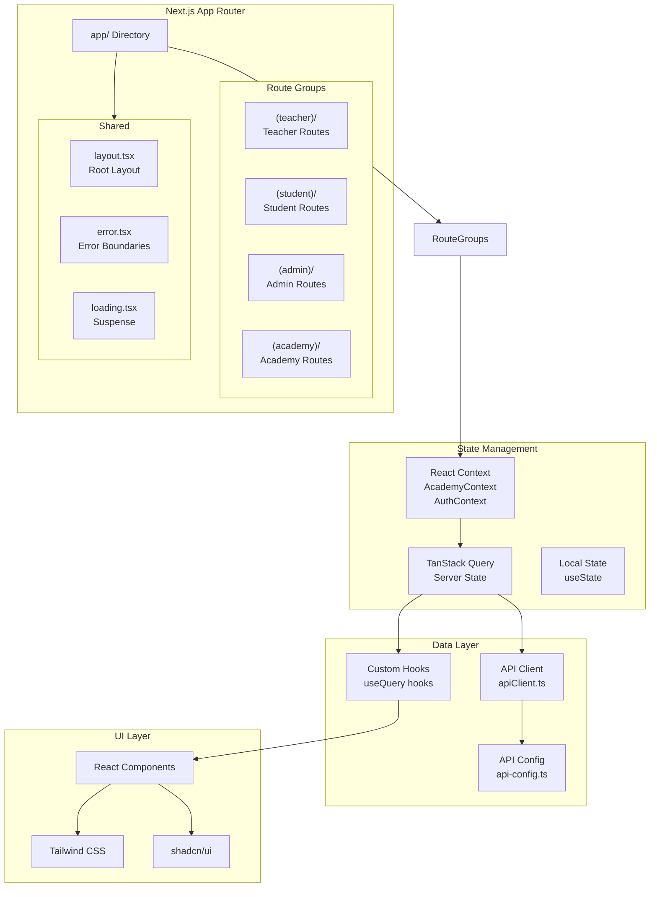

# Frontend Architecture

The Neetaq frontend is built with Next.js 15, React 18, and TypeScript, following modern React patterns with server and client components.

## Architecture Overview



## Directory Structure

```
frontend/src/
├── app/                          # Next.js App Router
│   ├── (teacher)/               # Teacher route group
│   │   ├── dashboard/
│   │   ├── students/
│   │   ├── lectures/
│   │   ├── exams/
│   │   └── layout.tsx
│   │
│   ├── (student)/               # Student route group
│   │   ├── dashboard/
│   │   ├── my-exams/
│   │   ├── lectures/
│   │   └── layout.tsx
│   │
│   ├── (admin)/                 # Admin route group
│   │   ├── dashboard/
│   │   ├── teachers/
│   │   ├── academies/
│   │   └── layout.tsx
│   │
│   ├── (academy)/               # Academy route group
│   │   ├── dashboard/
│   │   ├── students/
│   │   └── layout.tsx
│   │
│   ├── api/                     # API routes (if any)
│   ├── layout.tsx              # Root layout
│   ├── page.tsx                # Landing page
│   ├── globals.css             # Global styles
│   └── loading.tsx             # Global loading
│
├── components/                  # React Components
│   ├── ui/                     # shadcn/ui components
│   ├── common/                 # Shared components
│   │   ├── Header.tsx
│   │   ├── Sidebar.tsx
│   │   ├── DataTable.tsx
│   │   └── LoadingSpinner.tsx
│   ├── forms/                  # Form components
│   └── modals/                 # Modal components
│
├── contexts/                    # React Contexts
│   ├── AcademyContext.tsx
│   ├── AuthContext.tsx
│   └── NotificationContext.tsx
│
├── hooks/                       # Custom Hooks
│   ├── useAcademy.ts
│   ├── useAuth.ts
│   ├── useApi.ts
│   └── useLocalStorage.ts
│
├── lib/                         # Utilities & API
│   ├── apiClient.ts            # Centralized API client
│   ├── tokenManager.ts         # Token storage
│   ├── errorHandler.ts         # Error handling
│   └── csrf.ts                 # CSRF handling
│
├── config/                      # Configuration
│   ├── api-config.ts           # API endpoints & config
│   └── constants.ts            # App constants
│
├── types/                       # TypeScript Types
│   ├── api.ts
│   ├── models.ts
│   └── index.ts
│
├── services/                    # API Services
│   ├── authService.ts
│   ├── studentService.ts
│   ├── examService.ts
│   └── notificationService.ts
│
└── utils/                       # Utility functions
    ├── formatters.ts
    ├── validators.ts
    └── helpers.ts
```

## Routing Architecture

### Route Groups

Route groups (parentheses) organize routes without affecting the URL structure:

```tsx
// app/(teacher)/layout.tsx - Teacher layout with sidebar
export default function TeacherLayout({
  children,
}: {
  children: React.ReactNode;
}) {
  return (
    <div className="flex h-screen">
      <TeacherSidebar />
      <main className="flex-1 overflow-auto">
        {children}
      </main>
    </div>
  );
}

// app/(teacher)/dashboard/page.tsx
export default function TeacherDashboard() {
  return <DashboardContent />;
}
// URL: /dashboard (no /teacher prefix)
```

### Route Structure by Role

| Route Group | Path Pattern | Description |
|-------------|--------------|-------------|
| `(teacher)` | `/dashboard`, `/students`, `/exams` | Teacher portal |
| `(student)` | `/dashboard`, `/my-exams`, `/lectures` | Student portal |
| `(admin)` | `/dashboard`, `/teachers`, `/academies` | Admin portal |
| `(academy)` | `/dashboard`, `/students`, `/attendance` | Academy portal |

### Dynamic Routes

```tsx
// app/(teacher)/students/[id]/page.tsx
interface StudentPageProps {
  params: { id: string };
}

export default function StudentPage({ params }: StudentPageProps) {
  const { id } = params;
  
  return (
    <div>
      <h1>Student Details: {id}</h1>
      <StudentDetails studentId={id} />
    </div>
  );
}
```

## State Management

### TanStack React Query

Server state is managed with React Query for caching, synchronization, and background updates:

```tsx
// hooks/useStudents.ts
import { useQuery, useMutation, useQueryClient } from '@tanstack/react-query';
import { studentService } from '@/services/studentService';

export function useStudents() {
  return useQuery({
    queryKey: ['students'],
    queryFn: () => studentService.getAll(),
    staleTime: 5 * 60 * 1000, // 5 minutes
  });
}

export function useCreateStudent() {
  const queryClient = useQueryClient();
  
  return useMutation({
    mutationFn: studentService.create,
    onSuccess: () => {
      // Invalidate and refetch
      queryClient.invalidateQueries({ queryKey: ['students'] });
    },
  });
}

// Usage in component
export default function StudentsPage() {
  const { data: students, isLoading, error } = useStudents();
  const createStudent = useCreateStudent();
  
  if (isLoading) return <LoadingSpinner />;
  if (error) return <ErrorMessage error={error} />;
  
  return (
    <div>
      {students?.map(student => (
        <StudentCard key={student.id} student={student} />
      ))}
    </div>
  );
}
```

### Academy Context

Multi-tenant context for academy-scoped data:

```tsx
// contexts/AcademyContext.tsx
'use client';

import { createContext, useContext, useState, useEffect } from 'react';
import { apiClient } from '@/lib/apiClient';

interface AcademyContextType {
  currentAcademy: Academy | null;
  academies: Academy[];
  setCurrentAcademy: (academy: Academy | null) => void;
  isLoading: boolean;
}

const AcademyContext = createContext<AcademyContextType | undefined>(undefined);

export function AcademyProvider({ children }: { children: React.ReactNode }) {
  const [currentAcademy, setCurrentAcademy] = useState<Academy | null>(null);
  const [academies, setAcademies] = useState<Academy[]>([]);
  const [isLoading, setIsLoading] = useState(true);

  useEffect(() => {
    // Fetch user's academies
    apiClient.get('/teacher/dashboard/academies')
      .then(response => {
        setAcademies(response.data);
        // Restore from localStorage or use first
        const saved = localStorage.getItem('currentAcademy');
        if (saved) {
          setCurrentAcademy(JSON.parse(saved));
        } else if (response.data.length > 0) {
          setCurrentAcademy(response.data[0]);
        }
      })
      .finally(() => setIsLoading(false));
  }, []);

  const handleSetAcademy = (academy: Academy | null) => {
    setCurrentAcademy(academy);
    if (academy) {
      localStorage.setItem('currentAcademy', JSON.stringify(academy));
      apiClient.setAcademyContext(academy.id);
    }
  };

  return (
    <AcademyContext.Provider value={{
      currentAcademy,
      academies,
      setCurrentAcademy: handleSetAcademy,
      isLoading,
    }}>
      {children}
    </AcademyContext.Provider>
  );
}

export const useAcademy = () => {
  const context = useContext(AcademyContext);
  if (!context) throw new Error('useAcademy must be used within AcademyProvider');
  return context;
};
```

## Server vs Client Components

### Server Components (Default)

```tsx
// app/(teacher)/students/page.tsx - Server Component
import { studentService } from '@/services/studentService';

// Data fetching on server
async function getStudents() {
  const response = await studentService.getAll();
  return response.data;
}

export default async function StudentsPage() {
  const students = await getStudents();
  
  return (
    <div>
      <h1>Students</h1>
      <StudentTable students={students} />
    </div>
  );
}
```

### Client Components

```tsx
// components/StudentForm.tsx - Client Component
'use client';

import { useState } from 'react';
import { useCreateStudent } from '@/hooks/useStudents';

export default function StudentForm() {
  const [name, setName] = useState('');
  const createStudent = useCreateStudent();

  const handleSubmit = async (e: React.FormEvent) => {
    e.preventDefault();
    await createStudent.mutateAsync({ name });
    setName('');
  };

  return (
    <form onSubmit={handleSubmit}>
      <input
        value={name}
        onChange={(e) => setName(e.target.value)}
        placeholder="Student name"
      />
      <button type="submit" disabled={createStudent.isPending}>
        Add Student
      </button>
    </form>
  );
}
```

## Data Fetching Patterns

### Server-Side Fetching

```tsx
// Fetch on server with caching
async function getExam(examId: string) {
  const res = await fetch(
    `${process.env.INTERNAL_API_URL}/exams/${examId}`,
    { 
      next: { revalidate: 60 }, // ISR: regenerate every 60s
      headers: { Authorization: `Bearer ${token}` }
    }
  );
  
  if (!res.ok) throw new Error('Failed to fetch exam');
  return res.json();
}
```

### Client-Side Fetching

```tsx
// hooks/useExam.ts
import { useQuery } from '@tanstack/react-query';
import { apiClient } from '@/lib/apiClient';

export function useExam(examId: string) {
  return useQuery({
    queryKey: ['exam', examId],
    queryFn: () => apiClient.get(`/exams/${examId}`),
    enabled: !!examId,
  });
}
```

### Parallel Queries

```tsx
// Fetch multiple resources in parallel
export default function Dashboard() {
  const userQuery = useCurrentUser();
  const statsQuery = useDashboardStats();
  const notificationsQuery = useNotifications();
  
  const isLoading = 
    userQuery.isLoading || 
    statsQuery.isLoading || 
    notificationsQuery.isLoading;
  
  if (isLoading) return <DashboardSkeleton />;
  
  return (
    <DashboardLayout
      user={userQuery.data}
      stats={statsQuery.data}
      notifications={notificationsQuery.data}
    />
  );
}
```

## Loading & Error States

### Loading UI

```tsx
// app/(teacher)/students/loading.tsx
export default function Loading() {
  return (
    <div className="flex items-center justify-center h-screen">
      <LoadingSpinner size="lg" />
    </div>
  );
}
```

### Error Boundaries

```tsx
// app/(teacher)/students/error.tsx
'use client';

export default function Error({
  error,
  reset,
}: {
  error: Error & { digest?: string };
  reset: () => void;
}) {
  return (
    <div className="p-4">
      <h2>Something went wrong!</h2>
      <p>{error.message}</p>
      <button onClick={reset}>Try again</button>
    </div>
  );
}
```

## WebSocket Integration

```tsx
// hooks/useLaravelEcho.ts
import { useEffect, useRef } from 'react';
import Echo from 'laravel-echo';
import Pusher from 'pusher-js';

export function useLaravelEcho() {
  const echoRef = useRef<Echo | null>(null);

  useEffect(() => {
    window.Pusher = Pusher;
    
    echoRef.current = new Echo({
      broadcaster: 'reverb',
      key: process.env.NEXT_PUBLIC_REVERB_APP_KEY,
      wsHost: process.env.NEXT_PUBLIC_REVERB_HOST,
      wsPort: process.env.NEXT_PUBLIC_REVERB_PORT,
      wssPort: process.env.NEXT_PUBLIC_REVERB_PORT,
      forceTLS: process.env.NEXT_PUBLIC_REVERB_SCHEME === 'https',
      enabledTransports: ['ws', 'wss'],
    });

    return () => {
      echoRef.current?.disconnect();
    };
  }, []);

  return echoRef.current;
}

// Usage
export function useExamNotifications(examId: string) {
  const echo = useLaravelEcho();
  const queryClient = useQueryClient();

  useEffect(() => {
    if (!echo) return;

    const channel = echo
      .private(`exam.${examId}`)
      .listen('.exam.started', (e: any) => {
        queryClient.invalidateQueries({ queryKey: ['exam', examId] });
      });

    return () => {
      channel.stopListening('.exam.started');
    };
  }, [echo, examId, queryClient]);
}
```

## References

- [`frontend/src/app/`](/frontend/src/app/)
- [`frontend/src/contexts/`](/frontend/src/contexts/)
- [`frontend/src/hooks/`](/frontend/src/hooks/)
- [`frontend/src/lib/apiClient.ts`](/frontend/src/lib/apiClient.ts)
- [`frontend/next.config.js`](/frontend/next.config.js)

## TODO

- [ ] Add Server Actions documentation
- [ ] Document streaming and Suspense boundaries
- [ ] Add PWA configuration details
- [ ] Document image optimization with next/image
