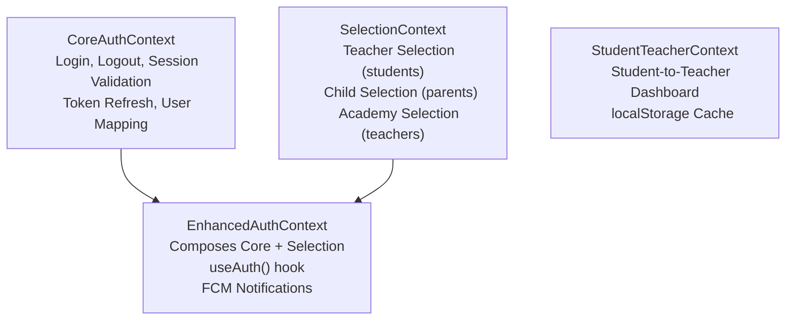

# Authentication

The frontend uses a 3-layer context architecture for authentication, with CSRF protection and role-based route guards.

## Architecture



## CoreAuthContext

**Source:** `frontend/src/contexts/CoreAuthContext.tsx`

Base authentication state management:

- **Login/Logout** — Handles login for all 5 user types (teacher, student, secretary, parent, academy)
- **Session Validation** — Validates existing sessions on mount with fallback to cached user data
- **Token Refresh** — Automatic token refresh on 401 responses
- **User Mapping** — `mapAuthResponseToUser()` normalizes auth responses into consistent user objects
- **Auth Clearing** — `clearAuth()` removes all auth state (cookies, localStorage, tokens)

**Exports:** `CoreAuthProvider`, `useCoreAuth`, `mapAuthResponseToUser`, `clearAuth`

## SelectionContext

**Source:** `frontend/src/contexts/SelectionContext.tsx`

Manages role-specific selections independently from auth state:

| Role | Selection | Storage |
|------|-----------|---------|
| Student | Teacher selection | localStorage |
| Parent | Child selection | localStorage |
| Teacher | Academy selection | localStorage |

Features:
- Smart teacher selection for students (filters accessible teachers via `studentTeacherAccess`)
- Automatic academy selection for teachers on mount
- Event dispatching for academy changes
- Persistence across sessions via localStorage

**Exports:** `SelectionProvider`, `useSelection`, `SelectionContext`

## EnhancedAuthContext

**Source:** `frontend/src/contexts/EnhancedAuthContext.tsx`

Composes CoreAuth + Selection into the primary `useAuth()` hook:

```tsx
const { user, login, logout, selectedTeacher, selectedChild, selectedAcademy } = useAuth();
```

Additional features:
- `enableNotifications()` — Firebase FCM token registration
- Backward compatibility exports for legacy code

**Exports:** `useAuth`, `AuthProvider`

## StudentTeacherContext

**Source:** `frontend/src/contexts/StudentTeacherContext.tsx`

Dedicated context for student-to-teacher dashboard data:

- Fetches teacher-specific dashboard data when student selects a teacher
- localStorage caching for selected teacher
- Loading state management for dashboard refresh

**Exports:** `StudentTeacherProvider`, `useStudentTeacher`

## CSRF Protection

### csrf.ts

**Source:** `frontend/src/lib/csrf.ts`

CSRF token management with single-flight initialization:

- `getCSRFToken()` — Returns current CSRF token from cookies
- `initializeCSRF()` — Fetches CSRF cookie from Sanctum endpoint (single-flight to prevent duplicates)
- `validateCSRF()` — Validates token existence and freshness

### useCSRFInit Hook

**Source:** `frontend/src/hooks/useCSRFInit.ts`

- `useCSRFInit()` — Initializes CSRF on component mount
- `useCSRFAutoRefresh()` — Periodic CSRF token refresh

## Token Management

**Source:** `frontend/src/lib/tokenManager.ts`

Handles JWT token lifecycle:
- Token storage in localStorage
- Token refresh before expiry
- Token cleanup on logout

## Route Guards

### RequireAuth

**Source:** `frontend/src/components/auth/RequireAuth.tsx`

Wrapper component that redirects to login if not authenticated:

```tsx
<RequireAuth>
  <ProtectedContent />
</RequireAuth>
```

### withAcademyAuth

**Source:** `frontend/src/components/auth/withAcademyAuth.tsx`

HOC that ensures academy context is available for academy-scoped pages.

### withTeacherAuth

**Source:** `frontend/src/components/auth/withTeacherAuth.tsx`

HOC that ensures teacher authentication for teacher-scoped pages.

## Auth Helpers

**Source:** `frontend/src/utils/authHelpers.ts`

Utility functions:
- `AUTH_COOKIES` — Cookie name constants (`auth_state`, `user_role`, etc.)
- `setAuthCookie()` / `clearAuthCookie()` — Cookie management with Secure and SameSite flags
- Storage key constants for localStorage
- Legacy token cleanup functions
- `createUser()` — Type-safe user creation helper

## Auth Types

**Source:** `frontend/src/types/auth.types.ts`

Key types:
- `UserType` — Union of `'teacher' | 'student' | 'secretary' | 'parent' | 'academy'`
- `BaseUser` — Common user properties (id, name, phone, avatar)
- `TeacherUser`, `StudentUser` — Role-specific interfaces with academy associations
- `AuthState` — Context state type
- `AuthResponse` — Login API response

## Auth Service

**Source:** `frontend/src/services/authService.ts`

- Login endpoints per role (teacher login, student login, etc.)
- Session validation endpoint
- Token refresh endpoint
