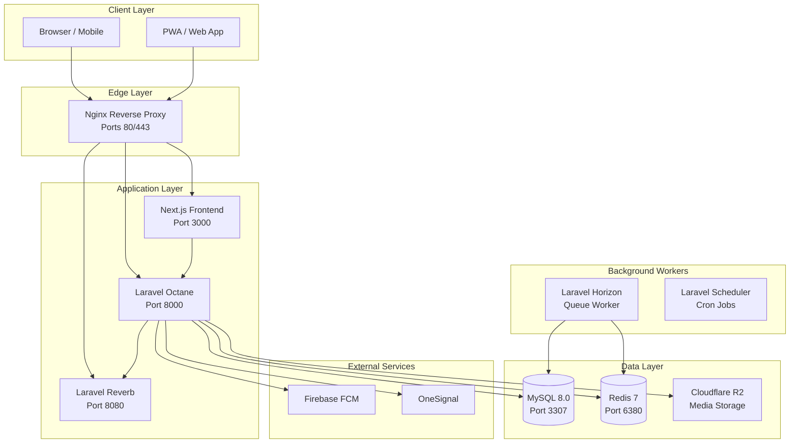

## System Overview

The Neetaq Educational Platform is a comprehensive Learning Management System (LMS) built with modern technologies designed for educational institutions.

### Technology Stack

| Layer | Technology |
|-------|------------|
| **Backend** | Laravel 11 + PHP 8.3 + Octane (Swoole) |
| **Frontend** | Next.js 15 + React 18 + TypeScript |
| **Database** | MySQL 8.0 + Redis 7 |
| **Real-Time** | Laravel Reverb (WebSocket) |
| **Queue** | Laravel Horizon + Redis |
| **Storage** | Cloudflare R2 |
| **Notifications** | Firebase FCM |

### Architecture Map



### Project Structure

```
neetaq/
├── backend/                 # Laravel Application
│   ├── app/
│   │   └── Domains/        # Domain-Driven Architecture
│   │       ├── Auth/       # Authentication (multi-guard)
│   │       ├── Exams/      # Exam & Assessment
│   │       ├── Lectures/   # Lecture & Attendance
│   │       ├── Enrollments/# Student Enrollment
│   │       ├── Notifications/# Push & Voice
│   │       ├── Subscriptions/# Payment & Plans
│   │       └── Media/      # File Storage (R2)
│   ├── config/
│   ├── database/
│   └── routes/
│       └── api.php         # API Routes
│
├── frontend/               # Next.js Application
│   ├── src/
│   │   ├── app/           # Next.js App Router
│   │   ├── components/    # React Components
│   │   ├── lib/          # API Client, Utils
│   │   └── contexts/     # React Contexts
│   └── public/
│
├── nginx/                 # Reverse Proxy Config
├── secrets/              # Docker Secrets
├── docker-compose.yml    # Development
└── docker-compose.prod.yml # Production
```

### Quick Links

| Resource | Description |
|----------|-------------|
| [Quick Start Guide](/getting-started/quickstart) | Docker-first development setup |
| [Environment Variables](/getting-started/env-vars) | Complete env var reference |
| [Docker Architecture](/docker/overview) | Container orchestration |
| [Backend Architecture](/backend/architecture) | Domain structure & conventions |
| [Frontend Architecture](/frontend/architecture) | Next.js app structure |
| [Adding Features](/cookbook/new-feature) | End-to-end feature guide |

### API Version

Current API version: **v1**

All endpoints are prefixed with `/api/v1/`

### Authentication Guards

| Guard | Description | Routes |
|-------|-------------|--------|
| `admin` | Super admin access | `/api/v1/admin/*` |
| `academy` | Academy management | `/api/v1/academy/*` |
| `teacher` | Teacher portal | `/api/v1/teacher/*` |
| `student` | Student portal | `/api/v1/student/*` |
| `secretary` | Secretary access | `/api/v1/secretary/*` |
| `guardian` | Parent portal | `/api/v1/parent/*` |

## Development Status

::: tip Development Mode
This documentation is actively maintained. For the latest API changes, check the source files referenced in each page.
:::

## Support

For technical support or questions:
- Check the [Troubleshooting](/getting-started/quickstart#troubleshooting) section
- Review [Docker logs](/docker/local-dev#viewing-logs)
- Verify [Environment Configuration](/getting-started/env-vars)

---

## References

- [`docker-compose.yml`](/docker-compose.yml) - Development orchestration
- [`docker-compose.prod.yml`](/docker-compose.prod.yml) - Production orchestration
- [`backend/routes/api.php`](/backend/routes/api.php) - API route definitions
- [`backend/config/auth.php`](/backend/config/auth.php) - Authentication configuration
- [`frontend/src/config/api-config.ts`](/frontend/src/config/api-config.ts) - Frontend API configuration

## TODO

- [ ] Add API endpoint reference with OpenAPI/Swagger
- [ ] Create deployment checklist
- [ ] Add monitoring & alerting documentation
- [ ] Document backup & restore procedures
