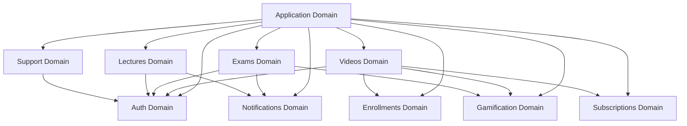

# Architecture & Clean Code Review Report
## Neetaq LMS Backend

**Review Date:** 2026-03-23  
**Reviewer:** Architecture Review (Architect Mode)

---

## Executive Summary

The Neetaq LMS backend demonstrates a **mature domain-driven architecture** with 12 well-organized domains. The codebase shows strong adherence to several clean code principles, particularly in the newer Videos domain. However, there are notable inconsistencies and areas requiring attention.

### Overall Rating: ⭐⭐⭐⭐ (4/5)

| Category | Rating | Status |
|----------|--------|--------|
| Controller Thinness | ⭐⭐⭐⭐ | Good with exceptions |
| Service Layer (SOLID) | ⭐⭐⭐⭐ | Good, needs consistency |
| Form Request Validation | ⭐⭐⭐⭐⭐ | Excellent |
| Naming Conventions | ⭐⭐⭐⭐⭐ | Excellent |
| Architectural Patterns | ⭐⭐⭐ | Inconsistent |
| Cross-Domain Coupling | ⭐⭐⭐ | Moderate concern |

---

## 1. Controller Analysis (Thin Controllers Check)

### Summary Table

| Controller | LOC | Logic in Controller? | Rating | Issues |
|------------|-----|---------------------|--------|--------|
| Teacher/StudentController | 342 | Yes (Moderate) | ⭐⭐⭐ | Business logic in `searchByPhone`, direct PaymentLog queries |
| Academy/StudentController | 304 | Yes (Moderate) | ⭐⭐⭐ | Mapping logic in `show`, direct model queries |
| Teacher/ExamController | 208 | Minimal | ⭐⭐⭐⭐ | Minor: direct results query in `results()` |
| Teacher/LectureController | 236 | Yes (PDF export) | ⭐⭐⭐ | PDF generation logic embedded in controller |
| Teacher/VideoController | 352 | No | ⭐⭐⭐⭐⭐ | Excellent delegation to services |

### Detailed Findings

#### ✅ Positive Patterns

1. **VideoController** - Exemplary thin controller:
   - Uses 5 specialized services via constructor injection
   - All business logic delegated to services
   - Uses DTOs for data transfer
   - Authorization via Gates

```php
// backend/app/Domains/Application/Http/Controllers/Teacher/VideoController.php
public function __construct(
    private readonly VideoLifecycleService $lifecycle,
    private readonly VideoActorResolverService $actorResolver,
    private readonly VideoInteractionService $interaction,
    private readonly VideoStorageService $storage,
    private readonly VideoQuizService $quizService,
) {}
```

2. **Consistent use of Form Requests** - All controllers use dedicated Form Request classes

#### ❌ Anti-Patterns Found

1. **Business Logic in Controllers**:

   - [`Teacher/StudentController.php:62-83`](backend/app/Domains/Application/Http/Controllers/Teacher/StudentController.php:62) - `searchByPhone` contains enrollment query logic:
   ```php
   // This logic should be in StudentService
   $enrollmentQuery = Enrollment::where('student_id', $student->id)
       ->where('teacher_id', $teacher->id)
       ->with(['academy:id,trial_period_days', 'teacher:id,trial_period_days']);
   
   if ($academyIdFromGrade) {
       $enrollmentQuery->where('academy_id', $academyIdFromGrade);
   }
   ```

   - [`Academy/StudentController.php:109-144`](backend/app/Domains/Application/Http/Controllers/Academy/StudentController.php:109) - Data mapping in controller:
   ```php
   // This mapping should be in a Resource or Service
   $enrolledTeachers = $enrollments->map(function ($enrollment) {
       return [
           'id' => $enrollment->teacher_id,
           'name' => $enrollment->teacher?->name,
           // ... more fields
       ];
   });
   ```

2. **PDF Generation in Controller**:

   - [`Teacher/LectureController.php:181-220`](backend/app/Domains/Application/Http/Controllers/Teacher/LectureController.php:181) - mPDF configuration embedded in controller:
   ```php
   // Should be extracted to a PdfExportService or ReportExporter
   $mpdf = new \Mpdf\Mpdf([
       'mode' => 'utf-8',
       'format' => 'A4',
       // ... 15+ lines of PDF config
   ]);
   ```

3. **Direct Model Access**:

   - [`Teacher/StudentController.php:171-185`](backend/app/Domains/Application/Http/Controllers/Teacher/StudentController.php:171) - Direct PaymentLog query:
   ```php
   // Should use PaymentService or Repository
   $paymentLogs = PaymentLog::forTeacher($teacher->id)
       ->forStudent($id)
       ->latest()
       ->get()
       ->map(fn ($log) => [...]);
   ```

---

## 2. Service Layer Analysis (SOLID Principles)

### Summary Table

| Service | LOC | SRP Violations | DI Issues | Rating | Notes |
|---------|-----|----------------|-----------|--------|-------|
| VideoLifecycleService | 492 | No | No | ⭐⭐⭐⭐⭐ | Excellent - uses 5 injected dependencies |
| NotificationService | 427 | Minor | No | ⭐⭐⭐⭐ | Good separation, could extract FCM logic |
| StudentService (Teacher) | 579 | Yes | No | ⭐⭐⭐ | God Service - handles too much |
| AuthService | 58 | Minor | No | ⭐⭐⭐⭐ | Simple, could use Strategy pattern |
| CacheService | 315 | No | Yes | ⭐⭐⭐ | Static methods prevent DI/testing |

### Detailed Findings

#### ✅ Excellent SOLID Adherence

1. **Videos Domain Services** (14 services total):

   The Videos domain demonstrates exemplary SOLID adherence:
   
   - [`VideoLifecycleService`](backend/app/Domains/Videos/Services/VideoLifecycleService.php) - Single responsibility for video lifecycle
   - [`VideoStorageService`](backend/app/Domains/Videos/Services/VideoStorageService.php) - Single responsibility for storage
   - [`VideoPlaybackService`](backend/app/Domains/Videos/Services/VideoPlaybackService.php) - Single responsibility for playback
   - [`VideoQuizService`](backend/app/Domains/Videos/Services/VideoQuizService.php) - Single responsibility for quizzes
   - [`VideoNotificationService`](backend/app/Domains/Videos/Services/VideoNotificationService.php) - Single responsibility for notifications

   Each service has a clear, focused purpose and uses constructor injection.

2. **Action Classes** (10 total):

   Well-designed single-purpose actions:
   
   - [`GrantXpAction`](backend/app/Domains/Gamification/Actions/GrantXpAction.php) - Uses Strategy pattern for XP calculation
   - [`StartAttemptAction`](backend/app/Domains/Exams/Actions/StartAttemptAction.php) - Clean exam start logic
   - [`SubmitAttemptAction`](backend/app/Domains/Exams/Actions/SubmitAttemptAction.php) - Clean exam submission logic

```php
// backend/app/Domains/Gamification/Actions/GrantXpAction.php
final class GrantXpAction
{
    public function execute(
        int $studentId,
        string $teacherId,
        XpCalculationStrategy $strategy, // Strategy pattern - OCP
        array $context = [],
        ?string $referenceId = null,
        string $type = 'manual',
    ): int {
        // Clean, focused logic
    }
}
```

#### ❌ SOLID Violations

1. **God Service: StudentService** (579 lines)

   [`Teacher/StudentService.php`](backend/app/Domains/Application/Services/Teacher/StudentService.php) handles:
   - Student CRUD
   - Enrollment management
   - Subscription validation
   - Guardian creation
   - Payment processing
   - Statistics generation
   - Activation logic

   **Recommendation:** Split into:
   - `StudentCrudService`
   - `EnrollmentManagementService`
   - `StudentStatisticsService`

2. **Static Methods in CacheService**:

   [`CacheService.php`](backend/app/Domains/Support/Services/CacheService.php) uses all static methods:
   
   ```php
   // Current - prevents DI and testing
   public static function getSetting(string $key, callable $callback): mixed
   
   // Should be instance method
   public function getSetting(string $key, callable $callback): mixed
   ```

3. **Open/Closed Principle Violation**:

   [`AuthService.php`](backend/app/Domains/Auth/Services/AuthService.php) has hardcoded user type detection:
   
   ```php
   // Adding new user types requires modifying this method
   $user = Admin::where('username', $identifier)->first();
   if (! $user) {
       $user = Teacher::where('phone', $identifier)->first();
   }
   if (! $user) {
       $user = Student::where('phone', $identifier)->first();
   }
   ```

   **Recommendation:** Use Strategy pattern with `UserTypeResolver` interface.

---

## 3. Form Request Validation

### Summary

| Aspect | Status | Rating |
|--------|--------|--------|
| Validation Separation | ✅ Consistent | ⭐⭐⭐⭐⭐ |
| Custom Messages | ✅ Arabic messages | ⭐⭐⭐⭐⭐ |
| prepareForValidation | ✅ Used for sanitization | ⭐⭐⭐⭐⭐ |
| withValidator | ✅ Used for complex rules | ⭐⭐⭐⭐⭐ |
| Authorization in Requests | ⚠️ Returns true mostly | ⭐⭐⭐ |

### Positive Patterns

1. **Comprehensive Validation Rules**:

   [`StoreStudentRequest`](backend/app/Domains/Application/Http/Requests/Teacher/Student/StoreStudentRequest.php):
   ```php
   public function rules(): array
   {
       return [
           'name' => 'required|string|min:3|max:255',
           'phone' => ['required', 'regex:/^01[0125][0-9]{8}$/'],
           'password' => 'nullable|string|min:6',
           // ... comprehensive rules
       ];
   }
   ```

2. **Input Sanitization**:

   ```php
   public function prepareForValidation()
   {
       $this->merge([
           'name' => strip_tags($this->input('name')),
           'phone' => strip_tags($this->input('phone')),
       ]);
   }
   ```

3. **Cross-Field Validation**:

   ```php
   public function withValidator($validator)
   {
       $validator->after(function ($validator) {
           if ($this->group_id && $this->grade_id) {
               $group = Group::find($this->group_id);
               if ($group && $group->grade_id != $this->grade_id) {
                   $validator->errors()->add('group_id', 'المجموعة المختارة لا تنتمي للصف الدراسي المحدد');
               }
           }
       });
   }
   ```

### Areas for Improvement

1. **Authorization in Form Requests**:
   
   Most Form Requests return `true` from `authorize()`, relying on middleware/policies instead. Consider moving authorization logic here for self-documenting validation.

---

## 4. Naming Convention Compliance

### Summary: 98% Compliance ⭐⭐⭐⭐⭐

| Convention | Standard | Status |
|------------|----------|--------|
| Controllers | PascalCase + Controller | ✅ `StudentController` |
| Services | PascalCase + Service | ✅ `VideoLifecycleService` |
| Repositories | PascalCase + Repository | ✅ `EloquentEnrollmentRepository` |
| Models | PascalCase, singular | ✅ `Student`, `Teacher`, `Exam` |
| Methods | camelCase | ✅ `getStudents()`, `createExam()` |
| Database columns | snake_case | ✅ `teacher_id`, `is_active` |
| DTOs | PascalCase + Data | ✅ `CreateVideoData`, `StudentData` |
| Enums | PascalCase | ✅ `VideoStatus`, `ExamAttemptStatus` |
| Actions | PascalCase + Action | ✅ `GrantXpAction`, `StartAttemptAction` |

### Minor Inconsistencies Found

1. **DTO Naming**: Some use `Data` suffix, others use `DTO` suffix:
   - `CreateVideoData` vs `CreateEnrollmentDTO`
   
   **Recommendation:** Standardize on `Data` suffix for consistency.

---

## 5. Architectural Pattern Assessment

### Repository Pattern: ⭐⭐ (Inconsistent)

**Status:** Only implemented in Enrollments domain

```php
// backend/app/Domains/Enrollments/Repositories/Contracts/EnrollmentRepository.php
interface EnrollmentRepository
{
    public function create(CreateEnrollmentDTO $dto): Enrollment;
    public function findActiveByStudentTeacher(int $studentId, int $teacherId, ?int $orgId = null): ?Enrollment;
    // ...
}

// backend/app/Domains/Enrollments/Repositories/Eloquent/EloquentEnrollmentRepository.php
final class EloquentEnrollmentRepository implements EnrollmentRepository
{
    // Clean implementation
}
```

**Assessment:**
- ✅ Proper interface/implementation separation
- ✅ Final class for implementation
- ❌ Not used consistently across domains
- ❌ Most services query Eloquent models directly

**Recommendation:** Either:
1. Implement Repository pattern consistently across all domains
2. Remove Repository pattern entirely and use Eloquent directly (acceptable for Laravel)

### Action Pattern: ⭐⭐⭐⭐ (Good)

**Status:** Used in 4 domains with 10 Action classes

| Domain | Actions |
|--------|---------|
| Auth | `LoginAction`, `SendOtpAction`, `VerifyOtpAction` |
| Exams | `StartAttemptAction`, `SubmitAttemptAction` |
| Gamification | `GrantXpAction`, `UpdateStreakAction` |
| Lectures | `ActivateLectureAction`, `CloseLectureAction` |
| Enrollments | `CreateEnrollmentAction` |

**Assessment:**
- ✅ All Actions are `final` classes
- ✅ Single responsibility per Action
- ✅ Use constructor injection
- ⚠️ Could be used more extensively

### DTO Pattern: ⭐⭐⭐⭐⭐ (Excellent)

**Status:** 35 DTOs across domains

```php
// backend/app/Domains/Videos/DTOs/CreateVideoData.php
readonly class CreateVideoData
{
    public function __construct(
        public readonly string $title,
        public readonly ?string $description,
        public readonly UploadedFile $videoFile,
        // ... immutable properties
    ) {}
    
    public static function fromArray(array $data): self
    {
        return new self(...);
    }
}
```

**Assessment:**
- ✅ Readonly properties for immutability
- ✅ Static factory methods
- ✅ Used consistently for data transfer

### Event-Driven Architecture: ⭐⭐⭐ (Developing)

**Status:** Limited but growing

| Events Found | Purpose |
|--------------|---------|
| `NewNotificationEvent` | Real-time notifications |
| `ExamStarted` / `ExamCompleted` | Exam lifecycle |
| `LectureActivated` / `LectureUpdated` | Lecture lifecycle |
| `UserLoggedIn` | Audit logging |
| `XpGranted` / `BadgeEarned` | Gamification |
| `SubscriptionExpired` | Subscription management |

**Assessment:**
- ✅ Events for cross-domain communication
- ✅ Listeners for side effects
- ⚠️ Could expand for more decoupling

---

## 6. Cross-Domain Dependencies

### Dependency Analysis



### Coupling Concerns

1. **Application Domain as God Domain**:

   The Application domain contains:
   - 57 Controllers
   - 45+ Services (Academy/*, Teacher/*, Student/*, etc.)
   
   This creates a "catch-all" domain that knows about all other domains.

2. **Tight Coupling Examples**:

   [`StudentService.php`](backend/app/Domains/Application/Services/Teacher/StudentService.php) imports from:
   - `App\Domains\Auth\Models\Student`
   - `App\Domains\Auth\Models\Teacher`
   - `App\Domains\Enrollments\Models\Enrollment`
   - `App\Domains\Enrollments\Models\StudentActivityLog`
   - `App\Domains\Subscriptions\Exceptions\QuotaExceededException`
   - `App\Domains\Support\Filters\EnrollmentFilter`
   - `App\Domains\Support\Traits\HasAcademyFilter`

3. **Well-Isolated Domain: Videos**:

   The Videos domain is well-isolated with:
   - Its own services (14)
   - Its own DTOs
   - Its own Enums
   - Its own Policies
   - Minimal external dependencies

---

## 7. Key Findings & Recommendations

### 🔴 Critical Issues

1. **God Service: StudentService (579 LOC)**

   **Impact:** High - Maintenance burden, testing difficulty
   
   **Recommendation:** Split into:
   - `StudentCrudService` - Basic CRUD operations
   - `EnrollmentManagementService` - Enrollment logic
   - `StudentStatisticsService` - Statistics and reporting
   - `StudentActivationService` - Activation and subscription

2. **Inconsistent Repository Pattern**

   **Impact:** Medium - Architectural inconsistency
   
   **Recommendation:** Choose one approach:
   - **Option A:** Implement repositories across all domains
   - **Option B:** Remove repositories, use Eloquent directly (document decision)

### 🟡 Major Improvements Needed

1. **Extract PDF Generation from Controller**

   **Location:** [`LectureController.php:181-220`](backend/app/Domains/Application/Http/Controllers/Teacher/LectureController.php:181)
   
   **Recommendation:** Create `PdfExportService` in Support domain:
   ```php
   class PdfExportService
   {
       public function exportAttendees(Lecture $lecture, Collection $attendees): StreamedResponse
       {
           $mpdf = $this->configureMpdf();
           $html = view('exports.attendees', [...])->render();
           return $this->streamPdf($mpdf, $html, "attendance_report_{$lecture->id}.pdf");
       }
   }
   ```

2. **Move Business Logic from Controllers to Services**

   **Locations:**
   - [`StudentController::searchByPhone()`](backend/app/Domains/Application/Http/Controllers/Teacher/StudentController.php:50)
   - [`Academy/StudentController::show()`](backend/app/Domains/Application/Http/Controllers/Academy/StudentController.php:75)

3. **Convert CacheService to Instance Methods**

   **Impact:** Enables proper DI and testing
   
   **Recommendation:**
   ```php
   class CacheService
   {
       public function getSetting(string $key, callable $callback): mixed
       {
           return Cache::tags(['settings'])->rememberForever("setting:{$key}", $callback);
       }
   }
   
   // Usage via DI:
   public function __construct(private CacheService $cache) {}
   ```

### 🟢 Minor Suggestions

1. **Standardize DTO Suffix**
   - Use `Data` suffix consistently (not `DTO`)

2. **Expand Policy Coverage**
   - Only 5 Policies for 56 Models
   - Add policies for authorization-heavy operations

3. **Use Strategy Pattern for AuthService**
   - Create `UserTypeResolverInterface`
   - Implement for each user type

4. **Expand Event-Driven Architecture**
   - Use events for cross-domain communication
   - Reduce direct service-to-service calls

---

## 8. Architectural Recommendations Summary

### Short-Term (1-2 Sprints)

| Priority | Task | Effort |
|----------|------|--------|
| High | Split StudentService into focused services | Medium |
| High | Extract PDF generation to service | Low |
| Medium | Convert CacheService to instance methods | Low |
| Medium | Move controller logic to services | Medium |

### Medium-Term (1-2 Months)

| Priority | Task | Effort |
|----------|------|--------|
| Medium | Decide on Repository pattern consistency | Low |
| Medium | Add Policies for authorization-heavy models | Medium |
| Low | Standardize DTO naming | Low |
| Low | Implement Strategy pattern for AuthService | Low |

### Long-Term (Quarterly)

| Priority | Task | Effort |
|----------|------|--------|
| Medium | Consider splitting Application domain | High |
| Low | Expand event-driven architecture | Medium |
| Low | Add domain events for cross-domain communication | Medium |

---

## 9. Positive Highlights

The codebase demonstrates several excellent practices:

1. **Videos Domain** - Exemplary architecture serving as a template for other domains
2. **Form Request Validation** - Comprehensive, localized, with Arabic messages
3. **DTO Usage** - Consistent, immutable data transfer
4. **Action Classes** - Single-purpose, testable actions
5. **Naming Conventions** - 98% compliance with Laravel standards
6. **Strict Types** - Consistent use of `declare(strict_types=1)`
7. **Readonly Properties** - Modern PHP practices in DTOs and services

---

## Conclusion

The Neetaq LMS backend demonstrates **mature architectural thinking** with room for improvement in consistency. The newer domains (Videos, Gamification) show excellent patterns that should be applied to older domains.

**Primary Focus Areas:**
1. Split God Services (especially StudentService)
2. Extract embedded logic from controllers
3. Decide on and document Repository pattern usage
4. Expand event-driven communication

The codebase is well-positioned for continued growth with these improvements.
