# NeetaQ — High-Level ERD وتصميم قاعدة البيانات

## ERD الأساسي (Mermaid)

```mermaid
erDiagram
    users {
        bigint id PK
        string name
        string phone UK
        string email UK
        string password
        string avatar
        string locale
        boolean is_active
        timestamps ts
    }
    roles {
        bigint id PK
        string name UK
        string guard_name
    }
    model_has_roles {
        bigint role_id FK
        string model_type
        bigint model_id
    }
    permissions {
        bigint id PK
        string name UK
        string guard_name
    }
    role_has_permissions {
        bigint role_id FK
        bigint permission_id FK
    }
    organizations {
        bigint id PK
        string name
        string type "academy or private_school"
        string phone
        string address
        string logo
        boolean is_active
        timestamps ts
    }
    teachers {
        bigint id PK
        bigint user_id FK
        string specialization
        json settings
        boolean is_independent
        boolean is_active
        timestamps ts
    }
    organization_teacher {
        bigint id PK
        bigint organization_id FK
        bigint teacher_id FK
        boolean is_active
    }
    students {
        bigint id PK
        bigint user_id FK
        bigint parent_id FK
        string governorate
        timestamps ts
    }
    parents {
        bigint id PK
        bigint user_id FK
        timestamps ts
    }
    secretaries {
        bigint id PK
        bigint user_id FK
        json permissions_list
        timestamps ts
    }
    secretary_assignments {
        bigint id PK
        bigint secretary_id FK
        string assignable_type
        bigint assignable_id
        boolean is_active
    }
    plans {
        bigint id PK
        string name
        integer max_seats
        integer max_secretaries
        integer max_teachers
        integer storage_limit_mb
        boolean has_video_upload
        boolean has_live_meetings
        decimal price_monthly
        decimal price_yearly
        boolean is_active
    }
    subscriptions {
        bigint id PK
        string subscriber_type
        bigint subscriber_id
        bigint plan_id FK
        string status
        date starts_at
        date ends_at
        integer grace_days
        integer used_seats
        decimal amount_paid
        decimal amount_due
        timestamps ts
    }
    seats {
        bigint id PK
        bigint subscription_id FK
        bigint teacher_id FK
        bigint student_id FK
        bigint organization_id FK
        string status
        timestamps ts
    }
    grades {
        bigint id PK
        string name
        integer sort_order
        boolean is_active
    }
    groups {
        bigint id PK
        bigint grade_id FK
        bigint teacher_id FK
        bigint organization_id FK
        string name
        string type "public or private"
        decimal price
        integer max_students
        boolean is_active
        timestamps ts
    }
    enrollments {
        bigint id PK
        bigint student_id FK
        bigint teacher_id FK
        bigint group_id FK
        bigint organization_id FK
        string status
        string period_type
        date starts_at
        date ends_at
        string suspension_reason
        timestamps ts
        softDeletes deleted_at
    }
    manual_payments {
        bigint id PK
        bigint enrollment_id FK
        decimal amount
        string period_label
        date paid_at
        bigint recorded_by FK
        text notes
        timestamps ts
    }
    lectures {
        bigint id PK
        bigint teacher_id FK
        bigint group_id FK
        bigint grade_id FK
        bigint organization_id FK
        string title
        text description
        datetime starts_at
        integer duration_minutes
        string status
        boolean is_recurring
        string recurrence_rule
        bigint parent_lecture_id FK
        timestamps ts
    }
    lecture_attachments {
        bigint id PK
        bigint lecture_id FK
        string type
        string file_path
        string original_name
        integer file_size
        timestamps ts
    }
    assignments {
        bigint id PK
        bigint lecture_id FK
        string title
        text description
        datetime deadline
        boolean is_graded
        decimal max_grade
        timestamps ts
    }
    assignment_submissions {
        bigint id PK
        bigint assignment_id FK
        bigint student_id FK
        text content
        string file_path
        decimal grade
        text feedback
        datetime submitted_at
    }
    attendances {
        bigint id PK
        bigint lecture_id FK
        bigint student_id FK
        string status "present or absent or late"
        string method "manual or qr or check_in"
        bigint marked_by FK
        datetime checked_at
        timestamps ts
    }
    exams {
        bigint id PK
        bigint teacher_id FK
        bigint grade_id FK
        bigint group_id FK
        bigint lecture_id FK
        bigint organization_id FK
        string title
        string mode "mcq_only or essay_only or mixed"
        integer duration_minutes
        integer total_marks
        boolean shuffle_questions
        boolean shuffle_options
        boolean one_attempt_only
        integer questions_count
        string status "draft or published or active or closed"
        datetime available_from
        datetime available_until
        timestamps ts
    }
    question_banks {
        bigint id PK
        bigint teacher_id FK
        string name
        bigint grade_id FK
        timestamps ts
    }
    questions {
        bigint id PK
        bigint question_bank_id FK
        string type "mcq or true_false or essay"
        text body
        text explanation
        decimal marks
        string difficulty
        string topic_tag
        string chapter_tag
        string lesson_tag
        timestamps ts
    }
    question_options {
        bigint id PK
        bigint question_id FK
        text body
        boolean is_correct
        integer sort_order
    }
    exam_attempts {
        bigint id PK
        bigint exam_id FK
        bigint student_id FK
        datetime started_at
        datetime finished_at
        decimal score
        decimal percentage
        string ip_address
        string user_agent
        string device_fingerprint
        integer tab_switches
        string status
        timestamps ts
    }
    attempt_answers {
        bigint id PK
        bigint exam_attempt_id FK
        bigint question_id FK
        bigint selected_option_id FK
        text essay_answer
        boolean is_correct
        decimal marks_awarded
        timestamps ts
    }
    student_mistakes {
        bigint id PK
        bigint student_id FK
        bigint question_id FK
        bigint exam_attempt_id FK
        bigint selected_option_id FK
        text essay_answer
        boolean is_reviewed
        timestamps ts
    }
    announcements {
        bigint id PK
        bigint sender_id FK
        string sender_role
        string target_type
        bigint target_id FK
        string content_type "text or voice"
        text text_content
        string voice_path
        integer voice_duration_seconds
        timestamps ts
    }
    announcement_deliveries {
        bigint id PK
        bigint announcement_id FK
        bigint recipient_id FK
        string status
        datetime delivered_at
        timestamps ts
    }
    voice_quotas {
        bigint id PK
        bigint user_id FK
        date quota_date
        integer used_count
        integer max_allowed
    }
    gamification_profiles {
        bigint id PK
        bigint student_id FK
        integer xp
        integer level
        integer coins
        integer current_streak
        integer longest_streak
    }
    badges {
        bigint id PK
        string name
        string name_ar
        text description_ar
        string icon
        string criteria_type
        integer criteria_value
    }
    student_badges {
        bigint id PK
        bigint student_id FK
        bigint badge_id FK
        datetime earned_at
    }
    xp_transactions {
        bigint id PK
        bigint student_id FK
        integer amount
        string action
        string reference_type
        bigint reference_id
        timestamps ts
    }
    leaderboards {
        bigint id PK
        string scope_type
        bigint scope_id FK
        bigint student_id FK
        integer rank
        integer total_xp
        datetime calculated_at
    }
    quests {
        bigint id PK
        string title_ar
        text description_ar
        string type "daily or weekly or milestone"
        string action_type
        integer required_count
        integer xp_reward
        boolean is_active
    }
    student_quests {
        bigint id PK
        bigint student_id FK
        bigint quest_id FK
        integer progress
        boolean is_completed
        datetime completed_at
    }
    media_uploads {
        bigint id PK
        bigint teacher_id FK
        bigint organization_id FK
        string type
        string title
        string storage_provider
        string file_path
        string signed_url
        integer file_size_bytes
        string mime_type
        boolean is_protected
        timestamps ts
    }
    seasonal_presets {
        bigint id PK
        string key UK
        string name_ar
        boolean is_active
        datetime start_at
        datetime end_at
        integer intensity
        json assets
        string applies_to
        timestamps ts
    }
    admin_settings {
        bigint id PK
        string key UK
        string value
        string group_name
        timestamps ts
    }
    audit_logs {
        bigint id PK
        bigint user_id FK
        string action
        string auditable_type
        bigint auditable_id
        json old_values
        json new_values
        string ip_address
        string user_agent
        timestamps ts
    }
    devices {
        bigint id PK
        bigint user_id FK
        string device_name
        string device_type "mobile or desktop or tablet"
        string platform "ios or android or web"
        string ip_address
        string user_agent
        string device_fingerprint UK
        string token_id FK "personal_access_tokens"
        boolean is_current
        datetime last_active_at
        timestamps ts
    }
    payment_logs {
        bigint id PK
        bigint subscription_id FK
        decimal amount
        string payment_method "cash or bank_transfer or other"
        string period_label
        date paid_at
        bigint recorded_by FK "user_id"
        string receipt_path "nullable"
        text notes
        timestamps ts
    }
    report_exports {
        bigint id PK
        bigint requested_by FK "user_id"
        string report_type "admin or teacher or organization"
        string format "pdf or excel"
        json filters "nullable"
        string status "pending or processing or completed or failed"
        string file_path "nullable"
        integer file_size "nullable"
        datetime completed_at "nullable"
        timestamps ts
    }
    notification_templates {
        bigint id PK
        string key UK "lecture_reminder or subscription_expiring"
        string title_ar
        text body_ar
        string channel "database or broadcast or both"
        json variables "placeholders list"
        boolean is_active
        timestamps ts
    }
    activity_log {
        bigint id PK
        bigint user_id FK
        string activity_type "page_view or exam_opened or lecture_joined or media_viewed"
        string page_url "nullable"
        string reference_type "nullable"
        bigint reference_id "nullable"
        integer duration_seconds "nullable"
        string ip_address
        string device_fingerprint
        timestamps ts
    }

    users ||--o{ model_has_roles : "has"
    roles ||--o{ model_has_roles : "assigned_to"
    roles ||--o{ role_has_permissions : "has"
    permissions ||--o{ role_has_permissions : "granted"
    users ||--o| teachers : "profile"
    users ||--o| students : "profile"
    users ||--o| parents : "profile"
    users ||--o| secretaries : "profile"
    parents ||--o{ students : "children"
    organizations ||--o{ organization_teacher : "has"
    teachers ||--o{ organization_teacher : "belongs_to"
    secretaries ||--o{ secretary_assignments : "assigned"
    plans ||--o{ subscriptions : "used_by"
    subscriptions ||--o{ seats : "contains"
    teachers ||--o{ seats : "allocated"
    students ||--o{ seats : "occupies"
    grades ||--o{ groups : "contains"
    teachers ||--o{ groups : "manages"
    students ||--o{ enrollments : "enrolled"
    groups ||--o{ enrollments : "in_group"
    enrollments ||--o{ manual_payments : "paid"
    teachers ||--o{ lectures : "gives"
    lectures ||--o{ lecture_attachments : "has"
    lectures ||--o{ assignments : "has"
    assignments ||--o{ assignment_submissions : "receives"
    lectures ||--o{ attendances : "tracks"
    teachers ||--o{ exams : "creates"
    teachers ||--o{ question_banks : "owns"
    question_banks ||--o{ questions : "contains"
    questions ||--o{ question_options : "has"
    exams ||--o{ exam_attempts : "attempted"
    exam_attempts ||--o{ attempt_answers : "contains"
    students ||--o{ student_mistakes : "learns"
    students ||--o{ gamification_profiles : "has"
    students ||--o{ student_badges : "earns"
    students ||--o{ xp_transactions : "earns"
    students ||--o{ student_quests : "tracks"
    teachers ||--o{ media_uploads : "uploads"
    announcements ||--o{ announcement_deliveries : "delivered"
    users ||--o{ devices : "has_devices"
    subscriptions ||--o{ payment_logs : "payments"
    users ||--o{ report_exports : "requests"
    users ||--o{ activity_log : "tracked"
```



---

## أهم الـ Indexes

| الجدول                   | Index                                        | السبب              |
| ------------------------ | -------------------------------------------- | ------------------ |
| `seats`                  | `(teacher_id, student_id, organization_id)`  | بحث سريع عن الكرسي |
| `enrollments`            | `(student_id, teacher_id, status)`           | تحقق من الاشتراك   |
| `enrollments`            | `(group_id, status)`                         | طلاب المجموعة      |
| `lectures`               | `(teacher_id, starts_at, status)`            | المحاضرات القادمة  |
| `attendances`            | `(lecture_id, student_id)` UNIQUE            | منع تكرار          |
| `exam_attempts`          | `(exam_id, student_id)`                      | محاولات الطالب     |
| `notifications`          | `(notifiable_type, notifiable_id, read_at)`  | غير مقروءة         |
| `xp_transactions`        | `(student_id, created_at)`                   | سجل XP             |
| `leaderboards`           | `(scope_type, scope_id, rank)`               | ترتيب المتصدرين    |
| `audit_logs`             | `(auditable_type, auditable_id, created_at)` | تتبع               |
| `subscriptions`          | `(subscriber_type, subscriber_id, status)`   | باقة المشترك       |
| `devices`                | `(user_id, is_current)`                      | الجهاز الحالي      |
| `devices`                | `(device_fingerprint)` UNIQUE                | منع التكرار        |
| `payment_logs`           | `(subscription_id, paid_at)`                 | سجل مدفوعات الباقة |
| `report_exports`         | `(requested_by, status, created_at)`         | تقارير المستخدم    |
| `activity_log`           | `(user_id, activity_type, created_at)`       | تتبع النشاط        |
| `notification_templates` | `(key)` UNIQUE                               | قالب الإشعار       |

## قواعد Soft Delete

- `enrollments` ✅ — `students`, `teachers`, `organizations` ✅ — `exams`, `questions` ✅
- `devices` ✅ (الأجهزة القديمة تتحذف soft)
- `activity_log` ❌ (Hard delete بعد retention period)
- باقي الجداول: Hard delete + `audit_logs`

## Seat Calculation

```
Seat = (Student ↔ Teacher) in Organization context
3 students × 3 teachers = 9 seats
```
