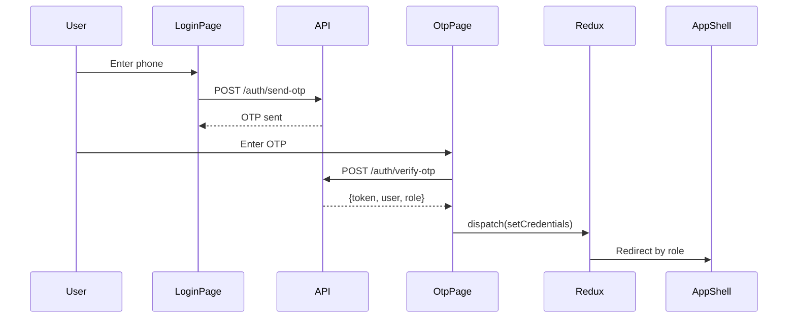

# NeetaQ — Frontend Structure (Next.js 19 + shadcn + Redux)

## Folder Structure

```
neetaq-frontend/
├── src/
│   ├── app/
│   │   ├── layout.tsx                    # Root: RTL + Providers + SeasonalOverlay
│   │   ├── globals.css                   # Design tokens light/dark
│   │   ├── (public)/
│   │   │   ├── page.tsx                  # Landing page
│   │   │   └── login/page.tsx
│   │   ├── (auth)/
│   │   │   ├── layout.tsx                # Auth guard + AppShell
│   │   │   ├── dashboard/
│   │   │   │   └── page.tsx
│   │   │   ├── teacher/
│   │   │   │   ├── lectures/
│   │   │   │   │   ├── page.tsx
│   │   │   │   │   ├── [id]/page.tsx
│   │   │   │   │   └── create/page.tsx
│   │   │   │   ├── exams/
│   │   │   │   ├── attendance/
│   │   │   │   ├── students/
│   │   │   │   ├── groups/
│   │   │   │   ├── question-bank/
│   │   │   │   ├── announcements/
│   │   │   │   ├── reports/
│   │   │   │   ├── media/
│   │   │   │   └── settings/
│   │   │   ├── student/
│   │   │   │   ├── lectures/
│   │   │   │   ├── exams/
│   │   │   │   ├── mistakes/
│   │   │   │   ├── leaderboard/
│   │   │   │   ├── announcements/
│   │   │   │   └── profile/
│   │   │   ├── parent/
│   │   │   │   ├── children/
│   │   │   │   │   └── [id]/page.tsx
│   │   │   │   ├── announcements/
│   │   │   │   └── settings/
│   │   │   ├── organization/
│   │   │   │   ├── teachers/
│   │   │   │   ├── students/
│   │   │   │   ├── groups/
│   │   │   │   ├── reports/
│   │   │   │   ├── announcements/
│   │   │   │   └── settings/
│   │   │   └── secretary/
│   │   │       └── ...same as assigned role
│   │   └── not-found.tsx
│   │
│   ├── components/
│   │   ├── ui/                           # shadcn/ui generated
│   │   │   ├── button.tsx
│   │   │   ├── card.tsx
│   │   │   ├── dialog.tsx
│   │   │   ├── input.tsx
│   │   │   ├── select.tsx
│   │   │   ├── table.tsx
│   │   │   ├── toast.tsx
│   │   │   ├── badge.tsx
│   │   │   ├── skeleton.tsx
│   │   │   └── ...
│   │   ├── shared/
│   │   │   ├── AppShell.tsx              # Sidebar + Topbar + Content
│   │   │   ├── Sidebar.tsx
│   │   │   ├── Topbar.tsx
│   │   │   ├── ThemeToggle.tsx
│   │   │   ├── NotificationBell.tsx
│   │   │   ├── TeacherSwitcher.tsx       # للطالب: اختيار المدرس
│   │   │   ├── DataTable.tsx             # جدول قابل لإعادة الاستخدام
│   │   │   ├── Pagination.tsx
│   │   │   ├── ConfirmDialog.tsx
│   │   │   ├── EmptyState.tsx
│   │   │   ├── LoadingSpinner.tsx
│   │   │   ├── ErrorBoundary.tsx         # صفحة خطأ عربية جميلة
│   │   │   ├── ErrorFallback.tsx         # UI بديل عند الخطأ (عربي + زرار إعادة المحاولة)
│   │   │   ├── RtlProvider.tsx
│   │   │   ├── SubscriptionGuard.tsx     # بوب أب تجديد الباقة
│   │   │   └── AccessibilityWrapper.tsx  # aria-labels عربية + skip nav + focus trap
│   │   ├── icons/
│   │   │   └── index.tsx
│   │   └── seasonal/
│   │       ├── SeasonalOverlay.tsx
│   │       └── presets/
│   │           ├── types.ts
│   │           └── registry.ts           # كل المناسبات
│   │
│   ├── features/
│   │   ├── auth/
│   │   │   ├── components/
│   │   │   │   ├── LoginForm.tsx
│   │   │   │   └── OtpVerification.tsx
│   │   │   ├── api/
│   │   │   │   └── auth.api.ts
│   │   │   ├── hooks/
│   │   │   │   └── useAuth.ts
│   │   │   ├── schemas/
│   │   │   │   └── login.schema.ts       # Zod
│   │   │   ├── types/
│   │   │   │   └── auth.types.ts
│   │   │   └── utils/
│   │   ├── lectures/
│   │   │   ├── components/
│   │   │   │   ├── LectureCard.tsx
│   │   │   │   ├── LectureForm.tsx
│   │   │   │   ├── LectureList.tsx
│   │   │   │   ├── AttachmentUploader.tsx
│   │   │   │   └── RecurrenceSelector.tsx
│   │   │   ├── api/
│   │   │   │   └── lectures.api.ts
│   │   │   ├── hooks/
│   │   │   │   ├── useLectures.ts
│   │   │   │   └── useLectureRealtime.ts
│   │   │   ├── schemas/
│   │   │   ├── types/
│   │   │   └── utils/
│   │   ├── exams/
│   │   │   ├── components/
│   │   │   │   ├── ExamForm.tsx
│   │   │   │   ├── ExamPlayer.tsx        # واجهة حل الامتحان
│   │   │   │   ├── QuestionRenderer.tsx
│   │   │   │   ├── ExamTimer.tsx
│   │   │   │   ├── ExamResults.tsx
│   │   │   │   └── AntiCheatGuard.tsx    # tab switch detection
│   │   │   ├── api/
│   │   │   ├── hooks/
│   │   │   ├── schemas/
│   │   │   ├── types/
│   │   │   └── utils/
│   │   ├── attendance/
│   │   │   ├── components/
│   │   │   │   ├── AttendanceSheet.tsx
│   │   │   │   ├── QrScanner.tsx
│   │   │   │   └── CheckInButton.tsx
│   │   │   ├── api/
│   │   │   ├── hooks/
│   │   │   └── types/
│   │   ├── gamification/
│   │   │   ├── components/
│   │   │   │   ├── XpBar.tsx
│   │   │   │   ├── BadgeGrid.tsx
│   │   │   │   ├── LeaderboardTable.tsx
│   │   │   │   ├── StreakDisplay.tsx
│   │   │   │   ├── QuestList.tsx
│   │   │   │   └── LevelUpModal.tsx
│   │   │   ├── api/
│   │   │   ├── hooks/
│   │   │   └── types/
│   │   ├── notifications/
│   │   │   ├── components/
│   │   │   │   ├── NotificationList.tsx
│   │   │   │   └── NotificationItem.tsx
│   │   │   ├── api/
│   │   │   ├── hooks/
│   │   │   │   └── useRealtimeNotifications.ts
│   │   │   └── types/
│   │   ├── announcements/
│   │   │   ├── components/
│   │   │   │   ├── AnnouncementForm.tsx
│   │   │   │   ├── VoiceRecorder.tsx
│   │   │   │   └── AnnouncementFeed.tsx
│   │   │   ├── api/
│   │   │   ├── hooks/
│   │   │   └── types/
│   │   ├── subscriptions/
│   │   ├── mistakes/
│   │   ├── media/
│   │   ├── reports/
│   │   ├── groups/
│   │   └── devices/
│   │       ├── components/
│   │       │   ├── DeviceList.tsx
│   │       │   └── RevokeDeviceButton.tsx
│   │       ├── api/
│   │       ├── hooks/
│   │       └── types/
│   │
│   ├── store/                            # Redux Toolkit
│   │   ├── store.ts                      # configureStore
│   │   ├── hooks.ts                      # useAppDispatch, useAppSelector
│   │   ├── slices/
│   │   │   ├── authSlice.ts              # user, token, role
│   │   │   ├── uiSlice.ts               # sidebar, modals, theme
│   │   │   ├── teacherSwitcherSlice.ts   # selected teacher context
│   │   │   └── notificationSlice.ts      # unread count, realtime
│   │   └── middleware/
│   │       └── realtimeMiddleware.ts     # Reverb integration
│   │
│   ├── lib/
│   │   ├── api/
│   │   │   ├── client.ts                # Axios/fetch wrapper + v1 prefix
│   │   │   ├── endpoints.ts             # API URL constants
│   │   │   └── interceptors.ts          # Token refresh, error handling
│   │   ├── auth/
│   │   │   ├── session.ts
│   │   │   └── guards.ts
│   │   ├── realtime/
│   │   │   ├── reverb.ts               # Reverb client setup
│   │   │   ├── channels.ts             # Channel definitions
│   │   │   └── events.ts               # Event type mappings
│   │   ├── rtl/
│   │   │   ├── numerals.ts             # تحويل أرقام ١٢٣
│   │   │   └── direction.ts
│   │   ├── config/
│   │   │   ├── env.ts
│   │   │   └── featureFlags.ts
│   │   └── utils/
│   │       ├── formatters.ts           # تنسيق تاريخ/عملة
│   │       ├── validators.ts
│   │       └── helpers.ts
│   │
│   ├── hooks/                           # Global hooks
│   │   ├── useDebounce.ts
│   │   ├── useMediaQuery.ts
│   │   ├── useLocalStorage.ts
│   │   └── usePagination.ts
│   │
│   └── types/                           # Global types
│       ├── api.types.ts                 # ApiResponse<T>, PaginatedResponse<T>
│       ├── user.types.ts
│       └── common.types.ts
│
├── public/
│   ├── seasonal/                        # Seasonal assets
│   │   ├── ramadan/
│   │   │   ├── lantern.svg
│   │   │   ├── crescent.svg
│   │   │   └── pattern.svg
│   │   ├── eid_fitr/
│   │   ├── eid_adha/
│   │   ├── back_to_school/
│   │   └── ...
│   ├── fonts/
│   │   └── cairo/                       # Arabic font
│   └── images/
│
├── next.config.ts
├── tailwind.config.ts
├── components.json                      # shadcn config
├── tsconfig.json
├── manifest.json                        # PWA manifest
└── package.json
```

---

## State Management Strategy

| ما يُدار                       | الأداة                               | السبب                               |
| ------------------------------ | ------------------------------------ | ----------------------------------- |
| Server data (lists, details)   | TanStack Query                       | Caching + pagination + revalidation |
| Auth state (user, token, role) | Redux Toolkit `authSlice`            | Global, persistent                  |
| UI state (sidebar, modals)     | Redux Toolkit `uiSlice`              | Shared UI state                     |
| Selected teacher context       | Redux Toolkit `teacherSwitcherSlice` | Student/Parent context              |
| Notifications (realtime)       | Redux Toolkit + Reverb middleware    | Realtime updates                    |
| Form state                     | React Hook Form + Zod                | Isolated per form                   |

---

## API Client (مثال)

```typescript
// src/lib/api/client.ts
import axios from "axios";
import { store } from "@/store/store";

const apiClient = axios.create({
  baseURL: process.env.NEXT_PUBLIC_API_URL + "/api/v1",
  headers: { "Accept-Language": "ar" },
});

apiClient.interceptors.request.use((config) => {
  const token = store.getState().auth.token;
  if (token) config.headers.Authorization = `Bearer ${token}`;
  return config;
});

apiClient.interceptors.response.use(
  (res) => res.data,
  (err) => {
    if (err.response?.status === 401) {
      store.dispatch({ type: "auth/logout" });
    }
    return Promise.reject(err.response?.data);
  },
);

export default apiClient;
```

---

## Auth Flow (Frontend)



---

## API Response Type (Frontend)

```typescript
// src/types/api.types.ts
export interface ApiResponse<T> {
  success: boolean;
  message: string;
  data: T;
}

export interface PaginatedResponse<T> {
  success: boolean;
  message: string;
  data: T[];
  meta: {
    current_page: number;
    per_page: number;
    total: number;
    last_page: number;
  };
}
```

---

## Seasonal Preset Registry

```typescript
// src/components/seasonal/presets/registry.ts
export const SEASONAL_PRESETS = [
  // إسلامي
  "ramadan",
  "laylat_al_qadr",
  "eid_fitr",
  "eid_adha",
  "islamic_new_year",
  "mawlid",
  "isra_miraj",
  // مصري
  "sham_el_nessim",
  "new_year",
  "revolution_25_jan",
  "revolution_30_jun",
  "october_victory",
  // تعليمي
  "back_to_school",
  "midterm_exams",
  "final_exams",
  "results_season",
  "summer_revision",
  // اجتماعي
  "mothers_day",
  "national_teacher_day",
] as const;
```

## Unit Test Structure (Frontend)

```
__tests__/
├── features/
│   ├── auth/
│   │   ├── LoginForm.test.tsx
│   │   └── useAuth.test.ts
│   ├── lectures/
│   ├── exams/
│   └── gamification/
├── components/
│   ├── shared/
│   │   └── DataTable.test.tsx
│   └── seasonal/
├── lib/
│   ├── api/client.test.ts
│   └── rtl/numerals.test.ts
└── store/
    └── slices/
        └── authSlice.test.ts
```

---

## PWA Support (دعم العمل بدون إنترنت)

> [!TIP]
> مهم للطلاب في مصر (إنترنت ضعيف أحياناً)

- `manifest.json`: اسم التطبيق + أيقونات + theme color + RTL
- Service Worker (`next-pwa`): cache للصفحات الأساسية
- Offline page: صفحة "لا يوجد اتصال" عربية جميلة
- Install prompt: زرار "تثبيت التطبيق" للموبايل

## Accessibility (a11y) — إمكانية الوصول

| العنصر              | التطبيق                              |
| ------------------- | ------------------------------------ |
| `aria-labels`       | عربية لكل زرار/input/جدول            |
| `Skip to content`   | رابط "تخطي إلى المحتوى" أعلى الصفحة  |
| Keyboard navigation | Tab order صحيح RTL + focus ring واضح |
| Focus trap          | داخل dialogs/modals                  |
| Color contrast      | WCAG AA على الأقل                    |
| Screen reader       | نصوص بديلة للصور + حالات التحميل     |

## Error Boundary — صفحة الخطأ

```tsx
// ErrorFallback.tsx — صفحة خطأ عربية
export function ErrorFallback({ error, resetErrorBoundary }) {
  return (
    <div className="flex flex-col items-center justify-center min-h-screen text-center p-8">
      <h1 className="text-3xl font-bold mb-4">حدث خطأ غير متوقع</h1>
      <p className="text-muted-foreground mb-6">
        نعتذر على ذلك، يرجى إعادة المحاولة أو التواصل مع الدعم.
      </p>
      <Button onClick={resetErrorBoundary}>إعادة المحاولة</Button>
    </div>
  );
}
```
